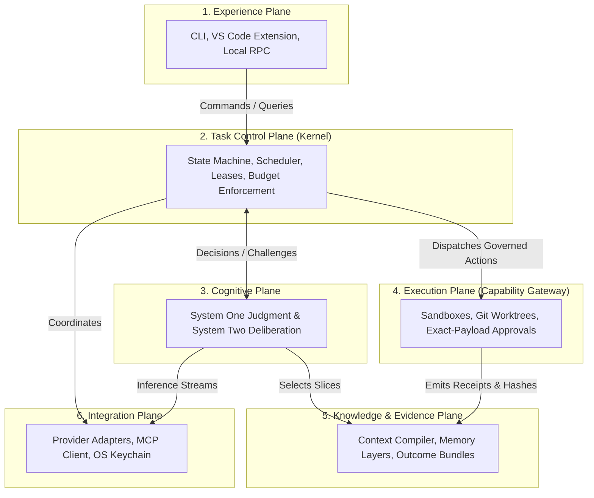
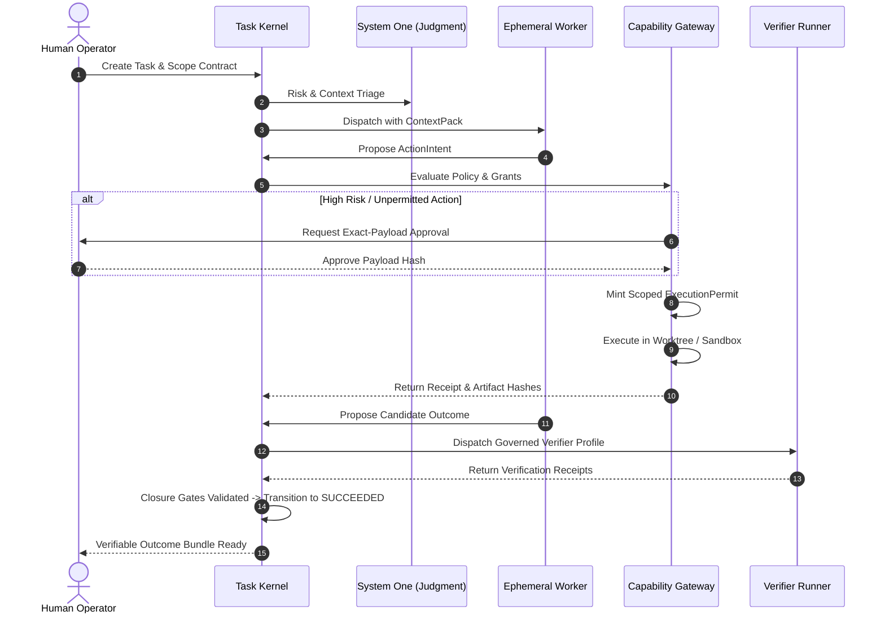

# Custos

### Human-Centered Agentic Work Runtime

*Local-First · Provider-Neutral · Evidence-Backed · Judgment-Governed*

[](LICENSE)
[](docs/canonical-specification.md)
[](docs/architecture/overview.md)
[](docs/architecture/deployment.md)

> "Custos turns human intent into controlled, resumable, cross-provider and evidence-backed work."

---

## What is Custos?

Custos is not an all-knowing "super-agent", not a chat wrapper aggregating model APIs, and not an autonomous swarm.

Custos is a **specialized local-first runtime layer** positioned between:
1. **The Human Principal:** Holding intent, constraints, ethics, and final approval authority.
2. **AI Reasoning Providers:** Frontier reasoning providers, coding providers, and local models.
3. **Workspace Knowledge:** Git repositories, AST symbol indexes, notes, and local files.
4. **Execution Tools & OS:** Shell environments, compilers, test runners, and MCP servers.
5. **Judgment Fabric (System One):** Fast, low-cost reflex evaluation, risk screening, and invariant checks.

```text
Human Intent
  └──> Task Contract (Intent, Scope, Invariants, Budget)
        └──> Decision Cases & Subtask Workflows
              └──> Ephemeral Workers + Tiered Sandboxes + Model Providers
                    └──> Content-Addressed Artifacts + Independent Evidence
                          └──> Human-Governed Verified Outcome Bundle
```

The fundamental operational unit of Custos is the **Durable Task** — never an ephemeral chat session or volatile context window.

---

## Why Custos?

| Current AI Agent Pitfalls | The Custos Architectural Remedy |
|---|---|
| **Ephemeral Chat Sessions:** Context is lost when switching windows, crashing, or hitting token ceilings. | **Durable Task State:** State transitions are committed to an append-only event store (SQLite WAL) and survive restarts. |
| **Provider Lock-In:** Workflows are tightly bound to proprietary vendor agent APIs. | **Provider-Neutral Continuation:** Lossless handoff between models mid-task via structured `ContinuationPacket`. |
| **Unchecked Side Effects:** Agents run destructive shell commands or overwrite files unexpectedly. | **Capability Gateway & Sandboxing:** OS-level sandboxing with single-use, payload-bound `ExecutionPermit` gates. |
| **Unbounded Costs & Loops:** Agents get trapped in hallucination loops burning tokens and API budgets. | **Strict Budget Ceilings:** Quantitative caps on tokens, financial cost, steps, and wall-clock time enforced by Kernel. |
| **Unverified Assertions:** AI asserts that bugs are fixed with zero objective proof. | **Evidence-Carrying Actions:** Completion requires independent verifier receipts, passing tests, and cryptographic diffs. |
| **Human Excluded or Spammed:** Binary choice between total agent autonomy or approval fatigue. | **Governed Sovereignty:** Low-risk steps execute autonomously; high-risk actions require exact-payload human sign-off. |

---

## Product Principles

1. **Task-Centered:** The durable Task with a binding contract is the core unit of work, not conversations.
2. **Human-Governed:** Humans define intent, policies, and constraints; humans retain absolute veto power.
3. **Local-First:** Durable state, policies, secrets, artifacts, and sensitive workspace knowledge are stored locally by default. Any context sent to a remote provider is explicitly selected and governed by workspace privacy and egress policies (local-first is not offline-only).
4. **Provider-Neutral:** Provider sessions may be stateful, but they are non-authoritative. Custos remains the source of truth for durable task state.
5. **Capability-Based:** No side effect executes without a scoped, payload-bound, and auditable `ExecutionPermit`.
6. **Evidence-Driven:** Tasks transition to `SUCCEEDED` only when independent verifiers validate objective evidence matching the Task Contract. Model assertions do not constitute evidence.
7. **Durable by Design:** Resilient against crashes, reboots, rate limits, and network partitions through transactional state persistence.

---

## Architecture Overview — Six Functional Planes

Custos organizes system responsibilities into **Six Functional Planes**. Governance, security, budgets, and observability operate as cross-cutting concerns across all planes:



### Three Impenetrable Membranes
1. **The Authority Membrane:** No action may execute without explicit authority rooted in the Task Contract or a validated `ExecutionPermit`.
2. **The Privacy Membrane:** Zero private workspace code, credentials, or telemetry leaves the workstation without passing through strict redaction gates.
3. **The Resource Membrane:** Token budgets, financial ceilings, execution step limits, and memory usage are strictly budgeted and settled transactionally.

---

## Human, System One, and System Two

Custos operationalizes cognitive dual-process theory into software architecture:

| Dimension | Human Principal | System One (Judgment Fabric) | System Two (Deliberation Fabric) |
|---|---|---|---|
| **Role** | Intent, constraints, ultimate sovereignty | Fast reflex, risk screening, invariant checks | Deep reasoning, multi-step planning, synthesis |
| **Engine** | Human Operator | Deterministic rules, local SLMs, specialized classifiers | Frontier reasoning and coding providers |
| **Cost & Speed** | High cognitive value | Substantially lower latency and cost (Design target) | High latency, higher cost per invocation |
| **Authority** | Ultimate approval & veto | Advisory & gating (Zero capability minting) | Proposes actions to be validated |

**Authority Invariant:** System One and System Two advise and propose; the Task Kernel decides state transitions; the Capability Gateway governs execution.

---

## How a Task Flows

Below is the end-to-end execution lifecycle for a governed task:



---

## Core Concepts

| Concept | Description | Reference Link |
|---|---|---|
| **Task** | The durable unit of work, governed by a state machine (`DRAFT`, `READY`, `RUNNING`, `WAITING_APPROVAL`, `PAUSED`, `WAITING_INPUT`, `VERIFYING`, `SUCCEEDED`, `FAILED`, `CANCELLED`). | [concepts.md](docs/reference/concepts.md#task) |
| **Task Contract** | Specification defining intent, workspace scope, invariants, budget, and acceptance criteria. | [task-lifecycle.md](docs/architecture/task-lifecycle.md) |
| **ActionIntent** | Normalized proposal emitted by a worker to execute a side-effecting action. | [capability-gateway.md](docs/architecture/capability-gateway.md) |
| **ExecutionPermit** | Scoped, payload-bound, short-lived token authorizing a single execution. | [capability-gateway.md](docs/architecture/capability-gateway.md) |
| **Receipt** | Tamper-evident record capturing start/end time, exit code, stdout/stderr hashes, and tool identity. | [evidence-verification.md](docs/architecture/evidence-verification.md) |
| **Artifact** | Content-addressed, immutable deliverable stored with cryptographic provenance. | [persistence.md](docs/architecture/persistence.md) |
| **Evidence** | Artifacts and receipts validated by independent verifiers against acceptance conditions. | [evidence-verification.md](docs/architecture/evidence-verification.md) |
| **ContextPack** | Token-budgeted, relevance-scored compilation of code slices, memory, and AST symbols. | [context-memory.md](docs/architecture/context-memory.md) |
| **ContinuationPacket** | Provider-neutral state snapshot enabling seamless handoff between models mid-task. | [provider-interop.md](docs/architecture/provider-interop.md) |
| **Verifiable Outcome Bundle** | Final deliverable containing diffs, execution traces, test receipts, and costs. | [evidence-verification.md](docs/architecture/evidence-verification.md) |

---


## Repository Structure

Custos is organized as a unified Rust Cargo Workspace:

```text
custos/
├── Cargo.toml                      # Root Cargo workspace configuration
├── apps/
│   ├── custosd/                    # Trusted local runtime daemon
│   └── custos-cli/                 # High-performance developer CLI
├── crates/
│   ├── core-domain/                # Pure types, entities, System Invariants (Zero I/O)
│   ├── task-kernel/                # Task state machine & event store
│   ├── workflow-runtime/           # Command/event dispatch, leases, outbox
│   ├── capability-gateway/         # The ONLY side-effect execution entrance
│   ├── cognitive-runtime/          # Cognitive Arbiter & RDC protocol
│   ├── judgment-contracts/         # System One schemas & interfaces
│   ├── deliberation-contracts/     # System Two worker prompts & contracts
│   ├── context-compiler/           # Slicing, scoring, ContextPack builder
│   ├── evidence-engine/            # Verifier runners & completion gates
│   ├── persistence-sqlite/         # SQLite WAL migrations & event tables
│   ├── local-api/                  # Axum IPC daemon server
│   └── provider-sdk/               # ProviderPort traits & test harnesses
├── adapters/
│   ├── providers/                  # Codex, Claude, local model adapters
│   ├── judgments/                  # Rules engine, local classifiers
│   └── sandboxes/                  # macOS Seatbelt, Linux Bubblewrap
├── sidecars/                       # Isolated runtimes (Python for ML, TypeScript for Claude)
├── domain-packs/                   # Specialized domain packs (Engineering, Research, Personal)
├── dev_docs/                       # Internal engineering collaboration & sprint tracking
└── docs/                           # Canonical architecture & specification library
```

---

## Getting Started

### Prerequisites
- **Rust Toolchain:** Rust 1.82+ stable (`curl --proto '=https' --tlsv1.2 -sSf https://sh.rustup.rs | sh`)
- **System Tools:** Git, SQLite3

### Build & Test
```bash
# Clone the repository
git clone https://github.com/agent-hub/custos.git
cd custos

# Check workspace compilation
cargo check --workspace

# Run all unit, contract, and invariant tests
cargo test --workspace
```

---

## Documentation

Comprehensive architecture specifications and guides are maintained in the [docs/](docs/) directory:

| Document | Purpose |
|---|---|
| [Canonical Specification](docs/canonical-specification.md) | Authoritative 39-section master architectural blueprint. |
| [Start Here Guide](docs/00-start-here.md) | Role-based reading pathways for Engineers, Architects, and Security teams. |
| [Architecture Overview](docs/architecture/overview.md) | System architecture overview, functional planes, and boundary definitions. |
| [Task Lifecycle](docs/architecture/task-lifecycle.md) | State machine transitions, event sourcing, and recovery semantics. |
| [Capability Gateway](docs/architecture/capability-gateway.md) | Sandboxing, execution permits, and side-effect governance. |
| [Cognitive Fabric](docs/architecture/cognitive-fabric.md) | System One judgment, System Two deliberation, and RDC protocol. |
| [Evidence & Verification](docs/architecture/evidence-verification.md) | Verifier profiles, cryptographic diffs, and evidence closure rules. |
| [Core Concepts Glossary](docs/reference/concepts.md) | Canonical definitions of 20+ architectural concepts. |
| [System Invariants](docs/reference/invariants.md) | Irreversible architectural decisions and non-negotiable invariants. |
| [Comparative Analysis](docs/reference/comparisons.md) | Architectural comparison with LangGraph, Temporal, and Claude Code. |
| [Engineering Collaboration](dev_docs/README.md) | Engineering collaboration protocol and ownership boundaries. |

---

## Contributing

Custos adheres to strict architectural boundaries, typed domain models, and zero-panic error handling.  
Review [AGENTS.md](AGENTS.md) and [dev_docs/README.md](dev_docs/README.md) before submitting contributions.

---

## License

Custos is open-source software dual-licensed under the **MIT License** and **Apache License 2.0**.  
See the [LICENSE](LICENSE) file for complete details.

Copyright (c) 2026 Vi. All rights reserved.
