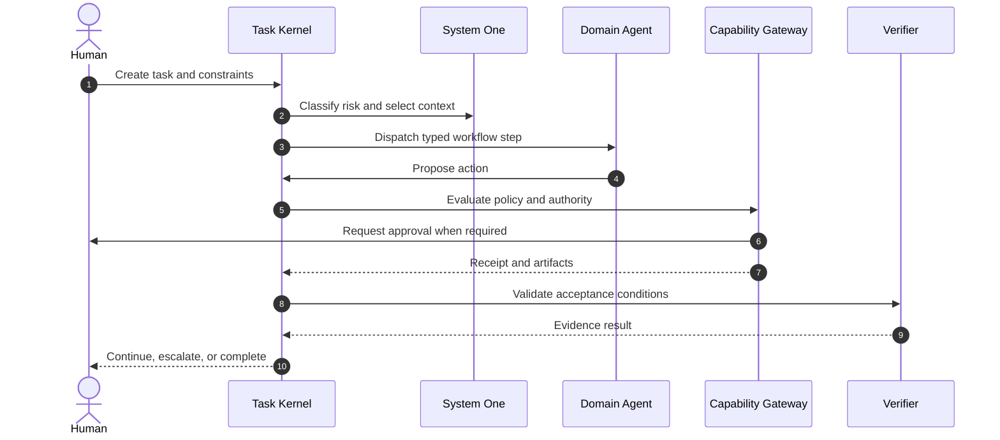
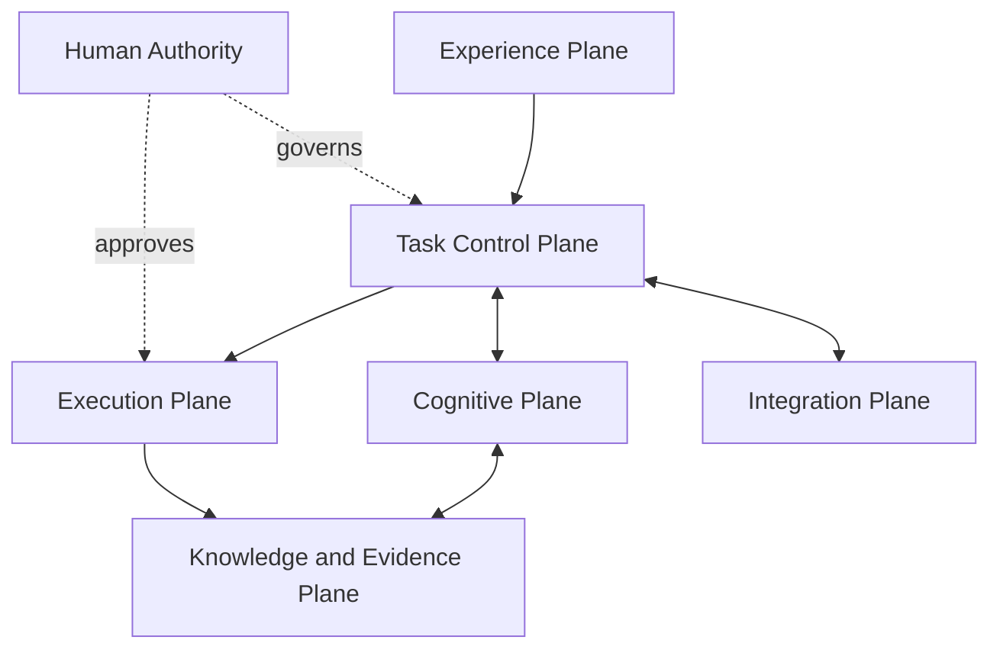

<div align="center">

# Custos

**A human-governed workspace for specialized agentic work**

*Vibe coding, research, and personal workflows across the models you choose — with durable state, controlled execution, cost-aware context, and verifiable outcomes.*

[](LICENSE)
[](docs/canonical-specification.md)
[](docs/architecture/overview.md)
[](docs/architecture/deployment.md)

</div>

---

## What Custos Means

Custos means *guardian*.

The name reflects the product's purpose: Custos guards the continuity, authority, privacy, resources, and evidence of AI-assisted work while leaving intent and final responsibility with the human.

Custos is **not** another autonomous super-agent and not merely a chat interface over several model APIs. It is a local-first runtime and workspace in which humans, specialized agents, models, tools, and knowledge can collaborate through durable and governed tasks.

Bring the models you trust. Work naturally. Custos keeps the work coherent, controlled, resumable, and verifiable.

---

## The Problem

AI coding and research tools are powerful, but the surrounding work remains fragmented.

- **Trapped Context:** Work is trapped inside provider-specific chats and sessions.
- **Lost Context:** Context must be repeatedly reconstructed after switching models or tools.
- **Wasted Tokens:** Agents consume tokens by rereading repositories, logs, and documents.
- **Cost Inefficiency:** A single expensive model is often used for tasks that could run locally or cheaply.
- **Fragile Fallbacks:** Provider fallback can silently lose tool, reasoning, or structured-output semantics.
- **Unverified Claims:** Generated code and research claims are often accepted without independent evidence.
- **Unchecked Side Effects:** Tool calls may execute without consistent scopes, approvals, or audit records.
- **Fragile Execution:** Long-running work is fragile across crashes, rate limits, restarts, and context limits.
- **Lack of Reusability:** Personal preferences and successful workflows are difficult to reuse safely.
- **Loss of Control:** Multi-agent systems often add complexity without preserving human control.

The result is a poor choice between manually coordinating disconnected AI tools and handing too much authority to opaque autonomous systems.

---

## The Product Goal

Custos aims to make AI-assisted work feel as fluid as vibe coding while giving it the structure required for serious engineering, research, and personal workflows.

The fundamental unit is a **Durable Task**, not a chat session. A task contains its goal, scope, constraints, workflow, budgets, context, decisions, approvals, artifacts, evidence, and continuation state.

A task can be:
- started with one model and continued with another;
- paused for human input and resumed after a restart;
- transferred between Coding, Research, and Assistant domains;
- executed with local or remote models according to user policy;
- constrained by token, financial, step, and time budgets;
- completed only when its acceptance conditions are supported by evidence.

---

## Product Experience

Custos is designed around three natural ways of working.

### Vibe Coding
Ask Custos to understand a repository, explain architecture, fix a bug, implement a feature, review a change, perform a migration, or prepare a release.

Custos can index the repository, select relevant symbols, propose a workflow, dispatch the chosen coding model, isolate changes in a worktree, run targeted verification, and present the resulting diff and evidence for review.

### Vibe Research
Ask Custos to investigate a topic, compare papers, extract claims, identify contradictions, turn literature into an implementation specification, design an experiment, run a benchmark, or produce a source-grounded report.

Custos preserves research questions, sources, claims, evidence, assumptions, datasets, experiment configurations, unresolved questions, and citation status instead of reducing research to one generated summary.

### Vibe Assistant
Use Custos to organize notes, documents, plans, recurring workflows, local data processing, and the work surrounding coding and research.

The Assistant domain can prepare continuation summaries, organize outputs, coordinate tasks, and propose external actions while keeping consequential operations behind explicit policy and approval boundaries.

---

## Specialized Agent Domains

Coding, Research, and Assistant are product-facing Agent Domains, not permanently running personas.

Each domain is implemented by a **Domain Pack**:

```text
Agent Domain
  = Task Types
  + Workflow Templates
  + Context Recipes
  + Memory Policy
  + Tool Capabilities
  + Cognitive Routing
  + Verification Profiles
  + Domain UX
```

| Domain | Typical work | Fast judgment | Deep deliberation | Completion evidence |
|---|---|---|---|---|
| **Coding** | Repository understanding, bug fixing, features, refactoring, review | File and symbol ranking, risk checks, test selection | Architecture, planning, implementation, complex debugging | Diff, build, tests, lint and security results |
| **Research** | Literature review, claim extraction, experiments, benchmarks | Relevance, deduplication, source screening, contradiction flags | Synthesis, hypothesis formation, experiment design | Citations, dataset hashes, configurations and metrics |
| **Assistant** | Documents, notes, planning and local workflow coordination | Classification, priority, privacy and action-risk screening | Drafting, analysis and multi-step planning | Human approval, delivery receipts and change records |

The domains can cooperate on the same task. A Research workflow may produce an evidence-backed implementation specification, Coding may implement and benchmark it, and Assistant may package the outcome and follow-up work.

---

## Human, System One, and System Two

Custos separates three forms of responsibility:

| Actor | Responsibility | Authority |
|---|---|---|
| **Human Principal** | Intent, constraints, values, approvals and final responsibility | Ultimate approval and veto |
| **System One** | Fast classification, ranking, screening, risk checks and escalation | Advisory or policy-gating only |
| **System Two** | Deep reasoning, planning, synthesis, generation and review | Proposes decisions and actions |

System One may be implemented by deterministic rules, local classifiers, embeddings, small language models, Jev, Layla, or another judgment backend. System Two may use frontier reasoning models, coding agents, local models, or provider-specific agent runtimes.

Neither System One nor System Two can grant itself authority. The Task Kernel owns state transitions, and the Capability Gateway governs side effects.

---

## Choose Your Models

Users decide which models and providers they trust.

Custos supports three selection modes:

| Mode | Behavior |
|---|---|
| **Manual** | Pin a specific model to the task or role |
| **Assisted** | Custos recommends a compatible model; the user confirms |
| **Automatic** | Custos routes within user-approved providers, capabilities, privacy rules and budgets |

A Coding Agent may use one model for everything, or several models for different roles:

```yaml
agents:
  coding:
    planner: anthropic/claude
    implementer: openai/codex
    reviewer: ollama/qwen-coder
  research:
    screener: ollama/qwen
    synthesizer: google/gemini
    critic: anthropic/claude
```

Agent workflows declare required capabilities rather than hard-coding a vendor. The Model Gateway matches those requirements against models connected by the user.

Changing a model must not discard task state, memory, artifacts, approvals, or evidence. Provider-neutral continuation packets preserve the information needed to resume work across model and agent boundaries.

---

## Simple When You Want It

Custos does not require a multi-model setup.

A developer can select one coding model and start working:

```bash
custos code --model codex
```

Repository indexing, context selection, budget enforcement, tool governance, recovery, tests, and evidence collection remain active underneath the simple experience.

Advanced routing is optional, not a prerequisite.

---

## Workflow Composer

Natural-language intent can be converted into a typed and reviewable `WorkflowPlan`.

Custos supports four workflow modes:

| Mode | Description |
|---|---|
| **Manual** | The human controls every step |
| **Suggested** | Custos proposes a workflow before execution |
| **Adaptive** | The workflow may change within approved constraints based on intermediate results |
| **Reusable** | A successful workflow can be saved as a governed template |

The Workflow Composer considers:
- task intent and domain;
- required model capabilities;
- context and memory recipes;
- privacy and network policy;
- tools and side effects;
- risk and approval checkpoints;
- token, financial and time budgets;
- required verification and completion evidence.

Custos may suggest saving a repeated successful process as a workflow template, but it does not blindly store complete conversations, secrets, or temporary data.

---

## Personal Work Profile

Custos can adapt to how each person codes, researches, reviews, and approves work.

A User Work Profile may contain:
- preferred interaction and explanation style;
- preferred models and local-versus-cloud policy;
- protected repositories, files and branches;
- coding conventions and required checks;
- research source and citation requirements;
- approval thresholds;
- token, cost and time defaults;
- reusable workflow preferences.

Personalization is inspectable and editable. Memory items carry scope, provenance, confidence, timestamps, retention policy, and deletion controls.

---

## Cost and Performance

Custos optimizes the system around the user's model choices rather than requiring every decision to be made by an expensive LLM.

### Context efficiency
- Incremental repository and document indexing.
- Symbol-aware and relevance-scored context selection.
- Token-budgeted Context Packs.
- Content-addressed artifacts instead of repeatedly embedding large outputs in prompts.
- Safe tool-output reduction with access to the original artifact.
- Context and retrieval caches with explicit invalidation.

### Cognitive efficiency
- Rules, local models, and specialized judges for inexpensive screening.
- System Two escalation only when deeper reasoning is justified.
- Capability-aware model matching.
- User-approved fallback chains.
- Early stopping, cycle detection and repeated-action detection.

### Execution efficiency
- Incremental builds and targeted tests before full verification.
- Durable state that prevents unnecessary restart work.
- Parallel execution only for independent and authorized steps.
- Token, monetary, step, retry and wall-clock budgets enforced by the runtime.

Custos can guarantee enforcement of configured budgets and policies. It cannot guarantee identical quality across models or turn an incompatible model into a capable coding or research engine.

---

## How a Task Flows



At any point, the human may inspect, pause, redirect, change an allowed model, revise the workflow, reduce authority, or cancel the task.

---

## Local-First by Default

Custos is designed to run primarily on the user's machine.

- Task state, policies, permissions and audit records remain local by default.
- Sensitive repository and document knowledge can remain local.
- Local models can be used for private or inexpensive work.
- Remote providers receive only context selected by policy.
- Credentials are referenced through an OS-backed secret store rather than embedded in task state.

*Local-first does not mean offline-only; remote services remain available through explicit adapters and egress policy.*

---

## Evidence, Not Model Confidence

A model claiming that work is complete does not make it complete.

Custos can require evidence such as:
- passing tests and build receipts;
- code diffs and static-analysis results;
- source citations and claim–evidence links;
- dataset and configuration hashes;
- benchmark metrics;
- tool execution receipts;
- explicit human decisions.

Completion policy belongs to the Task Contract and domain verifier profile, not to the provider that generated the answer.

---

## Functional Architecture



| Plane | Responsibility |
|---|---|
| **Experience** | CLI, VS Code and future local interfaces |
| **Task Control** | Durable state, scheduling, budgets, recovery and continuation |
| **Cognitive** | System One judgment, System Two deliberation and workflow composition |
| **Execution** | Capabilities, permits, approvals, worktrees and sandboxes |
| **Knowledge & Evidence**| Context, memory, artifacts, provenance and verification |
| **Integration** | Models, provider agents, MCP, A2A, local services and secrets |

Security, privacy, observability and resource governance apply across every plane.

---

## Gateway Boundaries

Custos separates connectivity from authority.

### Model Gateway
Responsible for model discovery, capability matching, request translation, health, quota, usage, cost and policy-compliant fallback.

### Protocol Gateway
Responsible for MCP and A2A discovery, transport, federation, authentication, traffic policy and telemetry.

### Capability Gateway
The only trusted entry point for consequential side effects. It validates scopes, approvals, payload binding, expiry, budgets and execution receipts.

Model and protocol gateways cannot mutate Task state, mint execution authority, promote memory, or declare a task complete.

---

## Product Interfaces

The target product experience includes:

| Interface | Purpose |
|---|---|
| **Task Workspace** | Goals, plans, agent handoffs, artifacts and continuation |
| **Approval Inbox** | Review exact actions, risks, scopes and expiry |
| **Model Fleet** | Connect models, inspect capabilities, health, cost and fallback |
| **Protocol Mesh** | Inspect MCP tools, resources, servers and A2A peers |
| **Context Inspector**| Understand what context was selected and why |
| **Run Timeline** | Observe human, agent, judgment, action and receipt events |
| **Evidence Explorer**| Trace claims and outcomes to their supporting evidence |

---

## Repository Architecture

Custos follows a Rust-first polyglot monorepo and ports-and-adapters architecture.

```text
custos/
├── apps/                    # Daemon, CLI and user-facing applications
├── crates/                  # Trusted Rust domain and runtime components
├── adapters/                # Models, providers, judgments, tools and gateways
├── sidecars/                # Isolated TypeScript or Python integrations
├── domain-packs/            # Engineering, research and personal workflows
├── schemas/                 # Versioned cross-process contracts
├── tests/                   # Contract, integration, recovery and security tests
├── evals/                   # Agent and workflow evaluation harnesses
├── docs/                    # Product, architecture, protocol and operational docs
└── lab/upstreams/           # Audited upstream research; excluded from production core
```

The trusted Rust core owns task state, authority, durability, persistence, execution governance and evidence closure. TypeScript and Python components communicate through versioned contracts and cannot directly mutate the Custos database or grant themselves capabilities.

---

## Core Concepts

| Concept | Meaning |
|---|---|
| **Task** | Durable user-level unit of work |
| **TaskContract** | Goal, scope, constraints, budgets and acceptance conditions |
| **Run** | One execution attempt for a task |
| **WorkflowPlan** | Typed plan of domain steps and dependencies |
| **ContextPack** | Budgeted, provenance-aware context for a worker |
| **ActionIntent** | Proposed side-effecting operation |
| **ExecutionPermit**| Scoped, payload-bound, expiring authorization |
| **Receipt** | Record of an executed action and its result |
| **Artifact** | Immutable content with identity and provenance |
| **Evidence** | Artifact accepted by a verifier or human reviewer |
| **ContinuationPacket**| Provider-neutral state required to resume or transfer work |
| **DomainPack** | Workflows, context, policy and verification for a domain |
| **OutcomeBundle** | Final deliverables, evidence, decisions and cost summary |

---

## Non-Goals

Custos is **not** intended to be:
- a new foundation model;
- a mandatory model marketplace;
- a collection of permanently running persona agents;
- a chat-history database presented as memory;
- an unrestricted autonomous computer operator;
- a replacement for every coding or research provider;
- a system that treats model confidence as proof;
- an excuse to hide workflow, cost, data egress, or authority from the user.

---

## Project Status

Custos is in early development.

This README describes both accepted architectural direction and the intended product experience. It does not imply that every described component is already implemented.

Every major capability should be labeled in project documentation as one of:
- **Implemented** — available and covered by relevant tests;
- **Experimental** — runnable but not yet stable;
- **Specified** — accepted contract or design, not yet implemented;
- **Proposed** — under discussion.

The first end-to-end product slice is expected to prove:

```text
Human creates a Coding Task
  → Custos proposes a workflow
  → User selects a model
  → Context is compiled from a repository
  → The Coding Agent proposes and performs governed changes
  → Tests and diffs become evidence
  → The human reviews a resumable Outcome Bundle
```

---

## Documentation

Detailed specifications belong under `docs/`:

```text
docs/
├── 00-start-here.md
├── product/                 # Agent domains, workflows, UX and personalization
├── architecture/            # Runtime, gateways, context, memory and evidence
├── protocols/               # Versioned task, action, model and continuation contracts
├── security/                # Threat models, trust boundaries and privacy
├── operations/              # Installation, configuration and diagnostics
├── reference/               # Concepts, invariants and compatibility
└── adr/                     # Architectural decision records
```

Documentation must distinguish implemented behavior from intended design.

---

## Contributing

Custos welcomes design discussion, implementation, evaluation, documentation, security review and upstream analysis.

Before contributing, review `AGENTS.md`, `CONTRIBUTING.md`, the relevant architectural decision records, and the ownership boundary of the module being changed.

---

## 👥 Core Team & Authors

- **Trần Chí Vĩ** — Systems Architecture, Kernel & Runtime Engineering (`custosd`, State Machine, Gateway, Persistence)
- **Nguyễn Đinh Nhật Trường** — Lead UX/UI, Human-in-the-Loop Interaction & Client Applications (`custos` CLI, Desktop Shell, VS Code Extension)

---

## License

Custos is licensed under the Apache License 2.0.

<<<<<<< HEAD
Copyright (c) 2026 Nguyễn Đinh Nhật Trường, Trần Chí Vĩ. All rights reserved.

---

<div align="center">
  <sub>Built with uncompromising discipline for human sovereignty, local autonomy, and verifiable software engineering.</sub>
=======
<div align="center">

**Custos — Guardian of Work**

*Your work style, encoded as governed agentic workflows.*

>>>>>>> 1ebaac7d18ec1bb9c5d477daccebd08b270aa10d
</div>
