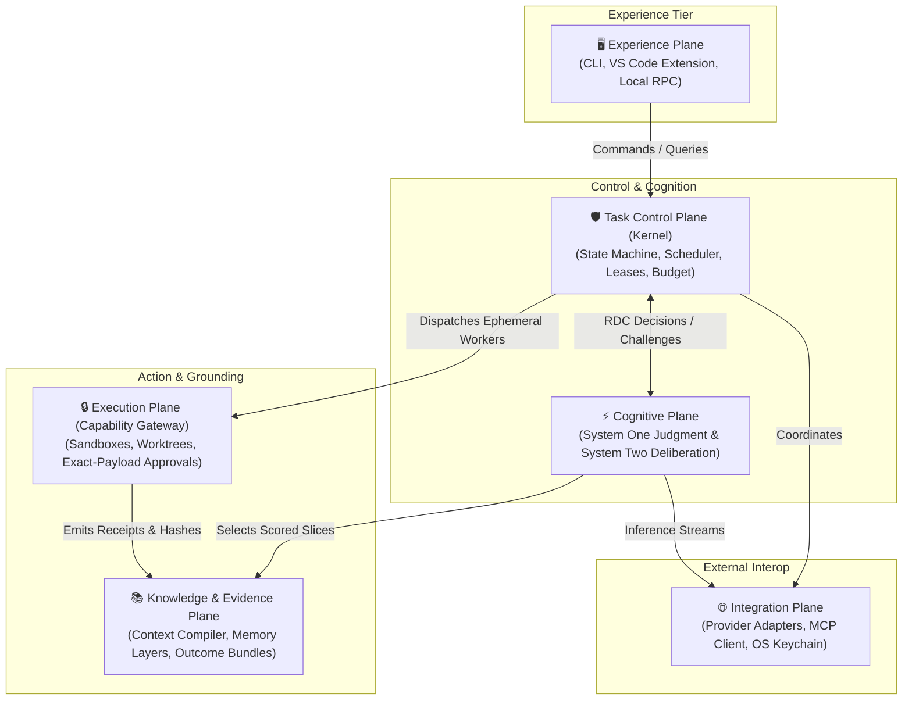
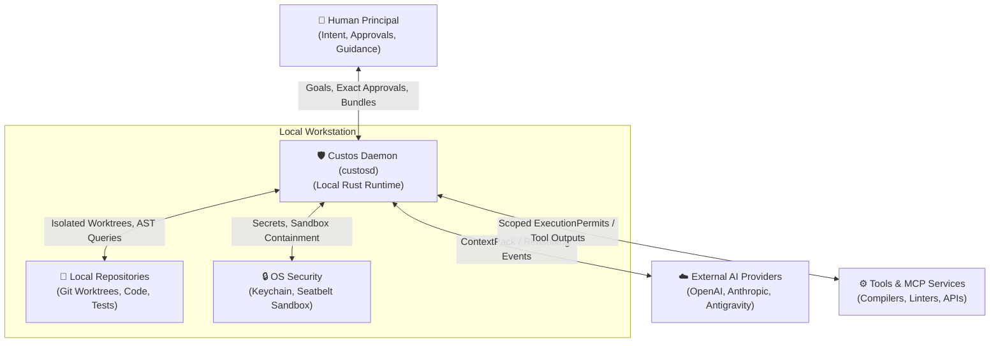
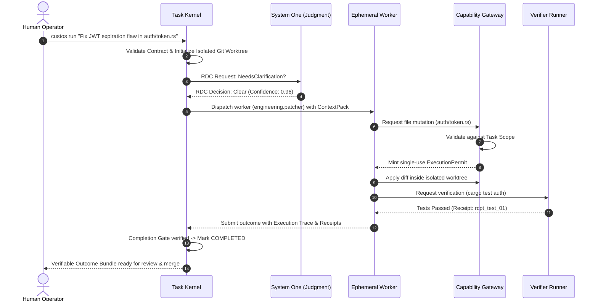

<div align="center">

# 🛡️ CUSTOS

### **Human-Centered Agentic Work Runtime**

*Local-First · Model-Agnostic · Evidence-Carrying · Judgment-Governed*

<br />

[](LICENSE)
[](docs/00-start-here.md)
[](docs/development/codebase.md)
[](docs/architecture/deployment.md)
[](docs/development/roadmap.md)

<br />

> **"Custos turns human intent into controlled, resumable, cross-provider and evidence-backed work."**  
> *Custos biến ý định của con người thành công việc được kiểm soát, có khả năng phục hồi, độc lập nhà cung cấp và được bảo đảm bằng chứng cứ.*

</div>

---

## 📑 Table of Contents

- [Overview](#-overview)
  - [Product Thesis](#product-thesis)
  - [System Formula](#system-formula)
  - [Architecture in Six Sentences](#architecture-in-six-sentences)
- [The Problem vs. The Custos Solution](#-the-problem-vs-the-custos-solution)
- [The Three Pillars](#-the-three-pillars)
- [Core Design Principles](#-core-design-principles)
- [System Architecture (The 7 Planes)](#-system-architecture-the-7-planes)
  - [System Context (C4 Level 1)](#system-context-c4-level-1)
  - [The 7 Functional Planes](#the-7-functional-planes)
  - [Three Impenetrable Membranes](#three-impenetrable-membranes)
- [System One vs. System Two (Judgment Fabric)](#-system-one-vs-system-two-judgment-fabric)
  - [Pluggable Multi-Backend Architecture](#pluggable-multi-backend-architecture)
- [End-to-End Task Lifecycle Walkthrough](#-end-to-end-task-lifecycle-walkthrough)
- [Core Concepts Glossary](#-core-concepts-glossary)
- [Repository Architecture (Monorepo Blueprint)](#-repository-architecture-monorepo-blueprint)
- [Three Specialized Domain Packs](#-three-specialized-domain-packs)
- [Competitive Differentiation](#-competitive-differentiation)
- [16-Week Delivery Roadmap](#-16-week-delivery-roadmap)
- [Complete Documentation Directory](#-complete-documentation-directory)
- [Quick Start](#-quick-start)
- [License](#-license)

---

## 🌟 Overview

**Custos** is not a "super-agent". It is not a chat wrapper aggregating models. It is not an in-memory orchestration graph.

Custos is a **specialized local-first runtime layer** positioned between:
1. **The Human Principal:** Holding intent, ethics, constraints, and ultimate approval sovereignty.
2. **AI Reasoning Providers:** OpenAI Codex, Anthropic Claude, Google Antigravity, and Local SLMs/LLMs.
3. **Workspace Knowledge:** Git repositories, codebases, AST indexes, notes, and local files.
4. **Execution Tools & OS:** Shell environments, linters, compilers, test runners, and external MCP tools.
5. **Judgment Fabric (System One):** Fast, deterministic reflection, invariant checks, and risk triage.

```text
Human Intent
  └──> Task Contract (Intent, Scope, Invariants, Budget)
        └──> Decision Cases & Subtask Workflows
              └──> Ephemeral Workers + Tiered Sandboxes + Model Providers
                    └──> Content-Addressed Artifacts + Independent Evidence
                          └──> Human-Governed Verified Outcome Bundle
```

### Product Thesis
> **Custos turns human intent into controlled, resumable, cross-provider and evidence-backed work.**

The fundamental operational unit of Custos is the **Durable Task** — never an ephemeral chat session, model context window, or isolated tool call.

### System Formula
$$	ext{Custos} = 	ext{Durable Task Control} + 	ext{Cognitive Control Fabric} + 	ext{Capability-Governed Execution} + 	ext{Knowledge/Evidence Fabric} + 	ext{Human Sovereignty}$$

### Architecture in Six Sentences
1. **The Kernel owns the truth:** The Task Kernel (not the LLM) owns task state, authority, budget, and commits; models are stateless, interchangeable reasoning engines.
2. **Workers are ephemeral:** Specialized workers are spawned on-demand for specific roles and terminate immediately upon completing their assigned scope.
3. **Judgment wraps deliberation:** Fast, low-cost reflex evaluation (System One) envelops and governs deep, expensive LLM deliberation (System Two).
4. **No implicit authority:** Zero file mutations, shell commands, or network requests may execute without a cryptographically signed `ExecutionPermit` issued via the `Capability Gateway`.
5. **Completion requires proof:** A Task transitions to `Completed` only when independent verifiers validate objective evidence matching the Task Contract.
6. **Human sovereignty is an attention budget:** High-risk decisions require exact-payload human approvals, while low-risk, verified steps run autonomously without cognitive spam.

---

## ⚡ The Problem vs. The Custos Solution

| Today's AI Agent Pitfalls | The Custos Architectural Remedy |
|---|---|
| **Ephemeral Chat Sessions:** Context is lost when switching windows, crashing, or hitting token ceilings. | **Durable Task State:** State transitions are committed to an append-only event store (SQLite + WAL) and persist across crashes. |
| **Vendor Lock-in:** Code and workflows are tightly coupled to one vendor's proprietary agent APIs. | **Model-Agnostic `ProviderPort`:** Switch between Codex, Claude, and Local models mid-task via `ContinuationPacket` without losing progress. |
| **Unchecked Side Effects:** Agents run destructive shell commands or overwrite code unexpectedly. | **Capability Gateway & Sandboxing:** OS-level sandboxing (macOS Seatbelt / Linux bwrap) with single-use, exact-payload approvals. |
| **Unbounded Costs & Loops:** Agents get stuck in hallucination loops, burning through API balances. | **Hard Budget Ceilings:** Strict limits on tokens, dollar cost, execution steps, and wall-clock time enforced by the Kernel. |
| **"Trust Me" Assertions:** AI asserts that a bug is fixed with zero objective verification. | **Evidence-Carrying Actions (ECA):** Completion requires passing automated test runners, linters, and cryptographic diff receipts. |

---

## 🏛️ The Three Pillars

```text
┌───────────────────────────┬───────────────────────────┬───────────────────────────┐
│     MODEL-AGNOSTIC        │     EVIDENCE-CARRYING     │  JUDGMENT INFRASTRUCTURE  │
│  "Swap the brain without  │   "Every action carries   │  "Fast reflex judgment is │
│     losing the soul"      │    proof of why it was    │  a first-class substrate" │
│                           │    permitted to happen"   │                           │
│ Decouples durable task    │ Eliminates unverified     │ Separates millisecond-    │
│ memory from volatile      │ assertions. Requires      │ level risk classification │
│ model sessions. Switch    │ compiler receipts, test   │ from multi-second deep    │
│ providers seamlessly.     │ logs, and AST diffs.      │ LLM deliberation.         │
└───────────────────────────┴───────────────────────────┴───────────────────────────┘
```

---

## 🧭 Core Design Principles

1. **Task-Centered:** The durable Task with a binding contract is the core unit of work, not conversations.
2. **Human-Governed:** Humans define intent, constraints, and policies; humans maintain absolute veto power.
3. **Local-First:** All code, secrets, state events, and memory items remain on the user's local workstation.
4. **Provider-Neutral:** Seamlessly orchestrate OpenAI, Anthropic, Google, and local open-weights models.
5. **Evidence-Driven:** Completion is verified through objective test receipts, not linguistic assertions.
6. **Capability-Based:** Execution uses least-privilege tokens (`ExecutionPermits`); no blanket permissions.
7. **Durable by Design:** Resilient against crashes, reboots, rate limits, and network partitions.

---

## 📐 System Architecture (The 7 Planes)

Custos organizes system responsibilities into **Planes** rather than a rigid linear pipeline:



### System Context (C4 Level 1)


### Three Impenetrable Membranes
1. **The Authority Membrane:** No action may execute without explicit authority rooted in the Task Contract or a human-signed `ExecutionPermit`.
2. **The Privacy Membrane:** Zero private workspace code, credentials, or personal telemetry leaves the workstation without passing through strict redaction gates.
3. **The Resource Membrane:** Token budgets, financial ceilings, execution step limits, and memory usage are strictly budgeted and settled transactionally.

---

## 🧠 System One vs. System Two (Judgment Fabric)

Custos operationalizes Daniel Kahneman's cognitive dual-process theory into software architecture:

| Attribute | System One (Judgment Fabric) | System Two (Deliberation Fabric) |
|---|---|---|
| **Role** | Instant reflex, risk screening, invariant checks | Deep reasoning, multi-step planning, code synthesis |
| **Underlying Engine** | Deterministic rules, local SLMs, TypeSafe Jev | Frontier LLMs (Claude 3.7 Sonnet, OpenAI Codex) |
| **Latency** | Extremely low: $10 - 200	ext{ ms}$ | High: $2 - 60	ext{ seconds}$ |
| **Cost** | Zero or near-zero ($< \$0.0001$/call) | Substantial ($\$0.01 - \$0.50$/call) |
| **Output Type** | Structured decisions (Boolean, Choice, Risk Score) | Unstructured plans, diffs, analysis text |
| **Authority** | **Zero capability minting** (Cannot grant permits) | Proposes actions to be validated |

### Pluggable Multi-Backend Architecture
```text
┌─────────────────────────────────────────────────────────────┐
│                   System One Router                         │
├─────────────────────────────────────────────────────────────┤
│ Tier 1: Deterministic Engine (Regex, AST rules, zero cost)  │
├─────────────────────────────────────────────────────────────┤
│ Tier 2: Local SLM (Llama-3-8B / Qwen-2.5 on llama.cpp)      │
├─────────────────────────────────────────────────────────────┤
│ Tier 3: Hosted Judgment Engine (TypeSafe Jev API adapter)   │
├─────────────────────────────────────────────────────────────┤
│ Tier 4: Shadow Evaluation & Calibration Harness             │
└─────────────────────────────────────────────────────────────┘
```

---

## 🔄 End-to-End Task Lifecycle Walkthrough

Here is how Custos processes a real-world software engineering task (Bug-Fix Scenario):



---

## 📖 Core Concepts Glossary

| Concept | Description | Reference Link |
|---|---|---|
| **Task** | The central durable unit of work, governed by a contract and state machine. | [concepts.md](docs/reference/concepts.md#task) |
| **Task Contract** | Binding specification defining intent, workspace scope, budget, and verification rules. | [task-lifecycle.md](docs/architecture/task-lifecycle.md) |
| **ExecutionPermit** | Cryptographically signed, single-use token granting scoped permission to execute a tool. | [capability-gateway.md](docs/architecture/capability-gateway.md) |
| **Exact-Payload Approval** | Human sign-off cryptographically bound to the exact payload hash of a high-risk action. | [capability-model.md](docs/security/capability-model.md) |
| **Worktree Isolation** | Executing all mutations in ephemeral `git worktrees` without dirtying the user's active branch. | [engineering.md](docs/domains/engineering.md) |
| **ContextPack** | Token-budgeted, relevance-scored compilation of code slices, memory, and AST symbols. | [context-memory.md](docs/architecture/context-memory.md) |
| **ContinuationPacket** | Provider-neutral state snapshot enabling seamless switching between AI models mid-task. | [provider-interop.md](docs/architecture/provider-interop.md) |
| **Verifiable Outcome Bundle** | Tamper-evident deliverable containing diffs, execution traces, test receipts, and costs. | [evidence-verification.md](docs/architecture/evidence-verification.md) |
| **System One** | Sub-second judgment fabric for fast classification, invariant checking, and risk triage. | [cognitive-fabric.md](docs/architecture/cognitive-fabric.md) |
| **RDC Protocol** | Request-Decision-Challenge protocol structuring communication between cognitive tiers. | [cognitive-fabric.md](docs/architecture/cognitive-fabric.md#3-giao-thức-rdc) |
| **Decision Ledger** | Immutable audit log recording every choice, rationale, confidence score, and human override. | [persistence.md](docs/architecture/persistence.md) |
| **Attention Budget** | Quantitative limit on human interruptions, clustering non-critical approvals for review. | [personal.md](docs/domains/personal.md) |

---

## 📦 Repository Architecture (Monorepo Blueprint)

Custos is structured as a unified **Rust Cargo Workspace**:

```text
custos/
├── Cargo.toml                      # Root Cargo workspace configuration
├── rust-toolchain.toml             # Pinned Rust 1.82+ stable toolchain
├── apps/
│   ├── custosd/                    # Trusted local daemon
│   ├── custos-cli/                 # High-performance developer CLI
│   └── custos-vscode/              # Official VS Code extension (TypeScript)
├── crates/
│   ├── core-domain/                # Pure types, entities, System Invariants
│   ├── task-kernel/                # Task state machine & event store
│   ├── workflow-runtime/           # Command/event dispatch, leases, outbox
│   ├── policy-engine/              # Grants, approval policies, Cedar mapping
│   ├── capability-gateway/         # The ONLY side-effect execution entrance
│   ├── cognitive-runtime/          # RDC protocol, Cognitive Arbiter
│   ├── judgment-contracts/         # System One schemas & interfaces
│   ├── deliberation-contracts/     # System Two worker prompts & contracts
│   ├── context-compiler/           # Slicing, scoring, ContextPack builder
│   ├── evidence-engine/            # Verifier runners & completion gates
│   ├── memory-service/             # 5-layer memory service & promotion
│   ├── repo-intelligence/          # Tree-sitter AST, ripgrep search, Git
│   ├── artifact-store/             # Content-addressed storage (CAS)
│   ├── persistence-sqlite/         # SQLite WAL migrations & event tables
│   ├── local-api/                  # Axum IPC & JSON-RPC daemon server
│   ├── provider-sdk/               # ProviderPort traits & test harnesses
│   └── observability/              # OpenTelemetry tracing, metrics, logs
├── adapters/
│   ├── providers/                  # Codex, Claude, Antigravity, Local models
│   ├── judgments/                  # Rules engine, ONNX SLM, TypeSafe Jev
│   └── sandboxes/                  # macOS Seatbelt, Linux Bubblewrap
├── domain-packs/
│   ├── engineering/                # Coding agent, worktree sandbox, verifiers
│   ├── research/                   # Claim-evidence, literature scan, Obsidian
│   └── personal/                   # Autonomy ladder, calendar/email connectors
└── docs/                           # Canonical documentation library
```

---

## 🎯 Three Specialized Domain Packs

```text
┌───────────────────────────┬───────────────────────────┬───────────────────────────┐
│     ENGINEERING PACK      │       RESEARCH PACK       │   PERSONAL OPERATIONS     │
│       (Horizon 1)         │       (Horizon 2)         │       (Horizon 2)         │
│                           │                           │                           │
│ - Ephemeral Worker Roles  │ - Claim-Evidence Schema   │ - 5-Level Autonomy Ladder │
│ - Tree-sitter AST & grep  │ - Academic Ingestion      │ - Human Attention Budget  │
│ - Isolated Git Worktrees  │ - Cross-Source Validation │ - Email & Calendar Gates  │
│ - Automated Verifiers     │ - Obsidian Vault Export   │ - Action Preview & Undo   │
│ - Outcome Bundle with diff│ - Zotero Integration      │ - Daily Review Rollup     │
└───────────────────────────┴───────────────────────────┴───────────────────────────┘
```

---

## 🥊 Competitive Differentiation

| Capability | LangGraph / CrewAI | Temporal / Workflow | Claude Code / Cursor | **Custos Runtime** |
|---|---|---|---|---|
| **Core Entity** | Graph node / Agent loop | Deterministic Activity | Chat session / Diff buffer | **Durable, Evidence-Carrying Task** |
| **State Ownership** | In-memory library | Central cluster | Proprietary vendor cloud | **Local SQLite + WAL + Outbox** |
| **Model Independence** | Framework wrappers | N/A (Non-AI) | Locked to vendor model | **Model-Agnostic `ProviderPort`** |
| **Judgment Substrate** | Prompt chains | N/A | Heuristic client checks | **Pluggable System One Fabric** |
| **Security & Permits** | Unrestricted tool calls | Static role ACLs | Prompt confirmation dialog | **Cryptographic `ExecutionPermits`** |
| **Completion Proof** | LLM text assertion | Return status code | Accepted diff | **Verifiable Outcome Bundle (ECA)** |
| **Deployment Mode** | Python runtime | Distributed server | Local CLI / Desktop IDE | **Local Daemon + Ephemeral Workers** |

---

## 🗺️ 16-Week Delivery Roadmap

Custos is developed across **four focused phases**:

```text
Phase 0 (Weeks 1–2): Architecture Runway
├── Monorepo setup, Cargo workspace, strict lint/deny policies
├── Core domain types, invariant tests, mock providers & tools
└── ADR-0001 through ADR-0010 accepted

Phase 1 (Weeks 3–5): Durable Local Kernel
├── SQLite WAL event store, outbox pattern, atomic step transactions
├── Task state machine, leases, idempotency keys, crash-recovery matrix
└── Minimal CLI: run, status, pause, resume

Phase 2 (Weeks 6–8): Read-Only Coding & Repo Intelligence
├── Git snapshot integration, tree-sitter AST parsing, ripgrep search
├── ContextPack compiler with relevance scoring and token budgeting
└── First ProviderPort adapter (Codex or Claude)

Phase 3 (Weeks 9–12): Controlled Mutation & Engineering Pack v1
├── Capability Gateway, macOS Seatbelt & Linux bwrap sandboxing
├── Ephemeral Git worktree isolation per task
├── Exact-payload human approval and automated verifier runners
└── Verifiable Outcome Bundle generation & multi-provider switching

Phase 4 (Weeks 13–16): Cognitive Control Fabric (System One Beta)
├── JudgmentPort, Versioned Question Registry, Pluggable Backends
├── Question Packs: Context-triage, Risk-triage, Completion-challenge
└── Calibration report demonstrating >= 60% latency & cost reduction
```

---

## 📚 Complete Documentation Directory

Every aspect of Custos is documented in detail in the [docs/](docs/) directory:

| Section | Documents & Links | Description |
|---|---|---|
| **🧭 Getting Started** | [Start Here Guide](docs/00-start-here.md) | Reading pathways tailored for Engineers, Architects, and Security teams. |
| **🎯 Product** | [Product Identity](docs/product/identity.md)<br />[Scope & MVP DoD](docs/product/scope.md)<br />[Capability Map](docs/product/capability-map.md) | Product thesis, personas, JTBD, non-goals, release horizons, feature taxonomy. |
| **📐 Architecture** | [Architecture Overview](docs/architecture/overview.md)<br />[Task Lifecycle](docs/architecture/task-lifecycle.md)<br />[Cognitive Fabric](docs/architecture/cognitive-fabric.md)<br />[Capability Gateway](docs/architecture/capability-gateway.md)<br />[Evidence & Verification](docs/architecture/evidence-verification.md)<br />[Communication](docs/architecture/communication.md)<br />[Provider Interop](docs/architecture/provider-interop.md)<br />[Context & Memory](docs/architecture/context-memory.md)<br />[Persistence](docs/architecture/persistence.md)<br />[Crash Recovery](docs/architecture/crash-recovery.md)<br />[Deployment](docs/architecture/deployment.md) | Complete technical specifications, C4 diagrams, state machines, schemas, protocols, traits, and recovery matrices. |
| **🧩 Domains** | [Engineering Pack v1](docs/domains/engineering.md)<br />[Research Pack](docs/domains/research.md)<br />[Personal Pack](docs/domains/personal.md) | Specialized workflows, ephemeral worker roles, and tool capabilities. |
| **🔒 Security** | [Threat Model (STRIDE)](docs/security/threat-model.md)<br />[Capability Model](docs/security/capability-model.md)<br />[Privacy & Data](docs/security/privacy.md) | Trust boundaries, prompt injection defense, exact-payload approvals, secrets. |
| **🛠️ Development** | [Codebase & Monorepo](docs/development/codebase.md)<br />[16-Week Roadmap](docs/development/roadmap.md)<br />[Testing Architecture](docs/development/testing.md)<br />[OSS Adoption Strategy](docs/development/oss-adoption.md)<br />[Observability](docs/development/observability.md) | Monorepo layout, crate boundaries, test pyramids, supply-chain policy, OpenTelemetry. |
| **📖 Reference** | [Core Concepts Glossary](docs/reference/concepts.md)<br />[Invariants & Principles](docs/reference/invariants.md)<br />[Naming Conventions](docs/reference/naming.md)<br />[Competitive Analysis](docs/reference/comparisons.md)<br />[Official Sources](docs/reference/sources.md) | 20+ core terms, 10 irreversible decisions, 8 invariants, naming tables, citations. |
| **🏛️ ADRs** | [Architecture Decision Records](docs/adr/README.md) | Index of 37 formal architectural decisions (ADR-0001 through ADR-0037). |

---

## 🚀 Quick Start

### Prerequisites
- **Rust Toolchain:** Rust 1.82+ stable (`curl --proto '=https' --tlsv1.2 -sSf https://sh.rustup.rs | sh`)
- **System Tools:** Git, SQLite3

### Clone & Build
```bash
# Clone the repository
git clone git@github.com:civi0411/Custos.git
cd Custos

# Check compilation of all workspace crates
cargo check --workspace

# Run all unit and contract tests
cargo test --workspace
```

---

## 📄 License

Custos is open-source software licensed under the **MIT License**.  
See the [LICENSE](LICENSE) file for complete details.

Copyright (c) 2026 Vĩ. All rights reserved.

---

<div align="center">
  <sub>Built with uncompromising discipline for human sovereignty, local autonomy, and verifiable software engineering.</sub>
</div>
