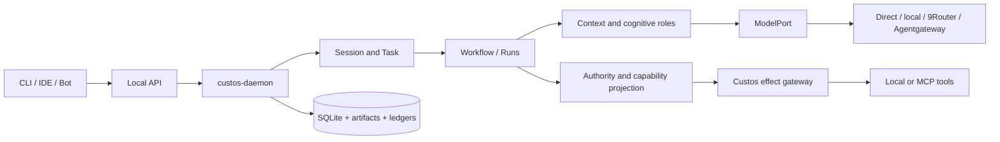

# Custos

Custos is a local-first work runtime for software engineering and programming research. It connects human intent to resumable work, model and agent choices, controlled tools, and evidence-backed outcomes.

## Start here

- [Documentation hub](docs/README.md) — authority, reading paths and document status.
- [Reference architecture](docs/architecture/reference-architecture.md) — full system, infrastructure, workflows and codebase boundaries.
- [Runtime flows](docs/architecture/runtime-flows.md) — Session/Task intake, F1/F2/F3, routing, MCP, effects, evidence and recovery.
- [Repository structure](docs/development/repository-structure.md) — current 42-member workspace and measured dependency debt.
- [Naming and Goose migration](docs/status/goose-naming-migration.md) — canonical Custos names versus retained upstream compatibility.
- [Connectivity hubs](docs/architecture/connectivity-hubs.md) — ModelPort, external coding agents, MCP tools, 9Router and Agentgateway.
- [Current local audit](docs/status/local-dev-audit-2026-09-28.md) — inspected source paths, verification results, trust gaps, and next gates.
- [Development work hub](dev_docs/README.md) — owners, current work, blockers and evidence.

## Architecture at a glance


```mermaid
flowchart LR
  U[CLI / IDE / Bot] --> API[Local API]
  API --> D[custos-daemon]
  D --> S[Session and Task]
  S --> W[Workflow / Runs]
  W --> C[Context and cognitive roles]
  C --> MP[ModelPort]
  MP --> BACK[Direct / local / 9Router / Agentgateway]
  W --> AUTH[Authority and capability projection]
  AUTH --> G[Custos effect gateway]
  G --> TOOL[Local or MCP tools]
  D --> DB[(SQLite + artifacts + ledgers)]
```

The daemon owns authoritative Task state. Models propose; policy decides; the gateway performs controlled effects; evidence and completion gates determine the reported outcome. Provider and agent integrations have separate contracts. A model routing endpoint does not imply control over a coding agent's internal tools.

## Repository status

The Cargo workspace currently reports 42 package members. The working tree is in a broad migration with many uncommitted moves and deletions. Architecture pages describe the target and mark known implementation gaps; they do not certify that every flow is wired. See [status rules](docs/status/README.md) before relying on a feature claim.

## Build and inspect

```bash
cargo metadata --offline --no-deps --format-version 1
cargo check --workspace --offline
cargo test --workspace --offline
```

These commands validate workspace metadata, compilation and tests respectively. They do not by themselves prove daemon-level durability, effect safety or evidence closure. Use the process-level gates in [PR-00](docs/development/pr-00-gates.md).

## Adjacent packages

`services/ask-ai-bot`, `oidc-proxy`, `packages/custos-npm-package` and `ui/` are adjacent products/integrations. They must use supported APIs or protocols and do not own Task persistence. `docs/goose/` contains imported upstream reference material, not a list of implemented Custos features.

The previous README and architecture draft are preserved in [`docs/archive/`](docs/archive/README.md) for provenance.
