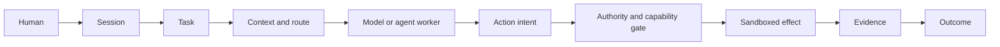

<div align="center">

<picture>
  <source media="(prefers-color-scheme: dark)" srcset="docs/assets/banner-dark.png">
  <source media="(prefers-color-scheme: light)" srcset="docs/assets/banner.png">
  
</picture>

# Custos

[ EN ] · [ VI ](docs/i18n/CUSTOS_RESEARCH_BACKED_ARCHITECTURE_VI.md)

</div>

**A local-first, human-governed runtime for proof-carrying agent work.**

Custos turns transient AI conversations into durable Tasks with explicit intent, bounded execution, recoverable state and evidence-backed outcomes. It is designed for software engineering, technical research and personal workflows across local models, cloud models and external coding agents.

> Custos is under active construction. The architecture is defined, core foundations compile and are tested, but the complete model/worker/effect/evidence path is not yet composed in the daemon. Read [current status](docs/status/README.md) before relying on a feature claim.

## Product contract

Custos separates concepts that ordinary agent systems often collapse:

- A **Session** is an interaction channel.
- A **Task** is the durable unit of intent, policy and acceptance.
- A **Run** is one execution attempt.
- An **Effect** is a governed external mutation.
- **Evidence** proves a bounded claim about a specific subject and revision.
- A human remains the final authority for scope, policy and consequential approval.

The intended path is:


```mermaid
flowchart LR
    Human --> Session
    Session --> Task
    Task --> Context[Context and route]
    Context --> Worker[Model or agent worker]
    Worker --> Intent[Action intent]
    Intent --> Gate[Authority and capability gate]
    Gate --> Effect[Sandboxed effect]
    Effect --> Evidence
    Evidence --> Outcome
```

Custos does not trust a model's declaration of success. Terminal outcomes require current, subject-bound evidence produced by trusted verification paths.

## Architecture

The repository uses 11 product crates:

| Crate | Responsibility |
|---|---|
| `custos-domain` | Pure domain identities, entities and invariants |
| `custos-core` | Task application service, authority and completion policy |
| `custos-persistence` | SQLite migrations and durable repositories |
| `custos-bridge` | Session-to-Task promotion and current Local API dispatch |
| `custos-runtime` | Session, workflow, worker, cognition, context and memory |
| `custos-provider` | Provider-neutral model contracts |
| `custos-adapters` | Model, agent, protocol, capability and infrastructure adapters |
| `custos-packs` | Engineering, Research and Assistant workflows |
| `custos-daemon` | Sole production composition root |
| `custos-sdk` | Versioned client DTOs and transport contracts |
| `custos-cli` | Thin operator client |

The workspace also contains two test crates and `xtask`. Source consolidated from Goose remains migration debt until a bounded call path is composed and verified.

Goose, 9Router, and Agentgateway are upstream research sources. Custos dissects
their mechanisms independently and may adapt a bounded mechanism through a
port, but none owns Task state, effect authority, evidence truth, or the Custos
control plane.

## Current state

Verified foundations include domain state machines, SQLite-backed core repositories, Session-to-Task bridging, Local API dispatch and a broad set of runtime/adapter tests.

The most important open gates are:

1. replace caller-authored verification claims with trusted, subject-bound evidence;
2. strengthen permits with task, capability, target, payload, revision, revocation and single-use binding;
3. replace developer shell execution with production OS sandbox adapters;
4. make Run/Step, effect and evidence persistence executable rather than schema-only;
5. compose model, agent, capability and judgment ports in `custos-daemon`;
6. classify and migrate remaining Goose compatibility/debt deliberately.

See [current implementation status](docs/status/README.md) for exact exit
conditions.

## Build and verify

Prerequisites are defined by the repository toolchain and package manifests.

```bash
cargo fmt --all -- --check
cargo check --workspace
cargo test --workspace --all-targets
bash scripts/check_naming.sh
bash scripts/check_deps.sh
```

The current dirty working tree may temporarily fail formatting while concurrent source refactoring is in progress. A mergeable branch must pass every applicable gate.

## Documentation

Start here:

1. [Documentation authority and navigation](docs/README.md)
2. [Definitive product architecture](docs/architecture/definitive-product-architecture.md)
3. [Runtime flows](docs/architecture/runtime-flows.md)
4. [Repository structure](docs/development/repository-structure.md)
5. [Upstream dissection protocol](docs/research/upstream-dissection.md)
6. [Vietnamese research-backed architecture](docs/i18n/CUSTOS_RESEARCH_BACKED_ARCHITECTURE_VI.md)
7. [Current implementation status](docs/status/README.md)
8. [Team work hub](dev_docs/README.md)
9. [Agent and ownership policy](AGENTS.md)

Obsolete plans, dated audits, weekly report copies, and the vendored Goose
documentation website were removed from the active checkout. Git history
preserves them when provenance work requires recovery.

## Design principles

- Local-first state and explicit egress policy
- Task-centric continuity across sessions and workers
- Human sovereignty and least authority
- No direct production effects outside a validated capability path
- Durable attempts before dispatch and no blind retry after uncertainty
- Evidence-bound completion
- Ports for models, external agents, capabilities, judgments and protocols
- Thin clients and one daemon composition root
- Observable cost, latency, risk and recovery

## License

See [LICENSE](LICENSE).
