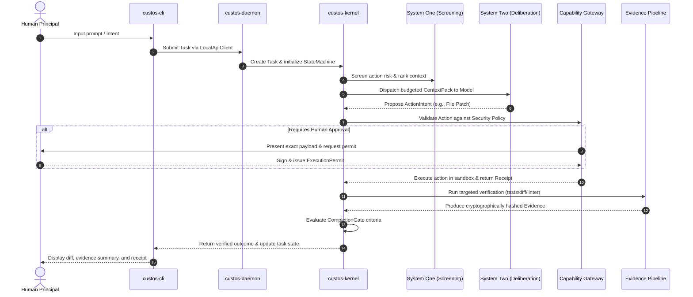

<div align="center">

<picture>
  <source media="(prefers-color-scheme: dark)" srcset="docs/assets/banner-dark.png">
  <source media="(prefers-color-scheme: light)" srcset="docs/assets/banner.png">
  
</picture>

**A Human-Governed Workspace for Specialized Agentic Work**

*Vibe coding, research, and personal workflows across the models you choose — with durable state, controlled execution, cost-aware context, and verifiable outcomes.*

<br />

[ EN ] | [ VI ](docs/i18n/README.vi.md) | [ DE ](docs/i18n/README.de.md) | [ ZH ](docs/i18n/README.zh.md)

<br />

[](LICENSE)
[](docs/canonical-specification.md)
[](docs/architecture/reference-architecture.md)
[](docs/architecture/deployment.md)

</div>

---

## What Custos Means

Custos means *guardian*.

The name reflects the product's primary mission: Custos guards the continuity, authority, privacy, resources, and evidence of AI-assisted work while leaving intent and final responsibility with the human.

Custos is **not** another autonomous black-box agent and not merely a chat wrapper over model APIs. It is a local-first runtime, task kernel, and workspace in which humans, specialized agent domains, cognitive models, tools, and repository knowledge collaborate through durable, verifiable, and governed tasks.

Bring the models you trust. Work naturally. Custos keeps the work coherent, controlled, resumable, and auditable.

---

## The Problem

Modern AI coding and research tools are fast, but the surrounding engineering workflows remain deeply fragmented:

- **Trapped Context:** Critical context is locked inside provider-specific chat sessions and isolated web portals.
- **Lost Progress:** Work state is lost whenever switching models, encountering rate limits, or restarting environments.
- **Wasted Tokens:** Agents constantly reread entire repositories, logs, and files from scratch with zero incremental caching.
- **Cost Inefficiency:** Expensive frontier models are routinely burned on trivial syntax checks and symbol lookups.
- **Silent Degradation:** Model fallbacks fail silently, dropping tool calling and structured output semantics mid-task.
- **Unverified Claims:** Generated code and research hypotheses are accepted without independent, reproducible evidence.
- **Unchecked Side Effects:** Tool executions mutate host file systems without granular approval, rollback, or audit receipts.

Custos replaces brittle, transient chat sessions with **Durable Tasks** governed by explicit execution permits and verifier gates.

---

## Core Philosophy: The Durable Task

The fundamental unit of execution in Custos is a **Durable Task**, not an ephemeral chat prompt.

```text
Durable Task = Contract + State Machine + Context Pack + Workflows + Permits + Evidence Closure
```

A Custos Task:
- **Resumes seamlessly** across crashes, process restarts, network outages, and token budget limits.
- **Handoffs cleanly** between different models (e.g., Claude for planning, Codex for editing, Qwen for local review) without losing memory.
- **Enforces strict boundaries:** Actions with external side-effects require cryptographic or human-signed **Execution Permits**.
- **Closes on evidence:** A task cannot succeed merely because an LLM claims "I have finished". Completion requires tangible evidence (passing tests, verified AST diffs, citation hashes, and human sign-off).

---

## Tripartite Responsibility Model

Custos cleanly separates authority, screening, and deliberation into three explicit tiers:

| Tier | Role | Responsibility | Authority |
|---|---|---|---|
| **Human Principal** | Sovereign Authority | Sets intent, defines budgets, approves consequential actions, grants veto | Ultimate approval and veto |
| **System One (S1)** | Fast Reflex & Screening | Deterministic rules, local embeddings, risk screening, symbol ranking | Advisory & policy gating only (No mutations) |
| **System Two (S2)** | Deep Deliberation | Frontier reasoning models, coding agents, synthesis, refactoring plans | Proposes actions via `ActionIntent` |

Neither System One nor System Two can self-grant execution authority. The **Task Kernel** owns state transitions, and the **Capability Gateway** enforces execution permits.

---

## Specialized Agent Domains

Custos provides three purpose-built **Domain Packs**:

| Domain | Typical Work | Fast Judgment (S1) | Deep Deliberation (S2) | Completion Evidence |
|---|---|---|---|---|
| **Coding** | Architecture explanation, bug fixing, refactoring, feature implementation | File/symbol ranking, risk checks, test selection | Multi-file planning, patch generation, debugging | Worktree diff, clean build, test receipts, linter green |
| **Research** | Paper comparison, claim extraction, benchmark synthesis | Relevance scoring, deduplication, contradiction flags | Hypothesis evaluation, experiment design | Source citations, dataset hashes, metric logs |
| **Assistant** | Workspace organization, planning, recurring workflows | Privacy screening, priority classification | Multi-step task drafting, execution coordination | Audit trails, human approval receipts, delivery logs |

---

## Real-World CLI Quickstart

Custos is driven by a lightweight, modular CLI (`custos-cli`) communicating via versioned IPC with the local daemon (`custos-daemon`).

### 1. Build and Verify Workspace

```bash
# Check compilation across all 42 crates
cargo check --workspace --offline

# Run workspace unit and contract tests
cargo test --workspace --offline
```

### 2. Run the Custos CLI

```bash
# Start an interactive Vibe Coding session
cargo run -p custos-cli -- vibe --prompt "Explain the repository architecture" --mode coding

# Run an End-to-End Vertical Slice (Repository Architecture Explanation)
cargo run -p custos-cli -- explain --query "How does the Task State Machine work?"

# Create a governed task
cargo run -p custos-cli -- create --title "Implement deterministic effect sandbox"

# Inspect task status and timeline
cargo run -p custos-cli -- status --id <TASK_ID>

# List all active tasks
cargo run -p custos-cli -- list
```

---

## Repository Architecture

The Custos codebase is organized as an audited, 42-crate Rust monorepo with clear ports-and-adapters layering:

```text
Custos/
├── crates/
│   ├── core/                        # Pure domain abstractions & zero-I/O contracts
│   │   ├── custos-domain            # Core domain entities: Task, Session, Evidence, Artifact
│   │   ├── custos-kernel            # CQRS TaskService, StateMachine, CompletionGate
│   │   ├── custos-bridge            # Session-to-Task lifecycle bridge
│   │   ├── custos-provider-sdk      # Provider conformance traits & event models
│   │   ├── custos-provider-types    # Provider message, completion, and stream types
│   │   └── custos-sdk-types         # Shared SDK data structures
│   │
│   ├── runtime/                     # Authoritative runtime engines & state machines
│   │   ├── custos-session           # Session lifecycle & durable journal
│   │   ├── custos-workflow          # Durable workflow engine & step dispatch
│   │   ├── custos-cognitive         # CognitiveArbiter (System 0/1/2 routing)
│   │   ├── custos-context           # Context compilation & token optimization
│   │   ├── custos-context-management# Context summarization & structured output
│   │   ├── custos-security          # PathSandbox, DeterministicGate, EvidencePipeline
│   │   ├── custos-gateway           # Protocol gateway & connection abstractions
│   │   ├── custos-memory-service    # Memory indexing & persistent recall
│   │   └── custos-agent             # Agent loop execution & event coordination
│   │
│   ├── infrastructure/              # Durable storage & external system drivers
│   │   └── custos-persistence       # SQLite WAL persistence, state ledgers, migrations
│   │
│   ├── adapters/                    # Pluggable model providers, sandboxes & tools
│   │   ├── custos-adapters-mcp      # MCP (Model Context Protocol) client & adapter
│   │   ├── custos-mcp               # Core MCP protocol implementation
│   │   ├── custos-providers         # Provider hub & dynamic router
│   │   ├── custos-local-inference   # On-device inference adapter
│   │   ├── custos-roaming           # Roaming agent synchronization
│   │   ├── custos-download-manager  # Asset & model artifact downloader
│   │   ├── judgments/               # System One judgment backends (rules, jev, onnx)
│   │   ├── providers/               # LLM adapters (Claude, Codex, Antigravity, Fake, Local)
│   │   └── sandboxes/               # OS-level containment (Linux bubblewrap, macOS seatbelt)
│   │
│   ├── packs/                       # Domain workflow templates & prompt recipes
│   │   ├── custos-packs-engineering # Engineering domain workflows & tool configurations
│   │   ├── custos-packs-research    # Research domain workflows & claim verification
│   │   └── custos-packs-assistant   # Assistant domain workflows & note management
│   │
│   └── app/                         # Executable entrypoints & user-facing APIs
│       ├── custos-cli               # Operator CLI & interactive vibe terminal
│       ├── custos-daemon            # Composition root & local daemon process
│       └── custos-local-api         # IPC transport client, DTOs & versioned API protocol
│
├── schemas/                         # Formal JSON schemas for cross-process contracts
├── tests/                           # E2E vertical slice & contract verification suites
│   ├── contract/                    # Strict C-01..C-04 contract conformance tests
│   └── e2e/                         # Multi-process daemon & CLI integration tests
├── evals/                           # Evaluation benchmarks & regression harnesses
├── ui/                              # Web & desktop user interface components
└── docs/                            # Comprehensive technical documentation
```

---

## Runtime Flow at a Glance


```mermaid
sequenceDiagram
    autonumber
    actor Human as Human Principal
    participant CLI as custos-cli
    participant Daemon as custos-daemon
    participant Kernel as custos-kernel
    participant S1 as System One (Screening)
    participant S2 as System Two (Deliberation)
    participant Gate as Capability Gateway
    participant Verifier as Evidence Pipeline

    Human->>CLI: Input prompt / intent
    CLI->>Daemon: Submit Task via LocalApiClient
    Daemon->>Kernel: Create Task & initialize StateMachine
    Kernel->>S1: Screen action risk & rank context
    Kernel->>S2: Dispatch budgeted ContextPack to Model
    S2-->>Kernel: Propose ActionIntent (e.g., File Patch)
    Kernel->>Gate: Validate Action against Security Policy
    alt Requires Human Approval
        Gate->>Human: Present exact payload & request permit
        Human-->>Gate: Sign & issue ExecutionPermit
    end
    Gate-->>Kernel: Execute action in sandbox & return Receipt
    Kernel->>Verifier: Run targeted verification (tests/diff/linter)
    Verifier-->>Kernel: Produce cryptographically hashed Evidence
    Kernel->>Kernel: Evaluate CompletionGate criteria
    Kernel-->>CLI: Return verified outcome & update task state
    CLI-->>Human: Display diff, evidence summary, and receipt
```

---

## Documentation Directory

The technical documentation is organized by architectural concern:

| Guide | Description |
|---|---|
| [Documentation Hub](docs/README.md) | Authority register, status taxonomy, and navigation overview |
| [Start Here & Reading Paths](docs/00-start-here.md) | Role-based onboarding for Systems, AI, Security, and Client engineers |
| [Reference Architecture](docs/architecture/reference-architecture.md) | Full system design, architectural planes, and cross-cutting invariants |
| [Runtime Flows](docs/architecture/runtime-flows.md) | End-to-end trace of task intake, cognitive routing, effects, and recovery |
| [Contract Register](docs/contracts/README.md) | Formal specifications for C-01 (API), C-02 (Task), C-03 (Permits), and C-04 (Evidence) |
| [Repository Structure](docs/development/repository-structure.md) | 42-crate dependency boundaries, layer rules, and technical debt log |
| [Implementation Blueprint](docs/development/implementation-blueprint.md) | Phased engineering milestones and PR delivery roadmap |
| [PR-00 Quality Gates](docs/development/pr-00-gates.md) | Strict conformance checklist required for landing changes |
| [Security & Threat Model](docs/security/threat-model.md) | STRIDE analysis, isolation sandboxes, and token egress policies |
| [Current Audit Snapshot](docs/status/local-dev-audit-2026-09-28.md) | Empirical test results and verified capability register |

---

## Verification Status

Custos maintains a strict distinction between **Verified Reality** and **Target Architecture**:

- **Verified:** Session durability, Task state machine (direct transitions to `Succeeded` are rejected without evidence), `PathSandbox` directory containment, `DeterministicGate` effect verification, and CLI-to-daemon IPC.
- **In Progress:** Provider gateway unification, full daemon composition of `DeterministicGate`, and streaming evidence verification.

Refer to [`docs/status/README.md`](docs/status/README.md) for full status claims and audit logs.

---

## Contributing

Custos enforces high engineering standards:
1. All changes must respect the **zero-I/O boundary** of `crates/core/custos-domain`.
2. Any side-effecting operation must flow through `crates/runtime/custos-security`.
3. Every pull request must pass the automated gates defined in [`docs/development/pr-00-gates.md`](docs/development/pr-00-gates.md).

Please review [`AGENTS.md`](AGENTS.md) and [`docs/development/naming-conventions.md`](docs/development/naming-conventions.md) before submitting code.

---

## License

Custos is open-source software licensed under the [Apache License 2.0](LICENSE).

<div align="center">

**Custos — Guardian of Work**

*Built for human sovereignty, local autonomy, and verifiable software engineering.*

</div>
