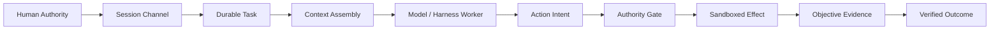

<div align="center">

<picture>
  <source media="(prefers-color-scheme: dark)" srcset="docs/assets/banner-dark.png">
  <source media="(prefers-color-scheme: light)" srcset="docs/assets/banner.png">
  
</picture>

[ EN ](README.md) · [ VI ](docs/i18n/README.vi.md) · [ DE ](docs/i18n/README.de.md) · [ ZH ](docs/i18n/README.zh.md)

</div>

**A local-first, human-governed runtime for proof-carrying agent work.**

Custos transforms transient artificial intelligence conversations into durable, governed tasks with explicit intent, bounded execution, recoverable state, and evidence-backed outcomes. It operates locally across local models, cloud providers, and external coding harnesses.

---

## Core Motivation

Contemporary agentic tools offer immense capability but suffer from fundamental architectural flaws:

- **Ephemeral Context Loss:** Context is trapped within isolated vendor silos and discarded across sessions or tool changes.
- **Unverified Assertions:** Model declarations of completion are trusted without objective verification or proof.
- **Uncontrolled Side Effects:** External mutations (file edits, network requests, system commands) execute without strict capability gating or audit trails.
- **Fragile State:** System crashes, rate limits, and context overflows abort in-flight work with no deterministic recovery.
- **Erosion of Human Agency:** Opaque multi-agent setups diminish human supervision and consequential decision authority.

Custos resolves these failures by introducing a local-first, evidence-bound operating model where human sovereignty is paramount and agent actions are strictly audited.

---

## Fundamental Concepts

Custos enforces clear boundaries between operational entities:

- **Session:** An ephemeral interaction channel (CLI, IDE harness, desktop interface, chat).
- **Task:** The durable, immutable unit of intent, policy, state, and acceptance criteria.
- **Run:** A discrete execution attempt within an active task lifecycle.
- **Action Intent:** A proposed external mutation generated by a model worker.
- **Execution Permit:** A cryptographically bound, single-use authorization issued by the authority engine.
- **Effect:** A sandboxed mutation executed exclusively under an active permit.
- **Evidence:** Objective, verifiable artifacts confirming claims independently of model assertions.


```mermaid
flowchart LR
    Human[Human Authority] --> Session[Session Channel]
    Session --> Task[Durable Task]
    Task --> Context[Context Assembly]
    Context --> Worker[Model / Harness Worker]
    Worker --> Intent[Action Intent]
    Intent --> Gate[Authority Gate]
    Gate --> Effect[Sandboxed Effect]
    Effect --> Evidence[Objective Evidence]
    Evidence --> Outcome[Verified Outcome]
```

---

## System Architecture

Custos operates across three distinct Trust Zones:

1. **Untrusted Zone:** External models, foreign agent workers, third-party network endpoints, and unparsed user input.
2. **Supervised Zone:** Context compilation, prompt synthesis, semantic routing, and ephemeral execution planning.
3. **Trusted Kernel:** SQLite write-ahead-log (WAL) persistence, authority engine, capability gateway, and completion verifiers.

### Product Crates

The codebase is organized into 11 focused Rust crates:

| Layer | Crate | Core Responsibility |
|---|---|---|
| **Domain** | `custos-domain` | Pure domain identities, entity models, state machines, and invariants. |
| **Core** | `custos-core` | Task orchestration service, authority engine, and completion policies. |
| | `custos-persistence` | SQLite migrations, durable repositories, and crash recovery. |
| **Runtime** | `custos-runtime` | Session lifecycle, worker processes, cognition, and memory tiers. |
| | `custos-provider` | Provider-neutral model contracts, streaming protocols, and tokenizers. |
| **Bridges & Adapters** | `custos-bridge` | Session-to-Task promotion and local application programming interface dispatch. |
| | `custos-adapters` | Concrete implementations for models, capabilities, and sandboxes. |
| **Domain Packs** | `custos-packs` | Specialized workflows: Engineering, Research, and Assistant packs. |
| **Daemon & Entry** | `custos-daemon` | Sole production composition root and background daemon service. |
| | `custos-sdk` | Client data transfer objects and transport client abstractions. |
| | `custos-cli` | Lightweight terminal operator interface. |

---

## Protocol Hubs and Harness Support

The Custos local daemon serves as a central interoperability gateway through six specialized hubs:

- **Model Hub:** Routes requests across local engines and cloud inference providers with fallback resilience.
- **Tool Hub:** Governs Model Context Protocol (MCP) servers and external execution tools.
- **Agent Hub:** Manages Agent-to-Agent (A2A) communications and Agent Communication Protocol (ACP) workflows.
- **Storage Hub:** Coordinates SQLite persistence, blob storage, and structured index caches.
- **Event Hub:** Distributes high-throughput audit telemetry and lifecycle events.
- **Operator Hub:** Provides secure local endpoints for operator interfaces and terminal sessions.

### Harness Adapters

Custos integrates with external developer environments without compromising safety boundaries:

- **Claude Code:** Stdio subprocess isolation and command wrapping.
- **Codex:** Sandboxed code completion and test execution.
- **Cursor:** Editor buffer synchronization and diff application.
- **Antigravity:** Agentic coding runtime coordination and task synchronization.

---

## Domain Packs

Custos provides workflow packs tailored to specific knowledge domains:

- **Engineering Pack:** Autonomous software engineering workflows featuring atomic patch bundles, multi-worker fault localization, and three-path execution workspaces (canonical repo, staging fork, and verification sandbox).
- **Research Pack:** Scientific and technical investigation workflows emphasizing reproducibility bundles, iterative claim verification, dataset auditing, and experiment tracking.
- **Assistant Pack:** Personal workflow management with multi-tier autonomy, calendar and communication governance, and stable payload scheduling.

---

## System Invariants

1. **Local-First Sovereignty:** All task data, state transitions, context artifacts, and audit logs reside on local disk.
2. **Zero Unchecked Effects:** No agent or model can perform file system modifications, process execution, or network calls without an active execution permit.
3. **Evidence Over Assertions:** A task cannot enter a completed state based solely on a model's claim of success; verified evidence must be attached.
4. **Durable State Transactions:** State changes persist to disk before action execution is dispatched, preventing indeterminate states during crashes.
5. **Human Supremacy:** The human operator holds unconstrained authority to pause, inspect, modify, or abort any task at any point in its lifecycle.

---

## Verification and Testing

Build and verify the workspace:

```bash
cargo fmt --all -- --check
cargo check --workspace
cargo test --workspace --all-targets
```

---

## Documentation and Specifications

- **Architectural Specification:** [Custos.md](Custos.md) (Single Source of Truth)
- **Agent and Contributor Rules:** [AGENTS.md](AGENTS.md)
- **Documentation Directory:** [docs/README.md](docs/README.md)
- **Internationalization:** [docs/i18n/README.md](docs/i18n/README.md)

---

## License

The root [LICENSE](LICENSE) currently contains the MIT License. Licensing and attribution for Goose-derived source are under review; see the [upstream source audit](docs/development/upstream-source-map.md). Do not assume the root license alone describes every upstream-derived file.
