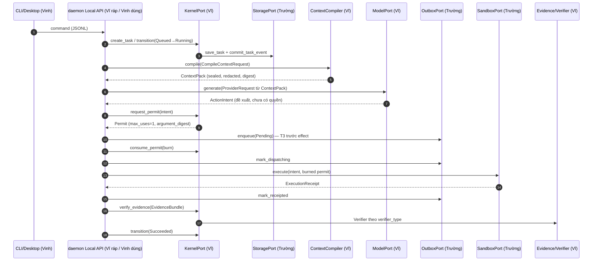
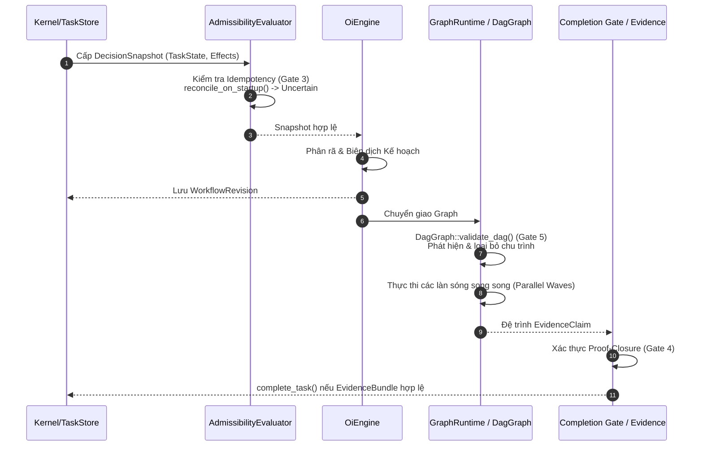

# CUSTOS — BẢN ĐỒ LIÊN KẾT KIẾN TRÚC (Architecture Linkage Map)

> **Mã tài liệu:** DEV-ARCH-01 · **SSOT:** [`Custos.md`](../Custos.md) · **Phân công:** [`TEAM_WORK_ALLOCATION.md`](TEAM_WORK_ALLOCATION.md)
> **Trạng thái:** Mọi mục đánh dấu ✅ đã được đối chiếu với code ở commit hiện tại và có test chạy được (`cargo test -p custos-testkit`).

Tài liệu này trả lời 4 câu hỏi để 3 người code song song mà không dẫm chân: **(1)** cái gì đã tồn tại, **(2)** 6 Port nối với nhau thế nào, **(3)** mỗi người sở hữu file nào, **(4)** làm sao test phần mình mà không chờ người khác.

---

## 0. Kết quả rà soát kế hoạch trước (các lỗi đã sửa)

| # | Sai sót trong plan cũ | Sự thật (nguồn) | Đã sửa |
|---|---|---|---|
| 1 | Đề xuất "viết Context Compiler 8 bước từ đầu" với thứ tự riêng (Secret Redaction ở bước 2) | **Đã có** tại `custos-core/src/context/mod.rs`, đúng thứ tự Custos.md §6.4: Scope→Structural→Anchor→Taint→Dedup→Compaction→**Redaction (bước 7)**→Seal. Có test. | Bỏ; việc của Vĩ là *nâng chất lượng* (Tree-sitter, FTS5, semantic cache), không viết lại |
| 2 | Đề xuất tạo `EvidenceEngine` mới | **Đã có** `EvidencePipeline` + trait `Verifier` + 7 verifier (exit code, hash, exact match, citation, semantic support, patch preview, diff) | Bỏ; Vĩ thêm verifier ALCE/MiniCheck/LTL bằng `register_verifier` |
| 3 | "6 Ports" = Kernel, Model, Storage, Capability+Sandbox, Memory, **TransportPort** | `TEAM_WORK_ALLOCATION §4.1` chốt: Kernel, Storage, Sandbox, Model, **Workflow**, Memory. Local API là *hợp đồng sản phẩm*, không phải port (Custos.md §7.10) | Dùng đúng danh sách của §4.1; bỏ TransportPort |
| 4 | Testbed đặt trong `custos-core` và dùng SQLite | Vi phạm DAG: core không được phụ thuộc persistence | Testbed ở `tests/testkit` (không phải product crate) |
| 5 | Schema `ActionIntent`/`MemoryPort` tự chế | `ActionIntent = Action` (alias), `Permit.max_uses=1`, `MemoryPort` có chữ ký cố định ở §9.3 | `MemoryPort` làm đúng §9.3; xem mục 5 về lệch schema |
| 6 | `dev_docs/README.md` còn ghi chia **60/20/20** và Vĩ sở hữu cả `daemon`, `packs`… | Phân công hiện hành là **40/30/30** | Sửa README |
| 7 | Hai hệ gate: `A→OPT` (8 gate) vs `Gate 0→5` + `PR-00→11` (docs/development/delivery-blueprint.md) | Hai hệ đo cùng một việc nhưng khác tên | Có bảng quy đổi ở mục 7 |

---

## 1. Hiện trạng thật của codebase (đo bằng `wc -l`)

| Crate | LOC | Bản chất |
|---|---:|---|
| `custos-runtime` | **99.319** | Chủ yếu mã thừa kế upstream (Goose: `engine/`, posthog, otel, scheduler…). Phần Custos-native nhỏ: `workflow/`, `session/`, `agent/runtime_port.rs`, `cognitive/` |
| `custos-adapters` | 36.371 | providers, local_inference, mcp, sandbox, roaming |
| `custos-provider` | 30.597 | `ModelProvider`, `AgentRuntimePort`, `CapabilityPort` |
| `custos-sdk` | 6.219 | Client SDK |
| `custos-core` | 4.504 | **Phần "thật" của Kernel**: FSM, Authority, Evidence, Context Compiler, PathSandbox |
| `custos-packs` | 3.067 | research/assistant (SDK mỏng) |
| `custos-domain` | 1.875 | Entities |
| `custos-persistence` | 1.357 | SQLite store + FS artifacts |
| `custos-daemon` | 1.378 | stdio-JSONL Local API |
| `custos-bridge` | 449 | Session↔Task |
| `custos-app/cli` | 2.205 | CLI |

**Hệ quả:** phần AI/Kernel của Vĩ nhỏ và đã có khung; rủi ro lớn nhất không phải "thiếu code AI" mà là **mã thừa kế khổng lồ trong runtime chưa được cắt gọt**, và **các đường nối giả** (provider/MCP/A2A mô phỏng — Custos.md §7.4–7.5).

### Trùng lặp cần dọn (cùng một chức năng, nhiều nơi)

| Chức năng | Các nơi hiện có | Bản chuẩn (giữ) |
|---|---|---|
| Context compiler | `core/context` (8 bước chuẩn) · `runtime/context/compiler.rs` (`TokenAwareContextCompiler`) · `runtime/context/compiler/` (upstream) | `core/context` |
| Memory | `runtime/memory_service` (`MemoryStore`) · `runtime/context/memory` | `core::contracts::MemoryPort` (§9.3) |
| Artifact store | `persistence::ArtifactStore` | nay là alias của `core::contracts::CasPort` |
| Cognitive routing | `runtime/cognitive/*` ("9Router": signal_extractor, arbiter, routing…) | Chưa khớp S1/S2 của §14.4 — xem mục 8 |

---

## 2. Đồ thị phụ thuộc: spec vs thực tế

Spec (Custos.md §2.2): `core→domain`, `persistence→domain`, `provider→domain`, `adapters→provider,domain`, `runtime→core,domain`, `packs→runtime,domain`, `bridge→domain`, `daemon→(runtime,persistence,adapters,packs,bridge)`.

| Cạnh thực tế | Trong spec? | Đánh giá |
|---|---|---|
| `persistence → core` | ❌ | **Cần thiết** (persistence implement trait của core theo hexagonal). Đề xuất **sửa spec** cho phép `persistence→core`, `adapters→core`; cấm chiều ngược |
| `adapters → core` | ❌ | như trên |
| `runtime → provider` | ❌ | Hợp lý (runtime gọi ModelPort). Thêm vào spec |
| `runtime → persistence` | ❌ | **Vi phạm thật.** Runtime phải đi qua `StoragePort`; daemon mới được chọn SQLite. Việc của Vinh gỡ |
| `bridge → runtime`, `bridge → core` | ❌ (spec: chỉ domain) | Chấp nhận tạm; mục tiêu: bridge chỉ biết `KernelPort` |
| `packs → core` | ❌ | Chấp nhận (dùng Verifier/Context) |
| `core → anything-but-domain` | — | ✅ không vi phạm |

> **Quyết định cần Vĩ chốt (RFC-001):** cập nhật mermaid §2.2 cho khớp hexagonal (`infra → core → domain`), hay ép `persistence→domain` (khi đó trait phải chuyển xuống domain, nhưng domain cấm async/I/O). Khuyến nghị: **sửa spec**.

Workspace `Cargo.toml` trước đây liệt kê trùng `custos-app/cli` và `desktop`; đã dọn.

---

## 3. Sáu Port — sổ đăng ký chuẩn

Định nghĩa trong [`custos-core/src/contracts/`](../crates/custos-core/src/contracts/mod.rs). *(Tên module là `contracts`, không phải `ports`: `kernel::ports` đã được glob re-export ở gốc crate, một module `ports` cấp cao sẽ che nó — đây chính là nguyên nhân lần scaffold trước làm vỡ `cargo check`.)*

| # | Port | Chữ ký chính | Trạng thái | Định nghĩa | Implement thật | Mock (testkit) | Owner |
|---|---|---|---|---|---|---|---|
| 1 | **KernelPort** | `create_task, get_task, transition_task, request_permit, consume_permit, verify_evidence` | ✅ chạy | `contracts/kernel.rs` | `TrustedKernel` (bọc `TaskService`+`AuthorityEngine`+`EvidencePipeline`) | dùng bản thật | Vĩ |
| 2 | **StoragePort** (+`CasPort`,`OutboxPort`) | `StoragePort = TaskStore+SessionStore`; Cas `put/get/exists`; Outbox `enqueue→dispatching→receipted/uncertain` | ✅ Storage/Cas · 🟡 Outbox chưa có SQLite impl | `contracts/storage.rs` | `SqliteTaskStore`, `FsArtifactStore` | SQLite in-memory, `InMemoryOutbox` | Trường |
| 3 | **SandboxPort** | `execute(&ActionIntent,&Permit)->ExecutionReceipt` + `verify_permit_binding` | 🟡 trait mới; driver Seatbelt/Bwrap chưa nối | `contracts/sandbox.rs` | `custos-adapters/sandbox/*` (chưa implement trait) | `MockSandbox` | Trường |
| 4 | **ModelPort** | `generate`, `stream` (`ModelProvider`, alias `ModelPort`) | ✅ trait · adapter vendor đang **mô phỏng** | `custos-provider/src/port.rs` | `adapters/providers/*` | `MockModel` | Vĩ |
| 5 | **WorkflowPort** | `start_run, cancel, checkpoint` | 🟡 **DRAFT** — chưa tồn tại trước đây; Vinh review qua RFC | `contracts/workflow.rs` | `custos-runtime/workflow/*` (chưa implement) | — (Vinh cung cấp) | Vinh |
| 6 | **MemoryPort** | `recall_context, recall_temporal_fact, propose_fact` (đúng §9.3, không có delete/purge) | 🟡 trait + domain types mới; chưa có backend | `contracts/memory.rs`, `domain/memory.rs` | chưa có | `InMemoryMemory` | Vĩ |

**Cổng phụ (không thuộc 6 port, giữ nguyên):** `AgentRuntimePort`, `CapabilityPort` (provider), `PolicyEvaluator`, `Verifier` (core), `A2ADelegationPort` (runtime).

---

## 4. Luồng dữ liệu một vòng "Observe→Choose→Work→Authorize→Verify→Continue"

Mỗi bước dưới đây được kiểm bởi `tests/testkit/tests/vertical_slice.rs::vertical_slice_links_all_ports`.



**Quy tắc bất biến đã có test:** permit dùng một lần · đổi tham số bị chặn (cả Kernel lẫn Sandbox) · risk High/Critical không tự cấp permit · Draft không nhảy thẳng Succeeded · proposal bộ nhớ không tự thành fact · đường dẫn `../../` bị loại ở bước 1 của Context Compiler.

### 4.1 Luồng Thực Thi Orchestration Intelligence (OI Engine)

Từ kết quả kiểm thử E2E gần đây, hệ thống điều phối OI (Orchestration Intelligence) đã được chuẩn hóa kiến trúc với các cơ chế bảo vệ nghiêm ngặt:



**Các Bất Biến Chạy Runtime Đã Được Đảm Bảo (OI Invariants):**
- **Gate 3 (Idempotency & Crash Recovery):** Bất kỳ sự cố tắt đột ngột nào cũng không dẫn đến việc mù quáng thử lại (blind retries). Quá trình đối soát `reconcile_on_startup()` biến đổi các effect đang ở trạng thái `InFlight` thành `Uncertain`. Hệ thống phải giải quyết trạng thái `Uncertain` (Outbox/EffectLedger) trước khi lên lịch tiếp.
- **Gate 4 (Harness Assurance & Proof-Closure):** Một `TaskContract` chỉ được phép đóng (`complete_task`) khi và chỉ khi có đầy đủ gói `EvidenceClaim` đã được xác thực (Proof-Closure). Không có ngoại lệ cho việc tự tuyên bố thành công.
- **Gate 5 (Graph Runtime & Cycle Detection):** Động cơ `GraphRuntime` sử dụng `DagGraph` kết hợp `validate_dag()` để ngăn chặn hoàn toàn các chu trình phụ thuộc (cyclic dependency) từ kế hoạch sinh ra bởi model. Các tác vụ con được nhóm và thực thi an toàn theo từng làn sóng song song (parallel waves).

---

## 5. Các điểm lệch giữa Custos.md và code (phải quyết trước khi "freeze")

| # | Custos.md nói | Code hiện tại | Đề xuất |
|---|---|---|---|
| a | `ActionIntent` có `intent_id, effect_kind, target, argument_digest, expected_precondition, estimated_cost, provenance` | `ActionIntent = Action {id,name,target,parameters,risk_level,…}`; digest **tính** từ `parameters` | Giữ `Action` cho Gate A–B; thêm `effect_kind`+`provenance` trước Gate D (taint). RFC-002 |
| b | `Permit` có `allowed_effect, target_scope, issued_by` | `Permit {capability, risk_class, grant_id,…}` thiếu `target_scope` | Thêm `target_scope` trước Gate B (sandbox) |
| c | Destructive Op: *bắt buộc human interactive approval* | `DefaultPolicyEvaluator`: Critical = **Deny cứng**; High = trả `Conflict` (không có luồng approval hoàn chỉnh) | Gate B: nối `ApprovalManager` ↔ UI |
| d | Permit/Outbox **bền vững** (§4, T3) | `PermitIssuer` chỉ trong RAM (Custos.md tự thừa nhận ở §4) | Gate C của Trường |
| e | `ContinuationPacket` cho resume | `{from_span,to_span,provider,model,task_summary,current_state,integrity_hash}` — không có `pending_effects`/`remaining_budget` | Thêm khi làm Gate C |
| f | S1/S2 (§14.4: S1 = rules/classifier có abstain; S2 = deliberative) | `runtime/cognitive` = "9Router" (signal→arbiter→tier) | Gate A chỉ cần stub; xem mục 8 |

---

## 6. Ai sở hữu file nào (đường dẫn cụ thể)

| Người | Sở hữu (R/A) | Không đụng vào |
|---|---|---|
| **Vĩ** | `domain/*`, `core/{kernel,authority,evidence,context,contracts}`, `provider/*`, `packs/*`, `daemon/runtime.rs` (bootstrap), `Custos.md`, `schemas/` | `persistence/*`, `adapters/sandbox/*`, `app/*` |
| **Trường** | `persistence/*`, `adapters/src/sandbox/*`, `core/sandbox_policy/*` (policy OS), crash tests T1–T5, `deny.toml`, impl `OutboxPort`/`SandboxPort`/`StoragePort` | `core/*` logic AI |
| **Vinh** | `runtime/{workflow,session,agent}`, `bridge/*`, `adapters/src/{mcp,providers}` (1 harness), `sdk/*`, `app/{cli,desktop}`, `daemon/{api,main}.rs` | `core/authority`, `evidence`, `context` |

`custos-runtime/src/engine/` (upstream): **đóng băng** — không ai thêm tính năng; chỉ xóa dần phần không dùng (kèm `docs/development/upstream-source-map.md`).

---

## 7. Quy đổi hệ Gate

| Gate (TEAM_WORK_ALLOCATION) | Gate (delivery-blueprint) | PR liên quan |
|---|---|---|
| A — Local E2E | Gate 0 + Gate 1 | PR-00…05 |
| B — Workspace/Sandbox | Gate 2 (phần sandbox) + Gate 3 | PR-06, 07, 08 |
| C — Crash | Gate 2 (reconciliation) | PR-07 |
| D — Taint | (bổ sung, chưa có trong blueprint) | — |
| E — SWE-bench | Gate 3 | PR-08, 09 |
| F — Research | Gate 4 | PR-10 |
| G — Memory | (chưa có) | — |
| OPT — Cost | Gate 5 (một phần) | — |

> Đề xuất: giữ **A→OPT** làm tên chính thức, thêm cột này vào `delivery-blueprint.md` ở lần cập nhật Doc Triad kế tiếp.

---

## 8. Việc còn lại theo thứ tự (không ai phải chờ ai)

### Sprint 0 còn lại — *tuần này*
1. **Vĩ:** chốt RFC-001 (DAG), RFC-002 (`ActionIntent`/`Permit` thêm trường). Duyệt chữ ký `WorkflowPort` cùng Vinh.
2. **Trường:** implement `OutboxPort` trên SQLite (bảng `outbox`, WAL) + chạy lại `vertical_slice` với Outbox thật thay `InMemoryOutbox`.
3. **Vinh:** implement `WorkflowPort` bọc `runtime/workflow` hiện có; gỡ cạnh `runtime→persistence` (đi qua `StoragePort`).

### Gate A (6–8 tuần) — mỗi người làm đúng cột của mình
- **Vĩ:** `ContextCompiler` thêm FTS5 anchor + Tree-sitter structural (hiện là heuristic); S1/S2 stub theo §14.4; adapter `ModelPort` thật (1 local model) thay provider mô phỏng.
- **Trường:** SQLite WAL + FTS5 + CAS dùng `CasPort`; T1–T5 skeleton.
- **Vinh:** daemon nhận command → gọi `Harness`-tương-đương thật; CLI hiển thị diff/approval.

### Quy tắc đổi hợp đồng
Sửa bất kỳ trait trong `contracts/` hoặc struct trong `domain/` ⇒ **RFC + `vertical_slice` phải vẫn xanh**. CI chạy `cargo test -p custos-testkit` như một "contract gate".

---

## 9. Cách mỗi người test phần mình mà không chờ người khác

```bash
cargo test -p custos-testkit            # toàn bộ vòng 6 port bằng mock (≈ giây)
cargo test -p custos-core               # Kernel/Authority/Evidence/Context
```

| Bạn làm | Thay mock nào bằng bản thật | Test phải vẫn xanh |
|---|---|---|
| Vĩ — Context/Evidence/S1-S2 | giữ mock Model/Sandbox/Outbox | `vertical_slice_*` |
| Trường — SQLite/Outbox/Sandbox | `InMemoryOutbox`→SQLite; `MockSandbox`→Seatbelt | `vertical_slice_*` + test crash |
| Vinh — Workflow/CLI | bọc `Harness` bằng daemon thật | `vertical_slice_*` + e2e |

Mẹo cho Vĩ: để thử logic AI độc lập, đẩy kịch bản vào `MockModel::push_reply(...)` rồi assert trên `ContextPack`/`ActionIntent`/`VerificationClaim` — không cần SQLite file, process hay network.
