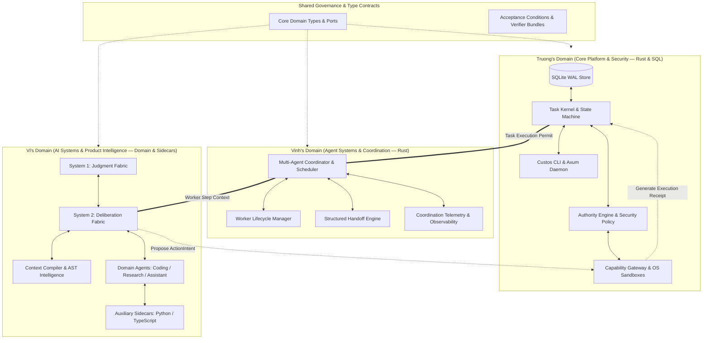

# Custos Dev Docs — Engineering Collaboration & Architecture Protocol

> **Audience:**  
> - **Vi:** Founder / AI Systems & Product Intelligence Lead  
> - **Truong:** Core Platform & Security Lead  
> - **Vinh:** Agent Systems & Coordination Research Engineer  
>  
> **Master Architecture:** Refer to [docs/canonical-specification.md](../docs/canonical-specification.md) for the authoritative 39-section system blueprint.  
> **Rule Enforcement:** All contributors and AI assistants must strictly obey [AGENTS.md](../AGENTS.md).

---

## 1. Three Official Roles & Mental Models

Custos enforces a strict tripartite division of engineering responsibility. Each team member owns a distinct architectural layer with unambiguous boundaries and non-overlapping ownership:

| Team Member | Official Role | Core Question (Mental Model) | Primary Focus |
|---|---|---|---|
| **Vi** | **Founder / AI Systems & Product Intelligence Lead** | *How does an agent think and behave?* | Cognitive architecture, System 1 / System 2 deliberation, context engineering, memory selection, domain agents, model strategy, AI quality evaluation. |
| **Truong** | **Core Platform & Security Lead** | *How does the system execute correctly, durably, and safely?* | Trusted runtime, Task Kernel state machine, SQLite WAL persistence, authority engine, capability gateway, OS sandboxes, daemon APIs, global crash recovery. |
| **Vinh** | **Agent Systems & Coordination Research Engineer** | *How do multiple workers coordinate with each other?* | Multi-agent runtime, worker lifecycle state machine, structured handoff protocols, scheduling & DAG execution, concurrency control, failure recovery, coordination telemetry. |

### Core Architectural Principle
> **Vi decides the cognitive intelligence being exchanged. Truong guarantees that execution is safe, sandboxed, and durably stored. Vinh ensures that multi-worker coordination occurs reliably, concurrently, and measurably.**

---

## 2. System Architecture Topology

Custos is architected as a **Rust-First Polyglot**: Rust forms the immutable, trusted computing base (Kernel, Persistence, Capability Gateway, Daemon, Coordination Engine), while auxiliary runtimes (Python for heuristics/evaluations, TypeScript for external agent adapters) reside exclusively in isolated sidecars communicating via JSON-RPC.



---

## 3. Comprehensive Domain Ownership & Responsibilities

### 3.1 Vi — Founder / AI Systems & Product Intelligence Lead
Vi owns the cognitive capabilities, reasoning strategies, and empirical AI quality of Custos:

- **System One (Judgment Fabric):**
  - Fast, low-cost reflex classification, risk prediction, context sufficiency checks, and action screening.
  - Repetition and infinite loop detection, confidence scoring, and abstention policies.
  - Escalation routing to System Two, calibration, and local evaluation of rules, Jev, Layla, and local classifiers.
  - Decides: *When to use rules? When to use local models? When to call frontier models? When to pause for humans? When to stop?*
- **System Two (Deliberation Fabric):**
  - Planner behavior, multi-step coding and research reasoning, and critic/reviewer evaluation.
  - Model capability requirements, structured output schemas, and reasoning graphs.
  - Provider handoff semantics, continuation strategies, and fallback paths across model families.
- **Context Intelligence & Token Economy:**
  - Repository understanding, AST symbol extraction, relevance ranking, and context compression.
  - Token-budgeted `ContextPack` assembly, memory selection, and context provenance tracking.
- **Three Domain Agents:**
  - **Coding:** Repo comprehension, debugging, implementation, code review, verification strategies.
  - **Research:** Source retrieval, claim extraction, contradiction detection, synthesis, citation tracking.
  - **Assistant:** Personal workflows, preference memory, privacy boundary classification, task planning.
- **Model Intelligence & AI Evaluation:**
  - Model capability taxonomy, selection policies (manual, assisted, automatic), and cost-quality trade-offs.
  - Canonical evaluation datasets, quality rubrics, hallucination metrics, and evidence-groundedness benchmarks.
- **Code Ownership:**
  ```text
  crates/judgment-sdk/
  crates/cognitive-runtime/
  crates/context-compiler/
  crates/knowledge-services/
  domain-packs/engineering/
  domain-packs/research/
  domain-packs/assistant/
  adapters/judgments/
  evals/ai-quality/
  evals/context-retrieval/
  evals/system-one/
  evals/coding/
  evals/research/
  evals/assistant/
  docs/product/
  docs/ai/
  docs/research/
  ```

---

### 3.2 Truong — Core Platform & Security Lead (SE)
Truong owns the immutable execution backbone, data persistence, and security isolation:

- **Engineering Mindset (AI as a Black Box):**
  - Zero requirement to learn prompt engineering, temperature tuning, or LLM psychology.
  - Treat all decisions from the AI runtime strictly as untrusted JSON payloads requiring schema validation, durable persistence, and sandbox containment before execution.
- **Durable Persistence (SQLite WAL):**
  - SQLite WAL mode, connection pool, single-writer multi-reader discipline, and atomic step transactions.
  - Schema migrations for `tasks`, `spans`, `domain_events`, and `outbox`.
- **Task Kernel & State Machine:**
  - Event-sourced state machine (`Draft` -> `Ready` -> `Running` -> `Verifying` -> `Succeeded` / `Failed` / `Paused`).
  - CQRS command validation and invariant verification reducers.
- **Authority Engine & Capability Gateway:**
  - Cryptographic single-use `ExecutionPermit` minting bound to exact-payload action hashes.
  - OS-level sandboxing containment: Ephemeral Git worktrees, macOS Seatbelt, Linux Bubblewrap (`bwrap`).
- **Local API & Daemon Infrastructure:**
  - Axum HTTP/IPC daemon server (`custosd`) and CLI binary (`custos-cli`).
  - Process supervision, lease heartbeats, and complete task recovery after `kill -9` crashes.
- **Code Ownership:**
  ```text
  crates/persistence-sqlite/
  crates/capability-gateway/
  crates/authority-engine/
  crates/task-kernel/
  crates/local-api/
  crates/evidence-engine/
  crates/artifact-store/
  apps/custos-cli/
  apps/custosd/
  tests/e2e/
  tests/contract/
  ```

---

### 3.3 Vinh — Agent Systems & Coordination Research Engineer (SE)
Vinh approaches multi-agent systems strictly from an **Empirical Software Systems Engineering** perspective:

- **Engineering Mindset (Systems Software Engineering):**
  - Focus purely on worker lifecycle correctness, communication protocols, state machine handoffs, concurrency safety, fault tolerance, and empirical evaluation.
  - Zero prompt engineering or heuristic tuning; treat agent communication as distributed message passing with explicit contract boundaries.
- **Worker Lifecycle Management:**
  - Formal worker state machine transitions:
    `CREATED -> LEASED -> ACTIVE -> WAITING_TOOL -> PAUSED -> COMPLETED / FAILED / CANCELLED`
  - Enforce leases, heartbeats, timeouts, cancellations, retries, orphan recovery, and idempotency.
- **Multi-Agent Coordination & Scheduler:**
  - Step assignment to workers, dependency DAG resolution, and bounded parallel execution.
  - Worker availability tracking, result aggregation, and handoff triggering.
  - **Invariants:** The Coordinator cannot mutate canonical Task state directly, cannot mint capability execution permits, cannot decide task truth, and cannot invoke tools outside the Capability Gateway.
- **Structured Handoff Protocols:**
  - Provider-agnostic handoff envelopes (`objective`, `completed_work`, `artifacts`, `evidence`, `decisions`, `assumptions`, `unresolved_questions`, `capabilities_used`, `budget_consumed`, `recommended_next_step`).
  - Eliminates raw transcript dumps and measures information loss across handoffs.
- **Scheduling, Concurrency & Deadlock Prevention:**
  - Sequential scheduling, DAG execution, bounded parallelism, backpressure, priority queues, cancellation propagation, and coordination budgets.
  - Enforce acyclic dependency validation to eliminate deadlocks and resource starvation.
- **Observability & Empirical Telemetry:**
  - Causal worker timelines, handoff traces, queue latency, agent utilization, duplicate work detection, failure dashboards, and per-worker token/cost attribution.
- **Code Ownership:**
  ```text
  crates/workflow-runtime/coordination/
  crates/workflow-runtime/worker_lifecycle/
  crates/workflow-runtime/scheduler/
  crates/workflow-runtime/handoff/
  crates/workflow-runtime/recovery/
  schemas/worker-definition/
  schemas/worker-event/
  schemas/handoff/
  schemas/coordination/
  adapters/protocols/a2a/
  adapters/protocols/agentgateway/
  evals/multi-agent/
  lab/multi-agent/
  tests/coordination/
  tests/concurrency/
  tests/recovery/
  tests/protocol/
  ```

---

## 4. Absolute Boundary Matrix: Vi vs. Vinh

To maintain pristine separation of concerns, the boundary between Vi and Vinh is governed by the following strict ownership contract:

| Subsystem / Capability | Vi's Ownership | Vinh's Ownership |
|---|:---:|:---:|
| **Prompt Engineering** | **Owner** | Non-owner |
| **Context Selection & Budgeting** | **Owner** | Consumer |
| **Retrieval & Reranking** | **Owner** | Non-owner |
| **System One (Judgment Fabric)** | **Owner** | Runtime Integration |
| **Model Evaluation** | **Owner** | Harness Support |
| **Model Routing Semantics** | **Owner** | Placement Execution |
| **Domain Agent Behavior** | **Owner** | Worker Runtime |
| **Agent Roles** | Defines Semantic Meaning | Defines Lifecycle & States |
| **Spawn Trigger** | Defines AI Decision Signal | Executes Scheduling Policy |
| **Handoff Envelope** | Defines Semantic Fields | Defines Protocol & Transport |
| **Output Quality Assurance** | **Owner** | Measures System Metrics |
| **Coordination Correctness** | Consulted | **Owner** |
| **Concurrency & Deadlock Safety** | Consulted | **Owner** |
| **External Protocols (A2A / AgentGateway)** | Product Validation | Research & Implementation |
| **AI / NLP Research** | **Owner** | Not Primary Focus |
| **Multi-Agent Systems Research** | Consulted | **Owner** |

---

## 5. Multi-Agent Topology Responsibility Matrix

When deploying multi-agent topologies, Vi defines the cognitive behavior, while Vinh builds the execution mechanics:

| Topology Pattern | Vinh (Systems Implementation) | Vi (Cognitive Specification) |
|---|---|---|
| **Single Worker** | Runtime execution, timeouts, heartbeats | Agent persona, prompts, tool choice |
| **Sequential Roles** | Task scheduling, dependency resolution, handoffs | Role prompts, context compilation recipes |
| **Parallel Explorers** | Parallel worker spawning, result aggregation transport | Search strategy, relevance heuristics |
| **Implementer–Reviewer** | Execution isolation, state diff and result routing | Review rubric, code quality criteria |
| **Competitive Proposals** | Parallel execution, candidate collection | Proposal quality evaluation and scoring |
| **Hierarchical Coordinator** | Coordinator state machine and worker supervision | Dynamic decision strategy and escalation rules |

---

## 6. Relationship & Authority Boundary: Truong vs. Vinh

Both Truong and Vinh are Software Engineers, but their system levels must never be conflated:

| Subsystem Dimension | Truong (Core Platform & Security Lead) | Vinh (Agent Systems & Coordination Engineer) |
|---|---|---|
| **System Core** | Task Kernel | Worker Coordinator |
| **State Scope** | Global Task State & Event Store | Per-Worker Lifecycle State Machine |
| **Data Persistence** | SQLite Canonical Tables & Migrations | Coordination Event Projections |
| **Security Gates** | Authority Engine & Policy Evaluator | Worker Capability Request Formulation |
| **Sandbox Isolation** | Capability Gateway (Seatbelt / bwrap) | Agent / Tool Invocation Scheduling |
| **Authorization** | Execution Permit Minting | Worker Assignment & Token Dispatch |
| **Execution Layer** | OS Process Executor & Worktrees | Worker Supervision & Heartbeats |
| **Crash Recovery** | Global Task Recovery & Outbox Dispatch | Per-Worker Handoff & Failure Recovery |
| **External Interface** | Local Axum HTTP / IPC Daemon API | Coordination Observability & Event Streams |
| **Boundary Control** | Security Boundary Enforcement | Inter-Agent Protocol Correctness |

### Hierarchy of Authority
```text
Task Kernel (Truong)
    └──> Multi-Agent Coordinator (Vinh)
          └──> Worker Assignment (Vinh)
                └──> Agent Proposes ActionIntent (Vi)
                      └──> Authority Engine (Truong)
                            └──> Capability Gateway & Sandboxing (Truong)
                                  └──> Verifiable Tool Execution
```
- **Invariant 1:** The Coordinator does not sit above the Task Kernel.
- **Invariant 2:** No worker or agent can bypass the Capability Gateway to execute shell commands or file mutations directly.

---

## 7. PR-Driven 5-Branch Git Workflow & Workspace Structure

To prevent merge conflicts, keep commit histories clean, and enable asynchronous reviews, the repository uses a dedicated 5-branch strategy and a strict 3-pillar documentation layout:

### Workspace Structure
1. **`docs/`**: **Master Architecture & Specifications.** The overarching system blueprint. Highly stable. Any modifications require alignment between Vi, Truong, and Vinh.
2. **`dev_docs/`**: **Task Architecture & Implementation.** Localized workspaces for individual task tracking and engineering specs (`vi/`, `truong/`, `vinh/`). Includes progress reports in their respective `reports/` directories.

### Branch Strategy (5-Branch Model)
| Branch | Purpose | Primary Operator | Invariants |
|---|---|---|---|
| `main` | **Production Release** | All | Cleanest branch. Contains only thoroughly tested, production-ready code. |
| `dev` | **Integration & System Test** | All | Integration branch where all team members merge feature code for full workspace testing. |
| `vi` | **Vi's Feature Branch** | Vi | AI intelligence, prompt engineering, agent behavior, sidecar implementations. |
| `truong` | **Truong's Feature Branch** | Truong | Backend systems, SQLite storage, CLI commands, OS sandboxes, capability gateway. |
| `vinh` | **Vinh's Feature Branch** | Vinh | Multi-agent coordination, protocol implementation, runtime concurrency, fault tolerance. |

### Daily Operational Workflow:
1. **Sync:** Pull the latest `dev` branch to integrate remote changes before beginning work.
2. **Feature Implementation:** Develop features strictly on your dedicated personal branch (`vi`, `truong`, or `vinh`).
3. **Status & Documentation Sync:** Write daily/weekly status logs into your personal report directory (`dev_docs/<name>/reports/YYYY-MM-DD.md`). Commit these reports *alongside your code* on your personal branch.
4. **Integration Merge:** Once a milestone or report is ready, open a Pull Request (PR) from your feature branch into `dev`. Peer review happens on the PR.
5. **Production Release:** Once `dev` passes all verification suites and proves stable, merge `dev` into `main`.

---

## 8. Code Hand-Off & Transaction Protocol

### Interface Contract Rule
1. **Step 1:** Vi defines Rust `struct` or `trait` models in `crates/core-domain` (e.g., `struct Task { pub id: TaskId, pub status: TaskStatus }`).
2. **Step 2:** Truong consumes these shared types to implement `INSERT INTO tasks...` persistence in `crates/persistence-sqlite` or exposes them via `crates/local-api`.
3. **Step 3:** Vinh integrates these types into worker scheduling and handoff state transitions in `crates/workflow-runtime`.
4. **Step 4:** No engineer renames shared structs, traits, or contract files without prior mutual alignment.

### Atomic Transaction Boundaries
To guarantee crash resilience and prevent orphaned side effects, Custos enforces strict transaction boundaries:
- **Before executing any external side-effect:** The runtime MUST persist:
  1. `ActionIntent` with a unique idempotency key.
  2. `ExecutionPermit` identity and scope.
  3. Expected task state and Outbox entry.
- **After receiving side-effect result:** The runtime MUST persist:
  1. Execution result, exit code, and stdout/stderr references.
  2. `Receipt` and content-addressed `Artifact` hashes.
  3. Resulting domain events and next task state transition.

---

## 9. The First Shared Vertical Slice (`repo_explain`)

Before implementing mutable coding workflows (`bug_fix`) or sandboxed execution, Vi, Truong, and Vinh jointly construct the `repo_explain` vertical slice. This slice proves the entire architectural loop end-to-end without risking destructive mutations or requiring live LLM API keys:

### Scenario
A user runs: `custos run "Which module is responsible for persisting tasks, and why can the UI not directly access the database?"`

### Sequence of Execution
```text
CLI (custos-cli)
  └──> Local API (Axum)
        └──> Task Kernel (Validates Task & commits to SQLite Event Store)
              └──> Workspace Engine (Scans fixture repo, builds file inventory)
                    └──> Context Compiler (Extracts README and symbol ranges)
                          └──> FakeProvider (Returns explanation citing exact files & line ranges)
                                └──> Citation Verifier (Validates cited paths and ranges exist)
                                      └──> Artifact Store (Saves response and context manifest)
                                            └──> Evidence Engine (Binds citations to snapshot -> Succeeded)
                                                  └──> Crash Test (Restart daemon -> Timeline fully preserved)
```

### Why this slice is mandatory:
- Zero external API costs: Uses `FakeProvider` for deterministic, repeatable testing.
- Exercises all foundational components: CLI, API, Kernel, SQLite, Workspace Intelligence, Artifact Store, and Evidence Verification.
- Establishes the exact pattern for the subsequent `bug_fix` slice (which adds worktree isolation, permits, and test execution).

---

## 10. System-Wide Definition of Done (DoD)

A feature or pull request is NOT "Done" merely because it compiles. It must satisfy:

### Feature DoD Checklist
- [ ] **Domain Contract:** Typed contracts and invariants defined in `crates/core-domain`.
- [ ] **Invalid Case Handling:** Defensive parsing; invalid inputs return typed domain errors (`thiserror`).
- [ ] **Zero Unwraps:** No `.unwrap()` or `.expect()` in non-test Rust production code.
- [ ] **Test Coverage:** Unit tests for logic, contract tests for traits, integration tests for storage/IPC.
- [ ] **Telemetry:** Structured tracing spans with correlation IDs (`task_id`, `run_id`).
- [ ] **Redaction:** Zero sensitive tokens, keys, or private code logged in telemetry.
- [ ] **Cancellation & Timeout:** Operations observe `tokio::select!` cancellation tokens.
- [ ] **Crash Resilience:** Committed state recovers correctly upon process restart.
- [ ] **Documentation:** Module README updated or ADR created if architectural boundaries change.

### Workflow DoD Checklist
- [ ] Can run end-to-end against a local fixture repository.
- [ ] Generates an auditable Evidence Bundle with verifiable receipts.

---

## 11. Architecture Comprehension Checklist (12 Golden Questions)

Before modifying core code, every contributor must be able to answer these 12 questions:

1. **Why is Task (not chat) the central source of truth?**  
   *Because tasks define durable goals, invariants, budgets, and verifiable outcomes that survive model context resets and process restarts.*
2. **How does System 1 (Judgment) differ from System 2 (Deliberation)?**  
   *System 1 provides sub-second, low-cost reflex classification and risk screening without capability minting; System 2 provides multi-step deep reasoning and code synthesis.*
3. **Why are providers strictly forbidden from calling the shell directly?**  
   *To enforce least privilege, sandboxing, and prevent unchecked side effects. Only the Capability Gateway can execute commands after validating an `ExecutionPermit`.*
4. **How does a `CapabilityGrant` differ from an `ExecutionPermit`?**  
   *A Grant defines general permission scope for a task; a Permit is a single-use token cryptographically bound to the exact payload hash of a specific action.*
5. **What are the distinctions between Output, Artifact, Receipt, and Evidence?**  
   *Output is an unverified model assertion; an Artifact is an immutable content-addressed deliverable; a Receipt is proof that a tool actually ran; Evidence is an artifact/receipt accepted by a verifier.*
6. **How does Custos hand off work between providers (e.g. Codex -> Claude)?**  
   *Via a structured, provider-neutral `ContinuationPacket` containing goals, decisions, and artifacts—never by dumping raw chat transcripts.*
7. **Why is MCP strictly an integration boundary rather than an internal bus?**  
   *MCP is an external tool discovery and invocation protocol. Internal orchestration is strictly governed by the Task Kernel and core domain events.*
8. **How does Context differ from Memory?**  
   *Memory is knowledge preserved across tasks/workspaces with provenance and lifecycle; Context is a token-budgeted bundle assembled for a single inference call.*
9. **How does Custos determine the next step after a crash?**  
   *The Kernel inspects non-terminal tasks, reconciles the outbox, checks external execution receipts, and resumes safely without blindly retrying non-idempotent actions.*
10. **Why is verifier closure required before marking a task as `Succeeded`?**  
    *A task cannot succeed merely because an LLM claims it is done; objective verifiers must confirm that tests passed, diffs exist, and acceptance criteria are met.*
11. **What are Domain Packs permitted and forbidden to do?**  
    *Packs define workflows, prompts, and verifiers. They are forbidden from directly accessing the DB, minting permits, or bypassing Kernel state transitions.*
12. **What exact closed loop does the MVP prove?**  
    *The end-to-end loop: Create task -> Profile repo -> Compile context -> Invoke provider -> Propose action -> Approve -> Execute in worktree -> Collect receipt -> Verify -> Build evidence bundle -> Recover after restart -> Complete.*

---

## 12. Reporting & Documentation Conventions

- **Daily / Sprint Status:** Log directly into your personal report directory (`dev_docs/<name>/reports/YYYY-MM-DD.md`).
- **Vi's Notes & Reports:** Store in `dev_docs/vi/notes/` and `dev_docs/vi/reports/`.
- **Truong's Notes & Reports:** Store in `dev_docs/truong/notes/` and `dev_docs/truong/reports/`.
- **Vinh's Notes & Reports:** Store in `dev_docs/vinh/notes/` and `dev_docs/vinh/reports/`.
- **Format:** Standard GitHub Markdown, 100% Technical English, Zero Emojis.
