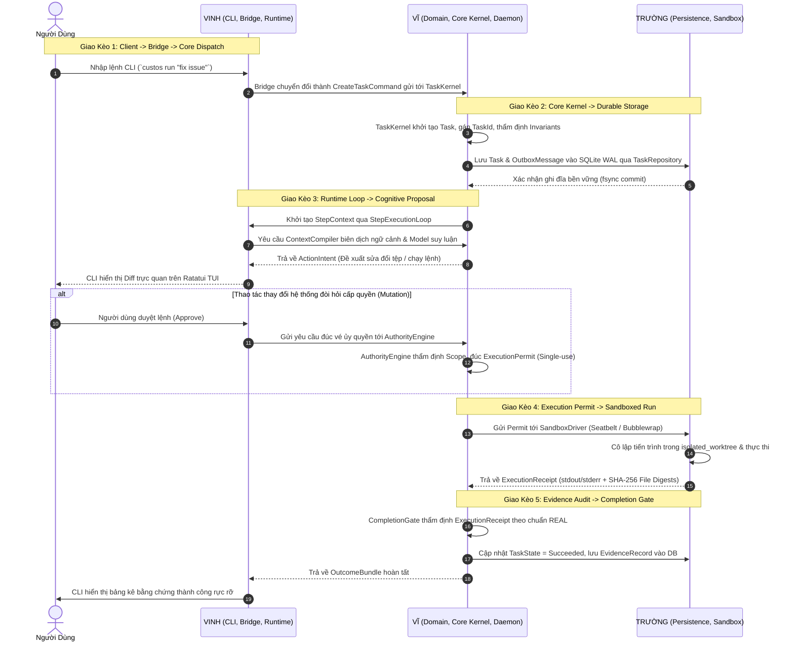

# CUSTOS — BẢN PHÂN CÔNG NHIỆM VỤ & MA TRẬN TRÁCH NHIỆM 11 CRATE
## (Team Work Allocation & Canonical RACI Ownership Blueprint)

> **Mã tài liệu:** DEV-TEAM-01  
> **Phân loại:** Quy ước vận hành bắt buộc & Hợp đồng phân quyền kỹ thuật  
> **Cơ sở kiến trúc tối cao:** Tuân thủ tuyệt đối [`Custos.md`](../Custos.md), [`AGENTS.md`](../AGENTS.md) và [`docs/development/codebase-architecture.md`](../docs/development/codebase-architecture.md)  
> **Phạm vi áp dụng:** Toàn bộ Workspace Monorepo 11 Product Crates (`crates/custos-*`)  
> **Hội đồng phê duyệt:**  
> - **Vĩ (Founder, Chief Architect & AI/DS Lead)**  
> - **Trường (SE 1 - Systems, Persistence & OS Security Lead)**  
> - **Vinh (SE 2 - Runtime, Protocols & Client Lead)**  

---

## 1. Triết Lý Phân Chia Và Tỷ Trọng Khối Lượng Công Việc

Hệ điều hành chủ quyền tác nhân Custos được xây dựng dựa trên mô hình **Clean Architecture / Hexagonal Architecture** kết hợp triết lý **Thân Cây Chịu Lực & Cành Nhánh Chức Năng (Core Trunk & Pluggable Branches)**:

1. **Thân Cây Chịu Lực (Core Trunk) — Trọng trách của Vĩ:**  
   Bao gồm Thực thể miền thuần túy (Domain), Hạt nhân máy trạng thái (Kernel), Động cơ phân xử quyền hạn (Authority Engine), Cổng kiểm chứng bằng chứng (Completion Gate), và Điểm ráp nối duy nhất (Composition Root). Đây là khu vực bất biến, quyết định sự an toàn, tính đúng đắn và sự sống còn của toàn hệ thống.
2. **Bộ Não Nhận Thức & Kỹ Thuật Dữ Liệu (Cognitive & Data Platform) — Trọng trách của Vĩ:**  
   Bao gồm điều phối nhận thức nhanh/chậm (System 1 Heuristic vs System 2 Deliberative), đường ống Context Compiler 8 bước, cắt lát cú pháp AST với Tree-sitter, kiểm soát ngân sách token (Budget Governor), và 3 gói nghiệp vụ chuyên sâu (Engineering, Research, Assistant Packs).
3. **Cành Nhánh Lưu Trữ & Cách Ly Hệ Điều Hành (Persistence & OS Sandboxing) — Trọng trách của Trường:**  
   Bao gồm hạ tầng lưu trữ quan hệ bền vững SQLite WAL, giải quyết triệt để lỗi đói WAL (P0 WAL Starvation), kho lưu trữ định danh nội dung (CAS), động cơ Transactional Outbox, và cơ chế sandbox cô lập tiến trình cấp hệ điều hành (Apple Seatbelt trên macOS / Bubblewrap trên Linux).
4. **Cành Nhánh Điều Phối Thực Thi & Giao Tiếp Client (Runtime, Protocols & UX) — Trọng trách của Vinh:**  
   Bao gồm vòng đời Session/Task, vòng lặp thực thi từng bước (Step Execution Loop), cơ chế giữ chỗ tác vụ (Worker Lease), chuẩn giao thức công cụ ngoại vi (MCP 2026-07-28, A2A v1.0.0), 5 bộ điều hợp Harness ngoại vi (Claude Code, Codex, Cursor, Antigravity, Goose), và giao diện tương tác người dùng (Terminal TUI / CLI / SDK).

```text
┌────────────────────────────────────────────────────────────────────────────────────────┐
│                              PHÂN BỔ TRỌNG LƯỢNG CÔNG VIỆC                             │
├────────────────────────────────────────────────────────────────────────────────────────┤
│ [██████████████████████████████████████░░░░░░░░░░░░░░░░░░░░░░░░░░░░░░]                 │
│   • VĨ: ~60% (Trục hạ tầng hạt nhân + AI/DS Platform + Composition Root)               │
│   • TRƯỜNG: ~20% (Hạ tầng lưu trữ SQLite WAL + CAS + Sandbox OS + Crash Testing)       │
│   • VINH: ~20% (Workflow Runtime + Giao thức MCP/A2A + Harnesses + CLI/TUI/SDK)       │
└────────────────────────────────────────────────────────────────────────────────────────┘
```

```text
                                 KIẾN TRÚC TẦNG 11 CRATES VÀ QUYỀN SỞ HỮU
                                 
  [ TẦNG 5: CLIENT & UX ]       crates/custos-cli         crates/custos-sdk         ──► VINH
                                        │                         │
                                        ▼                         ▼
  [ TẦNG 4: COMPOSITION ROOT ]              crates/custos-daemon                    ──► VĨ
                                        │                         │
                     ┌──────────────────┴─────────────────────────┴──────────────────┐
                     ▼                                                               ▼
  [ TẦNG 3: RUNTIME & PACKS ]   crates/custos-bridge     crates/custos-runtime      crates/custos-packs
                                (VINH)                   (VINH)                     (VĨ)
                                     │                        │                          │
                     ┌───────────────┴────────────────────────┼──────────────────────────┘
                     ▼                                        ▼
  [ TẦNG 2: INFRA & ADAPTERS ]  crates/custos-persistence crates/custos-adapters   crates/custos-provider
                                (TRƯỜNG)                  (TRƯỜNG & VINH)          (VĨ)
                                     │                        │                          │
                     ┌───────────────┴────────────────────────┴──────────────────────────┘
                     ▼
  [ TẦNG 1: PURE KERNEL ]                    crates/custos-core                             ──► VĨ
                                                      │
                                                      ▼
  [ TẦNG 0: ZERO-I/O DOMAIN ]                crates/custos-domain                           ──► VĨ
```

---

## 2. Ma Trận RACI Chi Tiết Cả 11 Crates & Cross-Cutting Subsystems

Quy chuẩn phân định trách nhiệm RACI chuẩn mực:
- **R (Responsible):** Người trực tiếp viết mã nguồn, thiết kế kiểm thử đơn vị và bảo trì các module bên trong crate.
- **A (Accountable):** Người chịu trách nhiệm cao nhất về mặt kiến trúc, có quyền phủ quyết (veto) và phê duyệt cuối cùng khi merge.
- **C (Consulted):** Người bắt buộc phải được tham vấn ý kiến khi có bất kỳ sửa đổi nào liên quan đến trait, schema hoặc cấu trúc dữ liệu dùng chung.
- **I (Informed):** Người nhận thông báo sau khi thay đổi đã được tích hợp để chủ động cập nhật các thành phần phụ thuộc.

### 2.1. Ma Trận RACI 11 Canonical Product Crates

| STT | Crate Name | Tầng Kiến Trúc | Đường Dẫn Canonical | R | A | C | I | Bất Biến Chi Phối & Trách Nhiệm Kỹ Thuật |
|:---:|---|:---:|---|:---:|:---:|:---:|:---:|---|
| **01** | `custos-domain` | **Tầng 0** | `crates/custos-domain` | **Vĩ** | **Vĩ** | Trường, Vinh | — | **Zero-I/O Purity:** Nghiêm cấm tuyệt đối async, network, file I/O. Định nghĩa Entity, Value Object, Domain Event, Error types. |
| **02** | `custos-core` | **Tầng 1** | `crates/custos-core` | **Vĩ** | **Vĩ** | Trường, Vinh | — | **Trusted Kernel:** Task FSM, Authority Engine, Completion Gate (REAL/LTL), Context Compiler, Budget Governor, Storage/Sandbox Ports. |
| **03** | `custos-persistence` | **Tầng 2A** | `crates/custos-persistence` | **Trường** | **Trường** | Vĩ | Vinh | **Crash Resilience & WAL:** Triển khai SQLite WAL pool, chống đói WAL (P0), Transactional Outbox, Content-Addressed Storage (CAS), FTS5. |
| **04** | `custos-provider` | **Tầng 2B** | `crates/custos-provider` | **Vĩ** | **Vĩ** | Vinh | Trường | **Model Port & Metering:** Trait `ModelProvider`, Token Streaming, Cost Accounting, Tokenizer, chuẩn hóa ProviderError. |
| **05** | `custos-adapters` | **Tầng 2C** | `crates/custos-adapters` | **Trường & Vinh** | **Vĩ** | Vĩ | — | **OS Isolation & Protocols:** Trường phụ trách Sandbox (Seatbelt/Bwrap); Vinh phụ trách MCP client (STDIO/SSE), A2A, và 5 Harnesses. |
| **06** | `custos-runtime` | **Tầng 3A** | `crates/custos-runtime` | **Vinh** | **Vinh** | Vĩ | Trường | **Workflow & Step Engine:** Step Execution Loop, Worker Lease, Checkpoint Resume, Task Cancellation, Session Lifecycle, Memory Runtime. |
| **07** | `custos-packs` | **Tầng 3B** | `crates/custos-packs` | **Vĩ** | **Vĩ** | Vinh | Trường | **Domain Packs:** Engineering Pack (SWE-agent ACI), Research Pack (FIRE Pattern, DatasetCard), Assistant Pack (Stability Contract). |
| **08** | `custos-bridge` | **Tầng 3C** | `crates/custos-bridge` | **Vinh** | **Vinh** | Vĩ, Trường | — | **Boundary Adapter:** Session-to-Task promotion, Local API v1 router, Idempotency. **Tuyệt đối không gọi trực tiếp Persistence (P0 Fixed)**. |
| **09** | `custos-daemon` | **Tầng 4** | `crates/custos-daemon` | **Vĩ** | **Vĩ** | Trường, Vinh | — | **Sole Composition Root:** Điểm ráp nối duy nhất của toàn hệ thống, khởi tạo Database, kết nối 6 Hubs, xử lý tín hiệu OS & Graceful Shutdown. |
| **10** | `custos-sdk` | **Tầng 5B** | `crates/custos-sdk` | **Vinh** | **Vinh** | Vĩ | Trường | **Client Library:** IPC Client trừu tượng qua Unix Domain Socket (`daemon.sock`), versioned DTOs, stream multiplexing. |
| **11** | `custos-cli` | **Tầng 5A** | `crates/custos-cli` | **Vinh** | **Vinh** | Vĩ | Trường | **Terminal UX:** Giao diện dòng lệnh (`clap`, `ratatui`), thanh tiến trình thời gian thực, colored diff preview, bằng chứng nghiệm thu REAL. |

### 2.2. Ma Trận RACI Các Phân Hệ Bổ Trợ & Cross-Cutting Concerns

| Phân Hệ Bổ Trợ | Đường Dẫn | R | A | C | I | Tiêu Chuẩn Quản Trị & Ràng Buộc Kỹ Thuật |
|---|---|:---:|:---:|:---:|:---:|---|
| **Wire Schemas JSON** | `schemas/*.json` | **Vĩ** | **Vĩ** | Vinh, Trường | — | Chuẩn hóa JSON Schema cho ActionIntent, CapabilityPermit, TaskContract, EventLedger. |
| **Database Migrations** | `crates/custos-persistence/migrations/` | **Trường** | **Trường** | Vĩ | Vinh | Schema tiến hóa một chiều, tương thích ngược, index tối ưu cho Transaction Boundaries T1–T5. |
| **E2E & Chaos Fixtures** | `tests/e2e/`, `tests/contract/` | **Trường & Vinh** | **Vĩ** | Cả 3 | — | Kịch bản giả lập sập nguồn đột ngột (`SIGKILL`), kiểm thử hợp đồng trait giữa các crate. |
| **Evals & Red-Teaming** | `evals/` | **Vĩ** | **Vĩ** | Vinh | Trường | Đánh giá SWE-bench Lite, LongMemEval, bộ kịch bản đối kháng Continuous Red-Teaming. |
| **CI/CD & Automation** | `xtask/`, `.github/` | **Trường** | **Vĩ** | Vinh | — | Tự động hóa kiểm tra `cargo check --workspace`, `cargo clippy`, `cargo test`, `deny.toml`. |
| **Documentation Triad** | `Custos.md`, `docs/`, `dev_docs/` | **Vĩ** | **Vĩ** | Trường, Vinh | — | Bảo đảm tính nhất quán tuyệt đối giữa Master Spec, Topic Docs, và Codebase Map. |

---

## 3. Bản Đặc Tả Trách Nhiệm Chi Tiết & Ranh Giới Kỹ Thuật Từng Thành Viên

### 3.1. VĨ — FOUNDER / CHIEF ARCHITECT & AI/DS LEAD (~60% Khối Lượng)

#### 1. Bảo Hộ Hạt Nhân Kiến Trúc & Kiểm Soát Bất Biến (Architecture Core & Invariants)
- **Bảo hộ Tầng 0 (`crates/custos-domain`):**  
  Trực tiếp định nghĩa và kiểm soát toàn bộ Domain Model: `TaskId`, `SessionId`, `TaskContract`, `TaskState`, `Grant`, `ActionIntent`, `CapabilityPermit`, `EvidenceRecord`, `DomainEvent`. Giữ vững nguyên tắc **Zero-I/O**: Không `tokio`, không `rusqlite`, không `reqwest`, không `std::fs`.
- **Hiện thực hóa Hạt nhân Nghiệp vụ Thuần (`crates/custos-core`):**  
  - `TaskStateMachine`: Máy trạng thái hữu hạn kiểm soát 4 FSM độc lập (Task, Session, Step, Verification).
  - `AuthorityEngine`: Kiểm tra quyền hạn nghiêm ngặt, đúc vé ủy quyền dùng một lần (`ExecutionPermit`) kèm hàm băm tham số và thời gian hết hạn (`TTL`).
  - `EvidenceEngine` & `CompletionGate`: Cổng nghiệm thu tự động dựa trên tiêu chuẩn **REAL** (Replicable, Explicit, Attributable, Linked) và kiểm chứng logic thời gian LTL. Ngăn chặn AI tự xưng hoàn thành khi thiếu chứng cứ.
  - `BudgetGovernor`: Quản lý ngân sách token theo mô hình Reserve & Settle.
- **Điểm Ráp Nối Duy Nhất (`crates/custos-daemon/src/main.rs`):**  
  Là người duy nhất nắm quyền cấu hình `bootstrap.rs`, ráp nối các Ports và Adapters từ Trường và Vinh thành tiến trình daemon hoàn chỉnh. Quản trị vòng đời 6 Hubs nội bộ.

#### 2. Nền Tảng AI Nhận Thức & Kỹ Thuật Ngữ Cảnh (Cognitive & Data Platform)
- **Cơ chế Định tuyến SOFAI-LM:**  
  Thiết kế cơ chế phối hợp nhận thức nhanh/chậm: System 1 (Scout, Judge, Heuristic SLM) phản xạ tức thì dưới 100ms vs System 2 (Frontier Deliberative LLM) lập kế hoạch sâu.
- **Đường Ống Context Compiler 8 Bước:**  
  Hiện thực hóa pipeline chuẩn: (1) Workspace Discovery -> (2) AST Slicing (Tree-sitter) -> (3) Git Diff Analysis -> (4) Symbol Resolution -> (5) Memory Recall -> (6) Context Compaction -> (7) Budget Allocation -> (8) Prompt Assembly.
- **Nghiệp Vụ Chuyên Sâu 3 Packs (`crates/custos-packs`):**  
  - `engineering`: SWE-agent ACI, 3-path ExecutionWorkspace, PatchBundle nguyên tử, Git worktree isolation.
  - `research`: FIRE pattern (Fact, Iterate, Re-verify, Evaluate), DatasetCard, Experiment Plane.
  - `assistant`: 6 nhóm công việc, cơ chế ổn định Payload, loại bỏ anti-pattern thông báo spam.
- **Trừu Tượng Hóa Model Provider (`crates/custos-provider`):**  
  Định nghĩa trait `ModelProvider`, Token Streaming, tokenizer caching, và hệ thống kế toán chi phí mô hình (cost accounting).

---

### 3.2. TRƯỜNG — SE 1: SYSTEMS, PERSISTENCE & OS SECURITY LEAD (~20% Khối Lượng)

#### 1. Phân Hệ Lưu Trữ Bền Vững SQLite WAL (`crates/custos-persistence`)
- **Triển khai Repository Ports:**  
  Hiện thực hóa các trait từ `custos-core` bằng `rusqlite`: `TaskRepository`, `SessionRepository`, `EvidenceRepository`, `OutboxRepository`.
- **Khắc phục Triệt để Sự cố WAL Phình To (P0 WAL Starvation):**  
  - Cấu hình chuẩn hóa: `journal_mode = WAL`, `synchronous = NORMAL`, `busy_timeout = 5000ms`, `wal_autocheckpoint = 1000`.
  - Thiết kế kiến trúc phân tách kết nối: **1 Dedicated Writer Connection** duy nhất cho các tác vụ ghi (đảm bảo tuần tự hóa tuyệt đối, chống lỗi `SQLITE_BUSY`) kết hợp với **Read Connection Pool** cho các tác vụ truy vấn song song.
- **Động Cơ Transactional Outbox:**  
  Lưu trữ sự kiện miền vào bảng `outbox_messages` trong cùng giao dịch SQLite với dữ liệu nghiệp vụ, bảo đảm tính nhất quán tuyệt đối (Atomicity).
- **Kho Lưu Trữ Định Danh Nội Dung (Content-Addressed Storage - CAS):**  
  Quản lý vùng `.custos/cas/` lưu trữ snapshot tập tin và bằng chứng nhị phân bằng hàm băm BLAKE3 / SHA-256.
- **Quản trị Di chuyển Dữ liệu (Migrations Engine):**  
  Xây dựng hệ thống migration tự động, đảm bảo tương thích ngược và không bao giờ làm mất dữ liệu người dùng khi nâng cấp daemon.

#### 2. Phân Hệ Cách Ly An Toàn Cấp Hệ Điều Hành (OS Sandboxing)
- **Triển khai Sandbox Drivers (`crates/custos-adapters/src/sandbox/`):**  
  - **macOS:** Hiện thực hóa `SeatbeltSandbox` sử dụng `sandbox-exec` với profile hạn chế tối đa: chỉ cho phép đọc hệ thống, cấm tuyệt đối ghi đè ra ngoài thư mục `isolated_worktree`, ngắt truy cập mạng tùy chọn.
  - **Linux:** Hiện thực hóa `BubblewrapSandbox` (`bwrap`): sử dụng unshared namespaces (IPC, PID, Network, UTS), mount read-only rootfs (`/usr`, `/lib`), bind mount tạm thời thư mục làm việc.
- **Ràng Buộc Chạy Lệnh Bằng Chứng (ExecutionReceipt):**  
  Sau khi chạy lệnh trong sandbox, thu thập toàn bộ `stdout`, `stderr`, `exit_code`, thời gian thực thi, và danh mục digest SHA-256 của các tệp tin bị biến đổi để gửi về cho Evidence Engine.

#### 3. Kiểm Thử Phục Hồi Thảm Họa (Crash Resilience & Chaos Testing)
- Xây dựng bộ test suite giả lập sập nguồn đột ngột (`SIGKILL`, mất điện) tại các điểm giao dịch T1–T5 để chứng minh: Sau khi daemon khởi động lại, cơ sở dữ liệu tự động phục hồi về trạng thái nhất quán, không có Task nào bị kẹt trạng thái mồ côi (Zero Data Loss).

---

### 3.3. VINH — SE 2: RUNTIME WORKFLOW, PROTOCOLS & CLIENT APPS (~20% Khối Lượng)

#### 1. Động Cơ Điều Phối Vòng Đời & Luồng Thực Thi (`crates/custos-runtime`)
- **Vòng Lặp Thực Thi Từng Bước (Step Execution Loop):**  
  Hiện thực hóa động cơ điều phối tuần tự: Tiếp nhận bước công việc -> Gửi lệnh kiểm tra an toàn -> Đề xuất hành động -> Tiếp nhận bằng chứng -> Chuyển bước tiếp theo.
- **Cơ Chế Giữ Chỗ Tác Vụ & Hủy Bỏ An Toàn (Worker Lease & Cancellation):**  
  Xây dựng cơ chế gia hạn lease cho worker, xử lý `tokio_util::sync::CancellationToken` để dừng khẩn cấp tác vụ trong vòng dưới 500ms mà không làm tha hóa trạng thái đĩa.
- **Trí Nhớ Runtime & Tiếp Tục Phiên Làm Việc (Continuation & Checkpointing):**  
  Hiện thực hóa việc lưu snapshot trạng thái bước (`CheckpointPolicy`), cho phép người dùng tạm dừng và tiếp tục (resume) tác vụ liền mạch.

#### 2. Cầu Nối Tương Tác & Tháo Gỡ Nợ Kỹ Thuật P0 (`crates/custos-bridge`)
- **Thăng Cấp Session-to-Task (Promotion Engine):**  
  Hiện thực hóa việc chuyển đổi mượt mà từ hội thoại tự do (Ephemeral Conversation) sang tác vụ kỹ thuật có ràng buộc (Task Contract). Đảm bảo tính lũy thừa (Idempotency) dựa trên `idempotency_key`.
- **Tháo Gỡ Nợ Kỹ Thuật P0 (Xóa Bỏ Bridge $\rightarrow$ Persistence Direct Edge):**  
  Tuyệt đối không để `custos-bridge` gọi trực tiếp vào SQLite. Mọi truy vấn và ghi nhận từ Bridge bắt buộc phải gửi qua `custos-core` (Kernel Port).

#### 3. Giao Thức Công Cụ Ngoại Vi & Bộ Điều Hợp (`crates/custos-adapters`)
- **Model Context Protocol (MCP 2026-07-28 Client):**  
  Hiện thực hóa client MCP hỗ trợ đầy đủ 2 cơ chế truyền tải: STDIO qua child process và Server-Sent Events (SSE) qua HTTP streaming, kèm hỗ trợ OAuth 2.1 authentication flow.
- **Giao Thức Tác Nhân A2A Protocol v1.0.0:**  
  Hiện thực hóa cơ chế phát hiện Agent Card, bắt tay ủy quyền tác vụ giữa các agent cục bộ và phân tán.
- **Năm Bộ Điều Hợp Harness Ngoại Vi:**  
  Triển khai từng Harness adapter theo conformance gate, không coi danh sách Claude Code, OpenAI Codex, Cursor, Antigravity và Goose là năm adapter đã hoạt động. Trước khi nhận adapter mới, xác định loop owner, workspace owner, mức chặn tool/effect, event coverage, approval, usage, cancel/resume và assurance theo từng action. Goose-derived source hiện hữu phải được kiểm tra active/dormant và provenance trước khi đưa vào runtime chính.

#### 4. Trải Nghiệm Người Dùng Dòng Lệnh & SDK (`crates/custos-cli`, `crates/custos-sdk`)
- **Giao Diện Dòng Lệnh Trực Quan (`crates/custos-cli`):**  
  Xây dựng CLI hiện đại bằng `clap` và `ratatui`: hiển thị thanh tiến trình multi-step, render streaming markdown phản hồi, bảng so sánh Git Diff trực quan nhiều màu sắc, và bảng kê bằng chứng nghiệm thu REAL rõ ràng.
- **Thư Viện Kết Nối Ngoại Vi (`crates/custos-sdk`):**  
  Cung cấp thư viện Rust client kết nối tới daemon qua Unix Domain Socket (`.custos/daemon.sock`) sử dụng giao thức IPC chuẩn hóa, làm nền tảng cho CLI và Desktop GUI sau này.

---

## 4. Năm Bản Giao Kèo Giao Diện Bắt Buộc Giữa Ba Kỹ Sư (Inter-Maintainer Handshakes)

Mọi sự giao tiếp xuyên Crate đều phải thông qua các **Rust Traits và Data Transfer Objects (DTO)** bất biến. Dưới đây là 5 giao kèo cốt lõi đã được đóng băng giao diện:



### 4.1. Chi Tiết Giao Kèo 1: Vinh $\rightarrow$ Vĩ (Bridge $\rightarrow$ Task Kernel)

```rust
// Định nghĩa tại: crates/custos-domain/src/command.rs
// Người sở hữu Trait & Struct: VĨ | Người hiện thực hóa & gọi: VINH
#[derive(Debug, Clone, Serialize, Deserialize)]
pub struct CreateTaskCommand {
    pub idempotency_key: IdempotencyKey,
    pub session_id: Option<SessionId>,
    pub goal: TaskGoal,
    pub constraints: Vec<TaskConstraint>,
    pub budget: TokenBudget,
    pub requested_pack: DomainPackKind,
}

pub trait TaskKernelPort: Send + Sync {
    fn create_task(&self, cmd: CreateTaskCommand) -> Result<TaskId, KernelError>;
    fn cancel_task(&self, task_id: &TaskId, reason: String) -> Result<(), KernelError>;
    fn query_task_snapshot(&self, task_id: &TaskId) -> Result<TaskSnapshot, KernelError>;
}
```

### 4.2. Chi Tiết Giao Kèo 2: Vĩ $\leftrightarrow$ Trường (Task Kernel $\leftrightarrow$ Persistence Storage)

```rust
// Định nghĩa tại: crates/custos-core/src/ports/storage.rs
// Người sở hữu Trait: VĨ | Người hiện thực hóa bằng SQLite WAL: TRƯỜNG
pub trait TaskRepository: Send + Sync {
    fn save(&self, task: &Task) -> Result<(), PersistenceError>;
    fn find_by_id(&self, id: &TaskId) -> Result<Option<Task>, PersistenceError>;
    fn update_state_cas(
        &self, 
        id: &TaskId, 
        expected: TaskState, 
        next: TaskState
    ) -> Result<bool, PersistenceError>;
    fn append_outbox(&self, msg: &OutboxMessage) -> Result<(), PersistenceError>;
}

pub trait CasStoragePort: Send + Sync {
    fn store_blob(&self, data: &[u8]) -> Result<CasHash, PersistenceError>;
    fn read_blob(&self, hash: &CasHash) -> Result<Vec<u8>, PersistenceError>;
    fn exists(&self, hash: &CasHash) -> Result<bool, PersistenceError>;
}
```

### 4.3. Chi Tiết Giao Kèo 3: Vĩ $\rightarrow$ Trường (Authority Engine $\rightarrow$ OS Sandbox)

```rust
// Định nghĩa tại: crates/custos-core/src/ports/sandbox.rs
// Người sở hữu Trait & Permit: VĨ | Người hiện thực hóa Driver: TRƯỜNG
#[derive(Debug, Clone, Serialize, Deserialize)]
pub struct ExecutionPermit {
    pub permit_id: PermitId,
    pub task_id: TaskId,
    pub allowed_command: String,
    pub allowed_worktree: PathBuf,
    pub network_allowed: bool,
    pub expires_at_unix: u64,
    pub signature: Vec<u8>,
}

#[derive(Debug, Clone, Serialize, Deserialize)]
pub struct ExecutionReceipt {
    pub permit_id: PermitId,
    pub exit_code: i32,
    pub stdout: Vec<u8>,
    pub stderr: Vec<u8>,
    pub mutated_files: Vec<(PathBuf, Blake3Hash)>,
    pub duration_ms: u64,
}

pub trait SandboxDriver: Send + Sync {
    fn execute_sandboxed(&self, permit: &ExecutionPermit) -> Result<ExecutionReceipt, SandboxError>;
}
```

### 4.4. Chi Tiết Giao Kèo 4: Vĩ $\rightarrow$ Vinh (Task Kernel $\rightarrow$ Runtime Workflow Engine)

```rust
// Định nghĩa tại: crates/custos-core/src/ports/workflow.rs
// Người sở hữu Trait & Event: VĨ | Người hiện thực hóa Workflow Engine: VINH
#[derive(Debug, Clone, Serialize, Deserialize)]
pub struct TaskPromotedEvent {
    pub session_id: SessionId,
    pub task_id: TaskId,
    pub initial_step_count: usize,
    pub timestamp_unix: u64,
}

pub trait WorkflowExecutionPort: Send + Sync {
    fn start_step_loop(&self, task_id: &TaskId) -> Result<ExecutionHandle, RuntimeError>;
    fn pause_step_loop(&self, task_id: &TaskId) -> Result<CheckpointId, RuntimeError>;
    fn resume_from_checkpoint(&self, checkpoint_id: &CheckpointId) -> Result<(), RuntimeError>;
}
```

### 4.5. Chi Tiết Giao Kèo 5: Vĩ $\leftrightarrow$ Vinh (Model Provider $\leftrightarrow$ External Adapters)

```rust
// Định nghĩa tại: crates/custos-provider/src/traits.rs
// Người sở hữu Trait: VĨ | Người tích hợp vào MCP & Runtime: VINH
#[async_trait::async_trait]
pub trait ModelProvider: Send + Sync {
    async fn stream_completion(
        &self,
        request: ModelRequest,
        sender: tokio::sync::mpsc::Sender<TokenChunk>,
    ) -> Result<ModelUsageSummary, ProviderError>;
    
    fn estimate_cost(&self, tokens: &TokenUsage) -> DecimalCost;
}
```

---

## 5. Ranh Giới Giao Dịch Bền Vững (T1–T5 Transaction Boundaries)

Để tránh bất kỳ sự mơ hồ nào khi xảy ra sự cố sập nguồn hoặc lỗi phần cứng, toàn bộ vòng đời tác vụ được phân định thành 5 ranh giới giao dịch bất biến:

```text
┌────────────────────────────────────────────────────────────────────────────────────────┐
│                        NĂM RANH GIỚI GIAO DỊCH BỀN VỮNG (T1–T5)                        │
├────────────────────────────────────────────────────────────────────────────────────────┤
│ T1: Task Inception (Vinh -> Vĩ -> Trường)                                              │
│     • Điều kiện: Ghi Task record (Submitted) + OutboxMessage trong 1 SQLite TX.        │
│     • Trách nhiệm bền vững: Trường (fsync disk commit).                                │
│                                                                                        │
│ T2: Step Planning & Context Compilation (Vinh <-> Vĩ)                                  │
│     • Điều kiện: Thu thập AST, Diff, Memory. Tạo ActionIntent thuần bộ nhớ.           │
│     • Trách nhiệm bền vững: Vĩ (Đảm bảo Token Budget & Context Guardrails).            │
│                                                                                        │
│ T3: Authority Minting & Approval (Vinh -> Vĩ -> Trường)                                │
│     • Điều kiện: Người dùng duyệt -> Ghi ApprovalAudit record -> Đúc ExecutionPermit.  │
│     • Trách nhiệm bền vững: Vĩ (Minting) & Trường (Append Outbox Audit).               │
│                                                                                        │
│ T4: Sandboxed Execution (Vĩ -> Trường)                                                 │
│     • Điều kiện: Chạy lệnh trong sandbox, hash files sửa đổi -> Tạo ExecutionReceipt.  │
│     • Trách nhiệm bền vững: Trường (Cô lập OS, thu thập Digest bằng chứng).            │
│                                                                                        │
│ T5: Completion Gate & State Settle (Trường -> Vĩ -> Trường -> Vinh)                   │
│     • Điều kiện: Thẩm định tiêu chuẩn REAL -> Ghi EvidenceRecord + TaskState = Succeeded│
│                  + Giải phóng Budget trong 1 SQLite Transaction duy nhất.              │
│     • Trách nhiệm bền vững: Vĩ (Gate logic) & Trường (Commit TX cuối cùng).            │
└────────────────────────────────────────────────────────────────────────────────────────┘
```

---

## 6. Sáu Điều Luật Thép Kiến Trúc Tuyệt Đối (Architectural Red Lines)

Bất kỳ vi phạm nào đối với 6 điều luật thép dưới đây sẽ bị hệ thống CI/CD hoặc Trưởng kiến trúc sư từ chối (Merge Veto) ngay lập tức:

1. **Điều luật 1 — Tinh Khiết Miền Tuyệt Đối (Zero-I/O Domain Purity):**  
   Crate `crates/custos-domain` tuyệt đối không được chứa bất kỳ crate I/O nào (`tokio`, `rusqlite`, `sqlx`, `reqwest`, `std::fs`, `std::net`). Nếu vi phạm, build CI sẽ thất bại ngay tại bước `cargo deny`.
2. **Điều luật 2 — Điểm Ráp Nối Đơn Nhất (Single Composition Root):**  
   Chỉ duy nhất **Vĩ (Chief Architect)** có quyền chỉnh sửa tệp `crates/custos-daemon/src/main.rs` và `bootstrap.rs`. Trường và Vinh xây dựng các thư viện độc lập theo Ports do Core quy định.
3. **Điều luật 3 — Cấm Bỏ Qua Cổng Nghiệm Thu (No Self-Proclaimed Success):**  
   AI Agent tuyệt đối không bao giờ được tự ý chuyển trạng thái Task sang `Succeeded` nếu chưa có `EvidenceRecord` hợp lệ được `CompletionGate` ký duyệt theo chuẩn REAL.
4. **Điều luật 4 — Nghiêm Cấm Gọi Trực Tiếp Bridge $\rightarrow$ Persistence (P0 Debt Zero-Tolerance):**  
   Crate `custos-bridge` tuyệt đối không được import `custos-persistence`. Mọi thao tác truy xuất dữ liệu từ các phiên tương tác bắt buộc phải thông qua `custos-core`.
5. **Điều luật 5 — Bắt Buộc Cách Ly Tuyệt Đối (Mandatory Sandboxing):**  
   Mọi lệnh Shell hoặc hành vi ghi đĩa của Agent trong quá trình thực thi Task bắt buộc phải đi qua `SandboxDriver` và bị cô lập trong `isolated_worktree`. Tuyệt đối không chạy lệnh trần trực tiếp trên máy chủ người dùng.
6. **Điều luật 6 — Quy Tắc Tam Giác Đồng Bộ Tài Liệu (Documentation Triad):**  
   Không một dòng code thay đổi ranh giới kiến trúc nào được phép merge nếu chưa hoàn thành việc cập nhật đồng thời trên 3 trụ cột: (1) `Custos.md`, (2) `docs/`, và (3) `docs/development/codebase-architecture.md`.

---

## 7. Quy Trình Vận Hành & Thỏa Thuận Mức Dịch Vụ Nội Bộ (Team SLA)

1. **Quy ước Nhánh Git (Branching Model):**
   - Nhánh `main`: Được bảo vệ tuyệt đối (Protected), chỉ merge thông qua Pull Request có đủ phê duyệt.
   - Nhánh tính năng: Đặt tên theo chuẩn `feat/{crate-name}-{owner}-{short-desc}` (ví dụ: `feat/persistence-truong-wal-pool`, `feat/runtime-vinh-mcp-sse`).
2. **Cam Kết Thời Gian Phản Hồi Review (24-Hour Review SLA):**
   Khi một Pull Request được gắn thẻ Reviewer theo bảng RACI, người được chỉ định có trách nhiệm phản hồi, yêu cầu chỉnh sửa hoặc phê duyệt trong vòng tối đa **24 giờ làm việc**.
3. **Giao Thức Sửa Đổi Hợp Đồng Công Khai (RFC Contract Amendment):**
   Nếu cần sửa đổi bất kỳ Trait dùng chung hoặc Schema nào trong `schemas/`, người đề xuất phải mở một Pull Request thảo luận và nhận được sự đồng thuận của cả 3 thành viên trước khi tiến hành viết code triển khai.
4. **Quyền Phủ Quyết Của Kiến Trúc Sư Trưởng (Chief Architect Veto Authority):**
   Trong trường hợp phát sinh tranh luận kỹ thuật không đạt được sự đồng thuận sau 2 vòng review, quyết định của **Vĩ (Chief Architect)** căn cứ trên văn kiện tối cao [`Custos.md`](../Custos.md) là quyết định thi hành cuối cùng.
