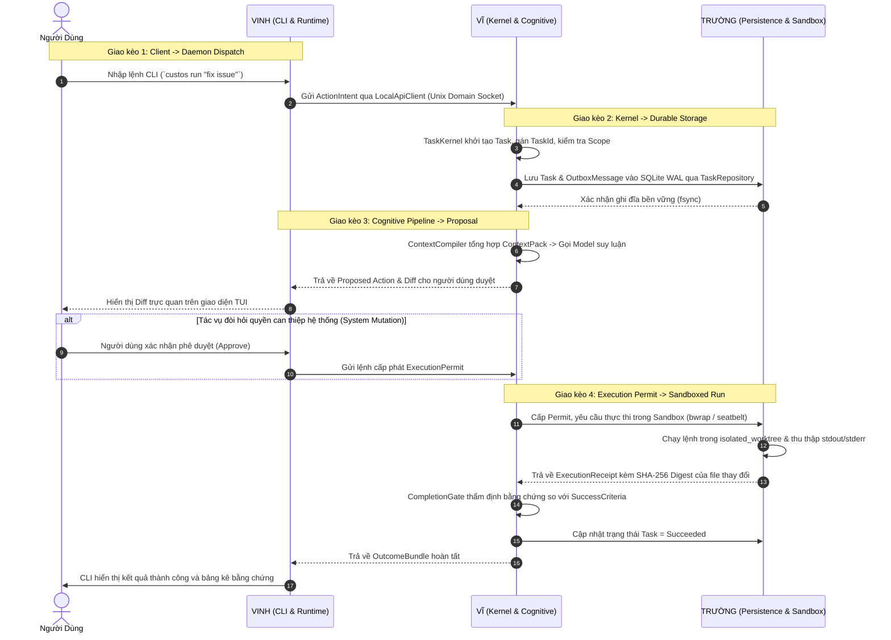

# CUSTOS — BẢN PHÂN CÔNG NHIỆM VỤ & MA TRẬN TRÁCH NHIỆM 11 CRATE
## (Team Work Allocation & RACI Ownership Blueprint)

> **Mã tài liệu:** DEV-TEAM-01  
> **Trạng thái:** Active Operational Allocation  
> **Người phê duyệt:** Vĩ (Founder, Chief Architect & AI/DS Lead)  
> **Phạm vi áp dụng:** Workspace Monorepo 11 Crates (`crates/custos-*`)  
> **Quy chuẩn quản trị tối cao:** Tuân thủ [`AGENTS.md`](../AGENTS.md) và [`Custos.md`](../Custos.md)

---

## 1. Triết Lý Phân Chia Và Tỷ Trọng Khối Lượng Công Việc

Dự án Custos được kiến tạo theo mô hình kiến trúc **Thân cây chịu lực & Cành nhánh chức năng (Core Trunk & Pluggable Branches)**:
- **Thân cây chịu lực (The Core Trunk):** Thực thể miền thuần khiết (Domain), Hạt nhân máy trạng thái (Kernel), Trọng tài phân xử quyền hạn (Authority), Cổng nghiệm thu bằng chứng (Completion Gate), và Điểm ráp nối duy nhất (Daemon Composition Root). Phần này quyết định tính toàn vẹn và sự sống còn của toàn bộ hệ thống, do **Vĩ (Chief Architect)** trực tiếp nắm giữ và kiểm soát.
- **Bộ não & Trí tuệ nhận thức (The Cognitive Brain):** Toàn bộ phân hệ trí tuệ nhân tạo, điều phối hai hệ thống nhận thức nhanh/chậm (System 1 / System 2), đường ống Context Compiler 8 bước, cắt lát cú pháp AST bằng Tree-sitter, kiểm soát ngân sách token và các Domain Pack chuyên sâu, do **Vĩ (AI & Data Science Lead)** trực tiếp phát triển.
- **Cành nhánh Lưu trữ & Cách ly hệ thống (Storage & OS Sandboxing):** Phân hệ lưu trữ quan hệ bền vững SQLite WAL, kiểm soát tranh chấp đa luồng, chống đói WAL (P0), Transactional Outbox, và cơ chế sandbox cô lập tiến trình cấp hệ điều hành (Apple Seatbelt / Linux Bubblewrap), do **Trường (SE 1 - Systems & Persistence Lead)** phụ trách.
- **Cành nhánh Điều phối Thực thi & Trải nghiệm (Workflow, Protocols & Client):** Phân hệ vòng đời Session/Task, máy thực thi luồng công việc (Step Loop), giao thức công cụ ngoại vi (MCP, A2A), các bộ điều hợp Harness bên ngoài, và giao diện dòng lệnh tương tác trực quan (Terminal TUI / CLI / SDK), do **Vinh (SE 2 - Runtime & Client Lead)** phụ trách.

### Tỷ trọng khối lượng công việc tổng thể:
```text
┌────────────────────────────────────────────────────────────────────────┐
│ [██████████████████████████████████████░░░░░░░░░░░░░░░░░░░░░░░░░░░░░░] │
│   VĨ: ~60% (Trục hạ tầng cốt lõi + Toàn bộ AI/Cognition/Context)       │
│   TRƯỜNG: ~20% (Hạ tầng lưu trữ SQLite WAL + OS Sandbox + Crash Test)  │
│   VINH: ~20% (Workflow engine + Giao thức MCP/A2A + Terminal CLI/UI)   │
└────────────────────────────────────────────────────────────────────────┘
```

---

## 2. Ma Trận RACI Chi Tiết Cả 11 Crates

Quy chuẩn RACI xác định rõ ranh giới quyền hạn:
- **R (Responsible):** Người trực tiếp viết mã nguồn, thiết kế kiểm thử và bảo trì mã lệnh của crate.
- **A (Accountable):** Người chịu trách nhiệm tối cao về mặt kiến trúc, có quyền phê duyệt cuối cùng (merge veto).
- **C (Consulted):** Người bắt buộc phải được tham vấn khi có sửa đổi liên quan đến interface, schema hoặc dữ liệu.
- **I (Informed):** Người nhận thông báo sau khi thay đổi đã được tích hợp để đồng bộ module phụ thuộc.

| STT | Product Crate | Đường dẫn Canonical | R | A | C | I | Trách nhiệm kỹ thuật cốt lõi |
|:---:|---|---|:---:|:---:|:---:|:---:|---|
| 01 | `custos-domain` | `crates/custos-domain` | **Vĩ** | **Vĩ** | Trường, Vinh | — | Thực thể miền thuần túy (Task, Session, Evidence, Permit). **Bất biến Zero-I/O tuyệt đối**. |
| 02 | `custos-core` | `crates/custos-core` | **Vĩ** | **Vĩ** | Trường, Vinh | — | Task Kernel, Authority Engine, Completion Gate, Context Compiler, xác thực bất biến. |
| 03 | `custos-persistence` | `crates/custos-persistence` | **Trường** | **Trường** | Vĩ | Vinh | Hiện thực hóa repository traits, SQLite WAL mode, schema migrations, Outbox, CAS. |
| 04 | `custos-provider` | `crates/custos-provider` | **Vĩ** | **Vĩ** | Vinh | Trường | Trait `ProviderPort`, token streaming, tokenizer, theo dõi chi phí mô hình (cost accounting). |
| 05 | `custos-runtime` | `crates/custos-runtime` | **Vinh** | **Vinh** | Vĩ | Trường | Vòng đời Session, workflow step execution loop, worker lease, cancellation, memory runtime. |
| 06 | `custos-adapters` | `crates/custos-adapters` | **Trường & Vinh** | **Vĩ** | Vĩ | — | Sandboxes (Trường), MCP/A2A & Harnesses (Vinh), Provider clients (Vĩ). |
| 07 | `custos-bridge` | `crates/custos-bridge` | **Vinh** | **Vinh** | Vĩ, Trường | — | Thăng cấp Session-to-Task, định tuyến Local API, chuyển đổi DTO sang domain command. |
| 08 | `custos-packs` | `crates/custos-packs` | **Vĩ** | **Vĩ** | Vinh | Trường | Khai báo quy trình công việc Engineering Pack, Research Pack, Assistant Pack. |
| 09 | `custos-daemon` | `crates/custos-daemon` | **Vĩ** | **Vĩ** | Trường, Vinh | — | **Điểm ráp nối duy nhất (Composition Root)**: Ráp storage, runtime, adapters thành daemon. |
| 10 | `custos-sdk` | `crates/custos-sdk` | **Vinh** | **Vinh** | Vĩ | Trường | Thư viện client trừu tượng hóa kết nối IPC, versioned DTOs cho các ứng dụng ngoài. |
| 11 | `custos-cli` | `crates/custos-cli` | **Vinh** | **Vinh** | Vĩ | Trường | Giao diện dòng lệnh terminal (`ratatui`, `clap`), hiển thị bảng tiến độ, diff màu sắc. |

> **Bản đồ mã nguồn chi tiết từng file:** Danh mục toàn diện 100% các file bên trong từng crate, vai trò chức năng và các struct/trait/hàm cốt lõi trích xuất bằng Custos Nexus được ghi nhận chi tiết tại: [**Bản Đồ Giải Phẫu Mã Nguồn Codebase (codebase-architecture.md)**](../docs/development/codebase-architecture.md).

---

## 3. Đặc Tả Chi Tiết Nhiệm Vụ & Ranh Giới Từng Thành Viên

### 3.1. VĨ — FOUNDER / CHIEF ARCHITECT & AI/DS LEAD (~60% Khối lượng)

1. **Kiến Trúc Hạt Nhân & Kiểm Soát Bất Biến (Core Architecture Authority):**
   - Trực tiếp định nghĩa mô hình thực thể thuần trong `crates/custos-domain`. Giữ vững bất biến **Zero-I/O** (không `tokio`, không `rusqlite`, không `reqwest`, không `std::fs`).
   - Xây dựng máy trạng thái `TaskStateMachine`, `AuthorityEngine` và `CompletionGate` trong `crates/custos-core`. Đảm bảo AI không bao giờ được tự xưng đã hoàn thành nếu thiếu bằng chứng đã được kiểm chứng (Proof-carrying verification).
   - Duy nhất sở hữu `crates/custos-daemon/src/main.rs` (**Sole Composition Root**). Tiếp nhận các thư viện từ Trường và Vinh để ráp nối thành tiến trình thực thi hoàn chỉnh.
   - Quản trị toàn bộ wire schemas chuẩn tại `schemas/`.
2. **Nền Tảng AI & Kỹ Thuật Dữ Liệu Ngữ Cảnh (Cognitive & Data Platform):**
   - **Cognitive Fabric:** Xây dựng cơ chế định tuyến nhận thức nhanh/chậm (System 1 Heuristic/SLM vs System 2 Frontier Deliberative LLM) theo quy chuẩn SOFAI-LM.
   - **Context Engineering:** Xây dựng đường ống Context Compiler 8 bước, cắt lát cú pháp AST bằng Tree-sitter, kiểm soát nghiêm ngặt ngân sách token (Token Budgeting).
   - **Domain Packs & Benchmarks:** Thiết kế cấu trúc các gói công việc chuyên ngành (`custos-packs`) và hệ thống đo lường chất lượng, độ chính xác tại `evals/`.

---

### 3.2. TRƯỜNG — SE 1: SYSTEMS, STORAGE & OS SECURITY (~20% Khối lượng)

1. **Hạ Tầng Lưu Trữ Bền Vững SQLite WAL (`crates/custos-persistence`):**
   - Hiện thực hóa các Repository traits mà Vĩ định nghĩa trong Domain bằng thư viện `rusqlite`.
   - Cấu hình chuẩn hóa chế độ **Write-Ahead Logging (WAL)**: `busy_timeout = 5000ms`, phân tách rõ kết nối ghi duy nhất (Dedicated Single Writer) và nhóm kết nối đọc (Read-only Pool) để triệt tiêu lỗi đói WAL (WAL Starvation - P0).
   - Xây dựng cơ chế tự động migration schema và bảng `outbox_messages` (Transactional Outbox Pattern) đảm bảo tính toàn vẹn sự kiện hệ thống.
2. **Hệ Thống Cách Ly An Toàn Hệ Điều Hành (OS Sandboxing):**
   - Phát triển các bộ điều hợp sandbox thực thi tại `crates/custos-adapters/src/sandbox/`:
     - macOS: Apple Seatbelt (`sandbox-exec` với profile hạn chế tối đa).
     - Linux: Bubblewrap (`bwrap` với unshared namespaces và read-only rootfs).
   - Đảm bảo mọi can thiệp tập tin và chạy lệnh của Agent chỉ được phép diễn ra trong thư mục `isolated_worktree`.
3. **Kiểm Thử Khả Năng Phục Hồi Khi Sập Nguồn (Crash Resilience):**
   - Xây dựng test suite giả lập sập nguồn đột ngột (`SIGKILL`) trước và sau khi commit transaction, chứng minh dữ liệu Task không bao giờ bị tha hóa (Zero Data Loss).

---

### 3.3. VINH — SE 2: RUNTIME WORKFLOW, MCP PROTOCOLS & CLIENT APPS (~20% Khối lượng)

1. **Động Cơ Điều Phối Vòng Đời & Luồng Thực Thi (`crates/custos-runtime`):**
   - Hiện thực hóa vòng lặp thực thi từng bước (Step Execution Loop), cơ chế giữ chỗ tác vụ (Worker Lease), hủy bỏ tác vụ (Cancellation) và khôi phục điểm kiểm tra (Safe Checkpointing).
   - Xây dựng cơ chế thăng cấp Session-to-Task trong `crates/custos-bridge`, bảo đảm tính lũy thừa (Idempotency) khi người dùng chuyển từ hội thoại tự do sang tác vụ ràng buộc.
2. **Giao Thức Công Cụ Ngoại Vi & Bộ Điều Hợp (Protocols & Adapters):**
   - Xây dựng client kết nối Model Context Protocol (MCP) qua hai phương thức truyền tải: STDIO và Server-Sent Events (SSE).
   - Hiện thực hóa 5 bộ điều hợp Harness ngoại vi: Claude Code, OpenAI Codex, Cursor, Antigravity, và Goose.
3. **Trải Nghiệm Dòng Lệnh TUI & Client SDK (`crates/custos-cli`, `crates/custos-sdk`):**
   - Xây dựng giao diện terminal trực quan bằng `ratatui` và `clap`: thanh tiến trình real-time, render bảng mã màu phân biệt diffs, hiển thị hóa đơn bằng chứng rõ ràng.
   - Phát triển thư viện `custos-sdk` kết nối với daemon qua Unix Domain Socket (`.custos/daemon.sock`) làm cầu nối cho CLI và Desktop UI.

---

## 4. Bốn Bản Giao Kèo Interface Giữa Ba Kỹ Sư (Inter-Maintainer Handshakes)



### Chi tiết các Interface dùng chung bắt buộc đồng thuận:

1. **Giao kèo Vinh $\rightarrow$ Vĩ (`custos-bridge` $\rightarrow$ `custos-core`):**
   ```rust
   // Định nghĩa tại custos-domain/src/command.rs
   pub struct CreateTaskCommand {
       pub idempotency_key: IdempotencyKey,
       pub session_id: Option<SessionId>,
       pub goal: TaskGoal,
       pub constraints: Vec<TaskConstraint>,
       pub budget: TokenBudget,
   }
   ```
2. **Giao kèo Vĩ $\leftrightarrow$ Trường (`custos-core` $\leftrightarrow$ `custos-persistence`):**
   ```rust
   // Định nghĩa tại custos-domain/src/repository.rs
   pub trait TaskRepository: Send + Sync {
       fn save(&self, task: &Task) -> Result<(), PersistenceError>;
       fn find_by_id(&self, id: &TaskId) -> Result<Option<Task>, PersistenceError>;
       fn append_outbox(&self, msg: &OutboxMessage) -> Result<(), PersistenceError>;
   }
   ```
3. **Giao kèo Vĩ $\rightarrow$ Trường (`custos-core` $\rightarrow$ `custos-adapters::sandbox`):**
   ```rust
   // Định nghĩa tại custos-domain/src/sandbox.rs
   pub trait SandboxDriver: Send + Sync {
       fn execute(&self, permit: &ExecutionPermit) -> Result<ExecutionReceipt, SandboxError>;
   }
   ```
4. **Giao kèo Vĩ $\rightarrow$ Vinh (`custos-core` $\rightarrow$ `custos-runtime`):**
   ```rust
   // Định nghĩa tại custos-domain/src/event.rs
   pub struct TaskPromotedEvent {
       pub session_id: SessionId,
       pub task_id: TaskId,
       pub snapshot_revision: u64,
   }
   ```

---

## 5. Năm Nguyên Tắc Vàng Trong Hợp Tác Kỹ Thuật (Golden Rules)

1. **Nguyên tắc Cửa Ngõ Duy Nhất (Single Composition Root):**
   Chỉ duy nhất **Vĩ** có quyền chỉnh sửa file `crates/custos-daemon/src/main.rs`. Trường và Vinh phát triển các library crate độc lập; Vĩ là người tích hợp và ráp nối chúng thành tiến trình daemon.
2. **Nguyên tắc Tinh Khiết Miền (Zero-I/O Domain Purity):**
   Crate `crates/custos-domain` do **Vĩ** bảo hộ. Nghiêm cấm tuyệt đối mọi hành vi thêm phụ thuộc I/O (`tokio`, `reqwest`, `rusqlite`, `std::fs`) vào crate này. Mọi I/O phải đi qua cổng Trait trừu tượng.
3. **Nguyên tắc Sửa Đổi Hợp Đồng Dùng Chung (Contract Amendment Protocol):**
   Mọi thay đổi đối với các interface công khai (Trạng thái Task, Mã lỗi, Wire schemas JSON, Domain events) bắt buộc phải được cả 3 anh em thảo luận và đồng thuận trước khi sửa mã nguồn.
4. **Cam Kết Thời Gian Phản Hồi Review (24-Hour Review SLA):**
   Khi một Pull Request được mở và gắn thẻ reviewer bắt buộc (theo ma trận RACI), reviewer có trách nhiệm phản hồi nhận xét hoặc phê duyệt trong vòng 24 giờ làm việc.
5. **Quyền Phủ Quyết Của Kiến Trúc Sư Trưởng (Architect Veto Authority):**
   Trong trường hợp phát sinh tranh luận kỹ thuật bất phân thắng bại, quyết định của **Vĩ (Chief Architect)** dựa trên nền tảng [`Custos.md`](../Custos.md) là quyết định thi hành cuối cùng.
