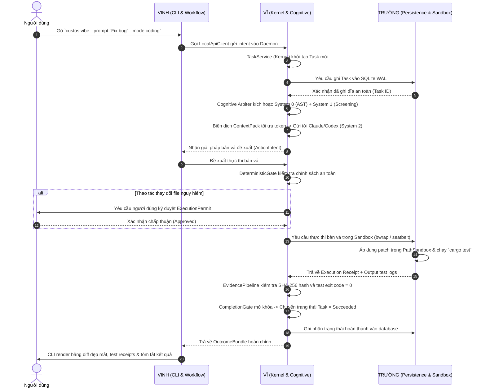

# CUSTOS — BẢN PHÂN CÔNG NHIỆM VỤ & TRÁCH NHIỆM MODULE CHI TIẾT
## (Team Work Allocation & Module Ownership Blueprint)

> **Mã tài liệu:** DEV-TEAM-01  
> **Trạng thái:** Active Operational Allocation  
> **Người phê duyệt:** Vĩ (Founder, Chief Architect & AI/DS Lead)  
> **Áp dụng cho:** Workspace Monorepo 42 Crates (`Custos/`)  
> **Ngày ban hành:** 2026-09-28  

---

## 1. TRIẾT LÝ PHÂN CHIA VÀ TỶ TRỌNG CÔNG VIỆC

Dự án Custos được xây dựng theo mô hình **"Cây mai ngày Tết" (Decorated Dry Apricot Tree)**:
- **Thân cây chịu lực (The Core Trunk):** Domain thuần, Kernel, Trọng tài an toàn, và Daemon composition root. Phần này quyết định sự sống còn của toàn bộ kiến trúc, do **Vĩ (Chief Architect)** trực tiếp chốt và nắm giữ.
- **Bộ não & Trí tuệ (The Cognitive Brain):** Toàn bộ phân hệ AI, tối ưu hóa token budget, cắt lát AST ngữ cảnh, trí nhớ và các domain pack chuyên biệt, do **Vĩ (AI & Data Science Lead)** trực tiếp phát triển.
- **Các cành nhánh chuyên biệt (The Functional Branches):** 
  - Phân hệ lưu trữ bền vững và cách ly hệ điều hành (Storage & OS Sandboxing) do **Trường (SE 1)** phụ trách.
  - Phân hệ điều phối luồng công việc, giao thức công cụ và giao diện người dùng (Workflow, MCP & CLI/Client) do **Vinh (SE 2)** phụ trách.

### Tỷ trọng khối lượng công việc (Workload Breakdown):
```text
┌────────────────────────────────────────────────────────────────────────┐
│ [██████████████████████████████████████░░░░░░░░░░░░░░░░░░░░░░░░░░░░░░] │
│   VĨ: ~60% (Trục hạ tầng cốt lõi + Toàn bộ AI/DS)                      │
│   TRƯỜNG: ~20% (Hạ tầng lưu trữ SQLite WAL + OS Sandbox)               │
│   VINH: ~20% (Workflow engine + Giao thức MCP + CLI/UI)                │
└────────────────────────────────────────────────────────────────────────┘
```

---

## 2. BẢNG KIỂM KÊ VÀ PHÂN ĐỊNH 42 CRATES WORKSPACE

| Phân tầng (Layer) | Crate / Module | Chủ sở hữu chính (Owner) | Vai trò & Trách nhiệm |
|---|---|:---:|---|
| **Layer 1: Core** | `crates/core/custos-domain` | **VĨ** | Thực thể miền (Task, Session, Evidence), bất biến Zero-I/O |
| | `crates/core/custos-kernel` | **VĨ** | Bộ máy CQRS TaskService, State Machine, Cổng nghiệm thu CompletionGate |
| | `crates/core/custos-provider-sdk` | **VĨ** | Trait chuẩn hóa ProviderPort, sự kiện LLM stream |
| | `crates/core/custos-provider-types` | **VĨ** | Kiểu dữ liệu hội thoại, tin nhắn, request/response |
| | `crates/core/custos-sdk-types` | **VĨ** | Kiểu dữ liệu nền tảng dùng chung cho SDK |
| | `crates/core/custos-bridge` | **VINH** | Cầu nối chuyển đổi Session nhanh sang Task bền vững |
| **Layer 2: Runtime** | `crates/runtime/custos-cognitive` | **VĨ** | Bộ não `CognitiveArbiter`: định tuyến 3 tầng System 0/1/2 |
| | `crates/runtime/custos-context` | **VĨ** | Cắt lát code AST, biên dịch `ContextPack` tối ưu token |
| | `crates/runtime/custos-context-management` | **VĨ** | Tóm tắt ngữ cảnh, nén token, structured output |
| | `crates/runtime/custos-memory-service` | **VĨ** | Hệ thống ký ức 5 tầng, vector/semantic search indexing |
| | `crates/runtime/custos-security` | **VĨ** | Cổng DeterministicGate, cấp phép ExecutionPermit, Evidence pipeline |
| | `crates/runtime/custos-session` | **VINH** | Vòng đời Session tương tác nhanh, nhật ký hội thoại |
| | `crates/runtime/custos-workflow` | **VINH** | Động cơ luồng bền vững (Step-by-step, retry, lease, cancel) |
| | `crates/runtime/custos-agent` | **VINH** | Vòng lặp phản hồi của Agent (`AgentStateMachine`) |
| | `crates/runtime/custos-gateway` | **VĨ** | Phân hệ thử nghiệm (Đang đóng băng/Mock, chờ ADR) |
| **Layer 2b: Storage**| `crates/infrastructure/custos-persistence`| **TRƯỜNG** | SQLite WAL mode, schema migrations, event store, outbox |
| **Layer 3: Adapters**| `crates/adapters/providers/**` | **VĨ** | Kết nối LLM: Claude, Codex, Antigravity, Fake, Local-model |
| | `crates/adapters/judgments/**` | **VĨ** | Phân loại System 1: Rules heuristic, ONNX embeddings, Jev SLM |
| | `crates/adapters/sandboxes/**` | **TRƯỜNG** | Cách ly cấp OS: Linux bubblewrap (`bwrap`), macOS seatbelt |
| | `crates/adapters/custos-download-manager` | **TRƯỜNG** | Tải model weights, asset nhị phân, kiểm tra SHA-256 an toàn |
| | `crates/adapters/custos-mcp` | **VINH** | Giao thức Model Context Protocol lõi |
| | `crates/adapters/custos-adapters-mcp` | **VINH** | Adapter client kết nối tool MCP ngoại vi |
| | `crates/adapters/custos-local-inference`| **VĨ** | Tích hợp inference on-device (llama.cpp/Ollama) |
| | `crates/adapters/custos-roaming` | **VINH** | Đồng bộ agent di động / phân tán |
| **Layer 4: Packs** | `crates/packs/custos-packs-engineering` | **VĨ** | Workflow mẫu Coding: Worktree, AST diff, test-driven dev |
| | `crates/packs/custos-packs-research` | **VĨ** | Workflow mẫu Research: Claim-evidence matrix, citations |
| | `crates/packs/custos-packs-assistant` | **VĨ** | Workflow mẫu Assistant: Phân loại email/calendar, note taking |
| **Layer 5: Apps** | `crates/app/custos-daemon` | **VĨ** | **Composition Root**: Điểm ráp nối duy nhất của toàn hệ thống |
| | `crates/app/custos-local-api` | **VĨ** | Giao thức IPC DTOs, hợp đồng API cục bộ C-01..C-04 |
| | `crates/app/custos-cli` | **VINH** | Giao diện dòng lệnh CLI (Ratatui, Clap, vibe terminal) |
| **Tools & Test** | `tools/repo_intelligent/` | **VĨ** | Công cụ trích xuất AST Tree-sitter, index repo |
| | `evals/` | **VĨ** | Dataset benchmark chất lượng, đo lường chi phí/độ chính xác |
| | `tests/contract/` | **CẢ 3** | Test hợp đồng C-01..C-04 (Mỗi người viết phần mình phụ trách) |
| | `tests/e2e/` | **VĨ chủ trì** | Test luồng tích hợp toàn diện từ CLI -> Daemon -> Model -> SQLite |
| | `ui/` & `packages/` | **VINH** | Giao diện Desktop và gói phân phối NPM/Homebrew |

---

## 3. BẢN ĐẶC TẢ CHI TIẾT NHIỆM VỤ TỪNG THÀNH VIÊN

### 👑 1. VĨ — FOUNDER / CHIEF ARCHITECT & AI/DS LEAD (~60% Khối lượng)

#### Nhiệm vụ trọng tâm:
1. **Thiết kế & Giữ vững Kiến trúc Hạt nhân (Core Architecture Authority):**
   * Trực tiếp định nghĩa mô hình thực thể thuần `custos-domain` (Task, TaskContract, Artifact, Evidence). Đảm bảo quy tắc **Zero-I/O** không bị vi phạm.
   * Xây dựng máy trạng thái `TaskStateMachine` trong `custos-kernel`. Chặn đứng hoàn toàn việc AI hoặc Client tự tiện nhảy sang `Succeeded` nếu thiếu bằng chứng.
   * Là người duy nhất cấu hình `custos-daemon` (**Composition Root**) để ráp các module của Trường và Vinh vào tiến trình daemon.
   * Quản lý các file Schema giao thức (`schemas/protocol/`) đại diện cho các hợp đồng C-01, C-02, C-03, C-04.
2. **Nền tảng AI & Kỹ thuật Dữ liệu (AI & Data Science Platform):**
   * **Cognitive Routing (`custos-cognitive`):** Xây dựng `CognitiveArbiter` chia 3 tầng:
     * *System 0:* Phân tích AST tĩnh bằng Tree-sitter (0 đồng, <5ms).
     * *System 1:* Phân loại heuristic nhanh, dùng local SLM để lọc rủi ro (<200ms).
     * *System 2:* Kêu gọi frontier LLM (Claude, Codex, Gemini) để suy luận sâu và lập kế hoạch.
   * **Context Engineering (`custos-context`):** Thuật toán bóc tách file, cắt lát hàm/class liên quan, đóng gói `ContextPack` tối ưu token, không bao giờ nhét bừa toàn bộ thư mục vào prompt.
   * **Trí nhớ ngữ nghĩa (`custos-memory-service`):** Xây dựng kho lưu trữ vector/semantic search để agent nhớ được các quyết định cũ của người dùng.
   * **Domain Packs & Evals:** Viết prompt recipes cho 3 miền (Engineering, Research, Assistant) và xây dựng bộ test suite `evals/` để đo lường độ chính xác và chi phí.

---

### 🛡️ 2. TRƯỜNG — SE 1: CORE PLATFORM, STORAGE & OS SECURITY (~20% Khối lượng)

#### Nhiệm vụ trọng tâm:
1. **Lưu trữ Bền vững SQLite WAL (`custos-persistence`):**
   * Hiện thực hóa (Implement) trait lưu trữ mà Vĩ định nghĩa sẵn bằng thư viện `rusqlite` / `sqlx`.
   * Cấu hình chế độ **Write-Ahead Logging (WAL)**, `busy_timeout = 5000ms`, khóa ngoại (Foreign Keys) để database chạy cực nhanh và không bao giờ bị lock.
   * Viết cơ chế tự động chạy Migration khi cập nhật cấu trúc database.
   * Xây dựng bảng `outbox_events` để đảm bảo lưu sự kiện an toàn (Transactional Outbox).
2. **Cách ly An toàn cấp Hệ điều hành (OS Sandboxing):**
   * Phát triển adapter `custos-adapter-sandbox-macos-seatbelt`: dùng cấu hình `sandbox-exec` trên macOS để giới hạn quyền ghi file.
   * Phát triển adapter `custos-adapter-sandbox-linux-bubblewrap`: dùng `bwrap` trên Linux để cô lập hoàn toàn môi trường thực thi code.
3. **Download Manager an toàn (`custos-download-manager`):**
   * Viết module tải file (model weights, binary utilities) hỗ trợ resume khi đứt mạng, kiểm tra mã băm SHA-256 sau khi tải xong.
4. **Kiểm thử khả năng chịu lỗi (Resilience Testing):**
   * Viết các bài test giả lập sập nguồn đột ngột (`SIGKILL` / `kill -9`) để chứng minh dữ liệu Task và Session không bao giờ bị hỏng (corrupt).

---

### ⚡ 3. VINH — SE 2: RUNTIME WORKFLOW, MCP PROTOCOL & CLIENT APPS (~20% Khối lượng)

#### Nhiệm vụ trọng tâm:
1. **Động cơ luồng công việc bền vững (`custos-workflow`):**
   * Hiện thực hóa máy thực thi luồng công việc: chạy từng bước (Step), cơ chế retry khi gặp lỗi tạm thời (Transient error), cấp quyền thuê bước (Worker lease) để tránh chạy trùng lặp.
   * Hỗ trợ lưu Checkpoint để khi người dùng tắt máy mở lại, workflow tự động resume đúng bước đang dở.
2. **Giao thức Công cụ Chuẩn Model Context Protocol (`custos-mcp`):**
   * Xây dựng client kết nối Stdio và SSE theo đặc tả chuẩn MCP của Anthropic.
   * Cho phép Custos cắm và nhận diện động các MCP tools bên ngoài (GitHub MCP, Postgres MCP, Brave Search MCP).
3. **Trải nghiệm Dòng lệnh CLI Đỉnh cao (`custos-cli`):**
   * Hiện thực hóa các lệnh CLI: `custos vibe`, `custos explain`, `custos create`, `custos status`, `custos list`.
   * Sử dụng thư viện `ratatui` và `clap` để tạo giao diện dòng lệnh hiện đại: có thanh tiến trình (progress bar), render diff màu xanh/đỏ rõ ràng, hiển thị bảng kết quả đẹp mắt.
4. **Giao diện Ứng dụng & Cầu nối Client (`ui/`, `packages/`):**
   * Quản lý gói đóng gói nhị phân (NPM distribution wrapper, Homebrew formula).
   * Phát triển connector giao tiếp JSON-RPC phục vụ cho VS Code extension và Desktop UI trong tương lai.

---

## 4. QUY TRÌNH PHỐI HỢP & LUỒNG THỰC THI CHUẨN

Khi người dùng thực hiện một lệnh thay đổi code, luồng công việc chạy qua 3 người như sau:



---

## 5. BỐN NGUYÊN TẮC HỢP TÁC BẤT BIẾN (GOLDEN RULES)

1. **Nguyên tắc "Cửa ngõ duy nhất" (Single Composition Root):**
   * Chỉ duy nhất **Vĩ** có quyền chỉnh sửa file `crates/app/custos-daemon/src/main.rs`. Trường và Vinh chỉ phát triển thư viện (library crates), Vĩ sẽ là người import và ráp các thư viện đó lại với nhau.
2. **Nguyên tắc Zero-I/O của Domain:**
   * Crate `crates/core/custos-domain` do **Vĩ** quản lý. Nghiêm cấm mọi hành vi thêm các thư viện I/O (như `tokio`, `reqwest`, `sqlx`, `std::fs`) vào crate này.
3. **Quy tắc sửa Hợp đồng dùng chung (Contract Changes):**
   * Nếu có nhu cầu thay đổi kiểu dữ liệu chung trong Domain hoặc JSON Schema: Phải mở một Issue thảo luận, có đủ chữ ký của cả 3 người trước khi tạo PR.
4. **Quyền quyết định tối cao của Leader (Architect Veto):**
   * Nếu có sự bất đồng về mặt kỹ thuật giữa việc tổ chức luồng hay cấu trúc database, quyết định của **Vĩ** dựa trên tài liệu chuẩn [`docs/architecture/reference-architecture.md`](../docs/architecture/reference-architecture.md) là quyết định cuối cùng.
