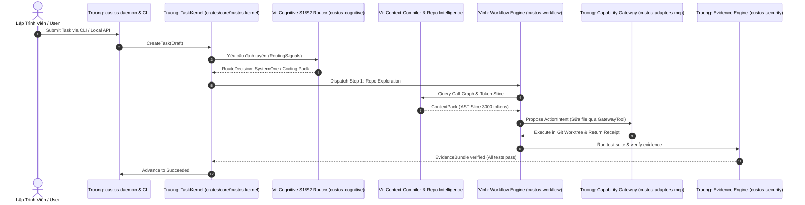

# Custos Dev Docs — Engineering Collaboration & Architecture Protocol

> **Audience:**  
> - **Vi:** Founder / AI Systems & Product Intelligence Lead (Dân AI)  
> - **Truong:** Core Platform & Security Lead (Dân SE 1)  
> - **Vinh:** Agent Systems & Coordination Research Engineer (Dân SE 2)  
>  
> **Master Architecture:** Refer to [docs/canonical-specification.md](../docs/canonical-specification.md).  
> **Module Ownership:** Refer to [dev_docs/MODULE_OWNERSHIP.md](./MODULE_OWNERSHIP.md) for crate-by-crate allocation.  
> **Rule Enforcement:** All contributors and AI assistants must strictly obey [AGENTS.md](../AGENTS.md).

---

## 1. Ba Vai Trò Cốt Lõi & Mental Models (Tripartite Division)

Custos áp dụng nguyên tắc tam quyền phân lập rõ ràng giữa 3 thành viên:

| Thành Viên | Vai Trò Chính | Câu Hỏi Cốt Lõi (Mental Model) | Phạm Vi Sở Hữu Chính |
|---|---|---|---|
| **Vi** | **Founder / AI Systems & Product Intelligence Lead** *(Dân AI)* | *How does an agent think, reason, and understand code?* | Cognitive architecture (S1/S2 Router), Repo Intelligence (`tools/repo_intelligent`), Context Compiler, Token budgeting, Model Providers, Domain Packs (Coding/Research/Assistant), Evals & Benchmarks. |
| **Truong** | **Core Platform & Security Lead** *(Dân SE 1)* | *How does the system execute correctly, durably, and safely?* | Task Kernel CQRS state machine, SQLite WAL persistence, Security & Authority Engine, Capability Gateway (`GatewayTool`, `GatewayProvider`), OS Sandboxes (Seatbelt/bwrap), Daemon runtime (`custosd`) & CLI. |
| **Vinh** | **Agent Systems & Coordination Research Engineer** *(Dân SE 2)* | *How do multiple workers coordinate and recover reliably?* | Workflow Re-entrant Operation Machine, Step-by-step DAG dispatcher, Session Manager & Session-to-Task Bridge (`promote`, `steer`), External MCP Client runner, Coordination Telemetry & E2E Verification. |

### Nguyên Tắc Kiến Trúc Bất Biến:
> **Vi** quyết định trí tuệ nhận thức và tri thức mã nguồn.  
> **Truong** bảo đảm thực thi an toàn, cách ly sandbox và lưu trữ bền vững.  
> **Vinh** đảm bảo điều phối tác tử tin cậy, không đứt gãy và đo lường được.

---

## 2. Bản Đồ Phân Phối Codebase 6 Tầng

```text
Custos/
├── crates/core/                # TRUONG (domain, kernel) + VINH (bridge) + VI (provider types/sdk)
├── crates/infrastructure/      # TRUONG (custos-persistence SQLite WAL)
├── crates/runtime/             # VI (cognitive, context, memory) + VINH (workflow, session, agent) + TRUONG (security)
├── crates/adapters/            # TRUONG (adapters-mcp, sandboxes) + VINH (custos-mcp) + VI (providers, local-inference)
├── crates/packs/               # VI (engineering coding agent, research, assistant)
├── crates/app/                 # TRUONG (custos-daemon, custos-cli) + VINH (custos-local-api, custos-vscode)
└── tools/repo_intelligent/     # VI (Tree-sitter AST, 2-way Call Graph, SQLite FTS5)
```

---

## 3. Luồng Tương Tác Giữa 3 Vai Trò Trong 1 Task Thực Tế

Ví dụ khi người dùng gửi một yêu cầu Coding: *"Fix bug in TaskKernel leasing expiration"*:



---

## 4. Hướng Dẫn Không Gian Làm Việc (Workspace Directories)

Mỗi thành viên có một không gian làm việc riêng biệt trong `dev_docs/`:
- [`dev_docs/vi/`](./vi/): Ghi chép thiết kế nhận thức, prompt schemas, chiến lược model, benchmark evals.
- [`dev_docs/truong/`](./truong/): Thiết kế schema SQLite, benchmark I/O, sandbox security policies, daemon APIs.
- [`dev_docs/vinh/`](./vinh/): Đặc tả giao thức handoff, telemetry DAG, state machine tests, MCP client configs.
- [`dev_docs/MODULE_OWNERSHIP.md`](./MODULE_OWNERSHIP.md): Bảng phân công chi tiết 38 crates.
- [`dev_docs/SPRINT_STATUS.md`](./SPRINT_STATUS.md): Báo cáo tiến độ và kế hoạch Sprint hiện tại.
