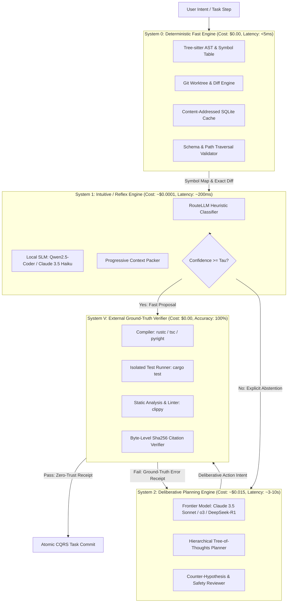
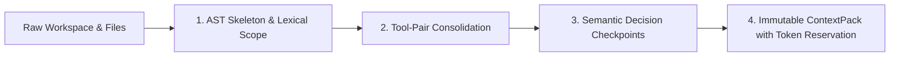

# Dual-Process Cognitive Architecture: System 1, System 2, and External Ground-Truth Verification

## 1. Theoretical and Empirical Foundations

Modern autonomous agents face an unsustainable trade-off: invoking frontier reasoning models for every turn drives token costs and latency to unacceptable levels, while delegating tasks to unguided small models leads to cognitive collapse, cascading errors, and hallucinated progress.

Custos New resolves this tension by formalizing a **Tri-System Cognitive Architecture** grounded in cognitive psychology and empirical LLM research:



### 1.1 Academic Literature Synthesis

1. **Dual-Process Theory (Kahneman, 2011 - *Thinking, Fast and Slow*)**:
   - *System 1*: Fast, autonomous, pattern-matching, associative, low-effort, prone to heuristic bias.
   - *System 2*: Slow, deliberative, sequential, rule-governed, high-effort, reflective, error-checking.
   - *Agent Mapping*: In an LLM agent, autoregressive next-token prediction without external scratchpads is purely System 1. True System 2 requires externalized state, structured planning DAGs, and deliberative lookahead.

2. **The Impossibility of Pure Self-Correction (Huang et al., 2023 - *Large Language Models Cannot Self-Correct Reasoning Yet*)**:
   - *Empirical Proof*: Autoregressive models prompted to "review and critique" their own logic without external oracle feedback systematically degrade in performance, flipping correct answers into incorrect ones.
   - *Architectural Directive*: Custos New **rejects pure prompt-based self-reflection**. Correction loops MUST be driven by **System V (External Ground-Truth Verifiers)** (compiler exit codes, test assertions, AST symbol resolution, byte-exact passage matches).

3. **Cost-Effective Routing & Cascades (Ong et al., 2024 - *RouteLLM*; Chen et al., 2023 - *FrugalGPT*)**:
   - Routing queries dynamically across model tiers using lightweight preference-trained classifiers and confidence scores achieves up to a **2x to 50x cost reduction** without sacrificing response quality.
   - *Custos Mechanism*: `CognitiveArbiter` evaluates query complexity, token budget, and user pins before routing. Small models are allowed to solve routine queries, but must support a typed `Abstain` variant.

4. **Step-Level Verification & PRMs (Lightman et al., 2023 - *Let's Verify Step by Step*)**:
   - Process-Supervised Reward Models (PRMs) verify individual reasoning steps rather than outcome-only rewards, drastically reducing reward hacking and cascading deadlocks.
   - *Custos Mechanism*: Each re-entrant worker step yields an `ActionIntent` that is independently validated and logged with an `ExecutionPermit` and `Receipt`.

5. **Tool-Interactive Verification (Gou et al., 2023 - *CRITIC*; Shinn et al., 2023 - *Reflexion*)**:
   - Interfacing external verification tools (linters, search engines, python interpreters) into the reflection loop allows agents to systematically debug code and verify facts.
   - *Custos Mechanism*: The `EvidenceEngine` operates as an external oracle, providing verifiable proof of outcome before any task moves to `Succeeded`.

---

## 2. Mathematical Cost and Efficiency Model

Let a task $T$ comprise $N$ sequential operational steps: $T = \{s_1, s_2, \dots, s_N\}$.
In a traditional agentic architecture (e.g. naive ReAct on a frontier model), the expected cost is:
$$\mathbb{E}[\text{Cost}_{\text{naive}}] = \sum_{i=1}^N \left( C_{\text{frontier}}(\text{input}_i) + C_{\text{frontier}}(\text{output}_i) \right)$$
where $C_{\text{frontier}} \approx \$3.00 / 1\text{M input tokens}, \$15.00 / 1\text{M output tokens}$. Because context grows monotonically ($O(N^2)$ token accumulation), token burn explodes superlinearly.

### 2.1 The Custos New Tri-System Cost Formulation

In Custos New, each step $s_i$ is evaluated by the routing cascade:
$$\mathbb{E}[\text{Cost}(s_i)] = C_{S0} + P(S_0) \cdot 0 + (1 - P(S_0)) \cdot \left[ C_{S1} + P(\text{S1 Accept}) \cdot 0 + P(\text{Escalate}) \cdot C_{S2} \right] + C_{\text{Verifier}}$$

Where:
- $C_{S0} = \$0.00$ (Local Rust binary, static AST query, SQLite index).
- $C_{\text{Verifier}} = \$0.00$ (Process execution: `rustc`, `cargo test`, `git diff`).
- $C_{S1} \approx \$0.0001$ (Local SLM or cheap commodity model: Claude 3.5 Haiku / Qwen2.5-Coder:7b).
- $C_{S2} \approx \$0.015$ (Frontier reasoning model: Claude 3.5 Sonnet / o3).
- $P(S_0)$: Probability of step being satisfied deterministically (e.g. file read, symbol lookup, git status, tree rendering) $\approx 35\%$.
- $P(\text{S1 Accept})$: Probability of System 1 generating an action or proposal that passes System V verification without escalation $\approx 45\%$.
- $P(\text{Escalate}) = 1 - P(S_0) - P(\text{S1 Accept}) \approx 20\%$.

### 2.2 Expected Cost Comparison

$$\begin{aligned}
\mathbb{E}[\text{Cost}_{\text{Custos}}(s_i)] &= 0 + 0.35(0) + 0.65(0.0001) + 0.20(0.015) + 0 \\
&= 0.000065 + 0.0030 = \mathbf{\$0.003065 \text{ per step}}
\end{aligned}$$

Compared to naive frontier execution ($\approx \mathbf{\$0.025 \text{ per step}}$ under equivalent 8K context):
$$\text{Cost Reduction Factor} = \frac{0.025}{0.003065} \approx \mathbf{8.15\times} \quad (\mathbf{87.7\% \text{ Cost Savings}})$$

Crucially, **verified task completion rate increases** because System V prevents false positives and deadlocks from being committed to the database.

---

## 3. Communication Protocol: System 1 $\longleftrightarrow$ System 2

The interaction between System 1 and System 2 is mediated strictly through typed domain contracts in `crates/cognitive-runtime`. **Direct unstructured model-to-model chatter is prohibited.**

### 3.1 Contract Definitions

```rust
/// Typed classification output emitted by System 1
#[derive(Debug, Clone, Serialize, Deserialize)]
pub enum SystemOneAdvice {
    /// Step can be resolved purely deterministically
    Deterministic(DeterministicPlan),
    /// Small model generated high-confidence proposal
    ConfidentProposal {
        action_intent: ActionIntent,
        confidence: f32, // [0.0, 1.0]
        rationale: String,
    },
    /// Small model abstains due to ambiguity, risk, or low confidence
    Abstain {
        reason: AbstentionReason,
        complexity_score: f32,
        missing_context_signals: Vec<String>,
    },
}

#[derive(Debug, Clone, Serialize, Deserialize)]
pub enum AbstentionReason {
    ConfidenceBelowThreshold { score: f32, threshold: f32 },
    HighRiskEffect(RiskLevel),
    MultiFileStructuralRefactor,
    ContradictoryEvidenceDetected,
    NovelDomainSchema,
}

/// Request dispatched to System 2 upon S1 abstention or SV verification failure
#[derive(Debug, Clone, Serialize, Deserialize)]
pub struct DeliberationRequest {
    pub task_id: TaskId,
    pub step_index: usize,
    pub bounded_context: ContextPack,
    pub s1_attempts: Vec<FailedAttemptReceipt>,
    pub ground_truth_feedback: Option<GroundTruthError>,
    pub budget_remaining_usd: f64,
}

/// Concrete ground-truth error from System V that breaks cognitive deadlocks
#[derive(Debug, Clone, Serialize, Deserialize)]
pub enum GroundTruthError {
    CompilationFailure {
        stderr: String,
        line_number: Option<usize>,
    },
    TestAssertionFailure {
        test_name: String,
        expected: String,
        actual: String,
    },
    AmbiguousTextReplacement {
        matches_found: usize,
        target_block: String,
    },
    CitationUnsupported {
        claim: String,
        source_uri: String,
        byte_range: (usize, usize),
        mismatch_reason: String,
    },
}
```

### 3.2 Escalation and De-escalation Lifecycle

1. **Preflight Hard Filter (System 0)**:
   - Privacy rules, provider pins, capability descriptors, and monetary budgets are checked first.
   - If user explicitly pinned a model (e.g. `--model claude-3-5-sonnet`), the router honors the pin and skips S1.
2. **Fast Evaluation (System 1)**:
   - S1 produces `SystemOneAdvice`.
   - If confidence $\ge \tau_{\text{abstain}}$ (default $\tau = 0.85$) and risk is `Low` or `Medium`, S1 mints an `ActionIntent`.
   - The intent is sent to System V (dry-run linter, AST validator, or deterministic check).
   - If System V passes, the intent is executed via the `CapabilityGateway`. **Cost saved.**
3. **Escalation Trigger (System 2 Hand-off)**:
   - Escalation occurs if and only if:
     a) S1 emits `Abstain`; OR
     b) System V rejects S1's proposed action; OR
     c) Risk level is `High` (e.g., shell script execution, external HTTP mutation, destructive delete).
4. **Deliberation (System 2)**:
   - S2 receives the `DeliberationRequest` containing the exact `GroundTruthError` from System V.
   - S2 generates a deep hypothesis, multi-step plan, or corrected code block.
   - S2 cannot bypass System V: its output is subjected to the same compiler and test verification before human presentation.
5. **De-escalation**:
   - Once S2 resolves the architectural hurdle (e.g. designs the interface or fixes the subtle type mismatch), routine continuation steps (e.g. updating documentation, formatting files, running standard tests) fall back to System 1.

---

## 4. Token Economy and Progressive Context Packing

One of the greatest drivers of agent cost and cognitive degradation is **context bloating**: repeatedly feeding entire conversation histories and uncurated file contents into frontier prompts.

Custos New enforces a **Four-Stage Context Compaction Pipeline**:



### 4.1 Four-Stage Compaction Rules

1. **AST Skeleton & Neighborhood Slicing (System 0)**:
   - Files are never ingested whole unless strictly necessary ($< 150$ LOC).
   - `custos-repo-intelligence` extracts structural signatures: function headers, struct definitions, trait implementations, and public types, discarding private function bodies outside the active call neighborhood.
2. **Tool-Pair Consolidation (Goose-Inspired)**:
   - In standard execution, an agent calling `fs.read_file` generates two bulky messages: the tool call request and the 500-line tool response.
   - Once an edit or reasoning step succeeds, the raw content of previous read operations is squashed into an immutable reference: `[Read: src/task.rs (SHA: 4a2b...), 142 lines verified]`.
3. **Semantic Decision Checkpoints**:
   - Intermediate conversation chatter is compacted into a structured `ContinuationPacket`:
     - `Goal`: Current task objective.
     - `DecisionsMade`: List of verified actions and reasons.
     - `ActiveHypothesis`: Current plan branch.
     - `OpenBlockers`: Ground-truth compiler errors or unmet criteria.
4. **Token Reservation and Settlement**:
   - Before any provider call, the `UsageLedger` checks `token_reservations`. If context size exceeds the step budget, compaction is triggered deterministically before dispatching the request.

---

## 5. Security & Invariant Envelope

1. **Zero Self-Authority**: Neither System 1 nor System 2 can authorize tool execution. Only the `AuthorityService` evaluates grants and mints an `ExecutionPermit`.
2. **Fail-Closed Verification**: If System V verifier experiences an internal error or timeout, the outcome is marked `UNCERTAIN` and completion is denied.
3. **No Unbounded Retries**: Consecutive failed attempts at any step are capped at 3. The fourth failure triggers a mandatory human yield.
