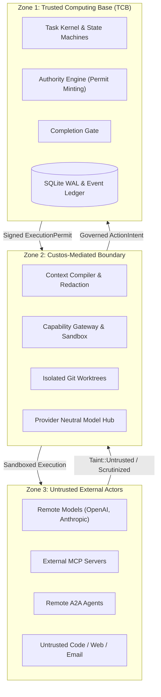

# Custos Architecture Hub & System Foundations

> **Classification:** Normative System Architecture Hub  
> **Source of Truth:** Authoritatively defined in [Custos Master Specification](../../Custos.md).  
> **Repository Documentation Hub:** See [Custos Documentation Overview](../README.md).

Custos is a sovereign, local-first runtime for proof-carrying agentic AI collaboration. Unlike transient chatbot interfaces or uncontrolled black-box autonomous agents, Custos turns complex, multi-day user goals into durable, auditable, and recoverable tasks governed by an invariant-enforcing kernel.

---

## 1. The Three Non-Negotiable Pillars

```text
┌────────────────────────────────────────────────────────────────────────┐
│                        CUSTOS ARCHITECTURAL PILLARS                    │
├────────────────────────────────────────────────────────────────────────┤
│ **P1 — Task as a First-Class Citizen:**                                │
│ Tasks persist independently of transient chat sessions. Work resumes   │
│ deterministically across client disconnects, restarts, or model swaps. │
├────────────────────────────────────────────────────────────────────────┤
│ **P2 — Strict Tripartite Separation:**                                 │
│ Models propose intent (ActionIntent); the Kernel decides authority     │
│ (Permit); the Gateway executes physical mutation (Receipt).            │
├────────────────────────────────────────────────────────────────────────┤
│ **P3 — Evidence-Backed Completion & Explicit Uncertainty:**            │
│ Model assertions have zero evidentiary value. Completion requires      │
│ empirical proof. Unknown, Stale, and Uncertain are first-class states. │
└────────────────────────────────────────────────────────────────────────┘
```

---

## 2. The Three Architectural Trust Zones

To enforce zero-trust isolation between reasoning components and host resources, Custos partitions the runtime into three distinct trust zones:



1. **Zone 1: Trusted Computing Base (Kernel):** Contains the immutable domain rules, SQLite event ledgers, authority engine, and completion gate. Possesses exclusive authority to alter task states and mint permits.
2. **Zone 2: Custos-Mediated Boundary:** Provides sandboxed execution environments, ephemeral Git worktrees (`isolated_worktree`), and context filtering pipelines that sanitize and enforce limits on external data.
3. **Zone 3: Untrusted External Actors:** Encompasses all frontier LLMs, remote MCP servers, external agent networks, and raw input files. All information received from Zone 3 carries `Taint::Untrusted`.

---

## 3. The Eight Architectural Pillars Directory

The architecture of Custos is structured into eight core domain pillars, directly elaborating the 18 parts of `Custos.md`:

| Architectural Pillar | Core Focus & Subsystems | Relevant `Custos.md` Sections |
|---|---|---|
| **[1. Kernel & Task Lifecycle](kernel-and-task-lifecycle.md)** | Session vs Task separation, the 4 independent FSMs, 5 durable transaction boundaries (T1–T5), CheckpointPolicy, and crash reconciliation. | Parts 1, 3 |
| **[2. Authority & Capability Gateway](authority-and-capability-gateway.md)** | Tripartite authorization (Grant $\rightarrow$ ActionIntent $\rightarrow$ Permit), Invocation-Bound Capability Tokens (IBCT), Delegation Diminishment, and multi-tier sandbox defense. | Parts 2, 4 |
| **[3. Evidence & Completion Gate](evidence-and-completion-gate.md)** | Three-tier evidence hierarchy (Fact, Extraction, Semantic), the Completion Gate, the REAL principle, and EG-VAR verifiable reasoning audit trails. | Part 5 |
| **[4. Data, Context & Memory](data-context-and-memory.md)** | Four core data zones, SQLite WAL starvation mitigation (P0), 8-step Context Compiler pipeline, 4 memory tiers, and ContinuationPacket safe resumption. | Parts 6, 9 |
| **[5. Protocol & Connectivity Hubs](protocol-and-connectivity-hubs.md)** | Six specialized daemon hubs (Session, Capability, MCP, A2A, Model, Event Bus), MCP OAuth 2.1 integration, A2A protocol, and 5 harness adapters. | Part 7 |
| **[6. Security & Threat Defense](security-and-threat-defense.md)** | Comprehensive STRIDE agent threat model, Taint Tracking Engine, defense-in-depth sandbox containment, and continuous red-teaming fixtures. | Part 8 |
| **[7. Cognitive Fabric & Orchestration](cognitive-fabric-and-orchestration.md)** | Single-worker-first OI; D0/D1/D2 planning, composable topology families, S1 hints without weakening S2, event-driven replan, criterion evidence and offline Meta evaluation. | Part 14 |
| **[8. Domain Packs & Workflows](domain-packs-and-workflows.md)** | Engineering Pack (3-path workspace, atomic patch bundles), Research Pack (ReproducibilityBundle, FIRE pattern), Assistant Pack, and cross-pack handoffs. | Parts 10, 11, 12, 13 |

---

## 4. Document Authority Order

When technical disagreements arise, adhere to this strict precedence order:

1. **Current Active Source Code & Automated Tests:** Rust crates (`crates/`) and test suites (`tests/`).
2. **Repository Governance:** [`AGENTS.md`](../../AGENTS.md) (team policy, agent behavior, coding bounds).
3. **Canonical Master Specification:** [`Custos.md`](../../Custos.md) (definitive product identity and architecture SSOT).
4. **Domain Pillar Specifications:** Detailed technical specifications in `docs/architecture/`, `docs/reference/`, and `docs/development/`.
