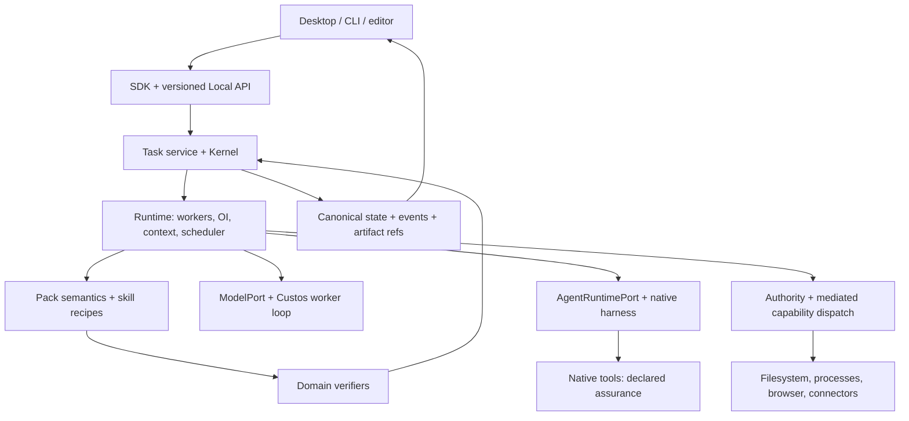
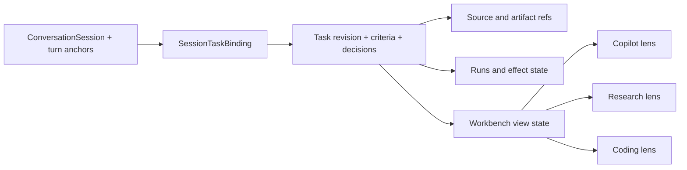

# Agent Workspace và giao diện ba miền

**Trạng thái: kiến trúc đích, chưa phải tuyên bố UI/runtime đã hoàn tất.** Tài liệu hiện thực hóa định vị trong [Custos.md](../../Custos.md), bổ sung cách người dùng làm việc với các contract hiện có. Không tạo một kernel, scheduler hay sản phẩm mang tên khác.

## 1. Quyết định sản phẩm

Định vị đầy đủ là **Custos SADE — Supervised Agent Development Environment**. Workspace là experience shell của cùng sản phẩm; xem [SADE design/supervision](sade-design-and-supervision.md) cho cơ chế S1–S2–human, loop ownership và outcome economics. Không giảm supervision thành thêm một tab Audit hoặc approval mỗi tool call.

Custos là **local-first Agent Workspace cho Coding, Research và Assistant**. Người dùng bắt đầu bằng hội thoại, mở tài nguyên cạnh agent, giao việc trong phạm vi rõ, kiểm kết quả và tiếp tục sau khi đóng phiên. Ba miền là ba bộ công cụ và cách đọc kết quả trong cùng workspace, không phải ba chatbot bắt buộc chạy cùng lúc.

Triết lý: **tối đa kết quả hữu ích trong ngân sách người dùng chọn, giữ chất lượng và quyền kiểm soát**. “Mạnh nhất, rẻ nhất” là mục tiêu tối ưu có điều kiện, không là cam kết đồng thời cho mọi bài toán. Một agent giỏi chạy trực tiếp luôn là lựa chọn hợp lệ; fan-out là tùy chọn có chi phí, không phải biểu tượng chất lượng.

[Orca](https://www.onorca.dev/) là nguồn tham khảo cho trải nghiệm agent cạnh terminal, diff, browser và worktree. [Repo upstream](https://github.com/stablyai/orca) giúp xác định đúng sản phẩm. Custos chọn triển khai trải nghiệm thống nhất giữa ba miền cùng contract về nguồn, quyền và kết quả; không kết luận Orca thiếu các cơ chế đó, không sao chép khẩu hiệu hiệu năng hay giao diện thương hiệu.

[Audit OrCa ở commit đã pin](../development/orca-source-study.md) xác nhận OrCa có runtime Run/Task/Dispatch, durable messages/receipts, structured Claude/Codex session, worktree/SSH và automation, không phải chỉ UI. Vì vậy UI Custos phải tách **resource workspace** (pane/host/checkout), **Task** (goal/scope/criteria), **Run/Dispatch** (attempt) và **Outcome** (verification) ngay trong navigation. Agent status dot và `worker_done` là trạng thái vận hành, không phải completion của criterion. Hai agent có thể chạy cùng Task nhưng tổng budget và source baseline phải hiện chung.

## 2. Những đối tượng không được trộn

| Đối tượng | Ý nghĩa | Không phải |
|---|---|---|
| Workspace | Phạm vi tài nguyên và bố cục làm việc; có thể không có Git repo | Một quyền tổng quát |
| Task | Goal, criteria, scope, budget, revisions và outcome bền vững | Một tab chat |
| Conversation/session | Lượt trao đổi, retention và bindings tới Task | Chính sách thực thi |
| Workbench | Một lens/preset UI lên cùng Task và tài nguyên đã bind: Copilot, Coding hoặc Research | Task mới, pack mới hay session mới |
| Run/WorkerRun | Một lần thực thi hoặc một ứng viên giải bài toán | Task mới bắt buộc |
| ExecutionWorkspace | Checkout, dataset/experiment directory hoặc connector scope cụ thể | OS sandbox |
| Pane | Một cách xem chat, file, diff, nguồn, terminal hoặc lịch | Owner của state backend |
| Artifact | Patch, brief, dataset card, experiment result hoặc draft có version | Bằng chứng tự động đủ để pass |

Workspace có nhiều Task; Task liên kết nhiều session; một session có thể chứa nhiều Task. Một Task có thể có nhiều candidate runs hoặc nhiều bước xuyên pack. Quan hệ này phải được map từ IDs hiện có; tên trong bảng là vocabulary thiết kế, không yêu cầu sinh thêm schema nếu contract hiện hữu đã đủ.

**Bất biến UX quan trọng nhất:** đổi workbench không được đổi chủ thể công việc. `task_id`, revision, selected source/artifact references, decisions, criteria, budget và pending effects vẫn giữ nguyên; chỉ pane tree, công cụ nổi bật và context recipe thay đổi. Nếu mục tiêu thật sự tách nhánh, user tạo child Task/fork tường minh. Nếu chỉ hỏi ngoài lề, side conversation giữ liên kết tới Task nhưng không làm nhiễu goal chính.

## 3. Luồng và nơi ra quyết định



Daemon ráp implementations. Runtime quản lý run/workspace/process lifecycle qua ports; adapter thực hiện Git, PTY, browser hoặc connector I/O. UI gửi command và hiển thị projection; không spawn agent thực thi, tự merge hay tự mint permit. Webview host cũng không trở thành composition root thứ hai.

## 4. Bố cục và điều hướng

Desktop/headless integration theo [superplan §21](../development/workspace-restructuring-plan.md#21-superplan-kết-hợp-custos-và-orca-cho-desktop-và-headless): selective port OrCa presentation components qua Custos SDK facade; projection/event store do backend IDs/version/cursor chi phối; terminal/token streams bounded riêng với persisted state events. Layout restore không tự spawn agent. Mobile app/client/push/packaging chưa nằm trong phạm vi; giao diện hẹp dưới đây chỉ là responsive desktop.

Desktop dùng một shell, không làm ba ứng dụng UI rời:

- **Navigation rail:** Workspace, Tasks, Sources/Artifacts, Automations, Connections, Settings. Người dùng ẩn/ghim mục ít dùng; không bắt đọc Authority/Audit trước khi chat.
- **Workspace sidebar:** tài nguyên, Task gần đây và runs liên quan; lọc theo project/corpus/account nhưng không lộ tài nguyên ngoài scope.
- **Main canvas:** panes tách/ghép được, mỗi pane giữ resource/run/task reference rõ ràng. Pane không bao giờ đổi Task âm thầm khi người dùng đổi sidebar.
- **Task strip:** mục tiêu, mode, model/harness thực dùng, đang làm gì, ngân sách và trạng thái. Pin model phải nhìn thấy.
- **Inspector:** criteria/evidence, route reason, approval, uncertainty, costs; mở theo ngữ cảnh. Detail mặc định thu gọn, pending effect không bị giấu.

Ba **workbench lens** là cấp điều hướng chính: **Copilot**, **Coding**, **Research**. Bên trong mỗi lens có preset bố cục: **Focus** (chat + artifact), **Build** (agent + repo/diff/test), **Study** (source + notes/claims), **Assist** (draft/calendar + conversation), **Compare** (candidates + shared criteria). Đổi lens hoặc preset không đổi mode, quyền, model hoặc Task.

Giao diện hẹp chỉ có một pane tại một thời điểm, navigation bằng tabs và inspector dạng drawer. Keyboard navigation, focus restoration, screen-reader labels, trạng thái bằng chữ cùng màu, phím hủy và copy citation/diff cần có ngay. CLI cung cấp cùng command/status semantics, không cần tái tạo mọi pane desktop.

### 4.1. Shared shell của cả ba workbench

```text
┌ Rail ┬ Workspace/Task list ┬──────────────── Task workspace ────────────────┬ Inspector ┐
│      │                     │ Task strip: goal · state · executor · budget  │           │
│ Home │ Recent conversations├ Copilot │ Coding │ Research ───────────────────┤ Criteria  │
│ Work │ Active Tasks        │                                                  │ Sources   │
│ Lib  │ Needs attention     │ Flexible pane canvas + persistent conversation   │ Evidence  │
│ Auto │ Artifacts           │                                                  │ Effects   │
└──────┴─────────────────────┴──────────────────────────────────────────────────┴───────────┘
```

- **Task strip là neo liên tục:** luôn hiện Task hiện hành, goal ngắn, state, source baseline, executor thực, spend/reservation và attention. Với chat chưa formalize, strip hiện `No active Task` cùng action tạo Task; không giả một Task ẩn.
- **Conversation là pane bền vững, không phải toàn workspace:** có thể ghim trái/phải, thu nhỏ thành dock hoặc mở toàn canvas. Composer gửi vào session hiện hành và hiển thị Task anchor của lượt kế tiếp.
- **Workbench switcher đổi lens:** Coding ưu tiên repo/diff/test/terminal; Research ưu tiên corpus/source/claim/experiment; Copilot ưu tiên conversation/draft/calendar/automations. Các pane khác vẫn mở được khi cần.
- **Inspector là control plane theo ngữ cảnh:** tab `Task`, `Context`, `Evidence`, `Activity`, `Permissions`. Pending approval, uncertain effect và conflict không được ẩn chỉ vì inspector đang đóng; chúng tạo attention item ở Task strip.
- **Library chung:** source, artifact và outcome có stable ID/version. Kéo hoặc chọn một item vào pane không copy raw bytes vào chat; nó thêm reference có scope và provenance.

### 4.2. Continuity model: không mất session khi đổi miền

Custos không “chuyển một chat sang app khác”. Nó giữ một **Task spine** và mở một view khác trên spine đó:



Khi user bấm **Continue in Research** hoặc **Continue in Coding**, backend không clone toàn transcript. Command thực hiện bốn việc có thể kiểm:

1. xác định Task hiện hành hoặc cho user chọn `same Task`, `child Task`, `new Task` khi goal khác;
2. bind các turn/source/artifact được user chọn bằng stable references và revision;
3. tạo/revise obligation của pack đích cùng acceptance cần thiết, không tự biến finding thành requirement;
4. compile ContextPack cho worker đích từ references, decisions và omissions; layout mở lens đích sau khi command được ack.

Transcript gốc vẫn ở session; workbench mới nhìn thấy summary có nguồn, selected artifacts, decisions và unresolved questions. Grant, permit, secret, native hidden state và toàn bộ raw transcript **không được kế thừa ngầm**. Native agent không hỗ trợ resume tương đương thì tạo WorkerRun mới, ghi rõ phần context đã chuyển và phần không chuyển được.

### 4.3. Ba lựa chọn khi chuyển hướng

| Lựa chọn | Dùng khi | Điều giữ | Điều tạo mới |
|---|---|---|---|
| **Open lens** | Cùng goal, chỉ cần công cụ khác | Cùng Task/session binding, criteria, sources, artifacts, budget | Presentation state và ContextPack theo lens |
| **Add pack step** | Cùng outcome nhưng cần Research → Coding hoặc Coding → Assistant | Cùng parent Task và shared lineage | Workflow node/obligation, pack artifact và run mới |
| **Fork child Task** | Goal/acceptance hoặc lifecycle đã tách | Selected source/artifact/decision refs có provenance | Task/revision/budget/authority riêng; liên kết parent-child |

UI không dùng từ mơ hồ `Switch mode` cho cả ba hành vi. Menu chuyển workbench phải nói rõ `Open Coding view`, `Add implementation step`, hoặc `Fork as coding task`. Default là **Open lens** khi chỉ thay bố cục; mọi mutation của Task cần preview diff contract ngắn.

### 4.4. Một chat có nhiều công việc

Mỗi turn có thể hiện Task chip nhỏ; composer có `Working on: <Task>` và cho chọn `No Task`. Chuyển active Task chỉ định tuyến lượt tiếp theo, không sửa provenance turn cũ và không cấp quyền. Khi matcher tìm thấy nhiều Task tương tự, UI cho 1–3 lựa chọn; không auto-attach theo recency. User có thể chọn turn/artifact để `Attach`, `Move`, `Copy reference` hoặc `Fork`, còn merge Task là operation riêng có conflict preview.

## 5. Coding workspace

Luồng: mở repo → đọc snapshot → chat/explore → giao patch/refactor → agent chạy trong execution scope → diff/test → quyết định apply/integrate → outcome.

Panes: repo explorer, source anchors, agent chat/terminal, diff comments, test matrix, browser preview. Terminal phải hiện rõ cwd, run owner, local/remote host và assurance; manual terminal input không mặc nhiên nằm trong mediated path.

Coding lens không tạo một “Codex session” riêng khỏi Custos Task. Header của mỗi editor/diff/terminal hiển thị `task_id`, execution workspace/worktree, host và run owner; chat bên cạnh có thể **steer active run** hoặc **queue lượt sau** bằng hai action tách biệt. Từ Research, action `Implement selected claims` tạo `EngineeringBrief/Spec` từ đúng claim IDs/caveats rồi mở Coding; source passages vẫn mở lại được trong Inspector.

### Worktree và candidate comparison

1. Giữ main checkout và dirty changes; không tự stash/reset. Lấy baseline commit cùng dirty manifest đã chọn.
2. Runtime cấp execution workspace cho writer; reader có thể dùng cùng read-only snapshot. Không bắt mọi câu hỏi tạo worktree.
3. Compare là **một Task, nhiều candidate runs** cùng criterion/baseline, có budget chung và cap từng ứng viên. UI preview số agent, dữ liệu ra ngoài và tổng chi phí trước chạy.
4. Giữ patch/artifact/evidence riêng từng candidate. Candidate fail/unknown không biến mất khỏi báo cáo chi phí.
5. Dùng cùng verifier baseline để so kết quả. Không xếp hạng “nhanh nhất” trước quality/scope gate; khác environment phải hiện không so trực tiếp được.
6. Chọn candidate không tự merge. Integration là effect riêng: check target HEAD/dirty/base hash, conflicts, scope, approval profile rồi verify snapshot đã tích hợp.
7. Cleanup chỉ workspace/process do Custos sở hữu; giữ dirty/untracked output đến khi có export/retention decision. Cancel không xóa artifact hoặc đảo ngược effect.

**Luồng launch phải hiển thị sự thật:** `requested_mode → actual_mode` (model worker, native structured session, native terminal), host, prompt-delivery status và lý do downgrade. Khi structured create có kết quả chưa rõ, UI hiện `start_unknown`/reconcile, không âm thầm mở terminal thứ hai. Terminal sống không chứng minh agent còn làm việc; agent hoàn thành không chứng minh Task accepted. Mất liên lạc remote hiện `unverifiable`, không `exited`. Những phân biệt này lấy từ source OrCa, nhưng kết quả/authority Custos vẫn do backend của mình sở hữu.

[Git worktree](https://git-scm.com/docs/git-worktree) quản lý nhiều checkout của cùng repo; đây là cách tách nhánh làm việc, không là bảo đảm file/network isolation. Repo Intelligence phải gắn worktree/snapshot/index generation, không dùng index của checkout A để chứng minh patch B. Xem [thiết kế Repo Intelligence](repo-intelligence-subsystem.md).

### Browser và Design mode

Capture DOM/CSS/screenshot là một source observation: lưu origin, URL, timestamp, viewport, selected element, build/source reference nếu xác định được, digest và parse limitations. Preview/redact secrets, personal data trước cloud egress; không thu screenshot toàn màn hình mặc định. Screenshot chứng minh trạng thái quan sát, không chứng minh toàn bộ behavior.

Browser inspect và browser act tách quyền: click có thể gửi form, thanh toán hoặc sửa dữ liệu; không gán mọi browser action là read-only. Dev server/process được runtime theo dõi owner và port; closing pane không tự kill server người dùng. Chromium engine/integration cần thử trên từng OS, không giả định Tauri webview tương đương browser automation.

## 6. Research workspace

Trọng tâm là research phục vụ lập trình, AI và Data: hiểu paper, so thuật toán, audit dataset, thiết kế/tái lập thí nghiệm và chuyển kết luận thành implementation có điều kiện.

| Công việc | Canvas chính | Artifact và gate |
|---|---|---|
| Đọc/QA nguồn | PDF/web/source passage + conversation | PaperCard/answer có locator và version |
| So sánh/literature | Corpus + criteria matrix + contradictions | Brief có coverage, support/unknown từng claim |
| AI/Data experiment | Dataset card + experiment runs + metrics/logs | Code/config/env/seed/data split/model version và limits |
| Research → code | Selected claims + engineering spec + target repo | Handoff provenance/privacy và acceptance đã làm rõ |

Search/read independent branches có thể song song; synthesis phải reconcile nguồn/versions, không vote theo số worker. NLI/LLM support assessment có sai số; locator tồn tại không đủ chứng minh claim. OCR/figure/table gaps phải nằm ngay cạnh kết quả có liên quan.

Experiment không dùng Git worktree như toàn bộ environment: pin dependency/container nếu dùng, GPU/compute limits, data access/license, network policy, seeds và output directory. Training/dataset download là effect có resource/egress implications. Notebook/kernel là managed process, không owner của canonical Task state. Code/API mutation chuyển Engineering obligation; không biến claim paper thành requirement tự động.

Research lens có ba lớp đồng thời: **Explore** (search/corpus/source viewer), **Reason** (question/claim/evidence/contradiction) và **Experiment** (dataset/notebook/run/metrics). Conversation có thể bắt đầu bằng web lookup nhanh; action `Deepen in Research` chỉ mang các nguồn/turn user chọn vào corpus ledger. Từ kết luận nghiên cứu, user chọn claims rồi `Continue in Coding`; Custos tạo handoff typed thay vì chép một đoạn summary không truy nguyên.

## 7. Assistant workspace

Ưu tiên hỗ trợ công việc developer và tri thức cá nhân: notes, reminders, schedules, drafts, notifications và bounded automation; mở rộng connector theo job cụ thể. “Jarvis” là cảm hứng trải nghiệm, không nghĩa ambient surveillance hoặc quyền vô hạn.

Panes: conversation, draft editor, recipient identity, calendar/timezone, inbox/outbox, automation history. Read-only answer/draft dùng scope tương ứng; send/create/delete cần effect preview đúng account, recipient, payload, attachments, timezone và expiry.

Automation editor thể hiện trigger, scope, recipient allowlist, provider/egress, per-run/total budget, max runs, expiry, retry/reconcile policy và revoke. Mặc định draft/notify. Standing grant không đồng nghĩa cho phép mọi payload. UI luôn phân biệt scheduled/running/drafted/sent/uncertain/cancelled; timeout không ghi “chưa gửi”.

Tên hiển thị nên là **Copilot** để diễn đạt lối vào hội thoại và trợ lý, còn `Assistant Pack` là semantics backend. Copilot luôn có thể hỏi nhanh, quản lý Task và mở artifact; các thao tác cá nhân như draft/calendar/outbox xuất hiện theo context thay vì biến thành một màn “fleet orchestrator”. Từ Coding/Research, `Summarize or notify` chỉ đưa selected outcome/artifact refs sang draft; quyền gửi không đi kèm.

## 8. Model API, native agent và skills

- **Model API/local model:** ModelPort cung cấp inference; Custos worker loop thêm tool use, context, checkpoints và verification. Chỉ endpoint không tự thành coding agent.
- **Native agent:** AgentRuntimePort điều khiển harness đã có loop/tools; giữ reasoning, context và feature riêng. Ghi support thực cho start/steer/cancel/resume/usage và tool interception.
- **Skill:** recipe/instruction gọi capabilities; dùng chung semantics và source contracts nhưng không hứa cùng native hidden state hoặc cùng khả năng interception.

Context adaptation gồm tool descriptions/examples, repo conventions, source refs và bounded feedback. Không chèn một vòng S1 “sửa mọi suy nghĩ” trước S2, không thay instruction của native harness bằng scaffold chưa được đo. S1 hỗ trợ bounded search/rank/extraction/test triage hoặc micro-worker trong worktree; S2 có thể bác bỏ hint, đọc lại source. Required verifier và permission không được S1 bỏ qua.

OI tổ chức topology ở ngoài worker: direct, single worker, independent readers, disjoint writers + join, candidate comparison, bounded iterative experiment, barriered automation. Chọn theo dependency/write overlap/privacy/budget và measured outcomes; pack không cố định topology. Xem [cognitive design](cognitive-fabric-and-orchestration.md) và [capability/skill ownership](capability-catalog-and-skills.md).

## 9. State, events và API behavior

Frontend lưu local presentation state: pane tree, sizes, theme, collapsed panels. Backend giữ Task/run/effect/criterion truth. UI không suy status từ câu trả lời agent hoặc đánh pass bằng toast.

Tận dụng command/event contracts hiện hữu, chỉ bổ sung phần thiếu sau contract audit:

| Intent giao diện | Backend responsibility | UI behavior khi pending/lỗi |
|---|---|---|
| Chọn/resume Task | Check revision/sources/pending effects | Hiện stale/reconcile, không tự repeat |
| Start/steer/cancel run | Lifecycle/capability/budget checks | Ack khác completion; giữ cancel pending |
| Compare candidates | Allocate bounded runs/reservations | Hiện tất cả spend và unsupported routes |
| Apply/integrate | Exact diff/target/preconditions/permit | Payload đổi làm approval stale |
| Approve/reject | Actor + expected version + exact intent | Không optimistic “đã thực thi” |
| Watch/reconnect | Persisted event cursor + projection version | Replay idempotent, detect cursor gap |
| Open/capture source | Scope + source revision + privacy | Hiện unavailable/parse gap |

Every command needs command ID/actor/expected version where state-sensitive; events carry seq/correlation and typed payload. Token streaming có thể ephemeral; approval/effect/outcome phải persisted. Permission details và assurance theo action, không một badge “secure” cho toàn agent.

### 9.1. Presentation state và deep link

`WorkbenchViewState` là projection phía client, có version và có thể rebuild; nó không nằm trong TaskContract và không quyết định quyền. Tối thiểu gồm `workspace_id`, `task_id?`, `active_session_id?`, `lens`, pane tree, focused pane, resource references, inspector tab và local sizing. Persist theo user/device/window; khi resource thiếu hoặc source revision stale, mở placeholder có nguyên nhân thay vì bỏ pane âm thầm.

Deep link đích dùng IDs ổn định, ví dụ `workspace/<id>/task/<id>?lens=research&resource=<source-ref>`. Link không nhúng secret/permit và khi mở phải recheck actor/scope. Restore layout chỉ mount view; không resume run, retry effect, tạo terminal hoặc khởi động notebook cho tới command tường minh.

### 9.2. Contract chuyển workbench

Không cần tạo một protocol mới nếu command/event hiện hữu biểu diễn đủ. Audit trước, rồi bổ sung tối thiểu các intent application-level:

| Intent | Input quan trọng | Kết quả/Failure |
|---|---|---|
| `SelectActiveTask` | session, task, expected binding version | Chọn anchor cho lượt sau; ambiguity/conflict không auto-resolve |
| `BindTurnsToTask` | turn IDs/range, task/revision, role | Binding có provenance; retention/scope mismatch bị từ chối |
| `OpenWorkbenchView` | workspace/task/lens/resource refs | Ack presentation target; không tạo run/effect |
| `AddPackObligation` | task revision, target pack/kind, selected artifacts, criteria draft | Task revision diff hoặc validation error |
| `ForkTaskFromSelection` | parent task, selected refs, goal/criteria/budget | Child Task riêng; không inherit grant/permit |
| `CompileContinuation` | task revision, consumer capability/privacy/token budget | ContinuationPacket + omissions + unsupported native state |

Frontend chỉ đổi lens ngay cho operation presentation-only. Với add/fork/bind, UI chờ backend ack/version mới; lỗi giữ user ở view cũ cùng selection để sửa, không làm mất dữ liệu.

## 10. Ranh giới triển khai và acceptance

Giữ `ui/desktop` là frontend sản phẩm chính; refactor theo feature modules trong repo hiện tại, không tạo `custos-ade-ui` hay `Rook`. Rust desktop host dưới `crates/custos-app/desktop` mỏng; `custos-daemon` là composition root đích. `ui/cli` hiện là frontend React khác, không phải Rust CLI: phải audit routes/host trước khi hợp nhất. Xem [migration plan](../development/workspace-restructuring-plan.md).

Done phải có demo chạy thật: chat → Task → scoped run → source/artifact → criterion → restart/resume. Compare cần dirty main preservation, shared verification và total budget; research cần citation đúng URL nhưng sai support; assistant cần hai tên trùng và timeout sau send; UI cần disconnected/replay/stale approval/accessibility. Fake/demo providers được gắn nhãn, không hiển thị như real result.

Không trì hoãn UI đến khi mọi subsystem hoàn tất: xây workspace read-only cùng execution spine đầu tiên, sau đó controlled mutation và domain panes. Không công bố full product từ số folder hoặc ảnh mockup.

### 10.1. Component architecture đích

| Feature module | Sở hữu | Không sở hữu |
|---|---|---|
| `features/workspace-shell` | rail, sidebar, Task strip, lens switcher, attention | Task/run truth |
| `features/conversations` | transcript, composer, turn selection, queue/steer affordance | worker lifecycle |
| `features/workbench` | pane tree, resource tabs, presets, restore/deep links | source bytes và permissions |
| `features/tasks` | Task projection, criteria, binding/fork/revise UI | policy decision |
| `features/engineering` | repo/editor/diff/test/terminal projections | Git/process execution |
| `features/research` | corpus/source/claims/experiments projections | crawler/OCR/notebook execution |
| `features/assistant` | draft/identity/calendar/outbox/automation projections | connector dispatch |
| `features/attention` | approvals, uncertainty, conflicts, reconnect gaps | tự resolve effect |
| `shared/api` | generated DTO/client, event sync, capability negotiation | domain-specific display logic |

Hiện `StudioPage`, `AppContext`, `WorkspaceTabBar` và các prototype workspace đang trộn layout, demo data và domain actions. Refactor theo vertical packets: tạo facade/event store trước; tách shell/conversation; sau đó pane model và từng domain. Không đổi toàn bộ file tree một lần và không giữ `Session` UI DTO như alias cho Task.

### 10.2. Acceptance journey xuyên ba workbench

1. User chat: “Tìm các cách giảm chi phí context cho agent coding”; Copilot trả lời nhanh với nguồn, chưa buộc tạo Task.
2. User chọn ba nguồn và bấm `Deepen in Research`; Custos tạo/attach Task, mở Research lens cùng transcript binding, corpus ledger và câu hỏi còn thiếu.
3. Research tạo claims có support/unknown; user chọn hai claim và bấm `Implement selected claims`; cùng Task nhận Engineering obligation và mở Coding lens với `EngineeringBrief` có source refs.
4. Coding agent chạy trên đúng repo/workspace; diff, tests và cost gắn run. User vẫn mở lại passage Research hoặc hỏi Copilot mà không mất Task.
5. User chọn accepted outcome và `Draft update`; Copilot tạo draft từ selected artifact; send vẫn cần exact effect approval.
6. Đóng/mở app: Task, session bindings, artifacts và evidence phục hồi từ backend; layout phục hồi riêng; pending/uncertain effect được reconcile trước mọi retry.

Journey chỉ pass khi không copy grant, không mất turn/source provenance, không đánh worker completion thành Task success, và mọi lens cho thấy cùng task/revision/budget truth.
