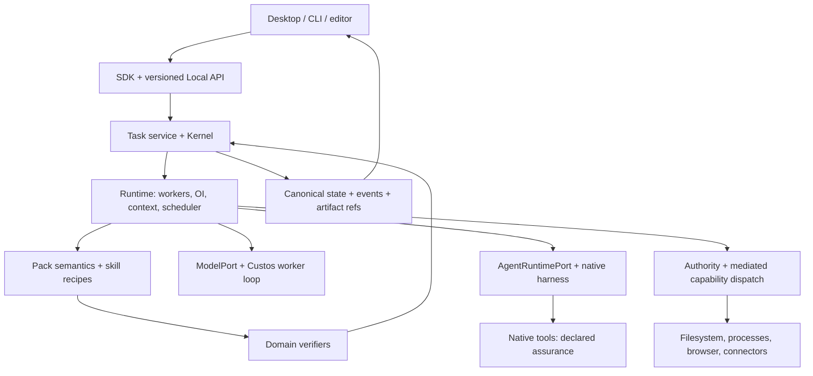
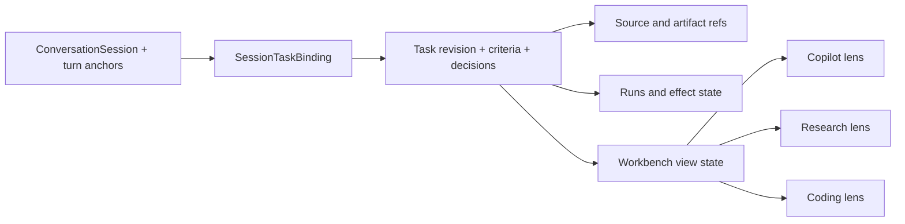
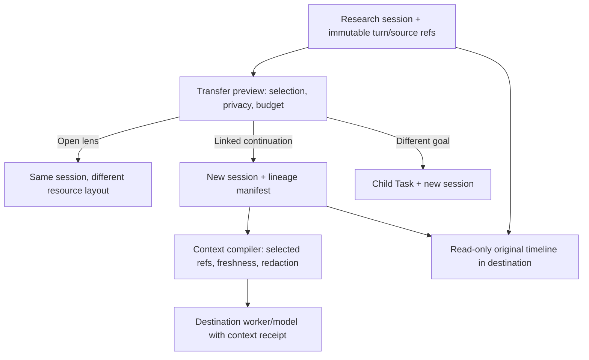
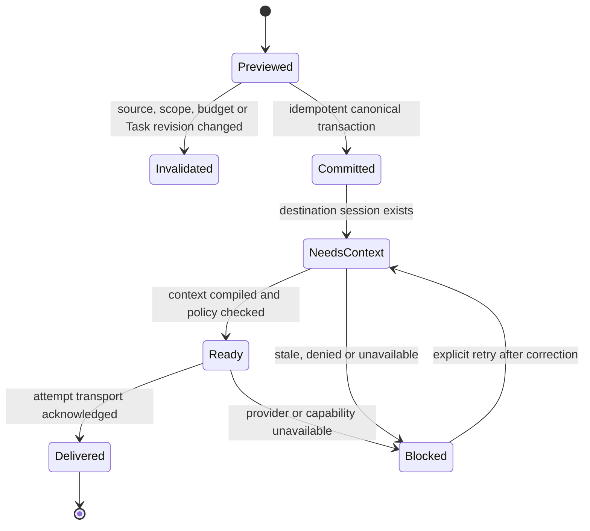

# Agent Workspace và giao diện ba miền

**Trạng thái: kiến trúc đích, chưa phải tuyên bố UI/runtime đã hoàn tất.** Tài liệu hiện thực hóa định vị trong [Custos.md](../../Custos.md), bổ sung cách người dùng làm việc với các contract hiện có. Không tạo một kernel, scheduler hay sản phẩm mang tên khác.

## 1. Quyết định sản phẩm

Định vị đầy đủ là **Custos SADE — Supervised Agent Development Environment**. Workspace là experience shell của cùng sản phẩm; xem [SADE design/supervision](sade-design-and-supervision.md) cho cơ chế S1–S2–human, loop ownership và outcome economics. Không giảm supervision thành thêm một tab Audit hoặc approval mỗi tool call.

Custos là **local-first Agent Workspace cho Coding, Research và Assistant**. Người dùng bắt đầu bằng hội thoại, mở tài nguyên cạnh agent, giao việc trong phạm vi rõ, kiểm kết quả và tiếp tục sau khi đóng phiên. Ba miền là ba bộ công cụ và cách đọc kết quả trong cùng workspace, không phải ba chatbot bắt buộc chạy cùng lúc.

Triết lý: **tối đa kết quả hữu ích trong ngân sách người dùng chọn, giữ chất lượng và quyền kiểm soát**. “Mạnh nhất, rẻ nhất” là mục tiêu tối ưu có điều kiện, không là cam kết đồng thời cho mọi bài toán. Một agent giỏi chạy trực tiếp luôn là lựa chọn hợp lệ; fan-out là tùy chọn có chi phí, không phải biểu tượng chất lượng.

[Orca](https://www.onorca.dev/) là nguồn tham khảo cho trải nghiệm agent cạnh terminal, diff, browser và worktree. [Repo upstream](https://github.com/stablyai/orca) giúp xác định đúng sản phẩm. Custos chọn triển khai trải nghiệm thống nhất giữa ba miền cùng contract về nguồn, quyền và kết quả; không kết luận Orca thiếu các cơ chế đó, không sao chép khẩu hiệu hiệu năng hay giao diện thương hiệu.

[Audit OrCa ở commit đã pin](../development/orca-source-study.md) xác nhận OrCa có runtime Run/Task/Dispatch, durable messages/receipts, structured Claude/Codex session, worktree/SSH và automation, không phải chỉ UI. Vì vậy UI Custos phải tách **resource workspace** (pane/host/checkout), **Task** (goal/scope/criteria), **Run/Dispatch** (attempt) và **Outcome** (verification) ngay trong navigation. Agent status dot và `worker_done` là trạng thái vận hành, không phải completion của criterion. Hai agent có thể chạy cùng Task nhưng tổng budget và source baseline phải hiện chung.

## 2. Những đối tượng không được trộn

| Đối tượng | Ý nghĩa | Không phải |
|---|---|---|
| Workspace | Phạm vi tài nguyên và bố cục làm việc; có thể không có Git repo | Một quyền tổng quát |
| Task | Goal, criteria, scope, budget, revisions và outcome bền vững | Một tab chat |
| Conversation/session | Lượt trao đổi, retention và bindings tới Task | Chính sách thực thi |
| Workbench | Một lens/preset UI lên cùng Task và tài nguyên đã bind: Copilot, Coding hoặc Research | Task mới, pack mới hay session mới |
| Run/WorkerRun | Một lần thực thi hoặc một ứng viên giải bài toán | Task mới bắt buộc |
| ExecutionWorkspace | Checkout, dataset/experiment directory hoặc connector scope cụ thể | OS sandbox |
| Pane | Một cách xem chat, file, diff, nguồn, terminal hoặc lịch | Owner của state backend |
| Artifact | Patch, brief, dataset card, experiment result hoặc draft có version | Bằng chứng tự động đủ để pass |

Workspace có nhiều Task; Task liên kết nhiều session; một session có thể chứa nhiều Task. Một Task có thể có nhiều candidate runs hoặc nhiều bước xuyên pack. Quan hệ này phải được map từ IDs hiện có; tên trong bảng là vocabulary thiết kế, không yêu cầu sinh thêm schema nếu contract hiện hữu đã đủ.

**Bất biến UX quan trọng nhất:** đổi workbench không được đổi chủ thể công việc. `task_id`, revision, selected source/artifact references, decisions, criteria, budget và pending effects vẫn giữ nguyên; chỉ pane tree, công cụ nổi bật và context recipe thay đổi. Nếu mục tiêu thật sự tách nhánh, user tạo child Task/fork tường minh. Nếu chỉ hỏi ngoài lề, side conversation giữ liên kết tới Task nhưng không làm nhiễu goal chính.

## 3. Luồng và nơi ra quyết định



Daemon ráp implementations. Runtime quản lý run/workspace/process lifecycle qua ports; adapter thực hiện Git, PTY, browser hoặc connector I/O. UI gửi command và hiển thị projection; không spawn agent thực thi, tự merge hay tự mint permit. Webview host cũng không trở thành composition root thứ hai.

## 4. Bố cục và điều hướng

Desktop/headless integration theo [superplan §21](../development/workspace-restructuring-plan.md#21-superplan-kết-hợp-custos-và-orca-cho-desktop-và-headless): selective port OrCa presentation components qua Custos SDK facade; projection/event store do backend IDs/version/cursor chi phối; terminal/token streams bounded riêng với persisted state events. Layout restore không tự spawn agent. Mobile app/client/push/packaging chưa nằm trong phạm vi; giao diện hẹp dưới đây chỉ là responsive desktop.

Desktop dùng một shell, không làm ba ứng dụng UI rời:

- **Navigation rail:** Workspace, Tasks, Sources/Artifacts, Automations, Connections, Settings. Người dùng ẩn/ghim mục ít dùng; không bắt đọc Authority/Audit trước khi chat.
- **Workspace sidebar:** tài nguyên, Task gần đây và runs liên quan; lọc theo project/corpus/account nhưng không lộ tài nguyên ngoài scope.
- **Main canvas:** panes tách/ghép được, mỗi pane giữ resource/run/task reference rõ ràng. Pane không bao giờ đổi Task âm thầm khi người dùng đổi sidebar.
- **Task strip:** mục tiêu, mode, model/harness thực dùng, đang làm gì, ngân sách và trạng thái. Pin model phải nhìn thấy.
- **Inspector:** criteria/evidence, route reason, approval, uncertainty, costs; mở theo ngữ cảnh. Detail mặc định thu gọn, pending effect không bị giấu.

Ba **workbench lens** là cấp điều hướng chính: **Copilot**, **Coding**, **Research**. Bên trong mỗi lens có preset bố cục: **Focus** (chat + artifact), **Build** (agent + repo/diff/test), **Study** (source + notes/claims), **Assist** (draft/calendar + conversation), **Compare** (candidates + shared criteria). Đổi lens hoặc preset không đổi mode, quyền, model hoặc Task.

Giao diện hẹp chỉ có một pane tại một thời điểm, navigation bằng tabs và inspector dạng drawer. Keyboard navigation, focus restoration, screen-reader labels, trạng thái bằng chữ cùng màu, phím hủy và copy citation/diff cần có ngay. CLI cung cấp cùng command/status semantics, không cần tái tạo mọi pane desktop.

### 4.1. Shared shell của cả ba workbench

```text
┌ Rail ┬ Workspace/Task list ┬──────────────── Task workspace ────────────────┬ Inspector ┐
│      │                     │ Task strip: goal · state · executor · budget  │           │
│ Home │ Recent conversations├ Copilot │ Coding │ Research ───────────────────┤ Criteria  │
│ Work │ Active Tasks        │                                                  │ Sources   │
│ Lib  │ Needs attention     │ Flexible pane canvas + persistent conversation   │ Evidence  │
│ Auto │ Artifacts           │                                                  │ Effects   │
└──────┴─────────────────────┴──────────────────────────────────────────────────┴───────────┘
```

- **Task strip là neo liên tục:** luôn hiện Task hiện hành, goal ngắn, state, source baseline, executor thực, spend/reservation và attention. Với chat chưa formalize, strip hiện `No active Task` cùng action tạo Task; không giả một Task ẩn.
- **Conversation là pane bền vững, không phải toàn workspace:** có thể ghim trái/phải, thu nhỏ thành dock hoặc mở toàn canvas. Composer gửi vào session hiện hành và hiển thị Task anchor của lượt kế tiếp.
- **Workbench switcher đổi lens:** Coding ưu tiên repo/diff/test/terminal; Research ưu tiên corpus/source/claim/experiment; Copilot ưu tiên conversation/draft/calendar/automations. Các pane khác vẫn mở được khi cần.
- **Inspector là control plane theo ngữ cảnh:** tab `Task`, `Context`, `Evidence`, `Activity`, `Permissions`. Pending approval, uncertain effect và conflict không được ẩn chỉ vì inspector đang đóng; chúng tạo attention item ở Task strip.
- **Library chung:** source, artifact và outcome có stable ID/version. Kéo hoặc chọn một item vào pane không copy raw bytes vào chat; nó thêm reference có scope và provenance.

### 4.2. Continuity model: không mất session khi đổi miền

Custos không “chuyển một chat sang app khác”. Nó giữ một **Task spine** và mở một view khác trên spine đó:



Khi user bấm **Continue in Research** hoặc **Continue in Coding**, UI trước hết hỏi đó là mở cùng chat, tạo linked chat hay thêm bước công việc. Chỉ **linked continuation/Add pack step**, không phải `Open lens`, mới có backend command mang ngữ cảnh. Command đó thực hiện bốn việc có thể kiểm:

1. xác định Task hiện hành hoặc cho user chọn `same Task`, `child Task`, `new Task` khi goal khác;
2. bind các turn/source/artifact được user chọn bằng stable references và revision;
3. tạo/revise obligation của pack đích cùng acceptance cần thiết, không tự biến finding thành requirement;
4. compile ContextPack cho worker đích từ references, decisions và omissions **nếu user thực sự khởi chạy worker**; layout có thể mở lens đích sau khi continuation được ack mà không tự dispatch.

Transcript gốc vẫn ở session; workbench mới nhìn thấy summary có nguồn, selected artifacts, decisions và unresolved questions. Grant, permit, secret, native hidden state và toàn bộ raw transcript **không được kế thừa ngầm**. Native agent không hỗ trợ resume tương đương thì tạo WorkerRun mới, ghi rõ phần context đã chuyển và phần không chuyển được.

### 4.3. Ba lựa chọn khi chuyển hướng

| Lựa chọn | Dùng khi | Điều giữ | Điều tạo mới |
|---|---|---|---|
| **Open lens** | Cùng goal, chỉ cần công cụ khác | Cùng Task/session binding, criteria, sources, artifacts, budget | Presentation state và ContextPack theo lens |
| **Add pack step** | Cùng outcome nhưng cần Research → Coding hoặc Coding → Assistant | Cùng parent Task và shared lineage | Workflow node/obligation, pack artifact và run mới |
| **Fork child Task** | Goal/acceptance hoặc lifecycle đã tách | Selected source/artifact/decision refs có provenance | Task/revision/budget/authority riêng; liên kết parent-child |

UI không dùng từ mơ hồ `Switch mode` cho cả ba hành vi. Menu chuyển workbench phải nói rõ `Open Coding view`, `Add implementation step`, hoặc `Fork as coding task`. Default là **Open lens** khi chỉ thay bố cục; mọi mutation của Task cần preview diff contract ngắn.

### 4.4. Một chat có nhiều công việc

Mỗi turn có thể hiện Task chip nhỏ; composer có `Working on: <Task>` và cho chọn `No Task`. Chuyển active Task chỉ định tuyến lượt tiếp theo, không sửa provenance turn cũ và không cấp quyền. Khi matcher tìm thấy nhiều Task tương tự, UI cho 1–3 lựa chọn; không auto-attach theo recency. User có thể chọn turn/artifact để `Attach`, `Move`, `Copy reference` hoặc `Fork`, còn merge Task là operation riêng có conflict preview.

## 5. Coding workspace

Luồng: mở repo → đọc snapshot → chat/explore → giao patch/refactor → agent chạy trong execution scope → diff/test → quyết định apply/integrate → outcome.

Panes: repo explorer, source anchors, agent chat/terminal, diff comments, test matrix, browser preview. Terminal phải hiện rõ cwd, run owner, local/remote host và assurance; manual terminal input không mặc nhiên nằm trong mediated path.

Coding lens không tạo một “Codex session” riêng khỏi Custos Task. Header của mỗi editor/diff/terminal hiển thị `task_id`, execution workspace/worktree, host và run owner; chat bên cạnh có thể **steer active run** hoặc **queue lượt sau** bằng hai action tách biệt. Từ Research, action `Implement selected claims` tạo `EngineeringBrief/Spec` từ đúng claim IDs/caveats rồi mở Coding; source passages vẫn mở lại được trong Inspector.

### Worktree và candidate comparison

1. Giữ main checkout và dirty changes; không tự stash/reset. Lấy baseline commit cùng dirty manifest đã chọn.
2. Runtime cấp execution workspace cho writer; reader có thể dùng cùng read-only snapshot. Không bắt mọi câu hỏi tạo worktree.
3. Compare là **một Task, nhiều candidate runs** cùng criterion/baseline, có budget chung và cap từng ứng viên. UI preview số agent, dữ liệu ra ngoài và tổng chi phí trước chạy.
4. Giữ patch/artifact/evidence riêng từng candidate. Candidate fail/unknown không biến mất khỏi báo cáo chi phí.
5. Dùng cùng verifier baseline để so kết quả. Không xếp hạng “nhanh nhất” trước quality/scope gate; khác environment phải hiện không so trực tiếp được.
6. Chọn candidate không tự merge. Integration là effect riêng: check target HEAD/dirty/base hash, conflicts, scope, approval profile rồi verify snapshot đã tích hợp.
7. Cleanup chỉ workspace/process do Custos sở hữu; giữ dirty/untracked output đến khi có export/retention decision. Cancel không xóa artifact hoặc đảo ngược effect.

**Luồng launch phải hiển thị sự thật:** `requested_mode → actual_mode` (model worker, native structured session, native terminal), host, prompt-delivery status và lý do downgrade. Khi structured create có kết quả chưa rõ, UI hiện `start_unknown`/reconcile, không âm thầm mở terminal thứ hai. Terminal sống không chứng minh agent còn làm việc; agent hoàn thành không chứng minh Task accepted. Mất liên lạc remote hiện `unverifiable`, không `exited`. Những phân biệt này lấy từ source OrCa, nhưng kết quả/authority Custos vẫn do backend của mình sở hữu.

[Git worktree](https://git-scm.com/docs/git-worktree) quản lý nhiều checkout của cùng repo; đây là cách tách nhánh làm việc, không là bảo đảm file/network isolation. Repo Intelligence phải gắn worktree/snapshot/index generation, không dùng index của checkout A để chứng minh patch B. Xem [thiết kế Repo Intelligence](repo-intelligence-subsystem.md).

### Browser và Design mode

Capture DOM/CSS/screenshot là một source observation: lưu origin, URL, timestamp, viewport, selected element, build/source reference nếu xác định được, digest và parse limitations. Preview/redact secrets, personal data trước cloud egress; không thu screenshot toàn màn hình mặc định. Screenshot chứng minh trạng thái quan sát, không chứng minh toàn bộ behavior.

Browser inspect và browser act tách quyền: click có thể gửi form, thanh toán hoặc sửa dữ liệu; không gán mọi browser action là read-only. Dev server/process được runtime theo dõi owner và port; closing pane không tự kill server người dùng. Chromium engine/integration cần thử trên từng OS, không giả định Tauri webview tương đương browser automation.

## 6. Research workspace

Trọng tâm là research phục vụ lập trình, AI và Data: hiểu paper, so thuật toán, audit dataset, thiết kế/tái lập thí nghiệm và chuyển kết luận thành implementation có điều kiện.

| Công việc | Canvas chính | Artifact và gate |
|---|---|---|
| Đọc/QA nguồn | PDF/web/source passage + conversation | PaperCard/answer có locator và version |
| So sánh/literature | Corpus + criteria matrix + contradictions | Brief có coverage, support/unknown từng claim |
| AI/Data experiment | Dataset card + experiment runs + metrics/logs | Code/config/env/seed/data split/model version và limits |
| Research → code | Selected claims + engineering spec + target repo | Handoff provenance/privacy và acceptance đã làm rõ |

Search/read independent branches có thể song song; synthesis phải reconcile nguồn/versions, không vote theo số worker. NLI/LLM support assessment có sai số; locator tồn tại không đủ chứng minh claim. OCR/figure/table gaps phải nằm ngay cạnh kết quả có liên quan.

Experiment không dùng Git worktree như toàn bộ environment: pin dependency/container nếu dùng, GPU/compute limits, data access/license, network policy, seeds và output directory. Training/dataset download là effect có resource/egress implications. Notebook/kernel là managed process, không owner của canonical Task state. Code/API mutation chuyển Engineering obligation; không biến claim paper thành requirement tự động.

Research lens có ba lớp đồng thời: **Explore** (search/corpus/source viewer), **Reason** (question/claim/evidence/contradiction) và **Experiment** (dataset/notebook/run/metrics). Conversation có thể bắt đầu bằng web lookup nhanh; action `Deepen in Research` chỉ mang các nguồn/turn user chọn vào corpus ledger. Từ kết luận nghiên cứu, user chọn claims rồi `Continue in Coding`; Custos tạo handoff typed thay vì chép một đoạn summary không truy nguyên.

## 7. Assistant workspace

Ưu tiên hỗ trợ công việc developer và tri thức cá nhân: notes, reminders, schedules, drafts, notifications và bounded automation; mở rộng connector theo job cụ thể. “Jarvis” là cảm hứng trải nghiệm, không nghĩa ambient surveillance hoặc quyền vô hạn.

Panes: conversation, draft editor, recipient identity, calendar/timezone, inbox/outbox, automation history. Read-only answer/draft dùng scope tương ứng; send/create/delete cần effect preview đúng account, recipient, payload, attachments, timezone và expiry.

Automation editor thể hiện trigger, scope, recipient allowlist, provider/egress, per-run/total budget, max runs, expiry, retry/reconcile policy và revoke. Mặc định draft/notify. Standing grant không đồng nghĩa cho phép mọi payload. UI luôn phân biệt scheduled/running/drafted/sent/uncertain/cancelled; timeout không ghi “chưa gửi”.

Tên hiển thị nên là **Copilot** để diễn đạt lối vào hội thoại và trợ lý, còn `Assistant Pack` là semantics backend. Copilot luôn có thể hỏi nhanh, quản lý Task và mở artifact; các thao tác cá nhân như draft/calendar/outbox xuất hiện theo context thay vì biến thành một màn “fleet orchestrator”. Từ Coding/Research, `Summarize or notify` chỉ đưa selected outcome/artifact refs sang draft; quyền gửi không đi kèm.

## 8. Model API, native agent và skills

- **Model API/local model:** ModelPort cung cấp inference; Custos worker loop thêm tool use, context, checkpoints và verification. Chỉ endpoint không tự thành coding agent.
- **Native agent:** AgentRuntimePort điều khiển harness đã có loop/tools; giữ reasoning, context và feature riêng. Ghi support thực cho start/steer/cancel/resume/usage và tool interception.
- **Skill:** recipe/instruction gọi capabilities; dùng chung semantics và source contracts nhưng không hứa cùng native hidden state hoặc cùng khả năng interception.

Context adaptation gồm tool descriptions/examples, repo conventions, source refs và bounded feedback. Không chèn một vòng S1 “sửa mọi suy nghĩ” trước S2, không thay instruction của native harness bằng scaffold chưa được đo. S1 hỗ trợ bounded search/rank/extraction/test triage hoặc micro-worker trong worktree; S2 có thể bác bỏ hint, đọc lại source. Required verifier và permission không được S1 bỏ qua.

OI tổ chức topology ở ngoài worker: direct, single worker, independent readers, disjoint writers + join, candidate comparison, bounded iterative experiment, barriered automation. Chọn theo dependency/write overlap/privacy/budget và measured outcomes; pack không cố định topology. Xem [cognitive design](cognitive-fabric-and-orchestration.md) và [capability/skill ownership](capability-catalog-and-skills.md).

## 9. State, events và API behavior

Frontend lưu local presentation state: pane tree, sizes, theme, collapsed panels. Backend giữ Task/run/effect/criterion truth. UI không suy status từ câu trả lời agent hoặc đánh pass bằng toast.

Tận dụng command/event contracts hiện hữu, chỉ bổ sung phần thiếu sau contract audit:

| Intent giao diện | Backend responsibility | UI behavior khi pending/lỗi |
|---|---|---|
| Chọn/resume Task | Check revision/sources/pending effects | Hiện stale/reconcile, không tự repeat |
| Start/steer/cancel run | Lifecycle/capability/budget checks | Ack khác completion; giữ cancel pending |
| Compare candidates | Allocate bounded runs/reservations | Hiện tất cả spend và unsupported routes |
| Apply/integrate | Exact diff/target/preconditions/permit | Payload đổi làm approval stale |
| Approve/reject | Actor + expected version + exact intent | Không optimistic “đã thực thi” |
| Watch/reconnect | Persisted event cursor + projection version | Replay idempotent, detect cursor gap |
| Open/capture source | Scope + source revision + privacy | Hiện unavailable/parse gap |

Every command needs command ID/actor/expected version where state-sensitive; events carry seq/correlation and typed payload. Token streaming có thể ephemeral; approval/effect/outcome phải persisted. Permission details và assurance theo action, không một badge “secure” cho toàn agent.

### 9.1. Presentation state và deep link

`WorkbenchViewState` là projection phía client, có version và có thể rebuild; nó không nằm trong TaskContract và không quyết định quyền. Tối thiểu gồm `workspace_id`, `task_id?`, `active_session_id?`, `lens`, pane tree, focused pane, resource references, inspector tab và local sizing. Persist theo user/device/window; khi resource thiếu hoặc source revision stale, mở placeholder có nguyên nhân thay vì bỏ pane âm thầm.

Deep link đích dùng IDs ổn định, ví dụ `workspace/<id>/task/<id>?lens=research&resource=<source-ref>`. Link không nhúng secret/permit và khi mở phải recheck actor/scope. Restore layout chỉ mount view; không resume run, retry effect, tạo terminal hoặc khởi động notebook cho tới command tường minh.

### 9.2. Contract chuyển workbench

Không cần tạo một protocol mới nếu command/event hiện hữu biểu diễn đủ. Audit trước, rồi bổ sung tối thiểu các intent application-level:

| Intent | Input quan trọng | Kết quả/Failure |
|---|---|---|
| `SelectActiveTask` | session, task, expected binding version | Chọn anchor cho lượt sau; ambiguity/conflict không auto-resolve |
| `BindTurnsToTask` | turn IDs/range, task/revision, role | Binding có provenance; retention/scope mismatch bị từ chối |
| `OpenWorkbenchView` | workspace/task/lens/resource refs | Ack presentation target; không tạo run/effect |
| `AddPackObligation` | task revision, target pack/kind, selected artifacts, criteria draft | Task revision diff hoặc validation error |
| `ForkTaskFromSelection` | parent task, selected refs, goal/criteria/budget | Child Task riêng; không inherit grant/permit |
| `CompileContinuation` | task revision, consumer capability/privacy/token budget | ContinuationPacket + omissions + unsupported native state |

Frontend chỉ đổi lens ngay cho operation presentation-only. Với add/fork/bind, UI chờ backend ack/version mới; lỗi giữ user ở view cũ cùng selection để sửa, không làm mất dữ liệu.

## 10. Ranh giới triển khai và acceptance

Giữ `ui/desktop` là frontend sản phẩm chính; refactor theo feature modules trong repo hiện tại, không tạo `custos-ade-ui` hay `Rook`. Rust desktop host dưới `crates/custos-app/desktop` mỏng; `custos-daemon` là composition root đích. `ui/cli` hiện là frontend React khác, không phải Rust CLI: phải audit routes/host trước khi hợp nhất. Xem [migration plan](../development/workspace-restructuring-plan.md).

Done phải có demo chạy thật: chat → Task → scoped run → source/artifact → criterion → restart/resume. Compare cần dirty main preservation, shared verification và total budget; research cần citation đúng URL nhưng sai support; assistant cần hai tên trùng và timeout sau send; UI cần disconnected/replay/stale approval/accessibility. Fake/demo providers được gắn nhãn, không hiển thị như real result.

Không trì hoãn UI đến khi mọi subsystem hoàn tất: xây workspace read-only cùng execution spine đầu tiên, sau đó controlled mutation và domain panes. Không công bố full product từ số folder hoặc ảnh mockup.

### 10.1. Component architecture đích

| Feature module | Sở hữu | Không sở hữu |
|---|---|---|
| `features/workspace-shell` | rail, sidebar, Task strip, lens switcher, attention | Task/run truth |
| `features/conversations` | transcript, composer, turn selection, queue/steer affordance | worker lifecycle |
| `features/workbench` | pane tree, resource tabs, presets, restore/deep links | source bytes và permissions |
| `features/tasks` | Task projection, criteria, binding/fork/revise UI | policy decision |
| `features/engineering` | repo/editor/diff/test/terminal projections | Git/process execution |
| `features/research` | corpus/source/claims/experiments projections | crawler/OCR/notebook execution |
| `features/assistant` | draft/identity/calendar/outbox/automation projections | connector dispatch |
| `features/attention` | approvals, uncertainty, conflicts, reconnect gaps | tự resolve effect |
| `shared/api` | generated DTO/client, event sync, capability negotiation | domain-specific display logic |

Hiện `StudioPage`, `AppContext`, `WorkspaceTabBar` và các prototype workspace đang trộn layout, demo data và domain actions. Refactor theo vertical packets: tạo facade/event store trước; tách shell/conversation; sau đó pane model và từng domain. Không đổi toàn bộ file tree một lần và không giữ `Session` UI DTO như alias cho Task.

### 10.2. Acceptance journey xuyên ba workbench

1. User chat: “Tìm các cách giảm chi phí context cho agent coding”; Copilot trả lời nhanh với nguồn, chưa buộc tạo Task.
2. User chọn ba nguồn và bấm `Deepen in Research`; Custos tạo/attach Task, mở Research lens cùng transcript binding, corpus ledger và câu hỏi còn thiếu.
3. Research tạo claims có support/unknown; user chọn hai claim và bấm `Implement selected claims`; cùng Task nhận Engineering obligation và mở Coding lens với `EngineeringBrief` có source refs.
4. Coding agent chạy trên đúng repo/workspace; diff, tests và cost gắn run. User vẫn mở lại passage Research hoặc hỏi Copilot mà không mất Task.
5. User chọn accepted outcome và `Draft update`; Copilot tạo draft từ selected artifact; send vẫn cần exact effect approval.
6. Đóng/mở app: Task, session bindings, artifacts và evidence phục hồi từ backend; layout phục hồi riêng; pending/uncertain effect được reconcile trước mọi retry.

Journey chỉ pass khi không copy grant, không mất turn/source provenance, không đánh worker completion thành Task success, và mọi lens cho thấy cùng task/revision/budget truth.

## 11. Kiểm tra desktop hiện hành và quyết định hoàn thiện

Phần này là **kiểm tra checkout hiện tại**, không thay thế đích ở §1–10. `ui/desktop` build được bằng `npm run build`; desktop host đã dùng `ensure_daemon_client` và chuyển `custos_request` qua `LocalApiClient`, nên bước host mỏng đã có thật. Build chỉ kiểm tra TypeScript/bundle, không xác nhận giao diện dùng đúng DTO Rust hoặc một journey ba miền chạy end-to-end. Browser dev hiện dùng simulator trong `daemon_client.ts`; ảnh browser không phải bằng chứng cho native Tauri/live daemon.

| Bề mặt | Đã hiện hữu | Khoảng cách tới UX đích |
|---|---|---|
| Shell | Header chuyển Chat/Code/Research bằng nút và phím; ba view có sidebar, transcript, composer; right tab container có nhiều loại resource. | `StudioPage` mount ba view riêng và chỉ lưu lens vào `localStorage`; shell chưa có Task strip, inspector, pane state và resource identity dùng chung. |
| Data/continuity | Desktop host gọi daemon; `AppContext` thử hydrate Tasks và Sessions. | UI projection dùng `Task.id` làm `Session.id`, ghép session theo `task_id` đơn; không có turn binding, selected references hoặc backend ack khi bấm `Send to Code/Research`. Toast `Transferred context` hiện chỉ là đổi lens. |
| Coding | Có chat, worktree modal và tab file/diff/terminal/changes. | Khi right tab đóng, chat vẫn chiếm khoảng 45% canvas và phần còn lại trống. Branch `wt-simd`, repo files, terminal/evidence trong OrCa tab là fixture; không được hiện như trạng thái live. |
| Research | Có Research chat và chỗ mở source/claim/experiment. | Nút corpus/experiment/claim hiện chủ yếu ra toast; một transcript Engineering có thể hiện y nguyên ở Research mà không có corpus/claim handoff, provenance hoặc acceptance Research. |
| Copilot/Assistant | Chat, action chuyển lens, prototype assistant/fleet. | Assistant effect/draft/identity/outbox chưa gắn Task/effect projections; tên model và mode ở một số view bị hard-code theo thương hiệu khác, không phản ánh executor thực. |
| Contract | Local API đã có Task, Session, Run, Workspace endpoints. | `types/domain.ts` còn là bản viết tay không khớp Rust: Task/Run status casing và variants, `TaskContract.pack` so với `pack_id`, `SessionMode`, cấu trúc journal/run/workspace status. `advanceTask` gửi `phase,status` thay vì `target_status`; `completeTask` gửi `evidence` thay vì `summary,evidence_claims`; `createSession('supervised', taskId)` không tạo attached session theo server. |
| Truth | Demo simulator giúp thử hình dáng nhanh. | Fixture khẳng định `Verified`, CAS proof, “Mediated Authority”, worktree/agent cụ thể mà không có receipt tương ứng. Mọi dữ liệu này phải mang nhãn `Demo` rõ tại nguồn và tại widget; live mode không được fallback sang fixture. |

### 11.1. Quyết định cấu trúc UI sau khi kiểm tra

Không cần thay Tauri, viết lại React, hay mở thêm một desktop product. **Giữ visual assets và các view hiện có như presentation prototypes**, nhưng chuyển quyền sở hữu state theo các ranh giới sau:

1. `WorkspaceShell` sở hữu route, rail, Task/sidebar selection, lens, pane layout và inspector placement. Nó không giữ Task/Run truth.
2. `ConversationSurface` sở hữu transcript, composer, turn selection và `Working on: Task | No Task`. Chỉ một conversation model dùng chung; Chat, Coding và Research có thể đổi bố cục/composer affordance, không tạo ba bản copy journal.
3. `ResourcePaneHost` nhận `resource_ref`, `workspace_id`, `task_id?`, `run_id?` và render file/diff/terminal, PDF/source, claims, experiment, draft, calendar hoặc outbox qua feature view. Pane đóng/mở chỉ đổi presentation state.
4. `TaskProjection` giữ Task/criterion/evidence/attention từ daemon. `SessionProjection` giữ transcript và binding. `RunProjection` giữ worker/attempt/usage. `WorkspaceProjection` giữ checkout/corpus/account resources. Mọi ID có type riêng; không dùng một `Session` UI object kiêm cả Task.
5. `LocalApiFacade` chứa DTO sinh hoặc kiểm bằng golden fixtures Rust–TS, command IDs, capability negotiation và event cursor. Tauri invoke là transport, không là business model. Browser demo có adapter riêng với `data_origin=demo`; không silently thay live failure bằng giả lập.

Đây là **ranh giới trách nhiệm**, chưa yêu cầu tạo đủ năm folder ngay. `StudioPage` có thể được rút từng phần qua facade và component adapter, giữ route hoạt động giữa các packet. `WorkspaceTabBar` hiện không phải thanh điều hướng đang render trong `StudioPage`; đừng tiếp tục polish nó như live Task strip trước khi gắn vào shell thật.

### 11.2. Hình dạng tương tác cuối cùng

| Vùng | Khi chưa có Task | Khi đang làm Task | Khi cần human |
|---|---|---|---|
| Header/Task strip | `No active Task`, provider/egress thực và action tạo/attach | Goal, revision, pack obligations, source baseline, actual executor/assurance theo action, spend known/estimated/unknown | Attention count và trạng thái pending/uncertain luôn thấy được, kể cả inspector đóng |
| Sidebar | Recent conversations và workspace resources, không đổ toàn bộ demo vào live | Task liên quan, sessions bind, runs và nguồn; filter theo ID/pack thật | Approval/conflict/stale/disconnected đứng đầu danh sách |
| Canvas | Copilot chat chiếm chiều rộng hữu ích; không có vùng rỗng vô cớ | Coding: chat + file/diff/test/terminal; Research: chat + source/claims/experiment; Copilot: chat + draft/calendar/outbox | Giữ selection/pane, mở preview exact effect hoặc evidence liên quan |
| Inspector | Thu gọn; không giả `Verified` | Context, criteria, evidence, activity, permission, cost trên cùng Task | Tự mở đúng tab nhưng không tự approve, retry hay gửi effect |

Open lens chỉ đổi view và được phép tức thì. `Add Research/Coding/Assistant step` phải chọn turn/artifact refs, hiển thị obligation/criteria/egress diff, chờ Task revision ack rồi mới toast thành công. `Fork child Task` tạo goal/budget/scope riêng, không copy grant. Nếu API chưa hỗ trợ các command này, action phải ghi `Chưa hỗ trợ trong live mode` và giữ selection; tuyệt đối không báo “đã chuyển context” chỉ vì `setMode`.

**Wide window:** khi không có pane phải, conversation dùng toàn vùng sau sidebar với max readable text width ở giữa, không giữ một cột chat cố định 45%. Khi mở pane, splitter cho hai vùng có min-width; dưới ngưỡng desktop hẹp chỉ một vùng chính cùng tab/drawer để tránh text/code bị ép dưới chiều rộng đọc được. Tab `New tab` không được mang tên một resource đã tồn tại, còn pane rỗng phải cho thấy chọn file/source/diff hoặc đóng pane. Pane layout có thể lưu local theo user/window, nhưng restore không mở process/agent hay đánh thức effect.

**Tab tài nguyên do Studio shell sở hữu:** thứ tự, tab được chọn và thao tác đóng/mở nằm trên ba lens. Đổi lens dùng lại một tab strip, không remount ba tab store độc lập. `New tab` là một resource picker có một identity, không tạo thêm tab trùng ID. Đóng pane không để tab strip mồ côi trên header. Research có Literature, Claims, Experiments và Synthesis; mỗi tab hiện trạng thái chưa kết nối cho tới khi API cung cấp nguồn, claim hoặc run có version. Provenance của artifact nghiên cứu cần nối tới nguồn, code, environment và run khi có dữ liệu; đây là điều học từ [Claude Science](https://www.anthropic.com/news/claude-science-ai-workbench), không phải claim Custos đã có scientific backend.

### 11.3. Chi tiết bắt buộc theo lens

| Lens | Header và primary action | Main resources | Completion nhìn thấy được |
|---|---|---|---|
| Copilot | `Chat`, `Create/attach Task`, provider/model thực; Assistant action xuất hiện theo intent | Transcript, selected context, draft, recipient, calendar, outbox/automation | Draft khác sent; exact recipient/payload, receipt hoặc `uncertain`; không gắn Assistant với fleet dashboard |
| Coding | `Coding`, repo/branch/worktree/dirty baseline, actual harness và assurance | File/symbol, terminal theo owner, diff theo run/base hash, test matrix, browser preview, candidate compare | Run done khác Task pass; apply/merge cần precondition, approvals và verifier sau integration |
| Research | `Research`, corpus/scope/freshness và source coverage | Passage/PDF/web, claim support/contradiction, notes, dataset/experiment logs | Locator/version, parse gaps, support method và claim `unknown` ngay cạnh synthesis |

Branding của Custos giữ ổn định ở shell; `Codex`, `Claude`, local coder hoặc agent khác là **executor được chọn/thực chạy** hiển thị bằng tên thật từ attempt. Không đặt tên toàn lens là “Claude Science” hoặc “Codex 3-Column”, vì đổi provider không được làm mất ý nghĩa của workbench. Có thể giữ logo provider trong message/run card khi attribution thực sự có dữ liệu.

### 11.4. Thứ tự chuyển từ prototype sang sản phẩm

1. **Truth pass:** làm `Demo` rõ ở cả shell và resource widgets; ẩn/disable fixture proof, worktree, badge, commands trên live path; sửa khung Coding trống và action toast sai. Đây là việc UI độc lập, không cần backend mới.
2. **Contract pass:** golden fixtures từ Rust cho Task/Session/Run/Workspace/commands; sửa DTO, enum, `createSession`, `advanceTask`, `completeTask`; test deserialize/error. Nếu API thiếu instruction trong `StartRunRequest`, đừng gửi `instruction` rồi giả nó được worker dùng; thiết kế command/journal contract trước.
3. **Identity pass:** tách Task/Session/Run/Workspace projections và active IDs. Hydrate Task và Session độc lập; không ép một Task có đúng một Session. Chưa có binding API thì hiện `Unbound` thay vì ghép theo `task_id` không chắc chắn.
4. **Continuity pass:** cùng Task chuyển Chat → Research → Coding → Copilot qua `Open lens`/`Add step`/`Fork`, selected refs và backend revision ack; transcript không biến thành policy, không sao chép quyền.
5. **Pane/feature pass:** gắn file/diff/test, source/claim/experiment, draft/outbox vào resource APIs theo từng vertical slice. Những pane còn thiếu hiện empty/unsupported state trung thực.
6. **Hardening pass:** reconnect/replay, stale resource, run-start unknown, accessibility/focus/keyboard, narrow windows, reduced motion, provider switch, restart, native Tauri smoke test.

**Gate phát hành UI:** một fixture có một session chứa hai Task; một Task trải nhiều sessions/lenses; taskless chat; daemon disconnect/restart; Research→Coding giữ selected claim IDs; Coding→Copilot chỉ đưa accepted/redacted artifact; fake mail timeout hiện `uncertain`; fixture claim sai không thành verified; viewport hẹp không có vùng rỗng/cắt composer. Build xanh là điều kiện nền, không thay các gate này.

### 11.5. Những sửa code đã áp dụng trong packet hiện tại

Packet hiện tại đã thực hiện phần truth/layout/contract có thể làm mà không phát minh API mới: `Task` và `Session` có ID riêng trong UI projection (session chưa bind được đánh dấu `unbound`), journal được đọc từ endpoint journal riêng, session mới được tạo ở chế độ `assisted` rồi attach qua `v1.sessions.attach`, `advance` gửi `target_status` hợp lệ và `complete` dùng `summary/evidence_claims`. Lens actions đổi tên thành `Open ...` và nói rõ chúng chưa tạo handoff; Coding dùng 100% canvas khi pane phải đóng; browser fixtures có banner Demo và transcript không còn tự nhận là proof. Đây chưa phải continuity hoàn chỉnh: `BindTurnsToTask`, `AddPackObligation` và event cursor vẫn cần API/vertical slice riêng trước khi bật hành động handoff thật.

## 12. Lịch sử hội thoại và chuyển workbench

### 12.1. Điều học từ desktop hiện hữu, không suy đoán mã nội bộ

[Tài liệu lệnh ChatGPT desktop](https://learn.chatgpt.com/docs/reference/commands) mô tả chuyển Chat/Work/Codex, đi giữa chat/tab, mở review/file/browser và bố cục split/full. [Tài liệu projects/chats](https://learn.chatgpt.com/docs/projects) xác nhận Work history tách với Codex history và người dùng có thể đưa một ChatGPT chat hiện có vào Codex chat. Đó là bằng chứng về **hành vi sản phẩm công khai**, không cho phép suy ra schema, React state hay implementation nội bộ. Custos nên giữ cảm giác điều hướng rõ như vậy nhưng chủ động giải quyết vấn đề Research → Coding → Assistant bằng session lineage có provenance; không ép ba kho lịch sử vật lý riêng.

| Thành phần | Chủ sở hữu sự thật | Cách hiện trong UI |
|---|---|---|
| `ConversationSession` + journal | Session service/persistence, ID và turn IDs bền vững | Transcript có thể mở từ nhiều lens; turn giữ lens/actor/attempt attribution gốc |
| `home_lens`/workbench membership | Projection tổ chức, sửa được, không là quyền | Sidebar Copilot/Coding/Research lọc mặc định theo lens; Global search tìm tất cả |
| `Task` và session–task bindings | Kernel + bridge, nhiều–nhiều theo turn/interval ở target | Task chip và criterion chung; session mới không tự nhận grant |
| `ResourceTab` | Client presentation state theo workspace/session/window | File, source, claim, notebook, diff có stable ref; không đồng nghĩa một chat |
| `LinkedConversation`/transfer manifest | Canonical provenance cho session đích | Chip “Continued from Research”, mở transcript gốc và danh sách phần đã đưa vào model |

**Ba thao tác khác nhau:**

1. `Open in another workbench`: giữ `session_id`, Task và journal; chỉ đổi lens/layout, có thể thêm membership trong sidebar. Đây là mặc định khi user muốn nhìn cùng cuộc trò chuyện bên cạnh file, paper hoặc notebook. Không gọi model, không chạy notebook và không phát sinh quyền.
2. `Continue as linked chat`: tạo `destination_session_id` mới, chọn `target_lens`/executor, liên kết nguồn đến `source_session_id` và checkpoint turn. Cùng Task nếu goal/criteria không đổi; tạo pack obligation bằng revision riêng khi thật sự cần. UI hiển thị lịch sử gốc dưới dạng read-only linked timeline (có thể chọn **toàn bộ lịch sử hiển thị**), còn model nhận `ContextReceipt` ghi chính xác selected turns, source/artifact versions, summary, omissions, redactions và token count. Không tuyên bố đã chuyển native hidden state của Codex/Claude/Colab.
3. `Fork child Task`: khi outcome mới tách acceptance/budget/scope; chọn refs và decisions đưa sang Task con, tạo session đích mới. Grant/permit không copy, source untrusted không thành instruction. Parent vẫn nguyên.

Menu chuyển từ Research nên hiện `Mở Coding với chat này`, `Tiếp tục bằng chat Coding mới`, `Tạo Task coding riêng`. Từ Coding sang Research/Copilot dùng cùng ba nghĩa. Preview của lựa chọn thứ hai hiện số turn, nguồn, notebook/code, claim statuses, egress/provider, phần không thể chuyển và chi phí context dự kiến. Action `Chuyển toàn bộ lịch sử` nghĩa là **cho phép truy cập/hiển thị transcript nguyên bản theo ref**; không đồng nghĩa nhét toàn bộ vào một prompt. Người dùng có thể tăng phạm vi model-visible khi consent/budget cho phép. Composer đích hiện `Working on Task …`, `Linked from …` và `Model received: N turns + M source refs`; nếu thiếu API thì button disabled với lý do, không toast thành công giả.



**Atomicity và recovery:** client gửi `command_id`, source journal checkpoint/`expected_revision`, destination lens, selected stable IDs và transfer policy. Backend tạo destination session + provenance link + Task binding trong một canonical transaction; sau commit mới compile context/start run. Retry cùng command trả cùng destination ID, không nhân đôi chat. Nếu provider/context compilation fail, linked chat vẫn tồn tại ở trạng thái `needs_context` với manifest và lỗi; không giả message đầu tiên đã được model đọc. Source bị xóa/hết quyền/stale → `omitted/blocked`, không copy cache cũ. UI reload lấy server projection; local tab layout không là nguồn sự thật.

**Gap của checkout hiện tại:** `crates/custos-domain/src/session.rs` chỉ có `attached_to: Option<TaskId>`; `v1.sessions.attach` nhận một Task và journal entry chỉ có `entry_type/entry_data`, chưa có typed turn-to-task/lens/source binding. `ui/desktop/src/app/studio/page.tsx` đang giữ resource-tab state trong React memory theo project/session, nên đổi lens giữ tab nhưng restart sẽ mất layout. Không dùng `ContinuationPacket` hiện tại (`task_summary` + free-form `current_state`) như hợp đồng transcript transfer hoàn chỉnh. Cần migration/versioned DTO và golden fixtures trước khi bật nút `Continue as linked chat`; không nên chỉ ghép hai transcript trong frontend.

### 12.2. Research có code như Colab nhưng không là Coding checkout

Research Workbench có bốn surface cùng Task: **Library** (paper/web/dataset/version/parse gaps), **Claims** (atomic claim ↔ passage/support/contradiction/unknown), **Experiments** (notebook/code/data/environment/metrics/negative runs), **Synthesis** (brief/figure/report với lineage). Nút `Run cell` mở compute request có environment, dataset scope, network, CPU/GPU, time/cost cap và approval profile; kernel output là `ExperimentArtifact`, không tự thành verified claim. `Open code in Coding` tạo artifact reference + snapshot/env/seed/data caveat; agent coding kiểm repo/branch và requirements trước patch. Worktree repo, notebook kernel và remote GPU là ba loại execution workspace khác nhau.

[Claude Science](https://www.anthropic.com/news/claude-science-ai-workbench) là tham chiếu cho artifact gắn code/environment/message history, reviewer citation/calculation và compute consent, **không có mã desktop công khai để chép toàn bộ**. Lựa chọn public components nên thử theo ranh giới sau, mỗi repo cần pin SHA/license/dependencies và đo latency/quality trước khi tích hợp:

| Nguồn chính thức | Học/thử | Ranh giới trong Custos |
|---|---|---|
| [PaperQA2](https://github.com/future-house/paper-qa) | PDF corpus, evidence retrieval, answer citations, fast/high-quality profiles | Optional research adapter/sidecar; Custos giữ SourceRecord, claim status, budget và provider routing. Không nhận citation text của library là criterion pass. |
| [OpenScholar](https://github.com/akariasai/openscholar) | Literature retrieval/synthesis/evaluation pattern | Benchmark/reference hoặc optional retrieval backend; không nhập toàn bộ training stack vào hot path. |
| [marimo](https://github.com/marimo-team/marimo) | Reactive Python/SQL notebook, source dạng `.py`, stale/dependency behavior | Optional managed compute/viewer; notebook không sở hữu Task, grant, evidence gate hay repo mutation. |
| [OpenAlex API](https://help.openalex.org/api/) + [Crossref REST](https://www.crossref.org/documentation/retrieve-metadata/rest-api/access-and-authentication/) | Discovery, metadata, DOI/version matching | Connector I/O có rate/egress/license policy; metadata không phải full text hay claim support. |

MCP phù hợp để nối công cụ ngoài khi có connector thực; in-process/direct API là hợp lý cho ingestion hot path. Không buộc PaperQA2 hoặc notebook qua MCP chỉ để gọi là “hub”. Chọn domain AI/Data/Software trước: paper + repo source + dataset card + notebook/experiment; biology viewers hay HPC chỉ thêm khi có user job và verification profile cụ thể.

### 12.3. Thứ tự triển khai và gate

1. **History projection:** sidebar lọc theo `home_lens` + `shared`, global search; mỗi session có một journal canonical, stable turn IDs. Đổi lens cùng chat không đẻ session mới. Test một Research session xuất hiện ở Coding sau `Open in Coding` mà journal ID không đổi.
2. **Linked continuation:** thêm manifest/binding transaction và `ContextReceipt`; preview selection toàn bộ/đoạn/brief, egress và omissions. Test Research 100-turn → Coding thấy toàn timeline nhưng model chỉ nhận 5 turns + 2 claim refs đã chọn; không mất nguồn gốc.
3. **Research vertical slice:** ingest một PDF/source version, mở passage, tạo claim có `unknown` và code/notebook artifact; chuyển selected claim + experiment caveat sang EngineeringBrief; source đổi thành stale ở cả hai lens.
4. **Compute boundary:** fake kernel trước; run/timeout/cancel/restart có receipt và cost, không chạy lại cell chỉ do reopen tab; sau đó mới thử marimo/Jupyter hoặc remote compute.
5. **Native harness:** khi Codex/Claude/agent khác được chọn ở chat đích, hiển thị `linked context delivered` hoặc `unsupported`; không nói đã resume internal state. So cùng pinned model baseline, đo handoff recall, unsupported claims, token/context cost, time-to-first-useful-output và user effort.

### 12.4. Hợp đồng danh tính và lịch sử

Thiết kế này phân biệt **lịch sử nhìn thấy** với **ngữ cảnh đã giao cho executor**. Một session có một journal canonical, được đọc theo cursor; Copilot/Coding/Research chỉ là các truy vấn và bố cục khác nhau trên journal đó. Không nhân bản message để tạo ba lịch sử. Mỗi lượt có `turn_id` ổn định, actor, lens lúc tạo, model/harness attempt nếu có, resource refs và privacy label. Sửa/xóa theo retention tạo event hoặc tombstone có audit, không viết lại turn cũ rồi để các liên kết trở thành sai.

Current Local API deletion scope is intentionally narrow: `v1.sessions.delete` removes the session record and its canonical `session_journal` entries, then evicts runtime caches. It is a conversation/session deletion command only; it must not cascade into Task, Run, WorkerRun, Evidence, Artifact, provider credentials or audit records. Full retention/tombstone semantics remain a later contract, so UI copy must not claim global erasure.

| ID/record đích | Sở hữu | Bất biến |
|---|---|---|
| `session_id`, `turn_id` | Session service; journal canonical | Một turn thuộc đúng một session nguồn; linked session chỉ tham chiếu, không đổi tác giả/nguồn. |
| `task_id`, `task_revision` | Kernel | Một Task có thể trải nhiều session; một session có thể chứa turn của nhiều Task; binding theo khoảng turn hoặc từng turn. |
| `lens_membership` | Session projection | `home_lens` là cách sắp xếp; thêm Coding membership không thêm quyền hay tạo Task. |
| `source_ref`, `artifact_ref` | Registry/CAS + pack | Luôn mang version/digest, sensitivity và trạng thái freshness; không suy ra support từ việc có ref. |
| `transfer_id`, `source_checkpoint` | Bridge/persistence | Liên kết bất biến từ session/turn gốc tới session đích; không biến link thành bản sao transcript. |
| `context_receipt_id`, `model_attempt_id` | Runtime/provider attempt ledger | Chứng minh **input đã chuẩn bị/gửi theo mức quan sát được**, không chứng minh model đọc/hiểu hết hoặc giữ hidden state. |

Lịch sử từng workbench là filter `membership OR home_lens`, thêm Task/project/updated_at để điều hướng; global search tìm toàn bộ session mà actor được phép đọc. Một session có thể hiện ở hai sidebar, nhưng chỉ một `session_id`. Khi người dùng chọn Task khác trong cùng chat, turn mới bind Task mới; các turn cũ giữ nguyên binding. Trường hợp imported Codex/Claude transcript cần lưu origin/harness cùng độ tin cậy của timestamp/tool receipt, không giả nó là journal native đầy đủ.

### 12.5. Lệnh chuyển và state machine

`OpenLens(session_id, target_lens, command_id)` là presentation command: sau ack, có thể persist membership/layout riêng nhưng không tạo message, Task revision hay model attempt. `PreviewContinuation` là read-only, chụp `source_checkpoint`, refs được chọn, source/Task versions và policy của destination. Preview là **estimate**, không phải permit. `CommitContinuation` là command có actor, `command_id`, `expected_source_checkpoint`, `expected_task_revision`, `target_lens`, `destination_task_kind` (`same` hoặc `child`), selected refs, transfer policy và privacy/egress consent; server tự kiểm lại mọi điều kiện đã preview. Không nhận raw path/recipient/model pin từ client như authority.



`Committed` là điểm duy nhất tạo session đích, lineage record và Task binding trong một SQLite transaction; unique `command_id` trả cùng `destination_session_id` khi retry. Context compilation và model dispatch ở ngoài transaction. Trạng thái `Ready` chỉ nghĩa là context đã được dựng; `Delivered` chỉ được dùng khi adapter chứng minh transport nhận request, không phải assurance rằng model đã sử dụng mọi byte. Nếu crash sau commit, startup/projector khôi phục `NeedsContext` và **không tự gọi model** trừ khi command chạy tiếp đã được user/standing scope cho phép. Nếu crash sau dispatch mà receipt chưa rõ, attempt ở `unknown/reconciling`; không tạo attempt mới mù. Không được cấp lại grant, permit, budget hoặc provider pin cho child Task từ session nguồn.

**Hợp đồng dữ liệu Layer 0:** `custos-domain` định nghĩa các value object tương ứng để validation/serialization dùng chung. Việc commit idempotent, persistence, context compilation và dispatch vẫn là công việc của bridge/persistence/runtime; sự hiện diện của struct không chứng nhận flow xuyên layer đã hoàn thành.

```text
ContinuationManifest {
  transfer_id, source_session_id, source_checkpoint_entry_id,
  destination_session_id, source_task_id?, destination_task_id?,
  target_lens, actor_id, command_id, created_at,
  selected_turn_ids[], selected_source_refs[], selected_artifact_refs[],
  display_scope, requested_model_scope, privacy_decision,
  source_task_revision?, manifest_version
}
ContextReceipt {
  transfer_id, model_attempt_id?, compiler_version, input_digest,
  included_turn_ids[], included_source_refs[], included_artifact_refs[],
  omitted_refs_with_reason[], redaction_digest, token_estimate,
  destination_provider, destination_model, delivery_state, recorded_at
}
```

`display_scope=full_source_timeline` chỉ cho UI fetch lượt gốc mà actor **hiện vẫn có quyền đọc**. `requested_model_scope` có thể là `selected`, `summary_plus_selected`, hoặc `bounded_full`; kể cả `bounded_full` vẫn qua privacy filter và context limit, phải báo phần bị bỏ. Manifest không chứa secrets, raw credential, executable permit hoặc native harness checkpoint. Nếu người dùng xóa/hạn chế nguồn sau khi link, UI hiển thị tombstone thay vì bản cached; ContextReceipt cũ vẫn là audit metadata nhưng bytes nhạy cảm tuân retention policy.

### 12.6. Context compiler của lượt chuyển

Compiler không tóm tắt toàn bộ transcript rồi gọi đó là continuity. Nó lấy manifest và Task revision tại checkpoint, xác thực quyền đọc/egress, kiểm source version/freshness, rồi xây ContextPack có ngân sách rõ. Thứ tự ưu tiên mặc định: (1) goal và acceptance hiện hành, (2) quyết định của human và unresolved/uncertain effects, (3) selected claim/experiment/patch với caveat và source version, (4) các turn được chọn, (5) recent-turn window, (6) source excerpts cần mở lại. Long raw transcript chỉ là phần tùy chọn sau khi đã giữ các mục bắt buộc. Mọi phần cắt, stale hoặc bị redacted xuất hiện trong `omitted_refs_with_reason` và UI `Model received`.

Source text, PDF, web và transcript import là dữ liệu bất tín: không được nâng chúng thành system instruction, Task grant hoặc acceptance criterion. Summary do model tạo có `generator/version/input refs` và nhãn *derived*, không thay thế user decision. Provider/harness switch phải kiểm capability, token window, privacy/local-only, cache invalidation và chi phí; nếu harness chỉ hỗ trợ prompt đầu vào mà không hỗ trợ checkpoint, nói rõ `new run with supplied context`. Chỉ khi attempt thực được ghi mới hiển thị cost/usage; thiếu usage báo `unknown`, không `$0`. Với session cực dài, preview nêu số turn **hiển thị**, số turn **sẽ gửi**, token estimate và những nguồn loại bỏ theo nhóm; cho user xem/edit selection trước khi chạy.

### 12.7. Research Workbench chuyên sâu cho software, AI và data

Research không chỉ là danh sách paper và một ô chat. Cùng Task spine, canvas có năm resource views có thể ghim hoặc tách pane:

| View | Dữ liệu có nguồn | Tương tác chủ đạo | Không được ngụ ý |
|---|---|---|---|
| `Library` | Corpus ledger, DOI/URL/version, inclusion, license, fetched_at, parse coverage | Search/filter, dedup, mở bản gốc | Metadata là full text hoặc claim support. |
| `Reader` | PDF/page/span, table/figure/OCR status, code repo/dataset links | Highlight → ask/claim, đối chiếu version | OCR hoặc link còn sống nghĩa là extraction đúng. |
| `Claims` | Atomic proposition, units/conditions, support/contradict/unknown links | So sánh nguồn và reviewer notes | Một citation là semantic proof. |
| `Experiments` | Notebook/code cells, dataset card, env/seed/config, logs/metrics/output digests | Run/stop/compare, inspect negative results | Cell chạy xanh nghĩa là hypothesis được chứng minh. |
| `Synthesis` | Brief, comparison matrix, figures, limits, selected claims | Review, export, handoff sang Coding | Brief tự trở thành Engineering requirement. |

`ExperimentArtifact` đích gồm `code_digest`, `environment_lock_ref`, `dataset_version/split`, `seed` khi có, `run_id`, `compute_profile`, `input/output digests`, `metrics_with_units`, `logs_ref`, `source_claim_refs`, `reproducibility_status` và `limitations`. Nếu notebook phụ thuộc trạng thái ẩn, remote dataset hoặc nondeterministic GPU, gắn `reproducibility_status=partial/unknown`; không ghi “reproducible” chỉ vì có file `.ipynb`. Figures phải mở được code/config/run sinh ra chúng. Review citation/calculation là verifier riêng có method/version và `unknown` khi không thể đánh giá; không buộc hai agent cho mọi câu hỏi.

Compute có contract `PreviewCompute → Approve/Grant → StartRun → Observe/Cancel → Receipt → Assess`. Local kernel, managed marimo hoặc Jupyter adapter, SSH/HPC và cloud GPU là execution backends **khác nhau**; chọn theo user job và khả năng sandbox/observability, không coi Jupyter message protocol là authority boundary. Output cell là artifact trong CAS; kernel process không viết canonical Task DB. Auto-rerun của reactive notebook không được vô tình chạy network/write/expensive cells ngoài scope đã duyệt; phân loại side effects và cap từng run. Mở lại tab không tự chạy lại. `Open in Coding` chỉ chuyển selected experiment/code refs + caveats; patch vào repo là effect Engineering riêng với base snapshot, diff và tests.

Research stack mặc định nên bắt đầu bằng local PDF/source inventory, lexical retrieval và versioned passage anchors; thêm metadata qua OpenAlex/Crossref theo egress policy; semantic rerank, PaperQA2/OpenScholar, notebook UI hay remote compute chỉ khi fixture chứng minh lợi ích. [Claude Science](https://www.anthropic.com/news/claude-science-ai-workbench) cho ví dụ artifact trace tới code/environment/message history và consent trước khi dùng tài nguyên mới; [marimo](https://docs.marimo.io/getting_started/key_concepts/) gợi ý notebook có dependency/reactivity; [Jupyter messaging](https://jupyter-client.readthedocs.io/en/stable/messaging.html) mô tả transport kernel. Chúng là tham chiếu kỹ thuật, không phải bằng chứng các adapter Custos đã có hoặc notebook được sandbox tự động.

[Mổ xẻ source Open Science Desktop tại SHA đã pin](../development/open-science-source-study.md) bổ sung một tham chiếu open-source có code: chat cạnh notebook/artifact, run và file-version provenance, reviewer findings và curated connectors. Custos chọn UX/lineage patterns, không thay core bằng OpenCode sidecar hay JSONL riêng. Đặc biệt, một run output quan sát theo mtime/hash thiếu không được gắn nhãn bằng chứng hoàn chỉnh; reviewer citation/figure chỉ xác nhận mức traceability đã kiểm, không tự hoàn thành semantic criterion.

### 12.8. Bản đồ triển khai vào repo hiện tại

Không tạo crate `workbench`, `science` hay `chat-history` mới. Đây là **địa chỉ thay đổi dự kiến**, phải cập nhật catalog vật lý khi code thật xuất hiện:

| Ranh giới | Đường hiện có cần mở rộng | Hợp đồng/gap cần đóng |
|---|---|---|
| Domain | `crates/custos-domain/src/session.rs`, `continuation.rs`, `context.rs`, `artifact.rs`, `run.rs`, `evidence.rs` | Typed turn/binding, lineage manifest, context receipt, selected-artifact handoff, launch/usage attempt và verifier/outcome values với validation thuần; giữ compatibility decode với `attached_to` trong thời gian migration. |
| Kernel/bridge | `crates/custos-core/` ports/policy, `crates/custos-bridge/` session–Task commands | Check actor/scope/revision/consent; một session nhiều Task theo turn range, không lấy `active_task_id` làm quyền. |
| Persistence | migration sau `0016_execution_workspaces.sql`, `crates/custos-persistence/src/repositories/session.rs` | Tables/index cho membership, binding, lineage, manifest/receipt và idempotent command; journal hiện có là nguồn transcript duy nhất. |
| Runtime | `crates/custos-runtime/` context/session orchestration | Compile selected refs, freshness/redaction/omission, attach attempt, crash reconciliation; không I/O trực tiếp từ domain. |
| Research pack/adapters | `crates/custos-packs/src/research/`, `crates/custos-adapters/` | Source/claim/experiment semantics ở pack; PDF/metadata/kernel/SSH/network I/O ở adapters; không đưa notebook process vào core. |
| Composition/API | `crates/custos-daemon/src/api.rs`, SDK DTOs | Preview/commit/get transfer, list history by lens, watch cursor, typed error/retry; daemon vẫn là host backend duy nhất. |
| Desktop | `ui/desktop/src/app/studio/page.tsx`, `ResearchView.tsx`, shared resource tabs | Sidebar projections, transfer preview, linked timeline, context receipt, research panes; local layout cache chỉ là preference. |

Migration không xoá/sửa `sessions.attached_to` ngay: thêm binding table canonical, backfill những attachment có thể xác thực, dual-read trong giai đoạn chuyển và chỉ ngừng legacy field sau fixtures/replay. `session_journal.entry_id` hiện là stable cursor nội bộ; nếu public turn ID cần tính ổn định xuyên import/export, tạo ID riêng hoặc mapping versioned, không dùng số rowid để suy ra quyền. `session_messages` và `session_journal` hiện cùng tồn tại; trước khi thêm record phải chốt một nguồn canonical cho transcript và biến bảng kia thành projection có test rebuild, tránh hai lịch sử lệch nhau. Schema cụ thể/foreign keys phải đối chiếu `tasks(id)` và migrations thực tế trước khi viết SQL; bảng trên không phải migration chạy sẵn.

### 12.9. Gate nghiệm thu theo lát cắt

1. **History:** một session hai Task và một Task hai sessions; sidebar mỗi lens + global search trả đúng ID, không duplicate journal; restart giữ provenance và quyền đọc.
2. **Same-session lens:** Research → Coding → Copilot giữ `session_id`, cursor, selected Task và mở lại source/notebook refs; không phát sinh model call hoặc approval do đổi lens.
3. **Linked chat:** 100 turns gốc vẫn xem được theo quyền; preview chọn 5 turns + 2 claims; receipt ghi đúng input/omissions; double-click/retry cùng `command_id` chỉ tạo một session đích; crash sau commit không mất link hoặc auto-dispatch.
4. **Boundaries:** child Task không kế thừa grant; local-only chặn cloud context; secret trong paper/chat không tới provider; user sửa recipient/payload làm approval cũ vô hiệu; native harness không được gắn nhãn resumed khi chỉ có prompt mới.
5. **Research:** paper đổi version làm claim phụ thuộc stale; OCR sai bảng để `unknown`; negative experiment vẫn lưu cost/outputs; notebook auto-rerun không lặp network write; code/figure mở đúng run/env; `Open in Coding` chỉ chuyển selected artifacts.
6. **Quality/UX:** so cùng task/model với manual copy/paste và chat-only: handoff recall, unsupported claims, user correction time, billed + unknown cost, p95 time-to-first-useful-output, accessibility/focus và viewport hẹp. Build xanh chưa chứng minh các gate này.

### 12.10. Hợp đồng tương tác phải giữ khi ghép desktop

Một hành động UI phải có identity và kết quả quan sát được; pane state không được thay thế Task/Run truth. `Continue in new agent` tạo preview gồm source session, checkpoint, model/harness đích, `focused` hoặc `bounded_full` context và phần không chuyển được; chỉ sau xác nhận mới tạo session/attempt mới. Hành động `Acknowledge` trong attention queue chỉ đánh dấu đã xem, không approve, cancel hoặc complete. `Reveal` mở đúng Task/Run/resource bằng ID, không dựa vào tên tab hoặc pane key. Đây là bài học từ [OrCa continuation dialog](../../../orca/src/renderer/src/components/agent-session-continuation/AgentSessionContinuationDialog.tsx) và [agent board](../../../orca/src/renderer/src/components/dashboard-popout/AgentKanbanBoard.tsx), cần triển khai trên API Custos chứ không port nguyên React store.

Trong Research, bôi chọn đoạn ở Reader hoặc câu trả lời chỉ tạo **selection candidate**. `Quote/Ask`, `Create passage anchor`, `Propose claim`, `Save memory` là bốn effect khác nhau: anchor cần source revision và offset/hash thật; claim vừa tạo ở trạng thái chưa đánh giá; memory cần scope/consent; không có thao tác nào tự tạo `SUPPORTS` hoặc `verified_by=deterministic_engine`. [Open Science selection actions](../../../open-science/apps/desktop/src/components/thread/SelectionActions.tsx) hữu ích cho thao tác nhanh nhưng chính nó không cung cấp criterion verification. Một artifact mở cạnh chat phải giữ artifact ID/version, có thể zoom/close mà không chạy lại compute; inspector tách code, inputs, environment, run, review và missing lineage. [Presented artifact pane](../../../open-science/apps/desktop/src/components/session/PresentedArtifactPane.tsx) và [trajectory](../../../open-science/apps/desktop/src/components/thread/TrajectoryPane.tsx) là mẫu UX, không là canonical journal.

`Attention` trên cả ba lens dùng projection duy nhất của pending approvals, uncertain attempts, verifier blockers và worker requests. `Trajectory` dùng persisted events + ephemeral stream có sequence/correlation; thiếu timestamp phải hiện thứ tự sự kiện thay vì giả duration. Research figure/run/card không hiển thị “verified” chỉ vì có hash, exit code hoặc reviewer không báo lỗi. Đổi lens giữ session và selected resource; linked continuation qua model/harness khác luôn có ContextReceipt. Các trạng thái `loading`, `empty`, `error`, `degraded`, `unknown` phải nhìn thấy được trong UI và không fallback sang fixture giả ở production.
