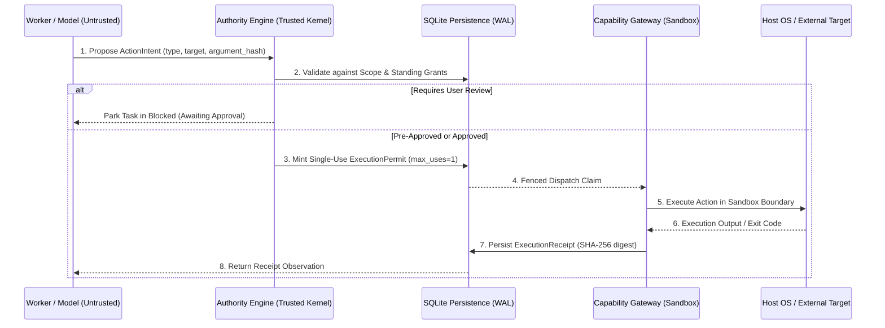

# Authority Engine & Capability Gateway

> **Classification:** Core Architectural Pillar  
> **Source of Truth:** Authoritatively defined in [Custos Master Specification](../../Custos.md) (Part 4).  
> **Architecture Hub:** See [Custos Architecture Overview](README.md).

Custos enforces a strict tripartite separation of concerns for all side effects: **Proposal vs Decision vs Effect**. Models and workers are granted zero ambient authority; every interaction with the host environment must be vetted by the Authority Engine and executed via the Capability Gateway under a cryptographically signed permit.

---

## 1. The Core Authorization Model



### 1.1 ActionIntent
An unprivileged proposal submitted by a reasoning worker. It declares:
- `action_type`: Category of effect (e.g., `file_patch`, `shell_exec`, `network_egress`).
- `target_resource`: Exact filesystem path or endpoint.
- `argument_digest`: SHA-256 hash of all invocation parameters.
- `rationale`: Declared reasoning for the action.

An `ActionIntent` possesses zero execution capability.

### 1.2 ExecutionPermit
A cryptographically verifiable capability minted exclusively by the Trusted Kernel:
- Valid for exactly one invocation (`max_uses = 1`).
- Strictly bound to the exact `argument_digest` (any parameter mutation voids the permit).
- Enforces an immutable expiration deadline (`expires_at`).
- Binds to a specific `task_id` and authorized worker identity.

### 1.3 ExecutionReceipt
An immutable proof record emitted after physical execution:
- Captures output content digest (`output_digest`), duration in milliseconds, exit status, and error logs.
- Persisted durably in SQLite and CAS before results are communicated back to workers.

---

## 2. Invocation-Bound Capability Tokens (IBCT) & Delegation Diminishment

In multi-agent or hierarchical sub-task configurations, authority propagation follows the mathematical principle of **Delegation Diminishment**:

$$\text{Scope}(\text{ChildTask}) \subset \text{Scope}(\text{ParentTask})$$

An authorized capability delegated to an ephemeral child worker is represented as an **Invocation-Bound Capability Token (IBCT)**:

```rust
pub struct InvocationBoundToken {
    pub token_id: Uuid,
    pub parent_task_id: TaskId,
    pub granted_actor: ActorId,
    pub permitted_actions: HashSet<ActionType>,
    pub resource_boundary: PathBuf,
    pub chain_depth: u8,
    pub max_chain_depth: u8,
    pub expires_at: chrono::DateTime<chrono::Utc>,
    pub signature: TokenSignature,
}
```

### Delegation Rules:
1. **Monotonic Narrowing:** A child agent can never be granted broader filesystem access, higher token budgets, or looser network access than its parent.
2. **Depth Bounding:** Every delegation increments `chain_depth`. When `chain_depth >= max_chain_depth` (default: 2), further delegation is rejected.
3. **No Downstream Elevation:** If a parent task operates under `LocalOnly = true`, every child agent unconditionally inherits `LocalOnly = true`.

---

## 3. Confused Deputy Attack Prevention

In agentic systems, a Confused Deputy vulnerability arises when an untrusted external entity (e.g., an indirect prompt injection from a scanned file or web page) tricks an authorized agent into exercising its legitimate tools for malicious ends.

Custos mitigates this vulnerability through three structural defenses:

1. **Origin Taint Binding:** Arguments derived from untrusted inputs carry the `Taint::Untrusted` label. The Authority Engine automatically denies permit minting for untrusted data without interactive human confirmation.
2. **Exact Parameter Hashing:** Permits are never issued for generalized tool classes (e.g., "allow bash commands"). A permit is valid solely for the exact, byte-for-byte SHA-256 hash of the command string.
3. **Sandbox Worktree Confinement:** File modifications cannot escape the isolated Git worktree. System configuration files (`~/.ssh`, `~/.bashrc`, `/etc/`) are mounted read-only or masked completely.

---

## 4. Multi-Tiered Sandbox Defense

Physical mutations are executed inside an OS-enforced capability sandbox:

| Operating System | Sandboxing Technology | Isolation Guarantees |
|---|---|---|
| **All Platforms** | Dedicated Git Worktree (`isolated_worktree`) | Filesystem mutations never touch the primary working branch directly. |
| **macOS** | Apple Sandbox / Seatbelt Profiles | Process restricted from network egress and paths outside worktree. |
| **Linux** | Bubblewrap (`bwrap`) + Unprivileged Namespaces | Mount namespace isolation, PID isolation, network namespace lockdown. |
| **Fallback** | Process Isolation + Path Traversal Traps | Canonical symlink resolution, working directory pinning, exit code monitoring. |
