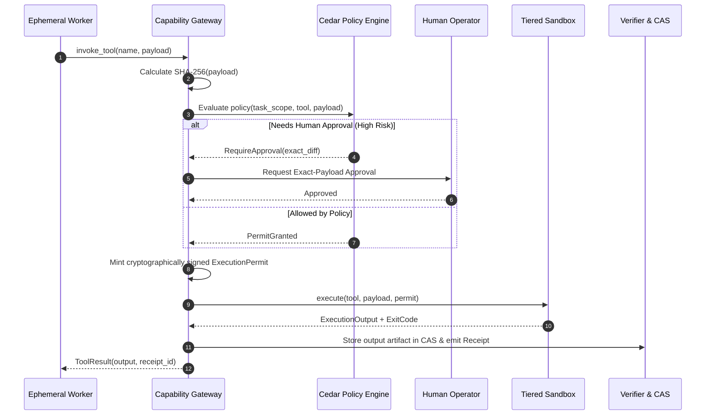

# Cổng Kiểm Soát Năng Lực (Capability Gateway & Sandboxing)

> **Status:** Canonical Baseline v4.0  
> **Source:** Phần IX (§27-29) & Phần VII (§58) Canonical Specification

Capability Gateway là ranh giới bảo mật tối cao của Custos, thực hiện nguyên lý: **Tuyệt đối không thực thi trực tiếp (Zero Direct Execution)**. Mọi thao tác đọc/ghi tệp tin, chạy lệnh shell hoặc gọi mạng đều phải đi qua cổng này.

---

## 1. Cơ Chế Giấy Phép Thực Thi (ExecutionPermit)

Mỗi hành động có tác động ngoại cảnh (*side effect*) đều bắt buộc phải sở hữu một giấy phép `ExecutionPermit` hợp lệ trước khi được đưa vào sandbox.

```rust
pub struct ExecutionPermit {
    pub permit_id: Uuid,
    pub task_id: TaskId,
    pub tool_name: String,
    pub payload_hash: Sha256Hash,  // Mã băm SHA-256 của toàn bộ tham số lệnh
    pub granted_authority: AuthorityLevel,
    pub valid_from: DateTime<Utc>,
    pub expires_at: DateTime<Utc>,  // Hạn sử dụng nghiêm ngặt (TTL)
    pub single_use: bool,          // Sử dụng một lần duy nhất
    pub signature: Vec<u8>,        // Chữ ký mật mã của Task Kernel
}
```

---

## 2. Quy Trình Gọi Công Cụ Chuẩn Xác (Tool Execution Sequence)



---

## 3. Tích Hợp Chính Sách Cedar (Cedar Policy Integration)

Custos sử dụng ngôn ngữ chính sách bảo mật **Cedar** (từ AWS/Linux Foundation) để xác thực phân quyền nhanh gọn và an toàn:

```cedar
// Cho phép đọc mã nguồn trong thư mục workspace được chỉ định
permit(
    principal == Custos::Worker::"engineering.explorer",
    action == Custos::Action::"ReadFile",
    resource in Custos::Workspace::"active_task_worktree"
);

// Cấm tuyệt đối can thiệp vào thư mục .git gốc hoặc tệp cấu hình hệ thống
forbid(
    principal,
    action in [Custos::Action::"WriteFile", Custos::Action::"DeleteFile"],
    resource in Custos::Path::"**/.git/**"
);
```

---

## 4. Tích Hợp Giao Thức Công Cụ MCP (Model Context Protocol)

Custos tích hợp thư viện chính thức **`modelcontextprotocol/rust-sdk`** tại tầng Capability Gateway:
- **MCP chỉ nằm ở ranh giới ngoài:** Chỉ dùng để kết nối với các công cụ bên ngoài (PostgreSQL, GitHub API, Web search).
- **Không dùng MCP nội bộ:** Giao tiếp nội bộ giữa các module của Custos sử dụng Rust typed contracts trực tiếp để đảm bảo hiệu năng và tính toàn vẹn kiểu dữ liệu.
