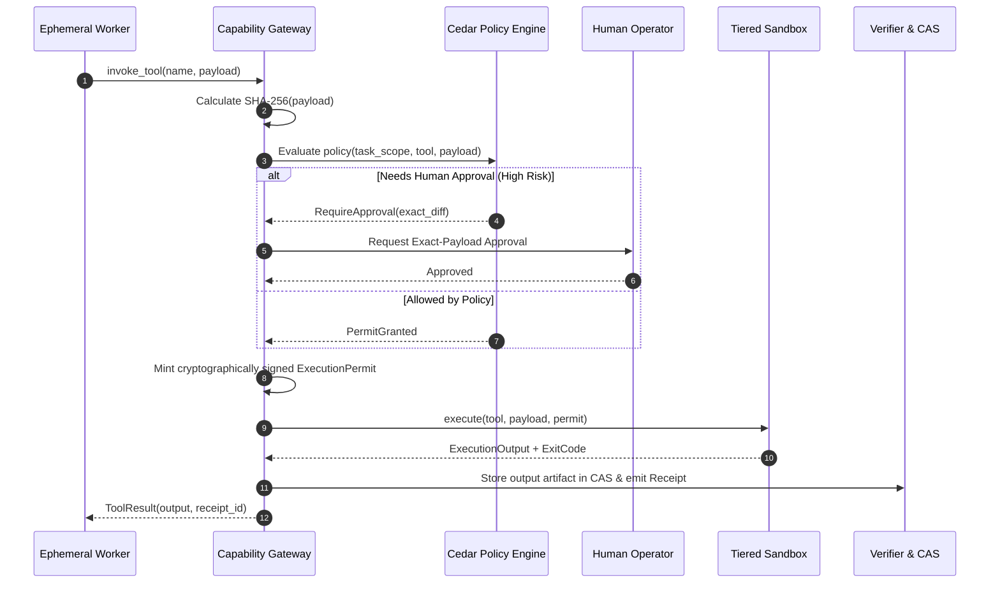

# Capability Gateway & Sandboxing

> **Status:** Canonical Baseline v4.0  
> **Source:** Part IX (§27-29) & Part VII (§58) Canonical Specification

The Capability Gateway enforces Custos's supreme security invariant: **Zero Direct Execution**. All file system operations, shell executions, and network egress calls must traverse this gateway.

---

## 1. ExecutionPermit Mechanism

Every action with external side effects must hold a valid `ExecutionPermit` prior to execution inside a sandboxed environment.

```rust
pub struct ExecutionPermit {
    pub permit_id: Uuid,
    pub task_id: TaskId,
    pub tool_name: String,
    pub payload_hash: Sha256Hash,  // SHA-256 digest of complete execution payload
    pub granted_authority: AuthorityLevel,
    pub valid_from: DateTime<Utc>,
    pub expires_at: DateTime<Utc>,  // Strict TTL expiry
    pub single_use: bool,          // Enforces single-use execution
    pub signature: Vec<u8>,        // Cryptographic signature from Task Kernel
}
```

---

## 2. Tool Execution Sequence



---

## 3. Cedar Policy Integration

Custos adopts the **Cedar** policy language (AWS / Linux Foundation) for deterministic, sub-millisecond authorization:

```cedar
// Permit source read access within designated active worktree
permit(
    principal == Custos::Worker::"engineering.explorer",
    action == Custos::Action::"ReadFile",
    resource in Custos::Workspace::"active_task_worktree"
);

// Strictly forbid direct mutations to the root .git directory or system config
forbid(
    principal,
    action in [Custos::Action::"WriteFile", Custos::Action::"DeleteFile"],
    resource in Custos::Path::"**/.git/**"
);
```

---

## 4. Model Context Protocol (MCP) Integration

Custos integrates the official **`modelcontextprotocol/rust-sdk`** strictly at the Capability Gateway boundary:
- **MCP at the Outer Boundary:** Used exclusively to bridge external tools and servers (PostgreSQL, GitHub API, Web search).
- **Zero Internal MCP:** Internal inter-module communication uses native Rust typed contracts to maximize throughput and guarantee type safety.
