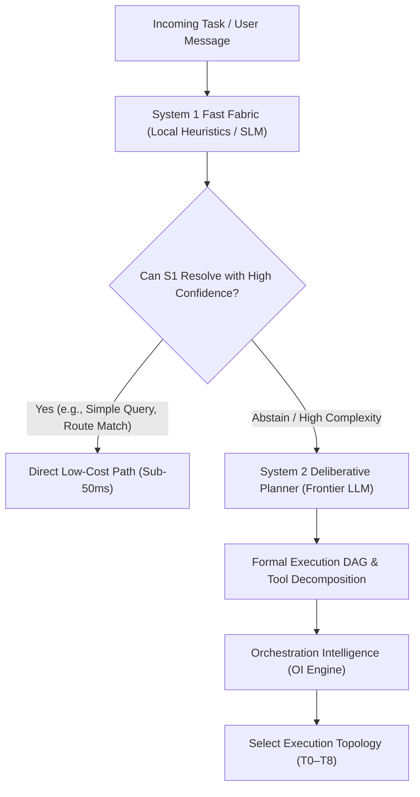

# Cognitive Fabric & Orchestration Intelligence

> **Classification:** Core Architectural Pillar  
> **Source of Truth:** Authoritatively defined in [Custos Master Specification](../../Custos.md) (Part 14).  
> **Architecture Hub:** See [Custos Architecture Overview](README.md).

Custos employs a hybrid cognitive architecture inspired by cognitive science (Dual-Process Theory / SOFAI-LM): blending low-latency, deterministic heuristics (System 1) with deep deliberative reasoning (System 2) to optimize operational efficiency, minimize financial expenditure, and prevent agent failure modes.

---

## 1. Fast vs Deliberative Cognition (SOFAI-LM)

### 1.1 System 1 (S1 Fast Fabric)
- **Engine:** Fast local rules, regex filters, tree-sitter symbol extractors, and small language models (SLMs).
- **Core Role:** Instant classification, intent triage, sensitivity tagging, and heuristic routing.
- **Invariant:** S1 operates with a strict **`abstain`** capability. When confidence falls below calibration thresholds, it abstains and delegates upward to S2. S1 **never** issues execution permits or verifies task completion.

### 1.2 System 2 (S2 Deliberative Planner)
- **Engine:** Frontier reasoning models (Claude, OpenAI Codex).
- **Core Role:** Deep problem decomposition, complex bug localization, multi-file code synthesis, and hypothesis generation.
- **Invariant:** S2 proposes code changes as unprivileged `ActionIntent` proposals. It cannot mark its own work as complete.

---

## 2. The Nine Canonical Orchestration Topologies (T0–T8)

Custos avoids hardcoding multi-agent complexity. The OI Engine dynamically routes work to the most economical topology capable of satisfying task constraints:

| Topology | Name | Structural Pattern | Ideal Use Case |
|---|---|---|---|
| **T0** | **Direct Model** | User $\rightarrow$ Single Model streaming response. | Explanations, Q&A, syntax checks, conversational queries. |
| **T1** | **Single Worker** | Single autonomous agent in an isolated worktree. | Focused bug fixes, single-file edits, unit test generation. |
| **T2** | **Sequential Pipeline** | Explorer $\rightarrow$ Patcher $\rightarrow$ Verifier. | Standard software engineering workflow with clear handoffs. |
| **T3** | **Fan-Out / Map** | Coordinator partitions task across parallel workers. | Multi-crate audits, broad test suite execution, mass migration. |
| **T4** | **Hierarchical** | Lead Architect delegates to Domain Specialists. | Complex multi-tier refactorings across frontend and backend. |
| **T5** | **Competitive / Debate**| Two workers produce alternative patches; judge scores. | High-risk algorithmic optimization, critical security fixes. |
| **T6** | **Human-in-the-Loop** | Autonomous execution pausing at critical gates for sign-off. | Production migrations, database schema updates, cloud deployment. |
| **T7** | **Bidding / Market** | Dynamic capability routing based on worker availability. | Distributed heterogeneous local clusters and specialized harnesses. |
| **T8** | **Cross-Pack Federated**| Engineering, Research, and Assistant packs coordinate. | Paper-to-code implementations, dataset audit and model training. |

> **Single Model First-Class Invariant (`INV-10`):**  
> T1 (Single Worker) is the baseline standard. Multi-worker topologies (T2–T8) are only invoked when empirical metrics prove they deliver measurably superior quality that justifies increased latency and token cost.

---

## 3. Agent Pathology Detection & Mitigation

Autonomous agentic systems frequently suffer from systemic failure modes (pathologies). Custos implements hard architectural mitigations for each:

| Agent Pathology | Observable Symptom | Custos Detection & Mitigation |
|---|---|---|
| **Infinite Tool Loop** | Agent calls the same tool repeatedly with identical or oscillating parameters. | **Argument Hash History:** The runtime tracks the last 5 `argument_digest` values; duplicates trigger backoff and require human intervention. |
| **Silent Spec Tampering**| Agent edits test fixtures to make failing tests pass artificially. | **Anti-Tampering Invariant:** Modifying existing test files without explicit permit raises `Failed(TestTamperingDetected)`. |
| **Cascading Hallucination**| Error in step 1 propagates and corrupts steps 2 through 10. | **Step-Level Verification Gate:** Each step must produce verified receipts before next DAG node executes. |
| **Scope Creep / Drifting**| Agent begins refactoring unrelated files outside the prompt. | **TaskScope Invariant:** Writes outside the authorized file whitelist are trapped and rejected at Layer 1. |
| **Sycophancy** | Model agrees with a user's incorrect assertion rather than reporting truth. | **Empirical Grounding:** Claims require physical test receipts or AST anchors; verbal consensus is discarded. |

---

## 4. Offline Meta Engine

The **Meta Engine** operates entirely offline during daemon idle cycles:
- Analyzes past task execution traces, token costs, and verifier pass ratios.
- Calibrates System 1 heuristic thresholds using Brier scores and Expected Calibration Error (ECE).
- Generates optimization suggestions (`PolicyProposal`).

**Core Governance Invariant:**  
The Meta Engine **never** automatically applies new policies to the runtime. All policy modifications require human developer review and check-in to version control.
