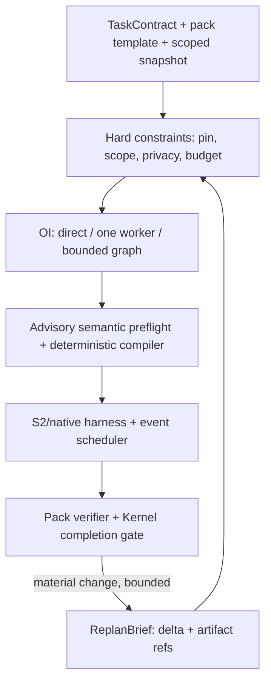

# Cognitive Fabric & Orchestration Intelligence

[SADE design](sade-design-and-supervision.md) defines product supervision and three distinct loops: worker execution, Task coordination, offline improvement. Each delegation branch has one orchestration owner. S1 can contribute bounded domain work, not only routing, while S2/native reasoning is preserved. Predicting failure risk and predicting a collaboration protocol's incremental value require separate evaluation; a low confidence score alone does not justify fan-out.

**Workspace integration:** [UI/runtime behavior](agent-workspace-and-ui.md) and [migration plan](../development/workspace-restructuring-plan.md) map OI decisions to visible runs, candidate comparison, execution workspaces and domain artifacts. OI stays in runtime, not a new ADE shell/client crate. Skill/context adaptation is defined in [capability ownership](capability-catalog-and-skills.md); it must preserve native S2 reasoning and declare unsupported harness features.

> **Classification:** Target architecture, not an implementation claim. **Source of truth:** [Custos.md, Part 14](../../Custos.md#phần-14-orchestration-intelligence-oi-s1-s2-meta). **Physical code map:** [codebase architecture](../development/codebase-architecture.md).

OI chọn **chiến lược thực thi trong TaskContract**, không là LLM planner thường trực. Direct hoặc một worker/native coding harness mạnh là baseline first-class; các graph phức tạp chỉ bật khi có lợi ích và điều kiện kiểm được. S1 đưa typed hint có `abstain`; S2/harness sở hữu reasoning sâu; scheduler chạy theo event; Kernel/Authority giữ quyền; verifier và completion gate sở hữu evidence status. Cảm hứng fast/slow từ [SOFAI-LM](https://arxiv.org/abs/2508.17959) không biến cheap-first cascade thành luật cho mọi Task.

---

## 1. Ranh giới Human, OI, S1, S2, scheduler và Kernel



| Thành phần | Trách nhiệm | Không được làm |
|---|---|---|
| Human/TaskContract | Goal, criterion, scope, pin, grant, revoke, waiver | Sửa receipt lịch sử thành pass. |
| Pack | Template, artifact, verifier obligations và context recipe | Cấp permit. |
| S1 | Judgment/scout hẹp có source, version, deadline và abstain | Quyết định an ninh hoặc criterion pass. |
| OI | Chọn route/model/harness/topology và budget reservation trong policy | Nới scope/pin, ép executor rẻ, tự công nhận success. |
| S2/native harness | Suy luận, tool loop, patch/brief/draft và action proposal | Grant hoặc nghiệm thu chính mình. |
| Compiler/scheduler | Structural checks, ready frontier, lease/cancel/retry và replan triggers | Chứng minh decomposition đúng ngữ nghĩa. |
| Authority/gateway | Recheck permit/effect và receipt/reconcile | Chọn topology theo utility. |
| Verifier/Kernel | Evidence theo criterion/source revision; completion gate | `error/unknown → pass`. |
| Meta offline | Đo và đề xuất policy version | Tự áp policy mới lên Task đang chạy. |

Native Codex/Claude/Goose có thể tự sở hữu worktree, tool loop và hidden state. OI chỉ điều phối ở mức adapter quan sát/điều khiển được; native tools ngoài Custos không tự thành `custos-mediated`. Một harness mạnh làm trọn refactor nhiều file là lựa chọn hợp lệ.

**Đối chiếu source OrCa:** [source study](../development/orca-source-study.md) ghi OrCa đã có Run/Task/Dispatch, dependency promotion, atomic worker claim, gates, mailbox và recovery. [`Coordinator.decompose()`](../../../orca/src/main/runtime/orchestration/coordinator.ts) hiện yêu cầu tasks được tạo trước; [orchestration skill](../../../orca/skill-guides/orchestration.md) cho agent coordinator phân rã rồi tạo chúng. Custos không nên gộp semantic decomposition, DAG compilation, scheduling và native-agent child planning thành một “OI agent” mơ hồ. `PlanProposal` do S2/S1/human tạo; deterministic compiler kiểm scope/deps/budget; scheduler nhận graph revision đã accepted; native harness có thể sở hữu toàn bộ reasoning nội bộ của **một** WorkerRun. Điểm khác biệt phải đo là domain verification/cost/effect truth, không chỉ số agent chạy song song.

---

## 2. Chọn route trước khi chạy

```text
TaskContract + scoped source snapshot + pack template
  → hard constraints: pin / local-only / egress / scope / capability / budget
  → candidates: direct | one worker | bounded sequential | independent parallel
  → D0 rules/template | D1 bounded planning | D2 strong planning nếu thật cần
  → semantic preflight (advisory) + deterministic compiler
  → versioned RoutePlan + run
```

`D0/D1/D2` là **mức đầu tư cho planning**, không phải class của executor. D0: query hẹp hoặc template đã biết. D1: nhiều bước có dependency/handoff thật. D2: decomposition khó do coupling, thiếu criterion, migration/data risk, research mâu thuẫn hoặc effect tác động lớn. D2 không tự chọn executor rẻ; model/harness pin của user là hard constraint. Nếu chưa có calibration cho task slice, giữ one-worker baseline và báo `unknown` thay vì bịa `P(success)`.

`RoutePlan` đích phải lưu Task/workflow/source/policy version; chosen candidate và alternatives hợp lệ; hard-filter outcomes; model/harness/capability và assurance; verifier obligations; range chi phí/latency, deadline, max calls/branches/replans; lý do chọn route và lý do không chọn single worker. Route không cấp grant. Assist hot path không ép S1, planner LLM hoặc cascade tuần tự vào time-to-first-useful-output.

**Hai mức kiểm plan khác nhau:** `SemanticPreflight` của pack/S2 nêu criterion bị bỏ, assumption thiếu source, node không thể kiểm, coupling, privacy và write conflict. Nó tạo finding có provenance/uncertainty, **không** chứng minh semantic correctness. `PlanCompiler` tất định kiểm schema/version, artifact input/output edges, missing dependency/cycle, source/egress scope, capability, budget, effective write set, effect ordering, evidence obligations và fan-out cap; chạy một lần **mỗi workflow revision**, không sau mỗi tool call. Compile pass vẫn không chứng minh lời giải đúng. [AdaptOrch](https://arxiv.org/html/2602.16873v1) cho ý tưởng DAG/coupling nhưng paper nêu decomposition kém lan lỗi xuống các pha sau và coupling estimate rời rạc.

## 3. Các họ topology và vai trò pack

Không chuẩn hóa chín tên `T0–T8` thành API. Human approval và verifier là barrier/obligation có thể cắm vào nhiều topology; cross-pack là typed artifact edge, không phải một topo thứ chín.

| Họ | Ví dụ | Gate |
|---|---|---|
| Direct | Repo/PDF question có locator, draft ngắn | Scope, egress, freshness. |
| One worker / native harness | Bugfix, refactor nhiều file, paper synthesis | Baseline first-class; giữ deep reasoning/tool loop; verify theo criterion. |
| Bounded sequential | Explore → patch → trusted test; acquire → claims → synthesis | Handoff schema/version, stop rule, context-transfer cost. |
| Parallel read-only | Đọc module hoặc tìm nguồn độc lập | Source/privacy scope, dedup và reconcile join. |
| Parallel writes | Module **thật sự** disjoint | Effective path/symlink check, base hash, worktree, merge + integration test. |
| Hierarchical/competitive | Opt-in slice chứng minh lợi ích | Bounded branches, independent verifier; vote không là truth. |

Không suy independence từ số file/node. Shared API, generated files, migration, test fixture và source version tạo coupling; worktree tách working tree/branch chứ không phải OS sandbox. Song song chỉ đáng dùng nếu lợi ích vượt planning, context transfer, merge, extra verification và retry.

- **Engineering:** single strong coding harness xử lý refactor lớn là hợp lệ. Scout read-only hoặc verifier độc lập chỉ thêm khi giúp localization/evidence. Agent-authored test không thay trusted baseline/reviewer. Replan khi giả định/reproducer sai hoặc acceptance còn thiếu.
- **Research:** một tài liệu nhỏ dùng single reader; literature map có thể fan-out acquisition/screen rồi reconcile atomic claims, contradictions, original-source support. Nhiều agent đồng ý không biến claim thành verified.
- **Assistant:** gather/read có thể song song, draft thường một worker; external write qua exact target/payload authorization và receipt, serial barrier khi cần. Timeout sau send là `uncertain`, không tự gửi lại.
- **Cross-pack:** ResearchBrief → EngineeringSpec → AssistantDraft là artifact edge của một Task nếu cùng goal; source/privacy/redaction/consent đi cùng handoff, grant không đi theo.

## 4. Event-driven execution, replan và verification

Scheduler xử lý `node_ready`, `worker_output`, `source_changed`, `verifier_result`, `budget_low`, `provider_unavailable`, `approval_changed`, `effect_uncertain`, `human_revision`. Retry của lỗi tạm thời dùng policy bounded riêng; không gọi planner sau mỗi lỗi/tool call/token. Chỉ replan nếu thay đổi **material** có thể làm future plan sai: assumption bị bác, thiếu criterion, source drift, lỗi lặp chạm cap, model/harness mất khả dụng, budget không đủ hoặc human revise.

`ReplanBrief` đích chứa `task_revision`, `workflow_revision`, affected/future nodes, failed assumptions + evidence refs, criterion statuses, source changes, remaining budget, pending approval/uncertain effect, artifact refs và privacy label. Planner có thể truy hồi snapshot có chọn lọc trong scope; không mặc định gửi toàn transcript. Replan tạo workflow revision có diff/actor/reason/cost; chỉ đổi future nodes. `dispatching/uncertain` effect phải reconcile trước khi đề xuất gửi lại; không nới grant/reset budget. Khi hết cap, Task thành `limited/blocked` và hỏi human.

`pass|fail|unknown|stale` thuộc verifier record; `waived` là quyết định human riêng. Verifier lỗi, source/receipt thiếu, hoặc agent sửa oracle → `unknown`/`stale`/review, không `pass`. Test exit 0 chỉ là operational fact; research claim cần support trên source/version; assistant external effect cần receipt/reconcile. [Zeph PR #2235](https://github.com/bug-ops/zeph/pull/2235) mô tả verifier error paths fail-open **trong PR đó**; không mang semantics này vào Custos, cũng không suy ra current Zeph vẫn vậy.

[Phân tích ITBench–MAST của IBM/UC Berkeley](https://huggingface.co/blog/ibm-research/itbenchandmast) thấy incorrect verification gắn mạnh với failure trên 310 SRE traces; đây là lý do tạo failure fixtures cho Custos, không phải định luật cho ba pack.

## 5. S1 mạnh đúng chỗ mà không làm yếu S2

S1 có thể chạy trước/trong/sau worker theo question manifest, source/permission filter, deadline, method/version và `abstain`. `Judge` hỗ trợ relevance, test selection, ambiguity, log clustering; `Scout` tạo locator read-only; `MicroExecutor` chỉ opt-in cho transform hẹp có output kiểm độc lập. S1 không được hỏi mỗi tool call, không dùng risk score làm permit, không tự pass patch do nó sinh ra. Native harness tiếp tục suy luận/tool loop liền mạch; S1 là hint/artifact có thể bác, không phải manager bắt S2 giải thích từng bước.

## 6. Cost ledger, Meta và gate bật mặc định

**Implementation contract:** cost policy thuộc core; route estimator thuộc runtime; durable reservations/usage thuộc persistence; clients chỉ hiển thị projections. [Plan §13](../development/workspace-restructuring-plan.md#13-cost-core-policy-estimator-ledger-và-projections) xác định identity/currency/unknown/overage/recovery và sequence reserve → dispatch → settle. Nối ledger cùng live baseline từ đầu, không đợi OI tối ưu. Giá thấp của một call không dự báo total accepted-task cost.

**Current-source caveat:** `oi/candidate_builder.rs` còn candidates hardcoded, estimator còn constants và selector chọn first admissible; `workflow/worker_executor.rs` sinh simulated outputs với fixed tokens/cost. Test `oi_engine_slice` xác nhận mechanics, chưa là calibrated optimization. Gia cố capability inventory/pin/constraints và real leaf-attempt measurements trước thay candidate selection bằng utility estimator. Không tự downgrade worker khi lacks data.

Ledger ghi **từng attempt** và attribution `plan|execute|handoff|verify|retry|replan`; tổng USD là actual billed model + paid tools, không cộng lại retry đã nằm trong attempts. Báo local compute estimate, human minutes và unknown usage riêng; p50/p95 time-to-first-useful-output/end-to-end và thời gian chờ approval riêng. Cost per accepted Task lấy **chi phí của mọi attempted Task** chia accepted Tasks, kèm completion rate/failure spend để không che việc khó. Local model có thể billed USD = 0 nhưng compute/latency không bằng 0.

Meta offline dùng outcome/evidence redacted để hiệu chuẩn theo pack/task kind/hardware/provider/harness, chỉ **đề xuất** policy version. Human review trước publish; Task đang chạy giữ version cũ trừ revision hợp lệ. Shadow/canary tốn tiền và có thể egress nên cần consent, không mặc định lấy 5% traffic.

**Bật default chỉ sau paired eval** cùng Task/source/tool/verification stack so với strong single-worker baseline. Chọn trước quality noninferiority margin theo pack; báo accepted criteria, false pass, unauthorized effect, spend kể cả retries, handoff/replan count, p50/p95 latency và human minutes; phân cold/warm cache, local/cloud, native/mediated. CI chất lượng chưa đạt hoặc mẫu ít → `inconclusive`, giữ baseline hoặc opt-in. [Free-Executor Paradox](https://github.com/kenimo49/free-executor-paradox), [MAST](https://arxiv.org/html/2503.13657v3) và [AgentRouter](https://arxiv.org/pdf/2609.22951) cho giả thuyết/fixtures, không phải Custos metrics.

## 7. Vị trí code và lộ trình hiện thực

Không tạo `oi/` hay crate planner mới chỉ vì tài liệu này. Map vào ranh giới hiện hữu sau audit:

| Trách nhiệm đích | Vị trí | Trạng thái cần hiểu đúng |
|---|---|---|
| Domain Task/Workflow/criterion/route DTO thuần | `crates/custos-domain/src/` | Chỉ thêm type tối thiểu cùng fixture/version khi flow thật cần. |
| Hard policy, budget/evidence/authority | `crates/custos-core/src/` | OI không sở hữu grant/permit. |
| Signals, arbiter, provider selection | `crates/custos-runtime/src/cognitive/` | Có code routing/arbiter; chưa chứng minh OI calibrated route end-to-end. |
| Plan compilation, scheduler, lease/replan | `crates/custos-runtime/src/workflow/` | Có machine/scheduler; không đồng nghĩa đã có typed compiler/replan. |
| S2 loop, native harness | `crates/custos-runtime/src/agent/`, `crates/custos-adapters/` | ModelPort khác AgentRuntimePort; assurance theo call path thật. |
| Pack template và verifier obligation | `crates/custos-packs/` + declarative pack files | Pack không mang policy quyền. |
| Ledger, evidence, eval | `crates/custos-persistence/`, `evals/` | Canonical DB owner; Meta đọc trace redacted. |
| Wiring, API, UI | `crates/custos-daemon/`, `crates/custos-bridge/`, clients | Client không ghi DB hoặc mint permit. |

Thứ tự: audit execution spine `exists/partial/absent` → instrument strong single baseline và ledger → D0 templates/hard filter/verifier → compiler + bounded sequential → event-driven replan → thử parallel/S1/D1/D2 theo pack → Meta offline và ablation. Không gọi kiến trúc đích là implemented trước e2e test và benchmark.
