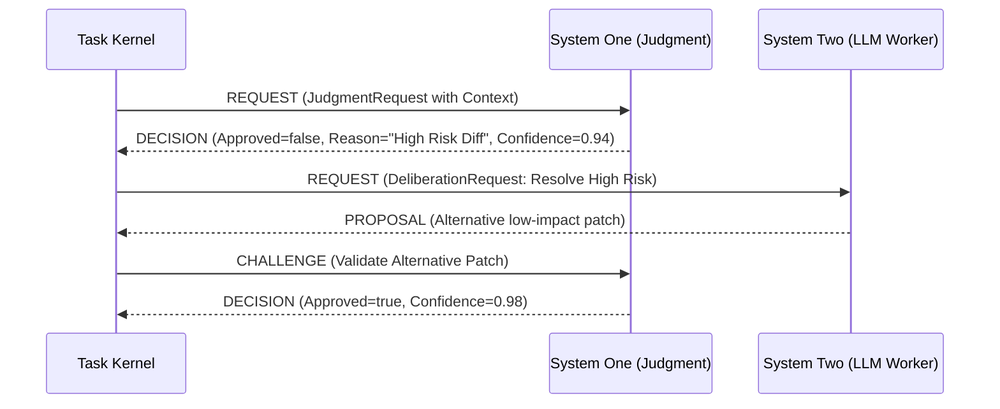

# Hạ Tầng Nhận Thức & Phán Đoán (Cognitive Control Fabric)

> **Status:** Canonical Baseline v4.0  
> **Source:** Phần III (§15), Phần V (§15-17) & Phần VII (§48) Canonical Specification

Cognitive Control Fabric (CCF) là kiến trúc điều khiển nhận thức của Custos, hiện thực hóa nguyên tắc **phân tách rõ rệt giữa Phán đoán nhanh (System One) và Suy luận sâu (System Two)**.

---

## 1. Triết Lý System One vs System Two

Theo lý thuyết nhận thức, trí thông minh con người hoạt động ở hai chế độ: phản xạ nhanh bản năng (System One) và suy nghĩ tính toán logic chậm (System Two). Custos áp dụng nguyên lý này vào kiến trúc phần mềm:

| Đặc tính | System One (Judgment Fabric) | System Two (Deliberation Fabric) |
|---|---|---|
| **Bản chất** | Phán đoán phản xạ, lọc quy tắc, đánh giá rủi ro | Suy luận logic sâu sắc, sinh mã nguồn, lập kế hoạch |
| **Mô hình triển khai**| Deterministic Rules, Local SLMs, Jev, Shadow models | Large Language Models (Claude 3.7 Sonnet, OpenAI Codex) |
| **Độ trễ** | Rất nhanh: $10 - 200	ext{ ms}$ | Chậm: $2 - 60	ext{ giây}$ |
| **Chi phí** | $0$ hoặc siêu rẻ ($< 0.0001	ext{ USD}$/lần) | Tốn kém ($0.01 - 0.50	ext{ USD}$/lần) |
| **Đầu ra** | Boolean, Phân loại lựa chọn, Điểm số tin cậy | Kế hoạch văn bản, Mã nguồn, Phân tích kiến trúc |
| **Quyền hạn** | **Tuyệt đối không cấp quyền hành động** | Đề xuất hành động cần kiểm tra |

---

## 2. Năm Phép Phán Đoán Cơ Bản (5 Judgment Primitives)

System One được chuẩn hóa thành 5 phép toán cốt lõi thông qua kho câu hỏi định chuẩn (*Question Registry*):

1. `ShouldProceed(context, step)`: Đánh giá liệu bước đi tiếp theo có đủ điều kiện an toàn và ngữ cảnh để tiến hành hay không.
2. `NeedsClarification(intent, input)`: Phát hiện sự mơ hồ, thiếu sót thông tin hoặc yêu cầu không đầy đủ từ người dùng trước khi tiêu tốn tài nguyên.
3. `EscalateApproval(action, risk_tier)`: Quyết định xem một hành vi có vượt ngưỡng an toàn và bắt buộc phải leo thang xin phê duyệt của con người hay không.
4. `AssessRisk(diff, command)`: Chấm điểm rủi ro của một đoạn mã vá hoặc một câu lệnh shell (Low, Medium, High, Critical).
5. `ProbeInvariant(state, proposal)`: Kiểm tra xem hành động đề xuất có vi phạm bất kỳ System Invariant nào hay không.

---

## 3. Giao Thức RDC (Request-Decision-Challenge)

Mọi trao đổi giữa Task Kernel, System One và System Two đều tuân theo hợp đồng giao thức **RDC**:



- **Request:** Mang dữ liệu ngữ cảnh tối giản, mã định danh câu hỏi từ Question Registry và các ràng buộc.
- **Decision:** Trả về kết luận rõ ràng kèm điểm tin cậy (*confidence score*) và lý giải ngắn gọn.
- **Challenge:** Cơ chế phản biện ngược (*Reflexive Challenge*): cho phép kiểm tra chéo các giả định sai lầm của worker trước khi commit.

---

## 4. Kiến Trúc Pluggable System One (Mục 48)

System One trong Custos không phải là một mô hình đơn lẻ độc quyền, mà là **hạ tầng cắm ghép đa backend (Pluggable Multi-backend Architecture)** với 4 tầng thực thi:

```text
┌─────────────────────────────────────────────────────────────┐
│                   System One Router                         │
├─────────────────────────────────────────────────────────────┤
│ Tier 1: Deterministic Engine (Zero cost, regex, AST rules)  │
├─────────────────────────────────────────────────────────────┤
│ Tier 2: Local SLM (Llama-3-8B / Qwen-2.5 on llama.cpp)      │
├─────────────────────────────────────────────────────────────┤
│ Tier 3: Hosted Judgment Engine (TypeSafe Jev API adapter)   │
├─────────────────────────────────────────────────────────────┤
│ Tier 4: Shadow Evaluation & Calibration Harness             │
└─────────────────────────────────────────────────────────────┘
```

### Rust Trait Interface: `JudgmentPort`

```rust
use async_trait::async_trait;
use serde::{Deserialize, Serialize};

#[derive(Debug, Clone, Serialize, Deserialize)]
pub struct JudgmentRequest {
    pub question_id: String,
    pub question_version: u32,
    pub context_summary: String,
    pub candidate_actions: Vec<String>,
}

#[derive(Debug, Clone, Serialize, Deserialize)]
pub struct JudgmentDecision {
    pub decision_id: String,
    pub selected_outcome: String,
    pub confidence_score: f32, // 0.0 to 1.0
    pub rationale: String,
    pub requires_escalation: bool,
}

#[async_trait]
pub trait JudgmentPort: Send + Sync {
    /// Thực hiện phán đoán nhanh có cấu trúc
    async fn judge(&self, req: &JudgmentRequest) -> Result<JudgmentDecision, JudgmentError>;
    
    /// Thẩm định lại giả định bằng cơ chế phản biện
    async fn challenge(&self, proposal: &str, invariant: &str) -> Result<bool, JudgmentError>;
}
```

> [!IMPORTANT]
> **Nguyên tắc bất di bất dịch:** `Confidence không bao giờ tạo Capability`. Dù System One trả về độ tin cậy $0.999$, điểm số này chỉ dùng để quyết định đường đi logic, không bao giờ được dùng để tự động bypass cổng kiểm soát quyền hạn `Capability Gateway`.
