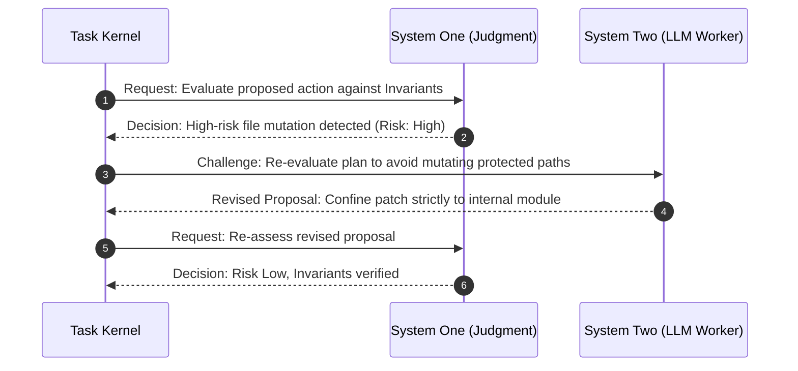

# Cognitive Control Fabric & Judgment Architecture

> **Status:** Canonical Baseline v4.0  
> **Source:** Part III (§15), Part V (§15-17) & Part VII (§48) Canonical Specification

The Cognitive Control Fabric (CCF) is Custos's cognitive control architecture, implementing the foundational principle of **strict bifurcation between Fast Reflection (System One) and Deep Deliberation (System Two)**.

---

## 1. System One vs System Two Philosophy

In cognitive theory, human intelligence operates across two modalities: fast heuristic reflex (System One) and slow deliberative reasoning (System Two). Custos applies this separation to agentic software engineering:

| Characteristic | System One (Judgment Fabric) | System Two (Deliberation Fabric) |
|---|---|---|
| **Nature** | Reflexive judgment, rule filtering, risk assessment | Deep logical reasoning, code synthesis, planning |
| **Implementation** | Deterministic Rules, Local SLMs, Jev, Shadow models | Frontier LLMs (Claude 3.7 Sonnet, OpenAI Codex) |
| **Latency** | Extremely fast: $10 - 200\text{ ms}$ | Slow: $2 - 60\text{ seconds}$ |
| **Cost** | Free or negligible ($< 0.0001\text{ USD}$ per call) | Expensive ($0.01 - 0.50\text{ USD}$ per call) |
| **Output** | Boolean flags, discrete choices, confidence scores | Natural language plans, source code, architecture diffs |
| **Authority** | **Strictly zero execution capability** | Proposes actions subject to gateway validation |

---

## 2. Five Core Judgment Primitives

System One is standardized into 5 core operators accessible via the Versioned Question Registry:

1. `ShouldProceed(context, step)`: Evaluates whether the next step satisfies safety invariants and context readiness.
2. `NeedsClarification(intent, input)`: Detects ambiguity, missing constraints, or underspecified inputs before consuming expensive compute.
3. `EscalateApproval(action, risk_tier)`: Determines whether an action crosses risk thresholds and requires human sign-off.
4. `AssessRisk(diff, command)`: Classifies the risk level of proposed file patches or shell commands (Low, Medium, High, Critical).
5. `ProbeInvariant(state, proposal)`: Probes whether a proposed action violates any declared System Invariant.

---

## 3. RDC Protocol (Request-Decision-Challenge)

All interactions between Task Kernel, System One, and System Two follow the **RDC** protocol contract:



- **Request:** Contains minimal scoped context, a question ID from the Question Registry, and constraints.
- **Decision:** Returns a deterministic outcome, calibrated confidence score, and concise rationale.
- **Challenge:** Reflexive challenge mechanism that cross-checks worker assumptions before committing state mutations.

---

## 4. Pluggable System One Architecture

System One in Custos is not a single proprietary model, but a **pluggable multi-backend architecture** operating across 4 execution tiers:

```text
+-------------------------------------------------------------+
|                   System One Router                         |
+-------------------------------------------------------------+
| Tier 1: Deterministic Engine (Zero cost, regex, AST rules)  |
+-------------------------------------------------------------+
| Tier 2: Local SLM (Llama-3-8B / Qwen-2.5 on llama.cpp)      |
+-------------------------------------------------------------+
| Tier 3: Hosted Judgment Engine (TypeSafe Jev API adapter)   |
+-------------------------------------------------------------+
| Tier 4: Shadow Evaluation & Calibration Harness             |
+-------------------------------------------------------------+
```

### Rust Trait Interface: `JudgmentPort`

```rust
use async_trait::async_trait;
use serde::{Deserialize, Serialize};

#[derive(Debug, Clone, Serialize, Deserialize)]
pub struct JudgmentRequest {
    pub question_id: String,
    pub question_version: u32,
    pub context_summary: String,
    pub candidate_actions: Vec<String>,
}

#[derive(Debug, Clone, Serialize, Deserialize)]
pub struct JudgmentDecision {
    pub decision_id: String,
    pub selected_outcome: String,
    pub confidence_score: f32, // 0.0 to 1.0
    pub rationale: String,
    pub requires_escalation: bool,
}

#[async_trait]
pub trait JudgmentPort: Send + Sync {
    /// Executes structured fast judgment
    async fn judge(&self, req: &JudgmentRequest) -> Result<JudgmentDecision, JudgmentError>;
    
    /// Cross-examines worker assumptions via reflexive challenge
    async fn challenge(&self, proposal: &str, invariant: &str) -> Result<bool, JudgmentError>;
}
```

> [!IMPORTANT]
> **Cardinal Invariant:** `Confidence never creates Capability`. Even if System One evaluates an action with $0.999$ confidence, this score purely guides decision routing and never bypasses the `Capability Gateway`.
