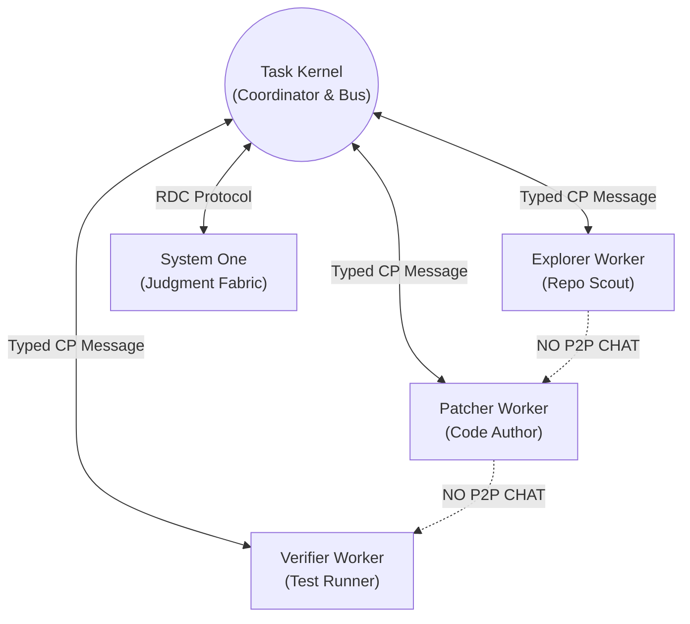

# Internal Communication & Protocols

> **Status:** Canonical Baseline v4.0  
> **Source:** Part VII (§21-23) & Part IV (§16-18, §20) Canonical Specification

Custos's internal communication architecture is governed by 3 principles: **Strongly-typed contracts**, **Non-blocking asynchronous messaging**, and a **Strict Star Topology**.

---

## 1. Star Topology Communication Model

Custos explicitly rejects free-form peer-to-peer agent chat loops (P2P Agent Chat) to prevent cascading hallucination loops and unconstrained token expenditures.



> [!NOTE]
> All inter-worker coordination occurs indirectly through the **Event Store** and verified **Artifacts** managed by the Kernel. Worker A completes a subtask and outputs an artifact; the Kernel receives, validates, and routes the artifact to Worker B.

---

## 2. Custos Protocol Envelope (CP Envelope)

All inter-module communication is wrapped inside a standardized typed **CP Envelope** formatted in JSON or YAML:

```yaml
envelope_version: "custos.cp.v1"
message_id: "msg_01J8N7A1B2C3D4E5F6G7H8J9K0"
correlation_id: "corr_01J8N7A1B2C3D4E5F6G7H8J9"
timestamp: "2026-09-21T21:45:00.123Z"

routing:
  sender: "custos:kernel:coordinator"
  recipient: "custos:worker:engineering.patcher:subtask_42"
  reply_to: "custos:kernel:inbox"

metadata:
  task_id: "tsk_01J8N6Z8K9M0P1Q2R3S4T5U6V7"
  run_id: "run_01"
  priority: "HIGH"
  lease_epoch: 3

payload:
  action_type: "APPLY_PATCH"
  parameters:
    target_worktree: ".custos/worktrees/tsk_01J8N6Z8K9"
    patch_artifact_hash: "sha256:4b227777d4dd1fc61c6f884f48641d02b4d121d3fd328cb08b5531fcacdabf8a"
  constraints:
    max_duration_seconds: 30
    token_reservation: 4000
```

---

## 3. Protocol Boundary Matrix

Custos applies tailored protocols across distinct architectural boundaries:

| Boundary | Applied Protocol | Wire Format | Design Rationale |
|---|---|---|---|
| **Kernel & Local Workers** | In-process Rust channels / IPC | Typed Rust Structs / CBOR | Maximum throughput, zero serialization overhead, compile-time type safety. |
| **CLI / VS Code to Daemon** | Unix Domain Socket (UDS) / Named Pipe | JSON-RPC 2.0 | Standardized, cross-language interop with TypeScript and Rust clients. |
| **Runtime to AI Providers** | HTTPS / Server-Sent Events (SSE) | Provider REST / Streaming API | Conforms to official provider specifications and streaming protocols. |
| **Runtime to External Tools** | Official Model Context Protocol (MCP) | JSON-RPC over stdio / HTTP | Open standard for polyglot ecosystem tools. |
| **Local Persistence** | SQLite C-API & Local Filesystem | SQL tables + Raw BLOB CAS | Durable ACID transactions, zero network dependencies. |
