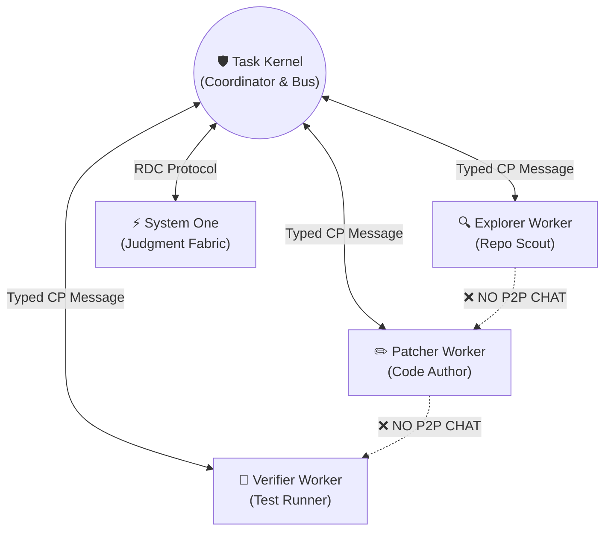

# Giao Tiếp Nội Bộ & Điều Phối (Internal Communication & Protocols)

> **Status:** Canonical Baseline v4.0  
> **Source:** Phần VII (§21-23) & Phần IV (§16-18, §20) Canonical Specification

Hệ thống giao tiếp nội bộ của Custos được thiết kế dựa trên 3 nguyên tắc: **Định kiểu tĩnh (Strongly-typed)**, **Bất đồng bộ không chặn (Non-blocking Asynchronous)**, và **Cấu trúc hình sao (Star Topology)**.

---

## 1. Mô Hình Liên Lạc Hình Sao (Star Topology)

Custos kiên quyết loại bỏ mô hình hội thoại tự do giữa các agent (Peer-to-Peer Agent Chat) để ngăn chặn vòng lặp ảo giác (*hallucination loops*) và mất kiểm soát chi phí.



> [!NOTE]
> Mọi sự phối hợp giữa các worker đều diễn ra gián tiếp thông qua **Event Store** và **Artifacts** do Kernel điều phối. Worker A kết thúc subtask và xuất artifact; Kernel tiếp nhận, kiểm định và mới chuyển giao artifact đó cho Worker B.

---

## 2. Định Dạng Thông Điệp Chuẩn Custos Protocol (CP Envelope)

Mọi thông điệp giao tiếp giữa Kernel và các thành phần đều được bao bọc trong một **CP Envelope** chuẩn hóa bằng định dạng typed JSON hoặc YAML:

```yaml
envelope_version: "custos.cp.v1"
message_id: "msg_01J8N7A1B2C3D4E5F6G7H8J9K0"
correlation_id: "corr_01J8N7A1B2C3D4E5F6G7H8J9"
timestamp: "2026-09-21T21:45:00.123Z"

routing:
  sender: "custos:kernel:coordinator"
  recipient: "custos:worker:engineering.patcher:subtask_42"
  reply_to: "custos:kernel:inbox"

metadata:
  task_id: "tsk_01J8N6Z8K9M0P1Q2R3S4T5U6V7"
  run_id: "run_01"
  priority: "HIGH"
  lease_epoch: 3

payload:
  action_type: "APPLY_PATCH"
  parameters:
    target_worktree: ".custos/worktrees/tsk_01J8N6Z8K9"
    patch_artifact_hash: "sha256:4b227777d4dd1fc61c6f884f48641d02b4d121d3fd328cb08b5531fcacdabf8a"
  constraints:
    max_duration_seconds: 30
    token_reservation: 4000
```

---

## 3. Ma Trận Ranh Giới Giao Thức (Protocol Boundary Matrix)

Custos phân định rõ ràng công nghệ áp dụng cho từng ranh giới tương tác:

| Ranh giới giao tiếp | Giao thức áp dụng | Định dạng dữ liệu | Lý do lựa chọn |
|---|---|---|---|
| **Nội bộ Kernel & Workers** | IPC / In-process Rust channels | Typed Rust Structs / CBOR | Hiệu năng cực cao, an toàn kiểu tại thời điểm biên dịch (*compile-time safety*). |
| **CLI / VS Code sang Daemon** | Unix Domain Socket (UDS) / Named Pipe | JSON-RPC 2.0 | Chuẩn công nghiệp, dễ tích hợp với client TypeScript/Rust. |
| **Runtime sang AI Providers** | HTTPS / SSE (Server-Sent Events) | Provider REST / Streaming API | Tương thích giao thức chính thức của từng nhà cung cấp. |
| **Runtime sang Công Cụ Ngoài**| Official MCP (Model Context Protocol) | JSON-RPC qua stdio / HTTP | Chuẩn mở cho hệ sinh thái công cụ đa nền tảng. |
| **Lưu trữ Cục Bộ** | SQLite C-API & Direct Filesystem | SQL tables + Raw BLOB CAS | Bền vững, hỗ trợ giao dịch ACID, không phụ thuộc network stack. |
