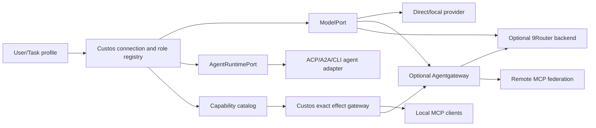

# Connectivity architecture: model, agent and MCP capability hubs

**Document ID:** ARCH-CONNECT-01. **Status:** target design; no gateway chain or external-agent control level is claimed implemented. **Research:** [primary-source findings](../research/connectivity-gateway-findings.md). **Owner proposal:** Vi for model/role semantics, Vinh for agent/MCP lifecycle, Truong for authority, data and network policy; shared contracts need all three reviews.

## One product surface, three distinct planes

The operator sees one **Connections** area, but Custos does not collapse unlike protocols into one “universal gateway”:

| Plane | Input → output | Canonical Custos interface | Optional component | Must never own |
|---|---|---|---|---|
| Model Hub | Prompt/messages → model stream, tool-call *proposal*, usage | `ModelPort` + role router | 9Router; Agentgateway LLM route | Task completion, tool permit |
| Agent Runtime Hub | Goal/context → external agent session/events/artifacts | `AgentRuntimePort` | ACP/A2A/CLI-specific adapter; Agentgateway A2A transport | Hidden native-tool authority claimed by Custos |
| Capability Hub | Tool/resource discovery → authorized invocation/receipt | `ToolPort`, MCP host/client, Custos effect gateway | Agentgateway MCP federation; local/remote MCP servers | Policy based only on untrusted tool metadata |

The fourth, cross-cutting plane is Custos's **control and evidence plane**: Session/Task/Run state, user preferences, policy/grants, budget reservation, durable attempts, source/effect evidence and completion. It remains in the daemon. Agentgateway is a possible network front; 9Router is a possible model/account back end; neither is the product source of truth.



These are alternative paths, not a requirement that every request traverse both sidecars. Tool output never becomes policy merely because it arrived through a trusted transport.

## Connection classes and control modes

| Connection | Typical use | Control mode | Eligibility |
|---|---|---|---|
| Direct/local model | Cheap private classification, pinned S2, offline mode | Custos-mediated for any tools it calls through Custos | Provider port conformance; egress policy |
| 9Router model route | Multiple upstream providers/accounts or format translation | Model routing only; tools still Custos-mediated when called via its ToolPort | Actual-model/usage visibility and fallback policy tested |
| External coding agent via ACP/CLI | Existing Codex/Claude/Goose workflow, user-chosen runtime | `Custos-mediated` only if all relevant tools are intercepted; otherwise `Provider-governed` or `Observe-only` | Adapter-specific conformance; declared native-tool behavior |
| Local stdio MCP server | Repo, filesystem or developer tool extension | Custos-mediated if host owns process and all calls traverse effect gate | Trusted install, per-user consent, sandbox and schema pin |
| Remote MCP via Agentgateway | Shared team tools and SaaS connections | Network identity/route plus Custos per-action decision | Auth, egress, per-tool scope, argument inspection in Custos |

9Router can often make **model endpoints** from several providers available through one API; it does not instantiate the separate agent loops of all coding tools. A coding client may itself use a 9Router-compatible endpoint when its configuration allows that, but its file/shell actions remain inside the client unless the integration exposes them through Custos. Goose explicitly documents ACP agents as providers whose internal tools are executed by that agent; this is the reason for the control-mode label. [9Router architecture](https://github.com/decolua/9router/blob/master/docs/ARCHITECTURE.md), [Goose architecture](https://github.com/aaif-goose/goose/blob/main/documentation/docs/goose-architecture/goose-architecture.md).

## Capability Hub as an MCP host

The MCP specification assigns client lifecycle, security policy, consent and cross-server isolation to the host. Custos should own a logical **Capability Hub** inside the daemon, using the existing MCP adapter and effect gateway; Agentgateway may federate remote servers, but does not become the host of Custos Task policy. [MCP architecture](https://modelcontextprotocol.io/specification/2025-11-25/architecture).

Each capability record is versioned:

```text
CapabilityRecord {
  capability_id, provider_kind, server_id, tool_name,
  input_schema_hash, output_schema_hash?, connector_version,
  trust_tier, effect_class, idempotency_class,
  allowed_data_classes, egress_target, credential_ref,
  required_grant, sandbox_profile, health_state
}
```

The MCP server's annotations, name and description are **claims**, not verified effect classification. MCP says tool annotations are untrusted unless the server is trusted. Custos derives `effect_class` from a reviewed adapter manifest/policy, probes or user confirmation; unknown tools default to no mutation authority. A changed `tools/list` or schema hash invalidates a previously pinned Task projection and requires review at a safe checkpoint. [MCP tools](https://modelcontextprotocol.io/specification/2025-11-25/server/tools).

### Per-user and per-task projection

1. Installation registers a connection and transport (`stdio`, streamable HTTP, or supported remote adapter) but grants no blanket tool authority.
2. User profile chooses allowed servers, data/egress classes, default approval mode and credential references. A Task contract can narrow this set; it cannot widen the user's or organization policy.
3. At Run/Step start, Custos computes a **CapabilityProjection** from user policy ∩ Task policy ∩ connector health ∩ role needs. Only the bounded set of tool schemas is shown to the model/agent. `capability_id` and schema hash are pinned in the Run, while secrets stay out of prompt context.
4. Tool proposal resolves to a pinned capability ID. Custos validates JSON schema, canonicalizes arguments/path/recipient, checks source/task revision and current grant, then mints the appropriate permit. For a controlled effect, it persists attempt → dispatches once through raw executor/MCP client → records receipt or Uncertain.
5. If a server disconnects or announces a tool-list change, stop new calls to that capability, mark in-flight effect state accurately and recompute the projection at a checkpoint. Never silently substitute a same-named tool from another server.

Read-only tool calls still need data classification, rate and egress controls; “read-only” does not mean harmless if it can expose private source to an external endpoint. Mutating calls use exact argument-level authorization when risk requires it. Agentgateway's documented MCP authorization availability is not a substitute for Custos exact pre-effect argument checks. [Agentgateway MCP authorization](https://agentgateway.dev/docs/standalone/latest/documentation/configuration/security/mcp-authz/).

## Model Hub routing and budget

The [Intelligence Hub](intelligence-hub.md) chooses `tier → role → candidate` after task class, privacy, allowed provider/region, tool/format capability, quality floor, health and budget filters. User pins take precedence; the router may abstain rather than silently downgrade. An approved equivalent pool may use one upstream fallback owner. Each attempt records actual provider/model if observable and marks it Unknown otherwise. A strict audit/reproducibility task rejects an opaque alias that cannot prove the actual candidate.

The route ledger keeps `estimated`, `metered`, `billed` and `unknown` cost distinct. Custos reserves a conservative amount before a call; provider usage settles it later. Agentgateway per-key budgets may charge after the response; therefore they are a useful second-line operational control, not Custos's hard per-request authorization. [Agentgateway budget limits](https://agentgateway.dev/docs/standalone/latest/documentation/llm/cost-controls/budget-limits/).

## Agent Runtime Hub and protocol choice

Choose integration by actual contract, not product name. `ModelPort` is suitable when Custos owns the loop and the external service supplies inference. `AgentRuntimePort` is suitable when an external agent owns its loop and exposes sessions/events/cancel/approval. ACP, A2A and CLI are distinct adapters with separate conformance suites. MCP is for capabilities and context, not a generic replacement for agent lifecycle. A2A is optional for remotely running agents; it does not change Task authority. [Goose ACP modes](https://github.com/aaif-goose/goose/blob/main/documentation/docs/goose-architecture/goose-architecture.md), [Agentgateway agent connectivity](https://agentgateway.dev/docs/standalone/latest/documentation/agent/).

An external agent adapter declares: `supports_pause`, `supports_cancel`, `supports_resume`, `native_tool_visibility`, `native_tool_interception`, `artifact_export`, `usage_visibility`, `side_effect_scope`, `replay_safety`. If a required capability is absent, the Task can require human approval, downgrade to Observe-only, or refuse the adapter. “Vibe” may opt into a less-governed external runtime with a clear UI label; Custos must not present those effects as its own verified receipts.

## Deployment profiles

| Profile | Processes | Best for | Failure/degrade behavior |
|---|---|---|---|
| P0 local-minimal | Custos daemon + SQLite/CAS; direct/local model; local controlled tools | One developer, offline/private work, F1/F2 foundation | If model unavailable, read-only deterministic paths remain; no hidden cloud egress. |
| P1 many-model desktop | P0 + 9Router loopback sidecar | Multiple accounts/providers with one model endpoint | If 9Router fails, use approved direct candidate or pause; no automatic policy bypass. |
| P2 team connectivity | Custos per user/workspace + Agentgateway network front; 9Router optional model backend | Shared remote MCP/A2A/identity/observability | If network hub fails, local work continues where allowed; remote capability is unavailable. |
| P3 strict/regulated | P0/P2 with pinned candidate/tool manifests, exact receipts, no opaque fallback | Reproducibility, private sources, sensitive effects | Abstain/pause rather than route to unknown model/tool. |

Do not deploy both gateway sidecars by default. If chained, Agentgateway's custom-compatible backend points to a tested, pinned 9Router endpoint. One layer owns model failover per pool; credentials and configuration have one owner each. A desired-state view in Custos compares to observed sidecar config but never edits their private databases. [Agentgateway custom provider](https://agentgateway.dev/docs/standalone/latest/integrations/llm/providers/custom/).

## Mandatory conformance before adoption

Test capability list changes, schema spoofing, same-name tool collision, expired permission, path escape, argument mismatch, unauthorized egress, stream cancellation, duplicate retry, server crash after dispatch, cost missing usage, actual-model opacity and sidecar failure. For each external coding agent, prove whether native file/shell tools are intercepted. For Agentgateway→9Router, use a fake upstream that tags model/account on at least three roles × three failure classes × stream/non-stream and record every attempt and cost. If provenance or effect control cannot be shown, lower the declared control mode or defer integration.
