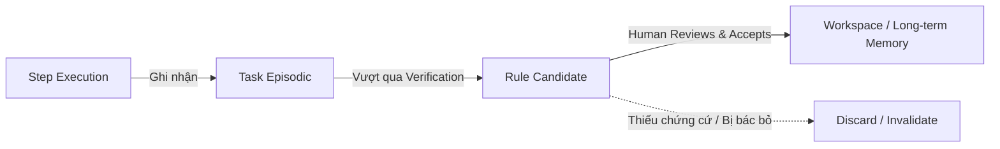

# Kiến Trúc Ngữ Cảnh & Bộ Nhớ (Context & Memory Architecture)

> **Status:** Canonical Baseline v4.0  
> **Source:** Phần V (§22-23) Canonical Specification

Để tối ưu hóa chi phí API và ngăn chặn hiện tượng quá tải ngữ cảnh (*context clutter*), Custos xây dựng kiến trúc quản lý ngữ cảnh đa tầng có chọn lọc và gắn nhãn nguồn gốc nghiêm ngặt.

---

## 1. Gói Ngữ Cảnh Chuẩn Hóa (`ContextPack`)

Thay vì nhồi nhét toàn bộ lịch sử chat hay dump cả thư mục mã nguồn vào prompt, Custos sử dụng bộ biên soạn ngữ cảnh để tạo ra một `ContextPack` tinh gọn:

```text
┌─────────────────────────────────────────────────────────────┐
│                       CONTEXTPACK                           │
├─────────────────────────────────────────────────────────────┤
│ 1. Task Contract & Invariants (Bất biến bắt buộc)           │
├─────────────────────────────────────────────────────────────┤
│ 2. Scored Code Slices (Các đoạn code có điểm liên quan cao) │
├─────────────────────────────────────────────────────────────┤
│ 3. Relevant Memory Items (Kinh nghiệm & quy tắc dự án)      │
├─────────────────────────────────────────────────────────────┤
│ 4. Provenance Metadata (Nhãn nguồn gốc, Commit Hash, TTL)   │
└─────────────────────────────────────────────────────────────┘
```

### Công Thức Chấm Điểm Ngữ Cảnh (Scoring Formula)
Mỗi đoạn mã hoặc mẩu tài liệu $c$ được chấm điểm liên quan trước khi quyết định đưa vào `ContextPack`:

$$\text{Score}(c) = w_r \cdot \text{Relevance}(c) + w_u \cdot \text{Recency}(c) + w_a \cdot \text{Authority}(c) - w_p \cdot \text{CostPenalty}(c)$$

Trong đó:
- $\text{Relevance}(c)$: Độ tương đồng ngữ nghĩa (Semantic search) và phụ thuộc AST (Tree-sitter references).
- $\text{Recency}(c)$: Tính tươi mới (thời gian commit hoặc sửa đổi gần nhất).
- $\text{Authority}(c)$: Độ tin cậy của nguồn (tài liệu chính thức > comment mã nguồn).
- $\text{CostPenalty}(c)$: Hình phạt độ dài token để bảo vệ ngân sách.

---

## 2. Năm Tầng Bộ Nhớ (The 5 Memory Layers)

Custos tổ chức bộ nhớ thành 5 tầng với phạm vi và tuổi thọ khác nhau:

```text
[ Tầng 1: Working Memory ]       --> Kéo dài trong 1 Step (Ephemeral biến mất khi step xong)
        │
[ Tầng 2: Task Episodic Memory ] --> Kéo dài trong 1 Task (Lịch sử các lần thử, lỗi đã gặp)
        │
[ Tầng 3: Workspace Semantic ]   --> Kéo dài theo Repository (Chỉ mục cấu trúc, quy ước code)
        │
[ Tầng 4: Procedural Memory ]    --> Công thức giải quyết lỗi (Các mẫu fix bug đã được xác minh)
        │
[ Tầng 5: Human Preference ]     --> Sở thích cá nhân lâu dài (Style lập trình, mức độ giải thích)
```

---

## 3. Quy Trình Thăng Hạng Bộ Nhớ (Memory Promotion Pipeline)

Một mẩu thông tin trong bộ nhớ ngắn hạn không tự ý trở thành quy tắc vĩnh viễn:



> [!IMPORTANT]
> **Quy Tắc Chỉ Mục Không Chuẩn Tắc (Non-canonical Index Rule):**  
> Mọi chỉ mục vector (Embeddings) hay đồ thị tri thức (Graph) đều được xem là **dữ liệu phái sinh (Derived Data)**. Cơ sở dữ liệu chuẩn tắc duy nhất là SQLite Event Store và các tệp tin trong Workspace. Nếu chỉ mục bị lỗi, runtime luôn có thể dựng lại hoàn chỉnh từ các nguồn chuẩn tắc này.
