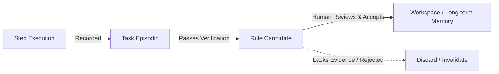

# Context & Memory Architecture

> **Status:** Canonical Baseline v4.0  
> **Source:** Part V (§22-23) Canonical Specification

To optimize token expenditures and eliminate context clutter, Custos implements a multi-tier context compilation and memory architecture with strict provenance labeling.

---

## 1. ContextPack Specification

Rather than dumping monolithic chat histories or raw directory contents into prompts, Custos compiles a lean, scoped `ContextPack`:

```text
+-------------------------------------------------------------+
|                       CONTEXTPACK                           |
+-------------------------------------------------------------+
| 1. Task Contract & Invariants (Mandatory invariants)        |
+-------------------------------------------------------------+
| 2. Scored Code Slices (High-relevance AST extracted slices) |
+-------------------------------------------------------------+
| 3. Relevant Memory Items (Workspace heuristics & rules)     |
+-------------------------------------------------------------+
| 4. Provenance Metadata (Source labels, commit hash, TTL)    |
+-------------------------------------------------------------+
```

### Context Scoring Formula
Every candidate code slice or document chunk $c$ is scored before admission into a `ContextPack`:

$$\text{Score}(c) = w_r \cdot \text{Relevance}(c) + w_u \cdot \text{Recency}(c) + w_a \cdot \text{Authority}(c) - w_p \cdot \text{CostPenalty}(c)$$

Where:
- $\text{Relevance}(c)$: Semantic vector similarity and Tree-sitter AST dependency graph proximity.
- $\text{Recency}(c)$: Temporal freshness (most recent commit or modification timestamp).
- $\text{Authority}(c)$: Source trustworthiness (canonical docs > source code comments).
- $\text{CostPenalty}(c)$: Length penalty enforcing token budget compliance.

---

## 2. Five-Tier Memory Hierarchy

Custos manages memory across 5 distinct tiers with increasing lifespans:

```text
[ Tier 1: Working Memory ]       --> Step scope (Ephemeral; discarded on step completion)
        |
[ Tier 2: Task Episodic Memory ] --> Task scope (Trial history, attempted fixes, errors)
        |
[ Tier 3: Workspace Semantic ]   --> Repository scope (AST structural indexes, conventions)
        |
[ Tier 4: Procedural Memory ]    --> Reusable patterns (Verified fix recipes and workflows)
        |
[ Tier 5: Human Preference ]     --> Long-term operator preferences (Coding style, tone)
```

---

## 3. Memory Promotion Pipeline

Short-term operational memory never auto-promotes into permanent rules without verification:



> [!IMPORTANT]
> **Non-Canonical Index Invariant:**  
> All vector embeddings, semantic caches, and knowledge graphs are strictly **Derived Data**. The sole canonical sources of truth are the SQLite Event Store and workspace repository files. If an index corrupts or diverges, the runtime reconstructs it from canonical sources.
