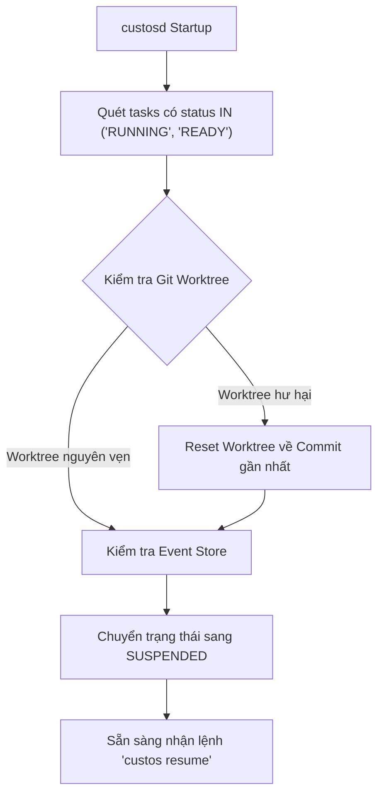

# Phục Hồi Sự Cố & Tính Bền Bỉ (Crash Recovery & Resilience)

> **Status:** Canonical Baseline v4.0  
> **Source:** Phần X (§30-31) & Phần VI (§32) Canonical Specification

Hệ thống Custos được thiết kế để **sống sót qua mọi sự cố bất ngờ**: tắt nguồn máy tính đột ngột, crash daemon (`SIGKILL`), sập kết nối mạng, hoặc AI provider trả về lỗi 500.

---

## 1. Ma Trận Xử Lý Sự Cố (Crash Recovery Matrix)

| Tình huống sự cố | Tác động ngay lập tức | Quy trình tự động khôi phục |
|---|---|---|
| **Daemon bị crash (`kill -9`)** | Tiến trình Rust dừng; DB SQLite giữ nguyên trạng thái atomic. | Khi khởi động lại, `Reconciliation Loop` quét các Task có trạng thái `Running`, đối soát Git worktree, đưa về trạng thái `Suspended` an toàn và thông báo cho người dùng. |
| **Worker tiến trình con bị crash** | Subtask bị ngắt quãng giữa chừng. | Kernel thu hồi `lease`, hủy bỏ các thay đổi dở dang chưa commit trong worktree, cấp phát worker mới thử lại từ step trước. |
| **Provider sập / Rate limit 429** | Luồng streaming bị đứt đoạn. | Exponential backoff với jitter; nếu quá 3 lần thất bại, tự động chuyển sang mô hình dự phòng (*Fallback Provider*) hoặc dừng chờ người dùng. |
| **Máy trạm mất điện / Tắt nguồn** | Toàn bộ tiến trình dừng đột ngột. | SQLite WAL rollback các giao dịch dở dang; trạng thái commit cuối cùng nguyên vẹn; `custos resume` tiếp tục phiên làm việc bình thường. |
| **Ổ đĩa đầy (Disk Full)** | Không thể ghi tiếp SQLite hoặc CAS. | Runtime từ chối nhận task mới, tạm dừng khẩn cấp các task đang chạy, phát cảnh báo dọn dẹp dung lượng. |
| **Mất kết nối Internet** | Không thể gọi Cloud AI Providers. | Nếu có cấu hình Local SLM, tự động chuyển hướng các task phán đoán sang local; task cần Cloud chuyển sang `Suspended`. |
| **Xung đột Git Worktree** | File bị sửa đổi ngoài tầm kiểm soát. | Phát hiện sai lệch mã băm; yêu cầu người dùng giải quyết xung đột thủ công trước khi cho phép tiếp tục. |

---

## 2. Hợp Đồng Tiếp Tục (Continuation Contract)

Để một Task có thể được tiếp tục (*resumed*) an toàn, runtime bắt buộc phải xác minh **Hợp Đồng Tiếp Tục (Continuation Contract)** thỏa mãn 4 điều kiện:

```text
resume(task) ≡ StateValid ∧ AuthorityValid ∧ PreconditionsValid ∧ PriorEffectsResolved
```

1. **StateValid:** Lịch sử sự kiện trong `task_events` không bị lỗi tính toàn vẹn (hash sequence hợp lệ).
2. **AuthorityValid:** Người thực hiện lệnh resume có thẩm quyền hợp lệ và các giấy phép cũ đã được vô hiệu hóa.
3. **PreconditionsValid:** Các tệp tin, commit snapshot và tài nguyên yêu cầu vẫn còn tồn tại trên máy trạm.
4. **PriorEffectsResolved:** Toàn bộ side effect của bước trước đó đã được ghi nhận hoặc rollback sạch sẽ; không để lại trạng thái "lửng lơ".

---

## 3. Vòng Lặp Đối Soát (Reconciliation Loop)

Mỗi khi `custosd` khởi động:


