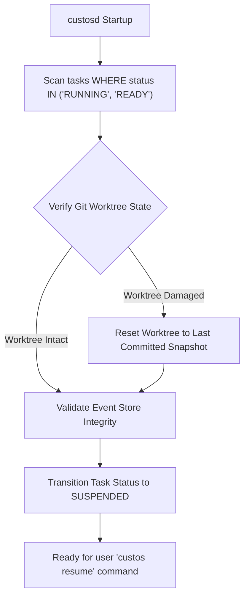

# Crash Recovery & Resilience Architecture

> **Status:** Canonical Baseline v4.0  
> **Source:** Part X (§30-31) & Part VI (§32) Canonical Specification

Custos is architected to **survive unexpected interruptions**: abrupt power loss, daemon termination (`kill -9` / `SIGKILL`), network dropouts, or upstream provider outages (HTTP 429/500).

---

## 1. Crash Recovery Matrix

| Fault Scenario | Immediate System Impact | Automated Recovery Procedure |
|---|---|---|
| **Daemon Killed (`kill -9`)** | Rust process halts; SQLite database preserves atomic state via WAL. | On restart, the `Reconciliation Loop` scans for tasks in `Running` state, verifies Git worktrees, marks tasks safely as `Suspended`, and notifies the user. |
| **Worker Subprocess Crash** | Active subtask interrupts mid-flight. | Kernel revokes the worker's lease, cleanses uncommitted worktree changes, and respawns a clean worker to retry from the last committed step. |
| **Provider 429 / Outage** | Streaming response terminates prematurely. | Exponential backoff with jitter; after 3 retries, automatically transitions to a configured Fallback Provider or pauses for human review. |
| **Workstation Power Loss** | Abrupt OS shutdown. | SQLite WAL rolls back uncommitted transactions; committed events remain intact; `custos resume` resumes the task session deterministically. |
| **Workstation Disk Full** | Inability to append SQLite or CAS blocks. | Runtime halts new task ingestion, transitions active tasks to emergency `Suspended` state, and emits a low-disk warning. |
| **Network Loss** | Inability to access cloud AI providers. | Routes judgment subtasks to local SLMs if configured; cloud-dependent tasks transition cleanly to `Suspended`. |
| **Git Worktree Conflict** | External process mutates worktree files. | Hash verification detects external modification; prompts user to reconcile Git state before allowing resumption. |

---

## 2. Continuation Contract

Before an interrupted task can be safely resumed, the runtime must verify that the **Continuation Contract** satisfies 4 formal predicates:

$$\text{resume}(task) \equiv \text{StateValid} \land \text{AuthorityValid} \land \text{PreconditionsValid} \land \text{PriorEffectsResolved}$$

1. **StateValid:** Event sequence integrity in `task_events` is intact (hash chains match).
2. **AuthorityValid:** Resuming principal has authenticated credentials, and prior single-use permits are invalidated.
3. **PreconditionsValid:** Target files, commit snapshots, and required OS tools remain present on the host.
4. **PriorEffectsResolved:** All side effects from the interrupted step are either fully committed or rolled back cleanly; zero orphaned state.

---

## 3. Reconciliation Loop

Upon daemon initialization (`custosd` startup):

