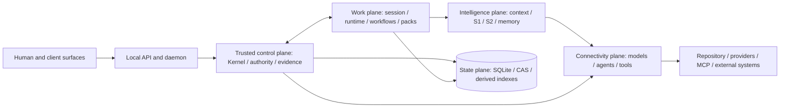
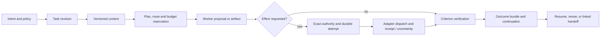
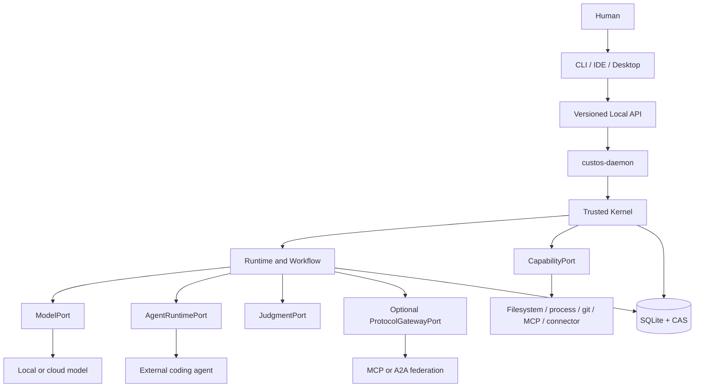
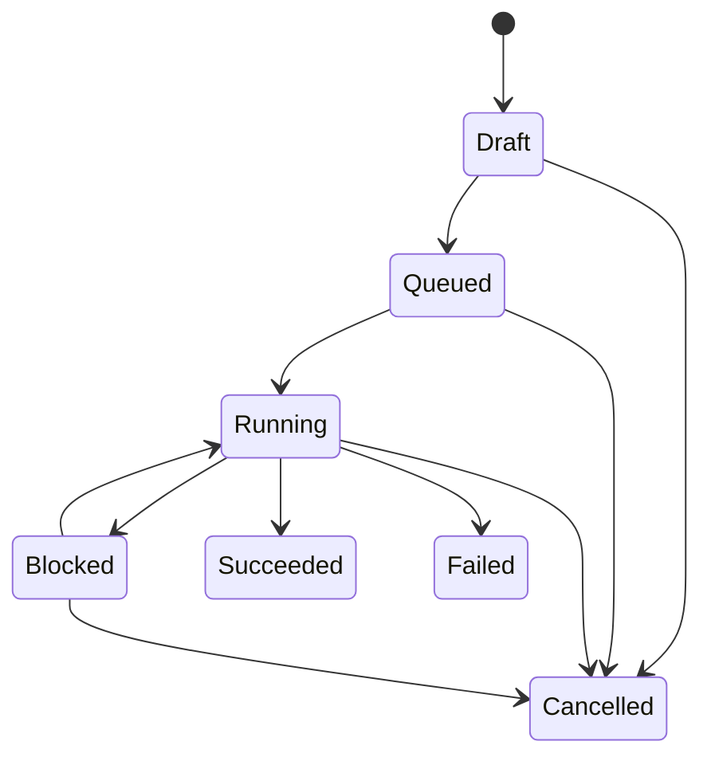
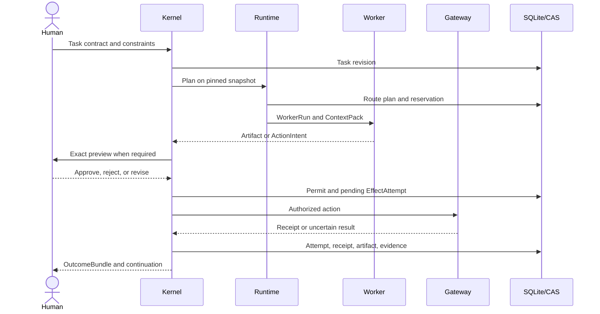
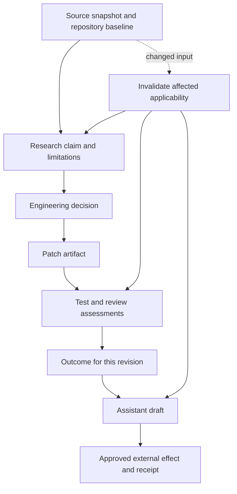

# Custos Definitive Product Architecture

**Document ID:** ARCH-DEF-01
**Status:** Canonical target architecture
**Reviewed against:** the 11-product-crate workspace on 2026-09-30
**Implementation truth:** [`../status/README.md`](../status/README.md)
**Governance:** [`../../AGENTS.md`](../../AGENTS.md) and accepted ADRs

This document defines the intended end state of Custos. It is normative for
system boundaries and invariants, but it is not evidence that a capability is
implemented, wired, or verified. Source code, migrations, Cargo metadata, and
repeatable tests remain the authority for implementation claims.

## 1. Product thesis

Custos is a local-first, human-governed work runtime for developers,
researchers, and personal knowledge work. It preserves continuity, authority,
evidence, provenance, and cost across models, tools, agents, and domain packs.

The product is not a model proxy, a multi-agent demo, or a renamed Goose fork.
Its differentiator is a durable control plane that can answer:

- what the user asked for and which revision is current;
- what sources and context an agent received;
- which model, agent, or tool produced each result;
- which effects were authorized and actually attempted;
- which acceptance criteria passed, failed, became stale, or remain unknown;
- what can safely resume after a crash or provider change.

The first valuable release is a single-worker Engineering flow with verified
context, controlled effects, and honest outcomes. System One, multi-worker
topologies, gateways, and remote federation are optional optimizations.

The product focus is a developer's complete work cycle: investigate a technical
question, implement a justified change, validate it, and coordinate its delivery.
Assistant initially serves this cycle through notes, draft updates, and meetings.
The differentiating hypothesis is **incremental, evidence-backed work**: retain
the dependency between claims, decisions, patches, checks, and communication,
then revalidate affected results when their inputs change. This combines known
systems techniques; it is not a claim of scientific novelty or market uniqueness.
Sections 15–20 define the proposed extension; shared contracts require review.

### Final architectural decision

The end state is **one Task-centered work system with five logical planes**,
not ten independently deployed services. The submitted ten-layer stack is a
useful inventory, but its vertical drawing is not the dependency graph:
pure domain must not depend on persistence, and adapters implement ports rather
than sit below them in a call chain.

These are **responsibility planes**, not new crates or independent data owners.
The daemon composes them. Every client, pack, and protocol enters through the
same Task authority and outcome contract. A Session remains the interaction
surface; a Task is the durable unit of accountable work; a Run is one attempt
to advance it; a criterion is the declared condition for acceptance. One Task
can span research, code, and a drafted update only while owner, scope, privacy,
retention, and approval policy remain compatible. Otherwise a linked child
Task crosses the boundary with a minimized artifact, not inherited grants.

The product-level promise is narrower than arbitrary autonomy: **a user can
resume work, inspect why an outcome is trusted, and see what is unresolved
after a model switch, source change, crash, or external action.** This is the
design hypothesis to validate against simpler agents and checkpoint-only
systems; it is not an established competitive lead.

### One end-to-end execution contract

At every arrow, persist an identity and causal reference sufficient to answer
who initiated it, which Task/contract/policy/source versions it used, what was
observed, and which uncertainty remains. Streaming UI updates are projections
of this contract, never the canonical record. [Runtime flows](runtime-flows.md)
define the failure windows and admission checks.

## 2. Non-negotiable invariants

1. The Task Kernel is the only canonical Task writer.
2. Models and external agents produce proposals, artifacts, and action intents;
   they cannot mint grants, permits, evidence passes, or completion.
3. A side effect requires an exact, current permit bound to Task revision,
   actor, capability, canonical target, payload digest, and use policy.
4. Task completion uses trusted evidence identities resolved by the Kernel. A
   client-authored `passed: true` claim is never completion evidence.
5. Task, Run, EffectAttempt, Approval, and Criterion have separate lifecycles.
6. Unknown, stale, uncertain, failed, and waived are distinct states. None is
   silently converted to pass or success.
7. External effects are not atomic with SQLite. Durable intent, idempotency,
   receipt, uncertainty, and reconciliation are explicit.
8. Local-first means local ownership of canonical state and an explicit egress
   choice, not a claim that cloud models are never available.
9. One model attempt has one active transport. Fallback creates a new attempt
   with a reason, budget check, privacy check, and provenance.
10. CLI, UI, bots, sidecars, 9Router, Agentgateway, and coding agents never
    write Custos SQLite directly.

## 3. System context and trust boundaries

### Trusted zone

- domain validation and state machines;
- Kernel commands, authority, effect attempt creation, evidence assessment, and
  completion;
- durable repositories and append-only audit records;
- daemon composition and authenticated Local API dispatch.

### Untrusted or conditionally trusted inputs

- model text, tool calls, routing judgments, and confidence values;
- repository, web, PDF, email, MCP output, and tool descriptions;
- claims supplied by clients or external agents;
- provider-reported usage and agent-native tool activity;
- gateway routing, telemetry, health, and fallback decisions.

Untrusted input may be stored with provenance, but it does not become authority
or verified evidence by crossing an API boundary.

## 4. Canonical domain model

| Object | Required responsibility | Current disposition |
|---|---|---|
| `Session` | Fast interaction, journal, retention, Task references | Existing; durable repository exists |
| `TaskContractV1` | Goal, scope and negative scope, pack, criteria, privacy, egress, model constraints, budget, approval profile | Existing type is partial |
| `TaskRevision` | Monotonic revision, actor, reason, source baseline | Existing type is partial |
| `Run` / `WorkerRun` | Attempt, role, model/agent, context, reservation, status | Existing domain types; not durably composed |
| `WorkflowRevision` / `NodeSpec` | Typed DAG, dependencies, read/write sets, join and fan-out limits | Target contract |
| `ActionIntent` | Effect kind, canonical target, payload digest, base precondition, idempotency | Existing type is partial |
| `Grant` / `Approval` / `ExecutionPermit` | Actor, scope, exact effect, expiry, revocation, use count | Existing types are partial and mostly in-memory |
| `EffectAttempt` / `Receipt` | Durable dispatch lifecycle, external identifier, result, uncertainty | Receipt exists; durable attempt is target |
| `SourceRecord` / `ContextPack` / `Observation` | Snapshot, locator, provenance, sensitivity, omissions | ContextPack exists; remaining records are target |
| `JudgmentRecord` / `RoutePlan` | Typed question, alternatives, backend/version, policy revision, cost and reason | Target contract |
| `EvidenceRecord` / `CriterionAssessment` | Trusted verifier, input revision, artifact/receipt bindings, status | EvidenceRecord exists; trusted closure is target |
| `Artifact` / `OutcomeBundle` | Content-addressed outputs, criteria, unknowns, cost, continuation | Artifact storage is partial; OutcomeBundle is target |
| `ContinuationPacket` | Goal, decisions, artifacts, constraints, budget, pending effects, unknowns | Existing and persisted |

`EphemeralQuery` is a product-level fast-path term, not a required new durable
aggregate. The implementation should use Session semantics unless an ADR proves
that a separate persisted lifecycle is necessary.

### Identity, concurrency, and outcome rules

Public and stored records need schema version, stable ID, Task ID, monotonic
Task revision, actor/principal, causation and correlation IDs, creation time,
and a typed status. Input snapshots, output artifacts, canonical effect
payloads, and policy/profile versions use digests or immutable references.
The Kernel rejects commands with stale expected versions. Same idempotency key
and same canonical payload returns the original result; the same key with a
different payload is a conflict. A database event records the accepted command
in the same transaction as its canonical state change. Schema details remain
subject to C-01 through C-04 review; the attachment's illustrative SQL is not
an accepted migration.

`OutcomeBundle` is an auditable projection of one Task revision: declared
criteria, per-criterion assessment and evidence IDs, artifacts, effect attempts
and receipts, unknowns, human waivers, cost/usage quality, and continuation.
Its labels are deliberately separate:

| Label | Meaning |
|---|---|
| `accepted` | The contract's current required criteria satisfy the reviewed completion rule |
| `limited` | Useful artifact exists, but at least one required condition is failed, stale, unknown, or waived under a disclosed limitation |
| `blocked` | More authority, information, reconciliation, or budget is needed before safe progress |
| `failed` | A terminal execution result under the Task policy; no implied external rollback |

These outcome labels are not new Task enum variants. The proposed strict
completion predicate is: a nonempty, current criterion set; every required
criterion has a Kernel-resolved assessment valid for the exact revision and
subject; every required artifact is readable and matches its digest; no
blocking effect is uncertain; and no required approval or human review remains
pending. A waiver requires an explicit contract revision and a visibly limited
or separately human-accepted outcome; it cannot fabricate a verifier pass.
Even a valid predicate proves only the declared checks, not universal
correctness. The UI must show the assurance level and the unresolved set.

The budget ledger is canonical, not disposable telemetry. Reserve estimated
maximum exposure before dispatch, atomically against the Task allowance;
settle actual provider usage when known; keep unknown and delayed charges as
liabilities; never interpret an absent bill as zero. A cheaper route is eligible
only after privacy, user pin, capability, authority, and verifier feasibility
checks pass. S1 and provider usage estimates are advisory inputs, not budget
truth.

## 5. Independent state machines

The canonical Task lifecycle remains deliberately small:

Approval waiting, verification, limitation, and reconciliation are projections
of their own records, not additional Task states.

- ActionIntent and authorization precede dispatch. EffectAttempt tracks
  `pending -> in_flight -> succeeded | failed | uncertain`; an uncertain attempt
  is resolved by reconciliation evidence, never by relabeling it as unexecuted.
- CriterionAssessment: `unknown -> pass | fail | stale | waived_by_human`.
- Run: `pending -> active -> suspended -> completed | failed | cancelled`.
- Approval: `pending -> approved | rejected | expired | revoked`.

Only the Kernel maps these records to a legal Task transition.

A completed revision remains an immutable historical result. Later changes
make its applicability stale; fresh work creates a revision or successor Task
under the accepted lifecycle. Do not silently reopen a terminal Task or rewrite
its past evidence. Human waivers amend the contract and remain visible in the
outcome; they are never converted into machine-verified passes.

## 6. Runtime responsibilities

### 6.1 Orchestration coordinator

Orchestration Intelligence is a Runtime coordinator, not an omnipotent agent or
second daemon. It assembles an execution proposal from narrow components:

- `WorkflowCompiler`: validates plans, dependencies, write sets, and limits;
- `RoutePlanner`: compares direct, single-worker, and bounded DAG candidates;
- `ProviderSelector`: chooses an eligible ModelPort transport;
- `ContextCompiler`: creates a bounded, provenance-carrying ContextPack;
- `VerificationPlanner`: maps criteria to trusted verifiers;
- `BudgetReservationPort`: reserves and later settles known, estimated, or
  unknown usage.

The coordinator cannot grant authority, dispatch an unpermitted effect, mutate
Task state directly, or declare criteria passed.

### 6.2 System One and System Two

System One answers a narrow, versioned, typed question through `JudgmentPort`.
Valid forms include choice, ranking, ordinal score, and binary probability. A
judgment records backend, model/version digest, input digest, rubric version,
latency, cost, abstention, and calibration identifier when calibration exists.

Backend count is demand-driven. Start with rules and disabled operation; evaluate
local classifiers and remote judgment models independently. Calibration requires
labeled, representative outcomes and drift checks; it cannot be inferred from
one confidence field. Retry and escalation have fixed budgets. Identical-query
majority voting is not a default correctness mechanism. A failed advisory
backend falls back to an eligible direct path or abstains, without relaxing
security or privacy constraints.

System Two performs generative work: analysis, plans, artifacts, patches, and
action intents. It remains inside Task scope and cannot authorize its own tools.

Jev, Laya, local ONNX, or another typed model may implement `JudgmentPort` after
conformance, but no named backend or count of six is mandatory. The Jev studies
in the [research register](../research/architecture-foundations-2026-09-30.md)
report probabilistic incoherence and option-label sensitivity despite typed
outputs. Consequently, questions pin neutral option IDs, rubrics, input and
backend versions; evaluation tests option permutation, adversarial source
content, abstention, calibration, and drift. Deterministic parsing handles
dates, arithmetic, and policy checks. Repeating an identical question is not
a substitute for independent evidence or calibrated confidence.

### 6.4 Route decision contract

For each eligible Task revision, the coordinator first generates a direct
single-worker candidate. It may add sequential or bounded parallel workflows
only from a validated dependency graph and declared read/write sets. It then:

1. Applies hard policy filters: user pin, local-only/egress, model and tool
   capabilities, account scope, isolation, budget ceiling, and a feasible
   verification path. No weighted score can override a failed filter.
2. Estimates complete cost (including S1, worker retries, verifiers, gateway,
   and recovery), p95 latency, accepted-outcome likelihood, uncertainty, and
   write/conflict risk from pinned evaluation data. Unknown estimates remain
   explicit and may disqualify strict work.
3. Selects a Pareto-eligible candidate under the user's quality/cost/latency
   policy; records alternatives rejected and the policy/model versions used.
   If evidence is insufficient, chooses the safe direct baseline or abstains.
4. Reserves budget and pins a WorkflowRevision before dispatch. Only ready
   nodes with committed predecessors run; publication compares the expected
   base and re-verifies the merged artifact.

This borrows task-graph features from AdaptOrch, selective participation from
CADTopo/DyTopo, bounded escalation from Jarvis Core, and cascade hypotheses
from Mahoraga. AgentConductor's topology learning stays an offline experiment.
None of their reported benchmark gains is a Custos performance guarantee;
manager-model scores remain signals, not completion authority. A route policy
is promoted only after matched, failure-inclusive comparisons against the
single-worker baseline.

### 6.3 Context and memory

Custos distinguishes transcript, Task outcomes, source knowledge, and personal
memory. Context compilation performs retrieval, permission and privacy filters,
source-version checks, deduplication, ranking, token budgeting, omission
reporting, and provenance sealing. Summaries and indexes are derived views;
they are not source truth.

## 7. Ports and upstream integration

| Port | Responsibility | Authority limit |
|---|---|---|
| `ModelPort` | Prompt/stream/tool proposal/usage against one model transport | Cannot mutate Task or execute effects |
| `AgentRuntimePort` | Start, stream, interrupt, resume, capability declaration, continuation for an external agent loop | Native tools may be only provider-governed; assurance must be labeled |
| `CapabilityPort` | Execute a permitted file/process/git/MCP/connector action and return a receipt | Must verify exact permit bindings and never mint permits |
| `JudgmentPort` | Return typed S1 judgments for versioned questions | Cannot authorize or become the sole truth source |
| `ProtocolGatewayPort` | Optional discovery, registry, transport, and federation | Does not own payload authority, Task state, or canonical budget |

Upstream positioning:

- Goose contributes agent-loop, provider, MCP/extension, ACP, streaming, and UX
  mechanics through rewritten modules or `AgentRuntimePort`. It receives no
  Kernel authority.
- 9Router is an optional model-transport profile for registry, health, fallback,
  and token-shaping experiments. It is not chained by default with another
  model proxy.
- Agentgateway is an optional MCP/A2A federation profile and may be evaluated as
  an alternative ModelPort edge through its virtual-model routing. It is not
  chained with 9Router by default; Custos still validates exact capability and
  payload locally.
- CLIProxyAPI is another optional ModelPort transport, mutually exclusive with
  9Router within one ModelAttempt.

Every adopted upstream follows the
[`upstream-dissection`](../research/upstream-dissection.md) protocol and has a
pinned source revision, license record, threat assessment, capability
declaration, and conformance suite before activation.

### Hub and protocol decision

There is one **Custos connection catalog** for user setup and Task-scoped
discovery, but not one all-powerful MCP hub. A catalog entry declares kind
(model, agent, tool/resource, or remote service), endpoint, account, observed
capabilities, verified capabilities, data class, allowed workspaces, health,
version, and credential reference. Discovery is untrusted; activation never
creates a grant. The execution plane is split by semantics:

| Boundary | Default | Optional profile | Why it cannot replace the Kernel |
|---|---|---|---|
| Model inference | Direct/local `ModelPort` | 9Router **or** Agentgateway virtual model **or** CLIProxyAPI per attempt | Transport fallback and provider billing are not Task authority or evidence |
| Coding-agent delegation | In-process Custos worker | ACP-backed `AgentRuntimePort` / Goose-derived loop | An agent may run native tools outside Custos mediation; assurance must say so |
| Tools and data | Custos `CapabilityPort` plus bounded MCP client | Agentgateway federation/authorization edge | Gateway allow/deny does not bind the exact Task revision, payload and receipt |
| Client control | Versioned Local API | ACP server or other user-facing adapter when a client requires it | Client sessions are not canonical Task state |
| Remote delegation | None initially | A2A after identity, data and cancellation conformance | Remote Task IDs and outcomes are foreign observations |

Do not put 9Router and Agentgateway in series by default: that creates two
retry/fallback owners, obscures actual model identity and usage, and increases
credential and privacy paths. A measured composition can be admitted later
with explicit ownership and complete traceability. MCP is tool/resource
interoperability, not a general Task/authority protocol. ACP is for agent
session interoperability; A2A is for remote delegation. ATP, ANP, AP2,
AGTP, AG-UI and A2UI remain watch-list options, not mandatory roadmap gates.
An outbound protocol is added only for a named user journey, pinned spec,
version negotiation, security model, failure fixtures, and owner.

## 8. Durable execution and recovery

Crash handling follows durable state:

| Crash window | Recovery rule |
|---|---|
| Before EffectAttempt commit | Retry the idempotent command with expected version |
| Pending attempt, no dispatch | Dispatch only if policy and permit remain current |
| Dispatch may have occurred, no receipt | Mark uncertain and reconcile; do not retry blindly |
| Receipt committed, verifier incomplete | Re-run the verifier against the pinned input |
| Outcome committed, client lost acknowledgement | Resume from durable event cursor |

SQLite is the transactional state store. CAS stores large artifacts using
temporary write, digest, atomic rename, metadata commit, and safe orphan GC.
Derived FTS, AST, symbol, graph, or vector indexes are rebuildable and carry
source/index versions. Secrets are referenced through an OS credential store;
plaintext bearer tokens do not enter event or evidence records.

## 9. Product packs

All packs declare Task templates, workflows, context policy, required
capabilities, criteria, verifiers, prompts, and evaluations. A pack cannot
change Kernel invariants or inherit another pack's grants implicitly.

- Engineering: read-only explanation, patch proposal, exact diff approval,
  controlled apply, targeted tests, regressions, and review outside patch scope.
- Research: source ingestion, passage-level provenance, claim/support matrix,
  synthesis, contradictions, caveats, and reproducible exports.
- Assistant: explicit target resolution, draft-first outbound work, calendar and
  communication approvals, retention, revoke, and receipts.

Cross-pack handoff transfers a typed, minimized artifact with source and policy
references. It never transfers broad authority implicitly.

### Pack acceptance contracts

| Pack | Candidate workflow | Required evidence and explicit limit | Dangerous edge |
|---|---|---|---|
| Engineering | Locate -> explain/plan -> isolate patch -> test -> review -> publish | Exact repository baseline and changed files, command/toolchain/test profile, exit/output receipt, scope check, unresolved paths | A test runs untrusted code; shell and downloads can write or egress even when called "verification" |
| Research | Acquire -> snapshot/parse -> atomic claims -> support and counter-evidence -> synthesis | Source bytes or stable locator, extraction version, support span, contradictory sources, freshness and human/semantic review when required | A valid URL or citation is not proof of the claim; web/PDF content can inject instructions |
| Assistant | Resolve identity/time/account -> draft -> exact preview -> approve -> send/create -> reconcile | Canonical recipient/timezone/payload, account scope, exact approval, connector receipt and uncertainty | Approval proves permission; provider acknowledgement does not prove delivery or readership |

The attachment's `repo-intel`, `doc-intel`, and `personal-intel` tool lists are
candidate **namespaces**, not a requirement for three MCP processes or fixed
tool counts. A tool's risk comes from actual action, target, data, account,
recipient, and environment, not its pack or label. `run_verifier_profile` can
execute hostile code; `search_counter_evidence` can contact the network;
`apply_patch` may be destructive if the base changed. Tools advertise observed
capabilities, but the Kernel computes effective capability for every attempt.
Roles such as Explorer, Implementer, Verifier, and Critic are workflow
responsibilities, not a requirement for separate simultaneous agents.

Sources pass through acquired, parsed, and validated stages before becoming
*citable*; citation support remains a separate assessment. Repository index
tiers are opportunistic: file walk/`rg` baseline, then AST/LSP only where
supported, then actual build/test observations. A failed index or unavailable
language server degrades coverage honestly instead of fabricating semantics.
Personal memories require explicit source, scope, retention, correction and
deletion policy; a model-written summary is never promoted silently.

## 10. Physical codebase

The complete process, language, contract-generation, and target directory rules
are defined in the canonical supporting
[`polyglot-repository-topology.md`](polyglot-repository-topology.md).

The canonical Rust product is eleven crates:

| Crate | Canonical responsibility |
|---|---|
| `custos-domain` | Pure domain entities, identifiers, states, and validation |
| `custos-core` | Kernel commands, authority, effects, evidence, completion |
| `custos-provider` | Stable Model/Agent/Capability/Judgment/Gateway port contracts |
| `custos-persistence` | SQLite repositories, migrations, CAS, outbox persistence |
| `custos-bridge` | Session-to-Task promotion, attachment, steering, observation |
| `custos-runtime` | Agent runtime, workflow, routing, context, memory, gateway policy |
| `custos-adapters` | Providers, MCP, agents, sandboxes, connectors, local inference |
| `custos-sdk` | External client and protocol bindings |
| `custos-daemon` | Sole production composition root and Local API server |
| `custos-cli` | Thin Local API client and terminal experience |
| `custos-packs` | Engineering, Research, and Assistant pack logic/registry |

Tests and `xtask` are workspace members but not product crates. No empty crate or
folder is created merely to match a diagram. Logical modules become physical
modules only when a bounded implementation requires them.

## 11. Team ownership

| Owner | Primary responsibility | Required cross-review |
|---|---|---|
| Vi | Product architecture; S1/OI; context/memory; model routing; pack semantics; quality and cost evaluation | Truong for authority/privacy/effects; Vinh for runtime and agent contracts |
| Truong | Domain/kernel correctness; persistence; authority/effects; daemon/API; sandbox and release correctness | Vi for evidence/product semantics; Vinh for lifecycle and recovery |
| Vinh | Session/bridge/workflow; AgentRuntimePort; MCP/ACP/A2A lifecycle; CLI/UI/packages | Truong for durable/effect boundaries; Vi for agent and UX semantics |

Shared contracts require the producer, consumer, primary owner, and both
cross-boundary reviewers. The operational authority remains
[`../../AGENTS.md`](../../AGENTS.md); this table is an architectural allocation,
not permission to bypass review.

## 12. Delivery gates

1. Pin a reproducible clean baseline, durable SQLite configuration, and
   current/target mappings.
2. Close the trusted evidence boundary and version Task/Effect/Evidence/Outcome
   contracts.
3. Deliver one daemon-composed, single-model Engineering vertical slice.
4. Add durable EffectAttempt/outbox/receipt/reconciliation and crash fixtures.
5. Deliver real Research and Assistant verifiers and pack handoffs.
6. Add JudgmentPort candidates and calibrated evaluations.
7. Add WorkflowCompiler and bounded topology candidates only when they beat the
   single-worker baseline.
8. Evaluate Goose/9Router/Agentgateway/CLIProxyAPI profiles through conformance;
   activate none by default without measured value.
9. Add richer UI surfaces and human feedback loops over the versioned Local API.

Every gate requires passing fixtures, known limitations, a rollback or
roll-forward plan, and an update to the implementation status matrix.

## 13. Acceptance metrics

Custos measures accepted outcome rate, criterion coverage, unsupported-claim
rate, false pass/false send rate, cost per accepted Task, billed versus estimated
usage, p50/p95 latency, context evidence recall, human corrections, unresolved
effects, and crash recovery time. Evaluation reports pin hardware, source SHA,
model/provider/configuration, cache state, sample size, and uncertainty.

Agent count, token volume, and apparent autonomy are not success metrics.

## 14. Research and localization

- [`../research/architecture-foundations-2026-09-30.md`](../research/architecture-foundations-2026-09-30.md)
  records the paper, standard, and framework evidence behind the design. It is a
  dated research register, not implementation proof.
- [`../research/upstream-dissection.md`](../research/upstream-dissection.md)
  defines how Goose, 9Router, and Agentgateway are studied and selectively
  adapted without inheriting their authority or product boundaries.
- [`../i18n/CUSTOS_RESEARCH_BACKED_ARCHITECTURE_VI.md`](../i18n/CUSTOS_RESEARCH_BACKED_ARCHITECTURE_VI.md)
  is the Vietnamese implementation-oriented explanation of this architecture.

## 15. Evidence dependencies and incremental verification

Two graphs have distinct purposes. The workflow DAG schedules execution. The
evidence dependency graph records why an output can be used. Initially represent
the latter through versioned references and SQLite queries within existing
evidence/context modules; a dedicated graph database is unnecessary.

Every reusable assessment binds Task/criterion revision, source and artifact
digests, verifier/profile version, relevant environment, and permission scope.
Dependencies may be `supports`, `contradicts`, `derived_from`, or `verified_by`;
these names describe proposed semantics, not newly accepted public DTOs.

On change, traverse recorded dependencies, mark affected applicability stale,
and build a bounded verification plan. Reuse only when dependency coverage is
adequate. Incomplete dependency capture requires conservative invalidation.
File watchers are hints; fresh reads and precondition checks guard final use.
Cache keys include policy/permission scope to prevent cross-workspace leakage.
Cache reuse does not replay actions, transfer permits, or prove semantic truth.

## 16. Verification as a planned part of execution

Before dispatch, map each criterion to its subject, evidence method, independent
checker when needed, cost allowance, and unresolved-outcome behavior. A route
without an affordable acceptable verification path is ineligible for strict work.
Learned routing may rank eligible candidates; deterministic policy applies hard
constraints. Begin with explicit rules and direct-model baselines.

| Pack | Evidence can establish | Evidence alone cannot establish |
|---|---|---|
| Engineering | Named tests ran on exact tree/toolchain; diff stayed in scope; results satisfy declared checks | Universal correctness or coverage of unexecuted paths |
| Research | Source bytes/span exist; extraction is reproducible; support assessment and counter-evidence are recorded | That citation presence implies truth, or an LLM opinion is a formal proof |
| Assistant | Resolved recipient/time/payload was approved; provider acknowledged an operation | Delivery, readership, or business success beyond the provider's observable contract |

An OutcomeBundle separates deterministic checks, model assessments, human
acceptance, remaining unknowns, and execution assurance. The completion rule is
deterministic over this declared contract; its inputs need not all be infallible.
Required semantic review remains pending until the specified reviewer accepts
it. Independent roles using the same model do not imply independent errors.

The UI presents each criterion with its revision and evidence method. It never
compresses all assurance into an unexplained green checkmark or one confidence
score. `custos-mediated`, `provider-governed`, `observe-only`, and `unknown`
describe effect control separately from output quality.

Here, proof-carrying means carrying inspectable evidence for bounded criteria.
It does not mean formal mathematical verification of arbitrary generated code
or research claims. An empty criterion set cannot yield a verified-outcome label.

## 17. Three interaction modes on one runtime

| Mode | User experience | Execution rule |
|---|---|---|
| Assist / vibe | Stream early, inspect source, preview patch, steer continuously | Persist a minimal Task before mutation; explicit standing grants permit routine bounded actions without repeated prompts |
| Delegated | Submit outcome and constraints; inspect milestones and blockers | Bounded Run, durable budget reservation, declared verification and recovery behavior |
| Workflow | Choose a reusable Engineering/Research/Assistant template | Validate typed inputs, dependencies, bounded fan-out, capabilities, and criteria before activation |

These are interaction policies over the same Kernel. A workspace profile
selects models, egress, retention, tool exposure, and approval preferences.
Effective authority is the intersection of user, workspace, Task, Run, and tool
constraints. Changing a profile increments policy version and invalidates
affected pending permissions. Models cannot widen it.

Expose one logical connection catalog in the UI with separate model, agent, and
tool views. This catalog is configuration and discovery; execution still uses
distinct ports. Neither a universal MCP hub nor a proxy owns orchestration.

## 18. Automatic setup and operations

Setup follows `inspect -> propose -> approve if required -> apply -> probe ->
record`. Inspect manifests, installed toolchains, OS isolation, credentials by
reference, and endpoint capabilities. Repository setup scripts are untrusted
execution requests. Show package/source/version, filesystem and network changes,
and required permissions before installation. Repeated setup is idempotent;
failed probes preserve diagnostics and the last working profile.

Start with one daemon per local user security boundary, one canonical SQLite
store and CAS, bounded worker processes, and optional supervised sidecars. Every
query, subscription, artifact lookup, and cache lookup enforces workspace scope.
Hosted multi-user deployment needs a separate tenancy/isolation design.

Set the canonical database to WAL with a deliberate durable writer profile
such as `synchronous=FULL`; never assign PRAGMA durability by table. Keep tasks,
approvals, attempts, receipts, evidence, and budget ledger in the same critical
transaction domain. Separate disposable telemetry/cache physically when needed.
Use bounded queues, resource limits, checkpoint monitoring, disk-full admission
failure, online backups, restore drills, and compatible migration/version gates.
CAS durability requires file and directory synchronization appropriate to the
platform before committed references promise power-loss durability.

Sandbox profiles declare tested filesystem, child-process, resource, credential,
and egress controls per OS/version. Windows Job Objects cover process/resource
management and require an actual isolation mechanism such as an appropriate
AppContainer or restricted-token design. Linux and macOS profiles likewise
require escape/denial fixtures; a command wrapper or worktree is insufficient.
Strict tasks fail admission when required isolation is unavailable.

Local IPC authenticates the caller using platform controls and scoped sessions.
Optional HTTP/WebSocket exposure requires explicit binding, authentication,
origin validation, rate limits, and no credential-bearing URL logging. Secrets
are injected at adapters and excluded from prompts, snapshots, receipts, and
telemetry. Source deletion propagates to derived indexes and cached context;
audit records retain minimal redacted metadata under a documented retention
policy. Deleting local data cannot retract data already sent to a remote model.

Trace command, Task/revision, Run, model attempt, effect attempt, and verifier
identities. Keep audit/evidence durable separately from sampled telemetry. Slow
clients use cursor-based resync. Record unknown costs and incomplete observations
explicitly; diagnostic replay uses recorded inputs and never replays effects.

## 19. Safe continuity and parallel work

Workers receive pinned input artifacts, capability scope, resource limits, and
fenced lease epochs. Schedule only ready nodes with committed predecessors.
Use separate worktrees for speculative patches; serialize publication against
the expected base. A worktree provides change isolation, not process sandboxing.
Treat unknown write sets conservatively. Joining branches creates a fresh
candidate artifact and verification run; passing branch tests is insufficient.

Checkpoint recovery resumes recorded work, not hidden model reasoning. Remote
effects require provider idempotency or reconciliation; local fencing alone
cannot make an external API exactly-once. Revocation stops future admission at
the dispatch boundary but cannot undo an already accepted remote operation.

Device handoff is a later ownership-transfer protocol: verify an artifact and
event manifest, resolve uncertain attempts, fence the source executor, and issue
fresh local permissions. Without authoritative fencing, the destination stays
read-only. Secrets and executable permits never travel in ContinuationPacket.

## 20. Differentiation experiments and acceptance

The first demo investigates a library migration, implements it in a worktree,
checks a fixed test profile, and prepares a sourced team update. Change one API
assumption or file after preview: dependent assessments and the draft become
stale; publication waits for revalidation. Kill the daemon after dispatch:
restart reconciles the same attempt and never silently duplicates the send.

Compare direct single-worker, checkpoint-only, and dependency-aware execution
with matched models, permissions, budget, fixtures, and multiple seeds. Measure
stale-result acceptance, unnecessary recomputation, criterion false passes,
duplicate effects, recovery success, user intervention, and total cost per
accepted outcome including failures, verification, retries, and routing.
Critical denial/duplicate fixtures must pass every run; stochastic quality uses
reported sample size and uncertainty. No speed or cost improvement is promised
before these comparisons. Existing module ownership and eleven crates remain
the implementation boundary; new contracts stay proposed until reviewed.
