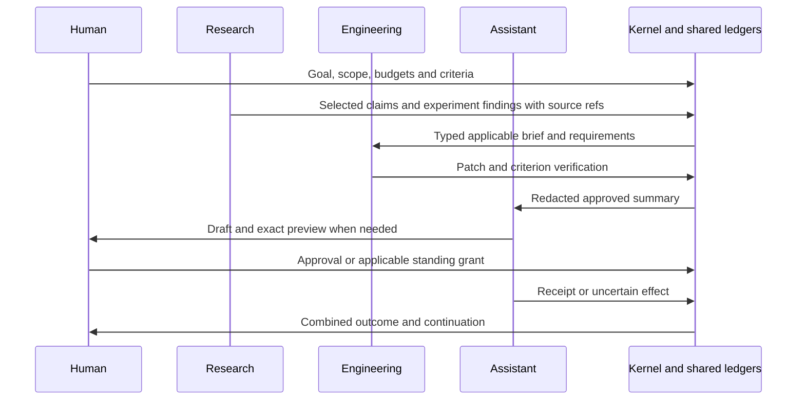

# Domain Packs và workflow Coding, Research, Assistant

**Kiến trúc đích cho Custos SADE.** Master [Parts 10–13](../../Custos.md) giữ quyết định; [plan §12–16](../development/workspace-restructuring-plan.md#12-đường-chạy-contracts-và-resource-lifecycle) giữ contracts, cost core, packets và evaluation. Artifact names bên dưới là vocabulary đích, chưa chứng nhận tất cả types/modules đã tồn tại. [Catalog](../development/codebase-architecture.md) xác định physical source.

Ba miền cùng dùng Task/run/workspace, source/context, authority, usage và evidence. Pack định nghĩa semantics và cách kiểm kết quả. Mỗi pack có thể dùng độc lập với model/harness phù hợp; không có pipeline ba agent bắt buộc.

## 1. Hợp đồng pack và foundation dùng chung

| Thành phần | Pack khai báo | Shared foundation thực hiện |
|---|---|---|
| Task kinds | Input/output, behavior và criterion | Task revisions/lifecycle/session bindings |
| Context recipe | Nguồn, retrieval/extraction, coverage | Scope/privacy filter, snapshots/CAS, compiler/freshness |
| Capabilities / skills | Operation requirements, instructions/rubrics | Registry availability, authority, dispatch/receipts |
| Workflow candidates | Direct/single/sequential/fan-out và join obligations | OI hard filters, compiler, scheduler/resources |
| Verifier profile | Assertion/rubric/environment/required checks | Evidence records, invalidation và completion gate |
| Economics / eval | Task features, quality constraints, fixtures | Shared reservations/attempt ledger, paired evaluation |
| Product views | Artifact và domain decisions | SDK/event projections, panes/attention |

`Pack ≠ skill ≠ capability ≠ worker ≠ model ≠ transport`. Repo Intelligence là subsystem snapshot/query; `repo_explain` là Engineering job; MCP là export adapter. [Capability/skill ownership](capability-catalog-and-skills.md) quyết định nơi đặt feature mới.

Artifact generation, authorization, operational receipt, semantic assessment và accepted outcome giữ riêng. Criterion pass/fail/unknown/stale dựa record có source/method/version; waiver là quyết định riêng. Worker report/citation/approval metadata/exit code không đủ cho mọi criterion.

## 2. Engineering Pack

### 2.1 Task kinds và acceptance

| Job | Input | Output | Acceptance |
|---|---|---|---|
| Repo explain | Snapshot, question/symbol/path, scope | Explanation + anchors/limitations | Version/locator đúng; không vượt source đã đọc |
| Diagnose | Symptoms/trace/expected behavior/env | Hypotheses + reproducer/observations | Experimental cause khác hypothesis; missing reproduction ghi unknown |
| Bugfix | Issue/criteria/allowed paths/baseline | Patch + behavior/test receipts | Relevant regression, diff scope và behavior criterion |
| Feature / UI | Behavior/API/UI contract | Implementation + acceptance checks | Behavior mới; compatibility/accessibility/platform khi được yêu cầu |
| Refactor | Scope/invariants/interfaces | Patch + parity evidence | Behavior/API preserved; nhiều file không tự justify fan-out |
| Review | Diff/base/commit/risk context | Findings có location/impact/rationale | Support/repro; speculative findings gắn nhãn |
| Migration | Versions/data/compatibility/backout | Migration artifacts + pre/post checks | Data và compatibility theo criterion; recovery plan |

Native strong agent làm trọn refactor lớn và local/API model dùng Custos worker loop đều hợp lệ. Tool/environment capability và criterion quyết định route, không provider label.

### 2.2 Repo Intelligence và context

`inventory/hash → lexical/symbol query → capped structure/test expansion → source spans → ContextPack`. Index gắn HEAD, selected dirty bytes, parser/index generation và coverage của ignored/generated/untracked/unresolved files. Syntax relation không tự là compiler-resolved call graph.

Exact identifier/trace ưu tiên lexical; AST/LSP/test map khi có; embedding/rerank thêm khi có giá trị. Output giữ locator/version/method/omissions, pagination và raw-source retrieval. S1 scout tìm test/log/caller candidates; S2 vẫn đọc source trong scope. Compaction không bỏ assertion/invariant để làm đẹp token count.

### 2.3 Workspace và patch lifecycle

Reader dùng read-only snapshot. Assist one-writer có thể apply vào allowed checkout theo grant/base hash; delegated/candidate writers dùng worktree khi cần. Parallel writes cần effective disjoint targets và integration gate. Shared API/build/test fixture tạo coupling dù filenames khác.

Workspace giữ baseline, selected dirty manifest, work directory, host, processes và output refs; worktree không là OS sandbox. Native harness tự quản worktree cần khai báo owner; không lồng hai workspace managers. Existing dirty edits không bị stash/reset tự động.

Patch artifact giữ Task/run/source revision, diff digest, write set và file preconditions. Apply/merge là effect riêng: target/freshness/conflict/permission → receipt → verifier trên integrated snapshot. Bundle integrity không tạo distributed atomicity cho mutation đa file/SQLite/shell; partial apply phải reconcile/roll-forward/back theo adapter.

### 2.4 Verification, UI và economics

Test receipt giữ command/env/toolchain/snapshot/exit/logs. Agent-authored test là supporting artifact; acceptance dựa trusted baseline/hidden harness hoặc reviewed test diff theo criterion. `cargo test` pass chỉ xác nhận test set đó trong environment đó, không chứng minh behavior chưa được suite kiểm. Targeted tests giúp feedback; required relevant regression/integration vẫn chạy.

Flaky checks có bounded retry/inconclusive; source drift invalidates dependent evidence. [Agentless](https://arxiv.org/abs/2407.01489) gợi simple localization/repair/validation baseline, không thay rubric feature/refactor.

Build preset mở agent chat/terminal, source/diff và test matrix; hiện cwd/host/assurance/actual executor/criteria/cost. Compare cùng baseline/verifier, failed candidates còn trong accounting; chọn winner chưa authorize merge. Economical default là one capable worker + exact context + optional scouts + required checks. Packet đầu: repo explanation rồi one-writer bugfix/reproducer/restart; parallel refactor sau integration conformance.

## 3. Research Pack cho programming, AI và Data

[Research Workbench blueprint](research-workbench-blueprint.md) là đặc tả sâu cho vòng source → analysis → artifact → review → revision → handoff, dựa trên docs Claude Science và source Open Science đã đối chiếu. Nó bổ sung assessment axes thay cách hiểu L0–L3 như thang chân lý, notebook/kernel lifecycle, versioned comments, dataset/experiment contracts và R0–R7 gắn với desktop packets.

### 3.1 Source, data và experimental execution

Research có ba chiều: tri thức từ nguồn, data/evaluation, thí nghiệm thực thi. Source QA không bắt buộc compute; reproduction cần vượt citation. [Claude Science](https://www.anthropic.com/news/claude-science-ai-workbench) tham khảo cách nối sources/code/environment/figures/compute; Custos ưu tiên programming/AI/Data và scientific connectors theo user job.

| Job | Artifact | Acceptance |
|---|---|---|
| Source QA / paper read | Answer/PaperCard/source/version/spans/limits | Locator, extraction/support và parse coverage |
| Compare | Paired criteria matrix | Same units/versions/baselines; contradictions/caveats |
| Literature / deep research | Search/inclusion ledger, corpus, claims/brief | Coverage scope, supported/contradicted/unknown claims |
| Dataset audit | DatasetCard/split/statistics/leakage/license | Provenance/units/sample/split checks theo rubric |
| Experiment design | Hypothesis/baseline/metrics/controls/resource plan | Falsifiable protocol, no test-data tuning |
| Reproduce / ablate | Code/env/data/model/config/seeds/logs/metrics/figures | Comparable protocol, uncertainty/repeats nếu yêu cầu, traceable outputs |
| Result analysis | Findings + calculations/caveats | Evidence-based difference; divergence không tự disproves paper |
| Research → code | Selected claims/applicability/spec proposal | Requirements theo user intent, Engineering acceptance riêng |

### 3.2 Source và claim pipeline

`acquire → dedup/version → parse/OCR coverage → select passages → atomic claims → counter-evidence → reconcile → synthesis/export`. Search ledger giữ queries/date/filters/inclusion/exclusion. Single PDF dùng one reader; literature breadth có bounded independent readers với precise packets/artifact refs. [Anthropic research system](https://www.anthropic.com/engineering/multi-agent-research-system) hỗ trợ pattern và cảnh báo overhead, không đưa token multiplier của vendor vào Custos SLO.

Source record giữ canonical ID/DOI/URL/date/version/fetched_at/digest/license/raw artifact. Passage giữ page/section/line/byte, extraction method và OCR/table/figure gaps. Claim giữ proposition/units/baseline/qualifiers, source-vs-inference và evidence links. Dedup nguồn secondary cùng gốc không biến chúng thành independent evidence.

Locator validity, extraction fidelity và semantic support được kiểm riêng. DOI hoặc `verified=true` do actor đưa không chứng minh support. Assessor có identity/version/rubric/source/uncertainty; half-supported claim/negation/OCR/v1-v2 có fixtures. [ALCE](https://aclanthology.org/2023.emnlp-main.398/) và [MiniCheck](https://aclanthology.org/2024.emnlp-main.499/) định hướng evaluation, không oracle.

Rechecking có cap/material trigger: missing support, contradiction hoặc source drift. Bibliographic API unavailable → freshness unknown; không chứng minh paper chưa retracted. `FIRE` là mnemonic nội bộ nếu chưa pin exact paper, không dependency khoa học đã xác minh.

Local API research là đường nhập bản nháp: backend ép `SourceRecord.verified=false`, tính lại digest của `PassageAnchor.exact_text`, ép claim về L0 và không nhận `sealed_proof_uri`/`verified_by` từ client làm proof. Endpoint lưu run chỉ nhận pending proposal và insert một lần; execution receipt/update phải đến từ runtime/adapter có attempt identity. Handoff tra claim canonical trong repository và tạo Coding Task với provenance + trạng thái L0, không coi statement client gửi là nguồn. Đây là invariant hiện thực ban đầu, chưa phải claim verifier/source byte-verifier hoàn chỉnh.

### 3.3 Experiment plane

Experiment nối hypothesis/protocol với code revision, environment lock, data version/split, model/weights/config, seed, hardware, job identity và outputs. Figure/calculation nhỏ giữ input/code refs thích hợp; PaperCard không cần fields HPC/dataset vô nghĩa.

Runtime allocate directory/kernel/compute qua ports; adapters chạy local trước, remote/GPU sau capability/egress/budget conformance. Data ở allowed host; prompt nhận selected permitted context. Persistent kernel reuse có lifetime/memory/version/isolation limits. Cancel/restart observe job; lost connection không bằng stopped.

Bibliographic availability, environment ready, code executable, measured result và comparability là các dimensions evidence; không một proof cascade tự động. Tolerance/repeats/interval theo protocol/metric, không ±5% chung. Missing data → blocked/limited/unknown. Divergence → finding có conditions; research Task có thể đạt mục tiêu đánh giá divergence dù chưa tái lập metric paper.

### 3.4 UI và economics

Study preset source/PDF/claims bên brief; experiment panes dataset/protocol/code/config/runs/metrics/figures. Mỗi số/figure mở được inputs/code/environment; parse gap hiện cạnh claim. Local export giữ refs và conflict/retention; remote export cần scope.

Economical default: native text trước OCR từng trang, parse/index cache theo digest/version, screen/dedup trước deep read, bounded readers, small validation trước full compute khi protocol cho phép. Supported-claim precision đo cùng coverage. Packet đầu source QA với wrong citation/OCR gap; tiếp theo small reproducible programming/AI experiment.

## 4. Assistant Pack và automation

### 4.1 Jobs và autonomy

| Job | Artifact / effect | Completion |
|---|---|---|
| Personal QA / notes / briefing | Answer/notes với temporal source | Scope/freshness/privacy/identity |
| Inbox triage / draft | Classification/draft/identity candidates | Draft chất lượng, status drafted; chưa sent |
| Schedule proposal | Slots/event draft | IANA timezone/DST/availability/freshness |
| Send / create / update | Exact payload + connector receipt | Canonical authorization + observed outcome/reconcile |
| Reminder / automation | Trigger occurrence + bounded Task/Run | Timing/frequency/expiry/per-run status/cost/revoke |

L0 on-demand answers; L1 scoped observation/suggestions; L2 drafts; L3 bounded effects; L4 bounded recurring/event-driven runs. Không unrestricted level. Presence và authority riêng: offline có thể chạy standing grant còn hợp lệ, không tự cấp quyền.

### 4.2 Identity, time và exact payload

Resolve bằng trusted contacts/account source, stable address/identity/freshness; ambiguity hoặc conflicts cần chọn. Address từ PDF/email untrusted không tự trusted. Calendar dùng IANA timezone/now/DST fold-gap/attendee timezone và availability preflight gần dispatch.

Canonical payload gồm account/from/to/cc/bcc/subject/body/attachments; calendar có participants/time/timezone/resource. Preview đúng nội dung sẽ gửi. Approval bind unambiguous canonical serialization digest, Task/grant/policy version/expiry. Payload/account/attachment đổi cần reauthorize; hash nối chuỗi ambiguous không đủ.

### 4.3 Effect state và verifier

`resolve → draft/edit → preview → grant/permit → durable outbox/claim → connector → receipt/post-read → evidence`. Approval validation trước effect; identity/payload/external outcome verification sau effect. Nonempty token/hash hoặc actor metadata `approved=true` không chứng minh approval canonical và không chứng minh sent.

Timeout sau server có thể đã nhận → uncertain; reconcile theo external ID/post-read/idempotency support. Retry chỉ khi connector semantics cho phép. Cancel sau send không đảo quá khứ; correction/delete/update là effect mới. Account/credential/rate errors phải được phân loại; secrets là secure local reference, không prompt/artifact/log.

### 4.4 Recurring automation, UI và economics

Spec giữ trigger/timezone/account/source/targets/output class/provider/egress/max runs, per-run và aggregate caps, expiry/notification/retry/reconcile. Occurrence ID dedup; overlap/missed-run behavior explicit. Revoke chặn future dispatch, in-flight effect vẫn reconcile. Default draft/notify nếu chưa outbound grant.

Notify theo preference và decision: complete/blocker/user deadline/uncertain effect. Progress nằm timeline; snooze không che uncertainty khi quyết định resend. Assist panes draft/identity/calendar/outbox + controls; automation history/cost/revoke. Jarvis-like experience dựa continuity và bounded initiative.

Economical default scoped retrieval, deterministic time/identity, stable personal facts có expiry, calibrated S1 triage và S2 nuanced draft. Permission không cascade theo cheap confidence. Packet đầu draft/schedule + fake connector timeout/duplicate/payload/account drift; real send sau conformance.

## 5. Execution paths và nơi đặt features

| Chủ đề | Pack semantics | Shared/runtime | Concrete edge |
|---|---|---|---|
| Coding | engineering skills/profile/verifiers/declarative | context/repo_intelligence, agent, workflow/workspace | adapters Git/fs/parser/LSP/process/browser; persistence index |
| Research | research skills/profile/verifiers/export, experiment services khi cần | context/memory/source refs/run/compute | adapters PDF/OCR/web/data/kernel/job; persistence artifacts |
| Assistant | assistant skills/profile/verifiers/trigger semantics | workflow/continuation/budget/effects | adapters contacts/mail/calendar/notes/notifications; outbox |
| Economics | Pack features/quality/fixtures | runtime OI/context/judgment, core budget | provider usage/cache profiles; persistence attempt ledger |

Module roots giữ trong `crates/custos-packs/src/<pack>/`, foundations theo [plan mapping](../development/workspace-restructuring-plan.md#13-cost-core-policy-estimator-ledger-và-projections). Extend existing paths/types; proposed workspace/experiment/connectors chỉ tạo khi có behavior. Không copy semantics vào mỗi MCP/harness adapter.

ModelPort path nhận tool loop/context/recipes từ Custos. Native AgentRuntimePort giữ loop và receive context/skills/capabilities theo support thật; Custos verify artifacts ngoài harness. Unsupported injection/resume/usage được khai báo. Native coding agent có thể chạy research analysis nếu environment/tool phù hợp; không cần ba agent brands cho ba pack.

## 6. Handoff và shared acceptance

Handoff giữ Task/node/producer/consumer, artifact type/version/digest, source dependencies, selected content/redaction/privacy, intent/consent và caveats. Child budget allocation thuộc shared ceiling, không copy balance. Grant/permit không tự đi theo artifact; stale/schema mismatch cần refresh/migrate/block.

Parent completion kiểm obligations từng miền: paper supported không tự authorize requirement; patch accepted không authorize email. Partial/unknown/stale/uncertain hiện theo criterion, không gộp thành done của cuối pipeline.

## 7. Acceptance và falsification

| Miền | Fixtures bắt buộc | Outcome metrics |
|---|---|---|
| Coding | Base drift/dirty main/test tampering/native bypass/coupled writers | Behavior/parity/regression/false pass, review effort/full cost |
| Research | Good citation wrong support/forged verified/OCR/version/leakage/metric mismatch | Supported claims + coverage, reproducibility/comparability, review/compute |
| Assistant | Ambiguous contacts/forged approval/payload-account drift/DST/timeout/replayed trigger/revoke | Recipient/payload/time/status, duplicates/false-sent, approval effort/cost |
| Cross-pack | Private leakage/implicit grant/wrong revision/partial obligation | Combined criteria, provenance/authority, resume/handoff effort |

Operational facts, semantic assessor và human rubric phối hợp theo criterion. Simulator/test pass không là product benchmark; [plan §16](../development/workspace-restructuring-plan.md#16-evaluation-và-release-gate-không-tự-chứng-minh) giữ paired baselines và publication gates.
