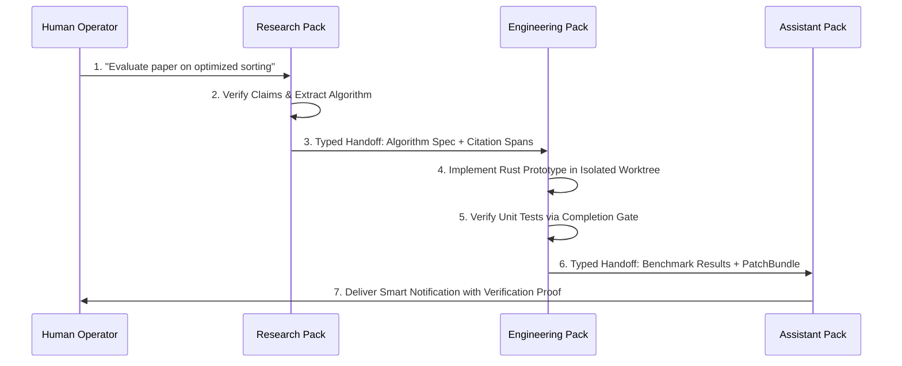

# Domain Packs & Cross-Pack Protocols

> **Classification:** Core Architectural Pillar  
> **Source of Truth:** Authoritatively defined in [Custos Master Specification](../../Custos.md) (Parts 10, 11, 12, 13).  
> **Architecture Hub:** See [Custos Architecture Overview](README.md).

Custos organizes domain-specific problem solving into three distinct **Domain Packs** hosted within `crates/custos-packs`: the **Engineering Pack**, the **Research Pack**, and the **Assistant Pack**. Cross-pack protocols enable verified, end-to-end workflows spanning from academic literature research to codebase patching and proactive notifications.

---

## 1. The Three Domain Packs

```text
┌────────────────────────────────────────────────────────────────────────┐
│                        THREE CANONICAL PACKS                           │
├─────────────────────┬──────────────────────────┬───────────────────────┤
│ DOMAIN PACK         │ PRIMARY MISSION          │ CORE WORKFLOW OUTPUT  │
├─────────────────────┼──────────────────────────┼───────────────────────┤
│ **Engineering**     │ Autonomous software      │ `PatchBundle`         │
│                     │ engineering & bug fixing │ & Test Receipts       │
├─────────────────────┼──────────────────────────┼───────────────────────┤
│ **Research**        │ Literature synthesis &   │ `ReproducibilityBundle`│
│                     │ claim verification       │ & Dataset Cards       │
├─────────────────────┼──────────────────────────┼───────────────────────┤
│ **Assistant**       │ Proactive workflow       │ Scheduled Automations │
│                     │ & notification assistant │ & User Notifications  │
└─────────────────────┴──────────────────────────┴───────────────────────┘
```

---

## 2. Engineering Pack Architecture

The Engineering Pack is optimized for real-world software engineering across polyglot repositories:

### 2.1 Three-Path Execution Workspace (`ExecutionWorkspace`)
To prevent work in progress from polluting the developer's clean repository branch, execution is isolated into three paths:
1. **Canonical Source Path:** The read-only root repository path pinned to the starting commit SHA.
2. **Isolated Worktree Path:** An ephemeral Git worktree created specifically for the task run (`isolated_worktree`), where all code edits and intermediate builds execute.
3. **Artifact Output Path:** Storage path for generated patch diffs, compiler error logs, and test output receipts committed to Content-Addressed Storage.

### 2.2 Atomic Patch Bundles (`PatchBundle`)
All file modifications are packaged as an atomic bundle:
```rust
pub struct PatchBundle {
    pub bundle_id: Uuid,
    pub base_commit: GitCommitSha,
    pub diff_content: String,
    pub affected_files: Vec<PathBuf>,
    pub test_receipts: Vec<ReceiptId>,
    pub checksum: Sha256Hash,
}
```
A patch is never applied directly to the master branch until the Completion Gate verifies that all pre-existing and newly added tests pass cleanly.

---

## 3. Research Pack Architecture

The Research Pack enforces scientific rigor and reproducibility for literature analysis and dataset exploration:

### 3.1 Reproducibility Bundle (`ReproducibilityBundle`)
Every research finding is packaged with complete experimental provenance:
- **Exact Source Locators:** DOI, arXiv ID, or URL with cryptographic content hash.
- **Passage Spans:** Exact line and character byte offsets of quoted excerpts.
- **Execution Environment:** Pinned Python/Rust package dependencies (`uv.lock` / `Cargo.lock`).
- **Dataset Cards:** Documenting provenance, license, missing data rates, and potential biases.

### 3.2 The FIRE Pattern (Fact Iterative Re-Verification)
Academic claims undergo iterative multi-step scrutiny:
1. **Extraction:** Locating the raw passage in the source document.
2. **Support Assessment:** Verifying that the passage logically supports the specific claim made.
3. **Freshness & Retraction Check:** Verifying against open bibliographic APIs that the paper has not been retracted or superseded by an erratum.

---

## 4. Assistant Pack Architecture

The Assistant Pack bridges long-term user context with day-to-day productivity:

### 4.1 Five Autonomy Levels
1. **Level 0 (Advisory Only):** Suggests actions; executes nothing without explicit confirmation.
2. **Level 1 (Drafting):** Prepares drafts (e.g., email reply, meeting summary); awaits user approval to send.
3. **Level 2 (Bounded Autonomy):** Executes routine actions within pre-approved standing grants.
4. **Level 3 (Escalation on Anomaly):** Operates autonomously; only pauses when unexpected parameters occur.
5. **Level 4 (Full Autonomy):** Unrestricted execution within strict budget ceilings.

### 4.2 Anti-Patterns Eliminated
- **Identity Resolution Anti-Pattern:** The assistant never assumes two entities with the same name are identical without validating email or domain keys.
- **Notification Fatigue:** Low-priority status updates are batched into a daily digest; only security-critical blockages trigger immediate alerts.

---

## 5. Cross-Pack Handoff Protocols

Complex tasks seamlessly transition across pack boundaries using typed handoff contracts:



Every cross-pack handoff carries:
- Parent `TaskId` and revision anchor.
- Immutable CAS digests of intermediate artifacts.
- Preserved taint labels and budget reservations.
