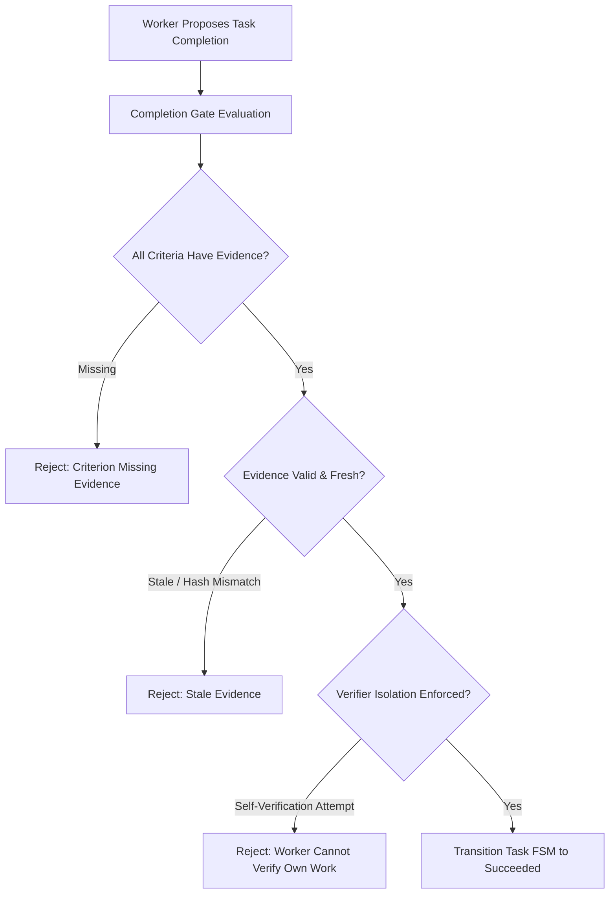

# Evidence Engine & Completion Gate

> **Classification:** Core Architectural Pillar  
> **Source of Truth:** Authoritatively defined in [Custos Master Specification](../../Custos.md) (Part 5).  
> **Architecture Hub:** See [Custos Architecture Overview](README.md).

In conventional agent frameworks, tasks complete when an LLM outputs an affirmative textual statement such as "I have completed the task." In Custos, model assertions possess zero evidentiary value. A task can only reach a terminal `Succeeded` state through the **Completion Gate**, backed by first-class, verifiable empirical evidence.

---

## 1. The Three-Tier Evidence Hierarchy

Evidence is strictly classified into three tiers based on objective verifiability:

```text
┌────────────────────────────────────────────────────────────────────────┐
│                        EVIDENCE HIERARCHY                              │
├─────────────────┬─────────────────────────────┬────────────────────────┤
│ TIER            │ VERIFICATION NATURE         │ ACCEPTABLE SOURCES     │
├─────────────────┼─────────────────────────────┼────────────────────────┤
│ **1. Fact**     │ Deterministic & Objective   │ Unit test exit code 0, │
│                 │ (Machine-verified)          │ compiler output, CAS   │
├─────────────────┼─────────────────────────────┼────────────────────────┤
│ **2. Extraction**│ Structural & Anchored       │ AST tree-sitter span,  │
│                 │ (Exact byte-offset support) │ exact line citation    │
├─────────────────┼─────────────────────────────┼────────────────────────┤
│ **3. Semantic** │ Probabilistic Evaluation    │ Rubric LLM judge,      │
│                 │ (Bounded confidence score)  │ human sign-off         │
└─────────────────┴─────────────────────────────┴────────────────────────┘
```

### EvidenceRecord Data Structure
```rust
pub struct EvidenceRecord {
    pub evidence_id: EvidenceId,
    pub task_id: TaskId,
    pub criterion_id: CriterionId,
    pub evidence_kind: EvidenceKind,
    pub verifier_id: VerifierId,
    pub artifact_digest: Option<CasDigest>,
    pub confidence_score: f32, // 1.0 for deterministic facts
    pub validity_window: Option<TimeRange>,
    pub produced_at: chrono::DateTime<chrono::Utc>,
}

pub enum EvidenceKind {
    DeterministicReceipt { exit_code: i32, receipt_id: ReceiptId },
    StructuralExtraction { file_path: PathBuf, byte_range: (usize, usize), hash: Sha256Hash },
    SemanticJudgment { rubric_id: String, score: f32, rationale_hash: Sha256Hash },
    HumanAttestation { reviewer_id: ActorId, comment: Option<String> },
}
```

---

## 2. The Completion Gate

The `CompletionGate` is an independent verification module within `crates/custos-core`. It is the **sole component** with authority to transition a task from `Running` to `Succeeded`.



### Invariant Rules Enforced by the Gate:
1. **Exhaustive Criteria Coverage:** Every criterion declared in the `TaskContract` must map to at least one valid `EvidenceRecord`.
2. **Freshness Guarantee:** If source code files in the workspace were modified after an evidence record was generated, that evidence is automatically marked `Stale` and rejected.
3. **Verifier Isolation:** A worker or model that authored an implementation or generated a patch is strictly prohibited from serving as the sole verifier of that patch. Verification must be performed by deterministic tools (`cargo test`) or an independent verifier profile.

---

## 3. The REAL Principle

Custos enforces the **REAL Principle** (Removal of Epistemic Assumption from LLMs):
- **Rule:** A model's parametric knowledge (internal weights learned during pre-training) can **never** serve as an admissible Fact.
- **Enforcement:** If a worker asserts that an API behaves in a certain way or that a bug exists, it must provide an external anchor: a test execution receipt, an AST call-graph edge, or an exact line citation from a local file. Unanchored assertions are flagged as `Inference`, never as `Fact`.

---

## 4. Evidence-Grounded Verifiable Reasoning (EG-VAR)

To audit how an agent arrived at a conclusion or patch, Custos records an **Audit Trail EG-VAR**:
1. **Observation Anchor:** Exact commit hash and file diff inspected by the worker.
2. **Reasoning Trace:** Graph of intermediate hypotheses linked to retrieved code spans.
3. **Action Correlation:** Every file edit is linked directly to the hypothesis it addresses.
4. **Outcome Proof:** The terminal execution receipt confirming test suite resolution.

This ensures that months after a task has been completed, any engineer can inspect the exact evidence chain that justified the modification.
