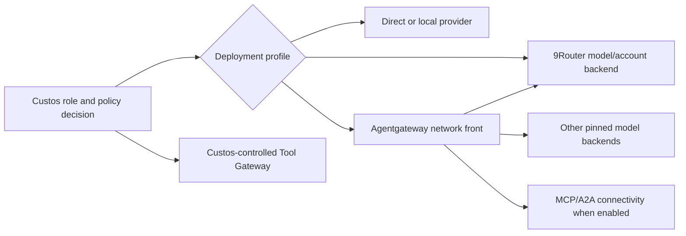

# Intelligence Hub: multiple S1/S2 roles and optional gateways

**Document ID:** ARCH-HUB-01. **Status:** proposed architecture and research-to-spike contract, not a deployed topology. **Updated:** 2026-09-27.

This page covers model/role routing. The [connectivity architecture](connectivity-hubs.md) separately specifies MCP tool capabilities and external coding-agent runtimes. A 9Router model endpoint does not imply support for every coding agent's session or internal tools.

## Decision

The Hub is a logical subsystem in Custos's daemon, not a mandatory new process or crate. It presents one operator view of role candidates, route constraints, budget, health, costs and provenance. Custos owns semantic choice and authority. Network and provider gateways remain optional infrastructure.

For a small local installation, direct/local ModelPort and Custos ToolPort suffice. A many-account workstation may add 9Router. A team needing shared network identity/routes/MCP/A2A may add Agentgateway. Chaining both is a **hypothesis to test**, not a required deployment shape. Agentgateway documents a custom OpenAI-compatible provider; 9Router documents a `/v1/*` compatibility API. Actual stream, tool call, usage and error behavior must pass conformance before that chain is approved. [Agentgateway custom provider](https://agentgateway.dev/docs/standalone/latest/integrations/llm/providers/custom/), [9Router architecture](https://github.com/decolua/9router/blob/master/docs/ARCHITECTURE.md).

## Tier, role and backend are distinct

| Concept | Example | Owner |
|---|---|---|
| Tier | System One, System Two, deterministic/abstain | Cognitive policy |
| Role | `repo.locate`, `evidence.extract`, `plan.engineering`, `implement.code`, `research.synthesize` | Versioned role registry and eval owner |
| Candidate | A specific model/runtime/route with capabilities and limits | Provider adapters plus Hub registry |
| Pool | Eligible candidates for a task class and data policy | Hub configuration |

One model can serve several roles; one role can have several candidates. Routing filters by task class, tool/format capability, egress/privacy, pinned preference, quality floor, budget and health before any weighted selection. A route change is a new recorded attempt at a safe checkpoint. S1 confidence cannot grant permission or mark completion.

## One fallback owner per pool

| Mode | Custos | Agentgateway | 9Router |
|---|---|---|---|
| `r9-account-owner` | Select approved role/model class and budget | Static route, no competing model failover | Account selection; model fallback only within approved equivalent set |
| `ag-model-owner` | Select role/virtual profile and budget | Owns virtual-model failover and retry | Pinned endpoint with cross-model fallback demonstrably disabled, or not in this pool |
| `custos-strict` | Exact candidate, reroute only at safe checkpoint | Fixed route or bypass | Strict/no model fallback |

Pool configuration records `fallback_owner`, `retry_owner`, `credential_owner`, `route_visibility`, `max_attempts` and `quality_floor`. The validator rejects double fallback or silent quality downgrades. Agentgateway failover may require health eviction **and** retry; the request that first triggers eviction can fail. [Agentgateway virtual models](https://agentgateway.dev/docs/standalone/latest/documentation/llm/virtual-models/). Do not assume 9Router can be pinned per pool until a version-specific test proves it; its [smart routing](https://github.com/decolua/9router/blob/master/gitbook/content/en/features/smart-routing.md) includes automatic fallback behavior.

## Durable route facts

Record `RoleProfileVersion`, `CandidateId`, `RouteDecision`, `RouteAttempt`, actual provider/model when observed, translation path, fallback reason, usage quality and correlation to SessionRun or Task/Run/Step. `actual_model` is `Known(value, source)` or `Unknown(reason)`, never guessed from an alias. Count estimated, metered and billed cost separately; never add gateway and provider usage as if they were distinct purchases. Reserve a conservative budget before dispatch and settle after response. Agentgateway's documented per-key budget accounting occurs after provider usage returns and therefore is not a per-request hard ceiling. [Budget limits](https://agentgateway.dev/docs/standalone/latest/documentation/llm/cost-controls/budget-limits/).

Gateway telemetry is not Task evidence. Agentgateway MCP authorization docs expose tool name/target at request time, while arguments may only be available after the request; exact action-argument authorization remains in Custos's controlled tool path unless another pre-effect mechanism is proven. [MCP authorization](https://agentgateway.dev/docs/standalone/latest/documentation/configuration/security/mcp-authz/).

## Implementation seam in the existing tree

Start with a versioned role registry and route policy in `custos-cognitive`; extend the `custos-provider-sdk` port with route/provenance metadata without injecting a whole Task object into the adapter; put concrete gateway adapters in `custos-providers`; compose them in `custos-daemon`; persist route decisions/attempts in `custos-persistence`; expose operator configuration through `custos-local-api`. Keep tool-effect authority in `custos-security`. Do not create a `custos-hub` crate or control-plane service until a real module boundary justifies one.

Custos holds desired configuration and observes effective sidecar configuration through supported adapters. If a management API is unavailable, use versioned deployment files and drift detection; never write into a sidecar's private database. Credentials have one declared owner and are referenced, not copied among three stores.

## Adoption gates

Pin 9Router and Agentgateway releases. Test fake upstream markers across at least three roles, three failure classes, stream/non-stream and direct/chained modes. Assert actual model/account provenance, route receipt, tool delta, cancellation, usage, duplicate retry, budget and secret redaction. Measure p50/p95 overhead and time-to-verified-outcome, then record an adopt/defer ADR. F1 and F2 do not depend on these sidecars.
