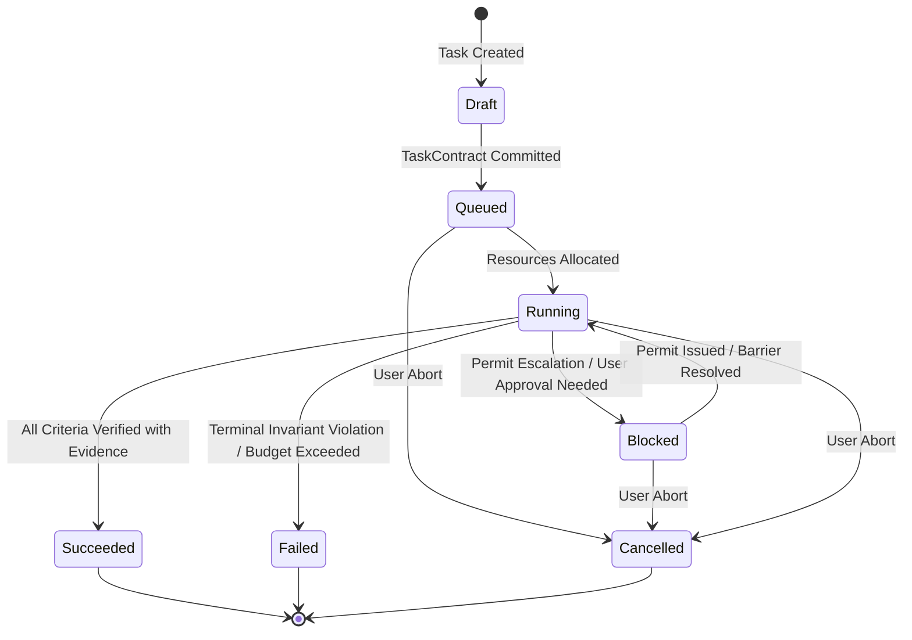

# Kernel Mechanics, Task Lifecycle & State Machines

> **Classification:** Core Architectural Pillar  
> **Source of Truth:** Authoritatively defined in [Custos Master Specification](../../Custos.md) (Part 3).  
> **Architecture Hub:** See [Custos Architecture Overview](README.md).

Custos explicitly decouples conversational user interaction from persistent business work. A chat session is an ephemeral communication medium; a task is a durable, auditable business entity managed by an invariant-enforcing kernel and persisted in a relational store.

---

## 1. Operational Object Taxonomy

To optimize latency, compute expenditure, and safety, Custos categorizes incoming user interactions into four operational objects:

| Object Type | Operational Purpose | Persistence Profile | I/O Mutation Authority |
|---|---|---|---|
| **Session** | Transient interaction channel (CLI, IDE, Web). | Canonical database record | Strictly forbidden |
| **EphemeralQuery** | Rapid lookup, Q&A, or conversational clarification. | Optional logging | Strictly forbidden |
| **TaskCandidate** | Proposed execution plan surfaced during exploration. | Ephemeral / Scratch | Read-only survey |
| **TaskContract** | Formally committed unit of durable work. | Full transactional FSM | Governed side effects |

### TaskContract Definition
A committed `TaskContract` establishes non-negotiable boundaries before execution begins:

```rust
pub struct TaskContract {
    pub task_id: TaskId,
    pub project_profile_id: Option<ProjectProfileId>,
    pub goal: String,
    pub scope: TaskScope,
    pub budget_limit: Budget,
    pub deadline: Option<chrono::DateTime<chrono::Utc>>,
    pub pack_kind: PackKind,
    pub model_pin: Option<ModelSpec>,
    pub local_only: bool,
    pub checkpoint_policy: Option<CheckpointPolicy>,
    pub resumption_token: Option<ResumptionToken>,
    pub human_availability: HumanAvailability,
    pub standing_grants: Vec<StandingGrantRef>,
    pub created_at: chrono::DateTime<chrono::Utc>,
}

pub enum HumanAvailability {
    Present, // User is actively available at workstation to review escalations
    Absent,  // User is offline; task blocks if actions exceed standing grants
}
```

---

## 2. The Four Independent Finite State Machines (FSMs)

Custos avoids monolithic state tracking by isolating lifecycle responsibilities into four distinct state machines:



### 2.1 Task FSM
Governs the aggregate task lifecycle:
- `Draft`: Contract formulation and interactive scoping.
- `Queued`: Awaiting runtime execution dispatch.
- `Running`: Active step execution, context generation, or worker coordination.
- `Blocked`: Parked awaiting human permit sign-off, external input, or budget adjustment.
- `Succeeded`: Terminal state reached when all criteria have valid evidence.
- `Failed`: Terminal state reached upon unrecoverable crash, budget depletion, or tampering.
- `Cancelled`: Terminated by explicit operator intervention.

### 2.2 EffectAttempt FSM
Tracks the exact lifecycle of an authorized side-effect execution:
- `Prepared`: Action staged durably in the transactional outbox with parameter hash.
- `Dispatching`: Capability permit claimed and fenced execution dispatched.
- `ObservedSuccess`: Definite success confirmed via execution receipt or post-read.
- `ObservedFailure`: Definite failure confirmed by exit status or environment error.
- `Uncertain`: Process crash, network ambiguity, or timeout occurred during execution.

### 2.3 Criterion FSM
Tracks individual acceptance goals within a task:
- `Unknown`: Initial state; no empirical verification gathered yet.
- `Pass`: Verified by valid, unexpired evidence meeting the verifier profile.
- `Fail`: Objective verification test failed or produced conflicting output.
- `Stale`: Underlying code or artifacts were modified after verification was recorded.

### 2.4 WorkflowNode FSM
Tracks step execution in multi-node execution DAGs:
- `Pending` $\rightarrow$ `Ready` $\rightarrow$ `Running` $\rightarrow$ (`Done` | `Failed` | `Skipped` | `Blocked`).

---

## 3. The Five Durable Transaction Boundaries (T1–T5)

To guarantee ACID durability on SQLite without claiming false distributed atomicity, execution is partitioned into five sequential transactional boundaries:

| Boundary | Transaction Scope | Commit Invariant | Failure Mode Guarantee |
|---|---|---|---|
| **T1: Task Admission** | Insert `tasks`, `task_contracts`, `task_events`. | Contract validated; `TaskId` unique. | Rejection before queue admission. |
| **T2: Step & Attempt Staging** | Write step intent, reserve token budget, stage `outbox_messages`. | Atomic staging; permit not yet consumed. | Safe replay; no side effects executed. |
| **T3: Permit Fencing** | Claim `execution_permits` record; update attempt to `Dispatching`. | Single-use permit marked consumed atomically. | Prevents double dispatch under concurrency. |
| **T4: Receipt Ingestion** | Store `execution_receipts` or mark attempt `Uncertain`. | Recorded receipt digest matches execution output. | Resolves dispatch ambiguity upon restart. |
| **T5: Outcome & Evidence Closure** | Ingest `evidence_records`, update criteria FSM, advance Task FSM. | Completion Gate validates all criteria before `Succeeded`. | Invariant violations park task in `Blocked`. |

---

## 4. CheckpointPolicy & Resumption Protocols

Custos implements durable checkpointing inspired by transactional state storage standards:

```rust
pub struct CheckpointPolicy {
    pub frequency: CheckpointFrequency,
    pub include_artifacts: bool,
    pub retention_limit: usize,
}

pub enum CheckpointFrequency {
    AfterEachWorkflowNode,
    AtBarrierSynchronization,
    OnBudgetConsumptionThreshold(u32), // Snapshot triggered every X% budget spent
    ExplicitManualOnly,
}
```

### Crash Recovery and Reconciliation Flow

When `custosd` restarts after an abnormal termination (power loss, SIGKILL):
1. **WAL Integrity Check:** SQLite WAL checkpoint is verified and recovered cleanly.
2. **Scan for Uncertain Attempts:** The engine queries for all `EffectAttempt` records in state `Dispatching` or `Uncertain`.
3. **Idempotent Reconciliation:**
   - If the external tool supports queryable execution IDs (e.g., git commit hash, PID status), status is queried.
   - If proven executed, the attempt advances to `ObservedSuccess` with an ingested receipt.
   - If proven unexecuted, the attempt advances to `ObservedFailure` and is queued for safe retry.
   - If non-idempotent and indeterminate, the attempt remains `Uncertain` and requires human review. Blind replay is strictly prohibited.
