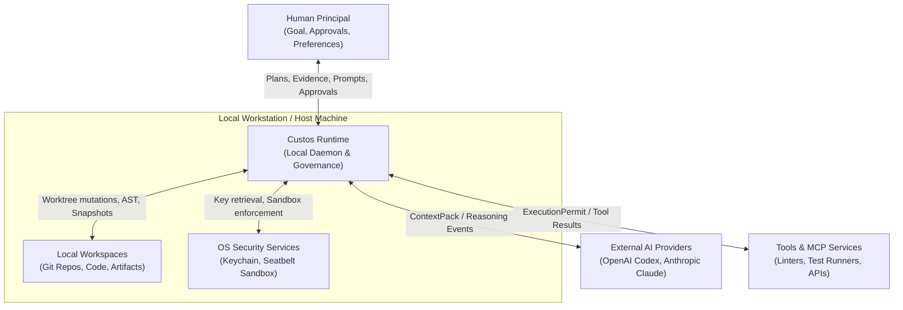
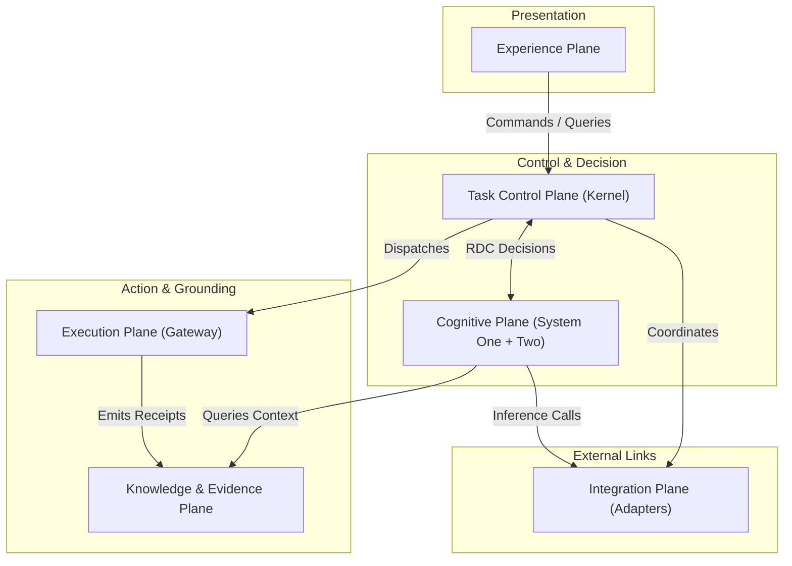
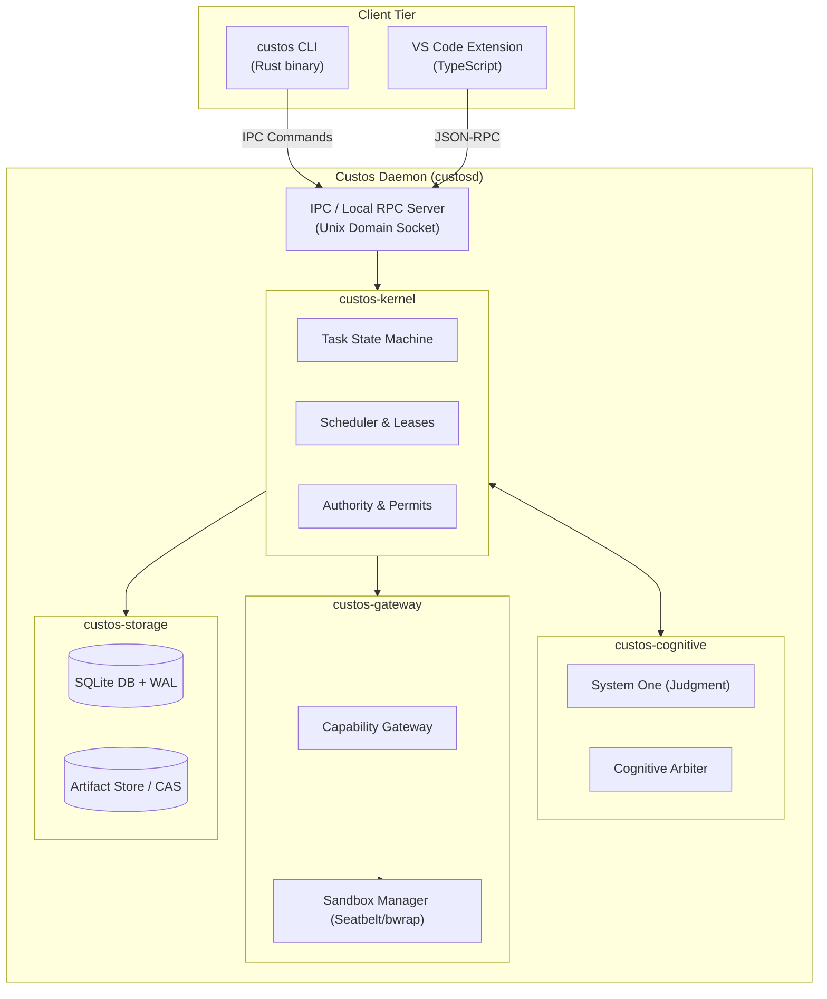

# System Architecture Overview

> **Status:** Canonical Baseline v4.0  
> **Standards:** C4 Model (Level 1 & 2) · arc42 (§5-8, §47)

This document describes the end-to-end architecture of Custos: system decomposition along execution boundaries, the 7-layer hierarchy, the 7 functional planes, the 3 security membranes, and C4 container topology.

---

## 1. System Context — C4 Level 1

Custos operates as an authoritative local runtime mediating between the user, local code repositories, external AI providers, and execution tooling.



### Trust Boundaries

| Boundary | Custos Ingests | Custos Dispatches | Trust Level |
|---|---|---|---|
| **Human Principal** | Goals, constraints, approval decisions | Plans, verified evidence, outcome bundles | Authenticated Principal (Supreme authority) |
| **Local Workspace** | Source code, documents, Git commit history | Patches, artifacts, metadata | **Untrusted Data** (may contain prompt injection or malicious code) |
| **AI Providers** | Reasoning events, action suggestions | Redacted ContextPacks, directives | External Untrusted Processor |
| **Tools / MCP** | Tool manifests, execution results, logs | Scoped actions bounded by `ExecutionPermit` | Configured per-adapter trust |
| **OS Keychain** | Auth secrets (API keys, tokens) | Authorized secret retrieval queries | Trusted Local OS Service |

> [!WARNING]
> Repositories, web pages, issues, PDFs, and tool outputs may contain **Prompt Injections**. In Custos, zero external data sources possess intrinsic authority.

---

## 2. Seven-Layer Architecture (7-Layer Model)

```text
+-----------------------------------------------------------------------------+
| L7: INTERFACE LAYER — CLI · VS Code Extension · Local Web UI                |
+-----------------------------------------------------------------------------+
| L6: ORCHESTRATION LAYER — Task Supervisor · Domain Pack Runtime · Leases    |
+-----------------------------------------------------------------------------+
| L5: JUDGMENT PLANE (System One) — Fast Evaluation · Risk Screening · Rules  |
+-----------------------------------------------------------------------------+
| L4: DELIBERATION PLANE (System Two) — Role-based Ephemeral Workers (LLMs)   |
+-----------------------------------------------------------------------------+
| L3: PROTOCOL & BOUNDARY MESH — Typed Internal Contracts · MCP Client        |
+-----------------------------------------------------------------------------+
| L2: KERNEL LAYER — State Machine · Capability Gateway · Evidence Verifier   |
+-----------------------------------------------------------------------------+
| L1: INTEGRATION LAYER — Provider Adapters · Tiered Sandboxes · OS Connectors |
+-----------------------------------------------------------------------------+
| L0: PERSISTENCE LAYER — SQLite + WAL · CAS Store · FTS5 · OS Keychain       |
+-----------------------------------------------------------------------------+
```

---

## 3. The Seven Functional Planes

Custos decouples system responsibilities into **Planes** rather than enforcing rigid linear execution pipelines:



1. **Experience Plane:** Client presentation surfaces (CLI, VS Code extension, notification inbox). Projects read models and dispatches commands; holds zero durable state.
2. **Task Control Plane (Kernel):** Authoritative system core: governs the Task State Machine, allocates resources, coordinates human approvals, and executes crash recovery.
3. **Cognitive Plane:** Combines fast reflexive System One evaluation (invariant checks, risk triage) with deep System Two deliberation (planning, patch generation).
4. **Execution Plane:** Manages side-effecting external operations via the Capability Gateway: Git worktree management, shell sandboxing, and MCP tool execution.
5. **Knowledge & Evidence Plane:** Maintains context indexing, 5-tier memory, verification evidence store, and the append-only Decision Ledger.
6. **Integration Plane:** Implements driver adapters for AI model providers (Codex, Claude, Antigravity, local models), OS services, and Keychain storage.
7. **Governance & Cross-Cutting:** Enforces budget ceilings, security policies, and structured telemetry across all planes.

---

## 4. The Three Membranes

All data flows and actions in Custos must traverse 3 impenetrable security membranes:

```text
       [ External / Untrusted ]
                 |
  ===============v===============  1. PRIVACY MEMBRANE
     (Egress Gate & Redaction)
  ===============|===============
                 |
  ===============v===============  2. AUTHORITY MEMBRANE
    (Exact-Payload Approval &
        ExecutionPermit)
  ===============|===============
                 |
  ===============v===============  3. RESOURCE MEMBRANE
     (Token, Time & Memory Budget)
  ===============|===============
                 |
       [ Protected Execution ]
```

- **Authority Membrane:** No action executes without valid authorization from the human principal or explicit bounds in the Task Contract.
- **Privacy Membrane:** Workspace source code and context never egress the workstation without passing the automated redaction and egress policy gate.
- **Resource Membrane:** Hard ceilings on token consumption, API calls, clock duration, and memory allocation.

---

## 5. Container Architecture — C4 Level 2



---

## 6. Target Implementation Topology

1. **Local Daemon (`custosd`):** Implemented 100% in **Rust** for maximum performance, predictable zero-GC latency, minimal memory footprint (< 50MB idle), and instant startup.
2. **Local Persistence:** Embedded **SQLite** operating in Write-Ahead Logging (`WAL`) mode with integrity verification and an outbox pattern for durable transaction processing.
3. **OS Sandboxing:** Leverages native OS isolation: `sandbox-exec` on macOS (Seatbelt profiles) and `bubblewrap` / namespaces on Linux.
