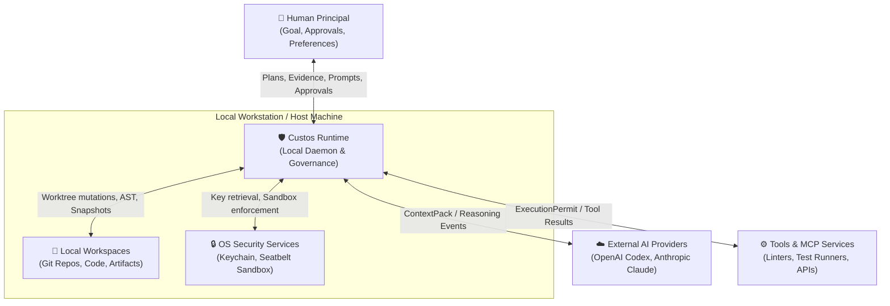
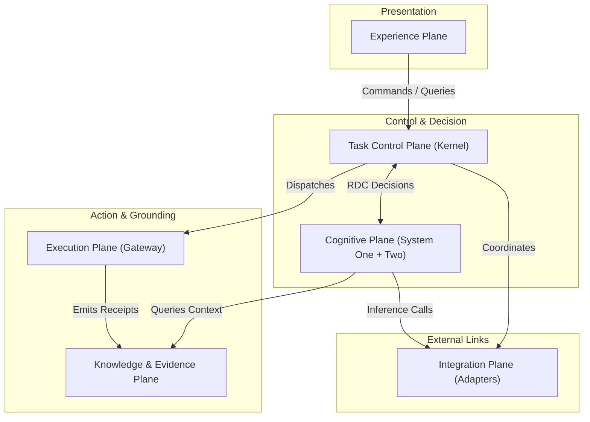
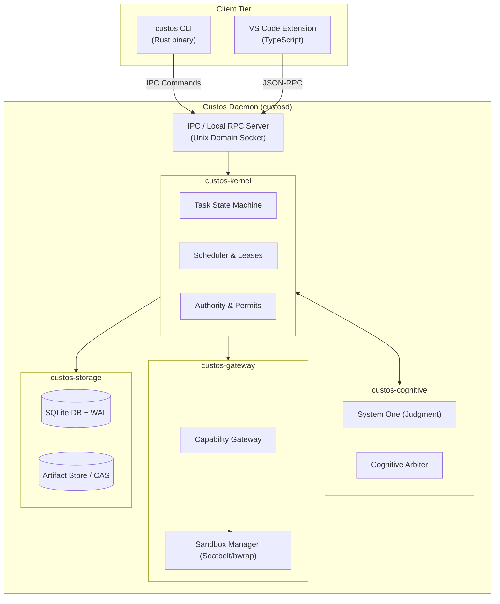

# Kiến Trúc Tổng Thể (System Architecture Overview)

> **Status:** Canonical Baseline v4.0  
> **Standards:** C4 Model (Level 1 & 2) · arc42 (§5-8, §47)

Tài liệu này mô tả toàn cảnh kiến trúc hệ thống của Custos: phân rã hệ thống theo các ranh giới thực thi, mô hình phân tầng 7 lớp, 7 mặt phẳng chức năng (*Planes*), 3 màng ngăn bảo vệ (*Membranes*), và cấu trúc container C4.

---

## 1. System Context — C4 Level 1

Custos vận hành như một runtime cục bộ đóng vai trò trung gian có thẩm quyền giữa người dùng, môi trường mã nguồn cục bộ, các AI provider bên ngoài và các công cụ thực thi.



### Bảng Ranh Giới Tin Cậy (Trust Boundaries)

| Ranh giới | Custos nhận | Custos gửi | Mức độ tin cậy |
|---|---|---|---|
| **Human Principal** | Mục tiêu, ràng buộc, quyết định phê duyệt | Kế hoạch, bằng chứng kiểm tra, kết quả | Định danh xác thực tối cao (*Authenticated Principal*) |
| **Local Workspace** | Mã nguồn, tệp tài liệu, lịch sử Git | Bản vá (*patches*), artifacts, metadata | **Nội dung không tin cậy (Untrusted data)** — có thể chứa mã độc |
| **AI Providers** | Các sự kiện suy luận (*reasoning events*), đề xuất | ContextPack đã lọc nhạy cảm, chỉ thị | Bộ xử lý suy luận ngoài (*External Untrusted Processor*) |
| **Tools / MCP** | Tài nguyên, kết quả kiểm tra, logs | Hành động có phạm vi trong `ExecutionPermit`| Tin cậy theo từng adapter đã cấu hình |
| **OS Keychain** | Bí mật xác thực (API keys, tokens) | Truy vấn có ủy quyền | Dịch vụ hệ điều hành tin cậy (*Trusted Local Service*) |

> [!WARNING]
> Repository, trang web, issue, tệp PDF và kết quả trả về của công cụ đều có khả năng chứa **Prompt Injection**. Trong Custos, không có bất kỳ nguồn dữ liệu ngoại cảnh nào tự thân mang quyền hạn (*Authority*).

---

## 2. Mô Hình Phân Tầng (7-Layer Architecture)

```text
┌─────────────────────────────────────────────────────────────────────────────┐
│ L7: INTERFACE LAYER — CLI · VS Code Extension · Local Web UI                │
├─────────────────────────────────────────────────────────────────────────────┤
│ L6: ORCHESTRATION LAYER — Task Supervisor · Domain Pack Runtime · Leases    │
├─────────────────────────────────────────────────────────────────────────────┤
│ L5: JUDGMENT PLANE (System One) — Fast Evaluation · Risk Screening · Rules  │
├─────────────────────────────────────────────────────────────────────────────┤
│ L4: DELIBERATION PLANE (System Two) — Role-based Ephemeral Workers (LLMs)   │
├─────────────────────────────────────────────────────────────────────────────┤
│ L3: PROTOCOL & BOUNDARY MESH — Typed Internal Contracts · MCP Client        │
├─────────────────────────────────────────────────────────────────────────────┤
│ L2: KERNEL LAYER — State Machine · Capability Gateway · Evidence Verifier   │
├─────────────────────────────────────────────────────────────────────────────┤
│ L1: INTEGRATION LAYER — Provider Adapters · Tiered Sandboxes · OS Connectors │
├─────────────────────────────────────────────────────────────────────────────┤
│ L0: PERSISTENCE LAYER — SQLite + WAL · CAS Store · FTS5 · OS Keychain       │
└─────────────────────────────────────────────────────────────────────────────┘
```

---

## 3. Kiến Trúc 7 Mặt Phẳng Chức Năng (The 7 Planes)

Custos sử dụng khái niệm **Planes** để mô tả các khối trách nhiệm độc lập, tránh ép buộc các yêu cầu phải đi qua một chuỗi tuyến tính cứng nhắc:



1. **Experience Plane:** Các giao diện tương tác người dùng (CLI, VS Code extension, notification inbox). Chỉ hiển thị dữ liệu chiếu (*projection*) và gửi lệnh (*commands*); không sở hữu trạng thái bền vững.
2. **Task Control Plane (Kernel):** Trung tâm điều hành tối cao của hệ thống: quản lý Task State Machine, cấp phát tài nguyên, điều phối phê duyệt, thực thi phục hồi thảm họa.
3. **Cognitive Plane:** Kết hợp phản xạ nhanh của System One (kiểm tra bất biến, phân loại rủi ro) và suy luận sâu của System Two (lập kế hoạch, sinh code).
4. **Execution Plane:** Chịu trách nhiệm thực thi các hành vi ngoại cảnh qua Capability Gateway, kiểm soát worktree Git, sandbox lệnh shell và thực thi công cụ MCP.
5. **Knowledge & Evidence Plane:** Quản lý chỉ mục ngữ cảnh, 5 tầng bộ nhớ, kho lưu trữ chứng cứ nghiệm thu và sổ cái quyết định (*Decision Ledger*).
6. **Integration Plane:** Chứa các adapters kết nối với AI providers (Codex, Claude, Antigravity, local models), và OS Keychain.
7. **Governance & Cross-Cutting:** Quản lý hạn mức ngân sách, chính sách bảo mật, và hệ thống đo lường từ xa xuyên suốt mọi mặt phẳng.

---

## 4. Ba Màng Ngăn Bảo Vệ (The 3 Membranes)

Mọi luồng dữ liệu và hành động trong Custos bắt buộc phải đi qua 3 màng ngăn không thể phá vỡ:

```text
       [ External / Untrusted ]
                 │
  ═══════════════▼═══════════════  1. PRIVACY MEMBRANE
     (Egress Gate & Redaction)
  ═══════════════╤═══════════════
                 │
  ═══════════════▼═══════════════  2. AUTHORITY MEMBRANE
    (Exact-Payload Approval &
        ExecutionPermit)
  ═══════════════╤═══════════════
                 │
  ═══════════════▼═══════════════  3. RESOURCE MEMBRANE
     (Token, Time & Memory Budget)
  ═══════════════╤═══════════════
                 │
       [ Protected Execution ]
```

- **Màng Quyền Hạn (Authority Membrane):** Không một hành động nào được phát động nếu thiếu sự ủy quyền hợp lệ từ con người hoặc vượt quá phạm vi của Task Contract.
- **Màng Riêng Tư (Privacy Membrane):** Dữ liệu mã nguồn và ngữ cảnh không bao giờ rời khỏi máy trạm nếu chưa thỏa mãn chính sách kiểm duyệt xuất dữ liệu (*egress policy*).
- **Màng Tài Nguyên (Resource Membrane):** Mọi tác vụ đều có hạn mức trần về token, số lần gọi API, thời gian chạy và dung lượng bộ nhớ.

---

## 5. Container Architecture — C4 Level 2



---

## 6. Mục Tiêu Triển Khai Thực Tế (Target Implementation Topology)

1. **Local Daemon (`custosd`):** Viết hoàn toàn bằng **Rust** để đạt hiệu năng tối đa, không phụ thuộc garbage collection, tiêu tốn ít RAM (< 50MB khi nhàn rỗi) và khởi động tức thì.
2. **Cơ sở dữ liệu cục bộ:** Sử dụng **SQLite** nhúng ở chế độ Write-Ahead Logging (`WAL`), kết hợp cơ chế kiểm tra tính toàn vẹn và outbox pattern đảm bảo độ bền dữ liệu 100%.
3. **Môi trường cách ly:** Tận dụng công nghệ sandboxing native của hệ điều hành: `sandbox-exec` trên macOS (Seatbelt profiles) và `bubblewrap` / namespaces trên Linux.
