# CUSTOS — ARCHITECTURE MAP AND FLOWS

> **Classification:** Legacy V8 visual design, non-normative. Read the [reference architecture](reference-architecture.md), [runtime flows](runtime-flows.md), and [Intelligence Hub](intelligence-hub.md) for current target boundaries; use [status evidence](../status/README.md) before claiming a diagram is wired.

> **Status:** Historical architecture maps

**Visual maps to be read alongside the V8 architecture document.** Each diagram represents a perspective; not every diagram is a strict call graph. Processes and features bear design labels until verified in actual code.

Background Document: [Custos Master Product, System, Pack & Repo Architecture V8](../canonical-specification.md).

## 1. Custos in a Single Picture

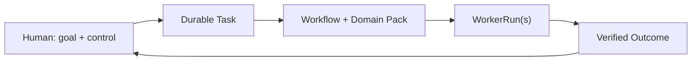
```mermaid
flowchart LR
    H["Human: goal + control"] --> T["Durable Task"]
    T --> W["Workflow + Domain Pack"]
    W --> X["WorkerRun(s)"]
    X --> O["Verified Outcome"]
    O --> H
```

**How to read:** Human and Custos collaborate on a Task with durable state. The Pack defines the domain approach; the workflow selects the steps; each WorkerRun is a delegation instance with a role, context, provider, scope, budget, and output contract. The Outcome returns to the Task with artifacts, receipts, evidence, and unresolved elements.

Custos does not require multiple agents for every job. A single worker or a user-pinned model remains the standard path. A provider's session is just an integration handle; the Task is the source of truth for the work.

## 2. Overall Architecture: Who Owns Which Responsibility

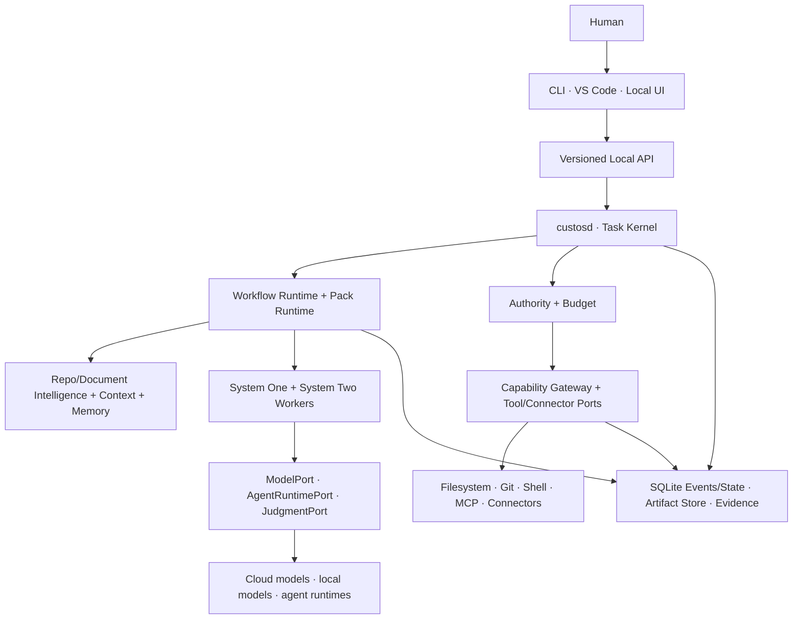
```mermaid
flowchart TB
    HUMAN["Human"] --> UI["CLI · VS Code · Local UI"]
    UI --> API["Versioned Local API"]
    API --> KERNEL["custosd · Task Kernel"]
    KERNEL --> FLOW["Workflow Runtime + Pack Runtime"]
    KERNEL --> AUTH["Authority + Budget"]
    FLOW --> KNOW["Repo/Document Intelligence + Context + Memory"]
    FLOW --> COG["System One + System Two Workers"]
    COG --> PORTS["ModelPort · AgentRuntimePort · JudgmentPort"]
    PORTS --> BACKEND["Cloud models · local models · agent runtimes"]
    AUTH --> GATE["Capability Gateway + Tool/Connector Ports"]
    GATE --> TOOLS["Filesystem · Git · Shell · MCP · Connectors"]
    KERNEL --> DATA["SQLite Events/State · Artifact Store · Evidence"]
    GATE --> DATA
    FLOW --> DATA
```

**Planes explain responsibilities, not network tiers.** A read-only query doesn't strictly have to traverse every box sequentially. Kernel/Workflow coordinates; Context and Cognitive prepare/execute reasoning; Authority checks permissions; Gateway executes controlled effects; SQLite/artifacts hold state. `custosd` is the composition root in the current design.

### Model/Tool Ports Must Not Be Conflated

| Port | Used For | Examples |
|---|---|---|
| `ModelPort` | Calling models to generate output/streams/usage | Claude API, local model, compatible endpoint |
| `AgentRuntimePort` | Controlling agent loops, sessions, events, approval/pause when runtime supports it | Codex runtime, Claude Agent SDK |
| `JudgmentPort` | Narrow S1 queries with schemas and abstentions | Rules, local classifiers, Jev adapter |
| `ToolPort` | Executing impactful actions and returning receipts | Filesystem, Git, commands, MCP, email |

Custos's Gateway checks **side effects**. Model Gateways like 9Router/LiteLLM, if used, are just model calling/routing layers. They do not replace each other.

## 3. Human × System One × System Two

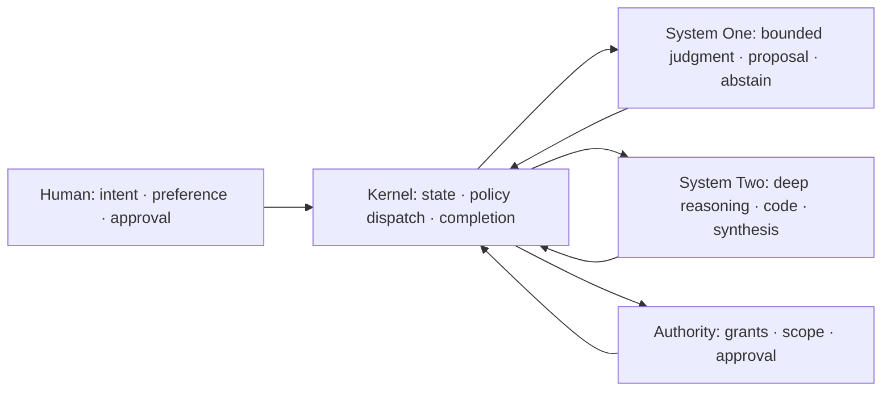
```mermaid
flowchart LR
    H["Human: intent · preference · approval"] --> K["Kernel: state · policy dispatch · completion"]
    K --> S1["System One: bounded judgment · proposal · abstain"]
    S1 --> K
    K --> S2["System Two: deep reasoning · code · synthesis"]
    S2 --> K
    K --> A["Authority: grants · scope · approval"]
    A --> K
```

**System One (S1)** is a Judgment Fabric that can have multiple backends. It proposes classifications, contexts, routes, complexities, or next check steps; confidence does not create authorization. Rules can be used for narrow judgments, but hard security/policy is the responsibility of Authority/validators.

**System Two (S2)** is the deep reasoning capability utilized by a WorkerRun or Planner: analyzing repos, planning, writing code, synthesizing sources. **A WorkerRun is not synonymous with S2**: a worker is a delegation unit; it may call an S2 model/runtime, use a specific tool, or use a deterministic step.

**Human** sets goals, modifies scopes, selects/pins providers, and approves impacts per policy. The Kernel saves and coordinates decisions, preventing models from autonomously changing permissions.

## 4. From Request to Workflow to Next Step

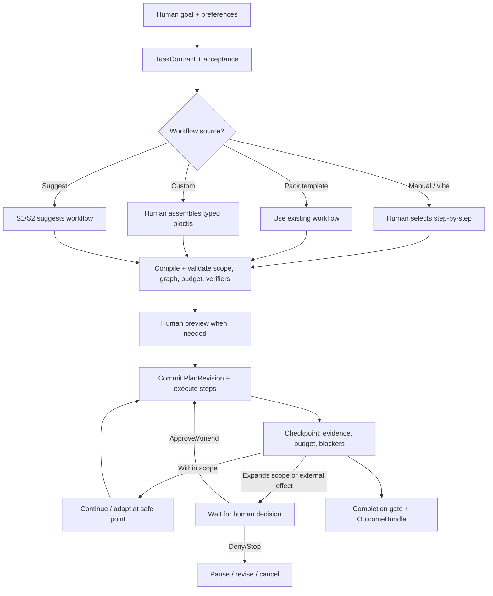
```mermaid
flowchart TD
    GOAL["Human goal + preferences"] --> CONTRACT["TaskContract + acceptance"]
    CONTRACT --> CHOICE{"Workflow source?"}
    CHOICE -->|"Manual / vibe"| MANUAL["Human selects step-by-step"]
    CHOICE -->|"Pack template"| TEMPLATE["Use existing workflow"]
    CHOICE -->|"Custom"| CUSTOM["Human assembles typed blocks"]
    CHOICE -->|"Suggest"| SUGGEST["S1/S2 suggests workflow"]
    MANUAL --> VALIDATE["Compile + validate scope, graph, budget, verifiers"]
    TEMPLATE --> VALIDATE
    CUSTOM --> VALIDATE
    SUGGEST --> VALIDATE
    VALIDATE --> PREVIEW["Human preview when needed"]
    PREVIEW --> RUN["Commit PlanRevision + execute steps"]
    RUN --> CHECK["Checkpoint: evidence, budget, blockers"]
    CHECK -->|"Within scope"| NEXT["Continue / adapt at safe point"]
    CHECK -->|"Expands scope or external effect"| HUMAN["Wait for human decision"]
    NEXT --> RUN
    HUMAN -->|"Approve/Amend"| RUN
    HUMAN -->|"Deny/Stop"| END["Pause / revise / cancel"]
    CHECK --> DONE["Completion gate + OutcomeBundle"]
```

**Assist/vibe** and **Delegated** are two control modes, not two separate runtimes. Workflows can be manually selected, taken from templates, assembled, or proposed by S1/S2. The compiler checks structures and scopes before execution. S1 only suggests; S2 can construct a PlanProposal; Kernel checks the plan, and Authority checks grants. The runtime only adapts within the granted scope; changing goals or adding permissions requires a Task revision/appropriate approval.

## 5. Model Selection per WorkerRun

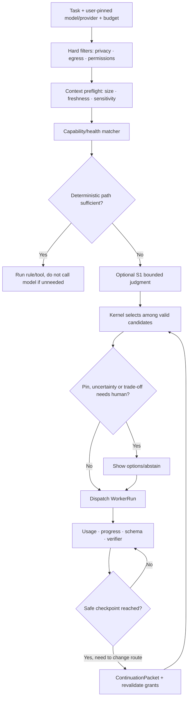
```mermaid
flowchart TD
    INPUT["Task + user-pinned model/provider + budget"] --> HARD["Hard filters: privacy · egress · permissions"]
    HARD --> CONTEXT["Context preflight: size · freshness · sensitivity"]
    CONTEXT --> CAP["Capability/health matcher"]
    CAP --> SIMPLE{"Deterministic path sufficient?"}
    SIMPLE -->|"Yes"| RULES["Run rule/tool, do not call model if unneeded"]
    SIMPLE -->|"No"| JUDGE["Optional S1 bounded judgment"]
    JUDGE --> SELECT["Kernel selects among valid candidates"]
    SELECT --> OPTION{"Pin, uncertainty or trade-off needs human?"}
    OPTION -->|"Yes"| ASK["Show options/abstain"]
    OPTION -->|"No"| DISPATCH["Dispatch WorkerRun"]
    ASK --> DISPATCH
    DISPATCH --> MONITOR["Usage · progress · schema · verifier"]
    MONITOR --> SAFE{"Safe checkpoint reached?"}
    SAFE -->|"Yes, need to change route"| HANDOFF["ContinuationPacket + revalidate grants"]
    HANDOFF --> SELECT
    SAFE -->|"No"| MONITOR
```

If a user pins a provider, that pin is a constraint unless the user permits a fallback. "Simple tasks use local models" and "high risk uses frontier models" are just heuristics, not fixed truths. Comparisons must account for capability, egress, measured quality, price, time, and bug-fixing costs. Do not switch providers while an effect is running or a receipt is uncertain.

## 6. Controlled Side Effects: Authority → Gateway → Evidence

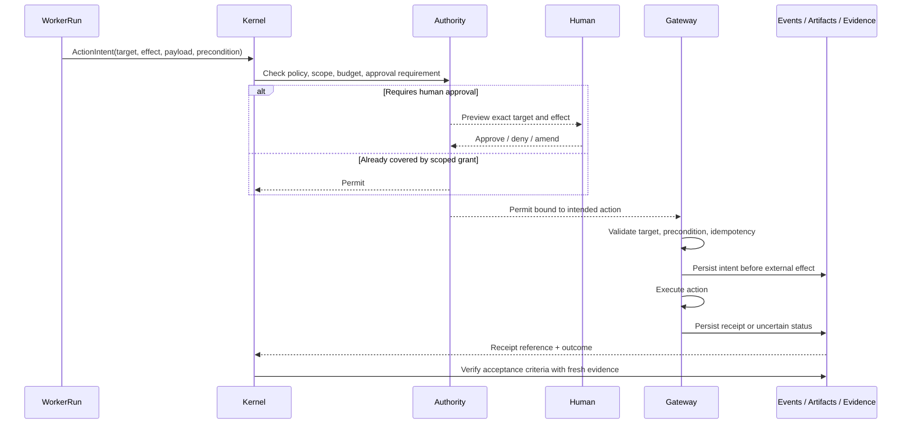
```mermaid
sequenceDiagram
    participant Worker as WorkerRun
    participant Kernel
    participant Auth as Authority
    participant Human
    participant Gateway
    participant Store as Events / Artifacts / Evidence
    Worker->>Kernel: ActionIntent(target, effect, payload, precondition)
    Kernel->>Auth: Check policy, scope, budget, approval requirement
    alt Requires human approval
        Auth-->>Human: Preview exact target and effect
        Human-->>Auth: Approve / deny / amend
    else Already covered by scoped grant
        Auth-->>Kernel: Permit
    end
    Auth-->>Gateway: Permit bound to intended action
    Gateway->>Gateway: Validate target, precondition, idempotency
    Gateway->>Store: Persist intent before external effect
    Gateway->>Gateway: Execute action
    Gateway->>Store: Persist receipt or uncertain status
    Store-->>Kernel: Receipt reference + outcome
    Kernel->>Store: Verify acceptance criteria with fresh evidence
```

Read-only inference does not require a write permit; however, privacy, egress, and resources are still subject to policy. Grants can cover a narrow scope for repetitive steps, such as testing within a worktree. Sending emails, publishing, deploying, deleting, or moving data externally usually requires a preview/approval bound to the exact target/payload. If a timeout obscures whether an action occurred, log it as `uncertain`, reconcile, and only then decide on a retry.

Provider agents with native tools may execute outside the Gateway. Adapters must declare their level as `custos-mediated`, `provider-governed`, or `observe-only`; do not claim Custos can block an action it cannot see.

## 7. Task State, Durable Events, and Recovery

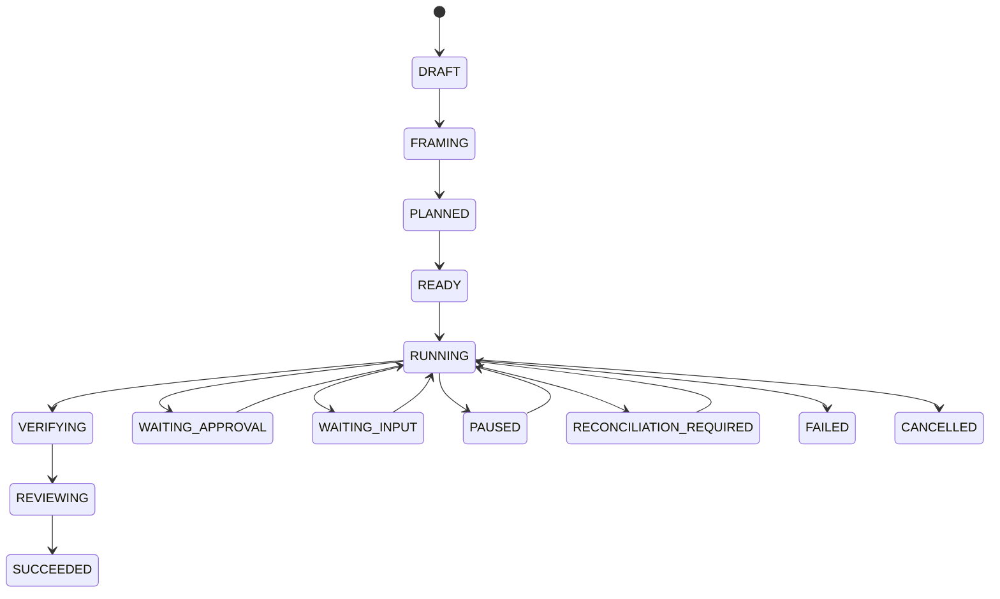
```mermaid
stateDiagram-v2
    [*] --> DRAFT
    DRAFT --> FRAMING
    FRAMING --> PLANNED
    PLANNED --> READY
    READY --> RUNNING
    RUNNING --> VERIFYING
    VERIFYING --> REVIEWING
    REVIEWING --> SUCCEEDED
    RUNNING --> WAITING_APPROVAL
    RUNNING --> WAITING_INPUT
    RUNNING --> PAUSED
    RUNNING --> RECONCILIATION_REQUIRED
    WAITING_APPROVAL --> RUNNING
    WAITING_INPUT --> RUNNING
    PAUSED --> RUNNING
    RECONCILIATION_REQUIRED --> RUNNING
    RUNNING --> FAILED
    RUNNING --> CANCELLED
```

The Kernel saves Task states/events with versions; plans and repo snapshots have their own versions. When the daemon restarts, the UI reconstructs from persisted state. If a process dies after an external effect but before the receipt, the Task stops at reconciliation instead of blindly retrying. If repo files change, dependent steps must refresh/rebase; this does not automatically alter the human's goal/acceptance. `SUCCEEDED` only applies when evidence meets acceptance/revision criteria, blockers are handled, and human acceptance is met if policy dictates.

## 8. Engineering/Coding Pack: From Repo Comprehension to Verifiable Patches

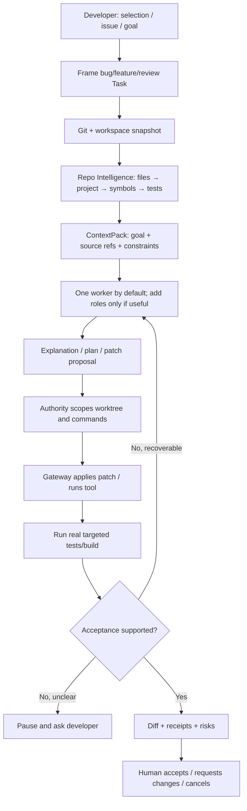
```mermaid
flowchart TD
    DEV["Developer: selection / issue / goal"] --> FRAME["Frame bug/feature/review Task"]
    FRAME --> SNAP["Git + workspace snapshot"]
    SNAP --> MAP["Repo Intelligence: files → project → symbols → tests"]
    MAP --> CTX["ContextPack: goal + source refs + constraints"]
    CTX --> WORK["One worker by default; add roles only if useful"]
    WORK --> PROPOSAL["Explanation / plan / patch proposal"]
    PROPOSAL --> PERMIT["Authority scopes worktree and commands"]
    PERMIT --> EXEC["Gateway applies patch / runs tool"]
    EXEC --> VERIFY["Run real targeted tests/build"]
    VERIFY --> PASS{"Acceptance supported?"}
    PASS -->|"No, recoverable"| WORK
    PASS -->|"No, unclear"| ASK["Pause and ask developer"]
    PASS -->|"Yes"| OUT["Diff + receipts + risks"]
    OUT --> HUMAN["Human accepts / requests changes / cancels"]
```

Repo Intelligence reports coverage (file lists, project detection, FTS, AST/LSP, executed tests), not a vague claim of "understanding the repo". Worktrees separate changes from the main branch but **are not security sandboxes**. Repro before is only logged if the error is actually reproduced; if not, evidence is `not_reproduced`.

### Engineering Agent Roles (Not all required)

| Role | Responsibility | Primary Artifact |
|---|---|---|
| Explorer | Map relevant areas, fetch source anchors | `RepoInsight` |
| Investigator | Formulate hypothesis, find root cause evidence | `RootCauseProposal` |
| Planner/Architect | Define scope, dependencies, tests, and risks | `ChangePlan` |
| Implementer | Propose in-scope patch | `PatchSet` |
| Test Designer | Supplement cases/fixtures | `TestPlan` or `TestPatch` |
| Verifier | Run deterministic checks | `VerificationReport` |
| Reviewer | Independently examine frozen diffs if justified | `ReviewFindings` |
| Integrator | Prepare apply/merge within policy | `IntegrationReport` |

Roles can be combined into a single agent for small tasks. Additional workers are only added when context isolation, parallelism, or independent review offers measurable value.

## 9. Research Pack: From Sources to Claims with Provenance

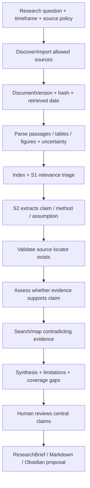
```mermaid
flowchart TD
    Q["Research question + timeframe + source policy"] --> SOURCES["Discover/import allowed sources"]
    SOURCES --> VERSION["DocumentVersion + hash + retrieved date"]
    VERSION --> PARSE["Parse passages / tables / figures + uncertainty"]
    PARSE --> SEARCH["Index + S1 relevance triage"]
    SEARCH --> EXTRACT["S2 extracts claim / method / assumption"]
    EXTRACT --> LOCATOR["Validate source locator exists"]
    LOCATOR --> SUPPORT["Assess whether evidence supports claim"]
    SUPPORT --> CONTRA["Search/map contradicting evidence"]
    CONTRA --> SYNTH["Synthesis + limitations + coverage gaps"]
    SYNTH --> HUMAN["Human reviews central claims"]
    HUMAN --> EXPORT["ResearchBrief / Markdown / Obsidian proposal"]
```

Locator-valid does not equate to a supported claim. Research outputs distinguish quotes, paraphrases, inferences, and unknowns. S1 can triage; S2 synthesizes and explains; verifiers check anchors/support; humans decide on critical or contradictory claims. Obsidian exports must detect user edits and surface conflicts for review, never silently overwriting.

### Research Worker Roles

| Role | Responsibility | Primary Artifact |
|---|---|---|
| Source Curator | Apply source policy, dedup, record versions | `SourceSet` |
| Parser/Extractor | Create passage/table/figure anchors and candidate claims | `DocumentMap`, `ClaimCandidates` |
| Method Analyst | Extract methods, assumptions, limitations | `MethodCard` |
| Evidence Analyst | Link supports/contradicts/unknown | `EvidenceMap` |
| Synthesizer | Compare, literature map, and gaps | `ResearchBrief` |
| Challenge Reviewer | Find unsupported or contradictory claims | `ChallengeReport` |
| Notes Curator | Propose knowledge base entries | `NoteProposal` |

## 10. Assistant/Personal Pack: Just-Enough Context, Draft First, Receipted Effects

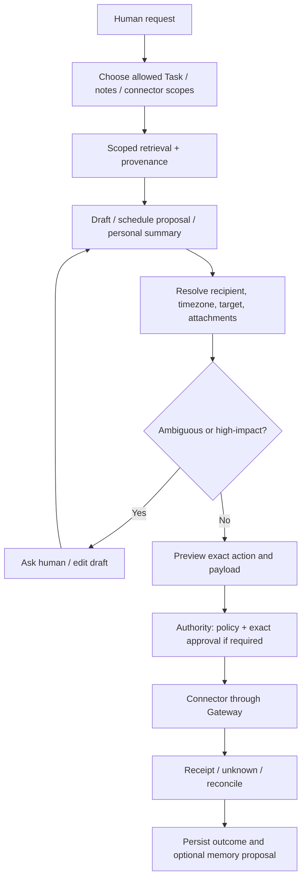
```mermaid
flowchart TD
    HUMAN["Human request"] --> SCOPE["Choose allowed Task / notes / connector scopes"]
    SCOPE --> RETRIEVE["Scoped retrieval + provenance"]
    RETRIEVE --> DRAFT["Draft / schedule proposal / personal summary"]
    DRAFT --> RESOLVE["Resolve recipient, timezone, target, attachments"]
    RESOLVE --> AMBIG{"Ambiguous or high-impact?"}
    AMBIG -->|"Yes"| CLARIFY["Ask human / edit draft"]
    CLARIFY --> DRAFT
    AMBIG -->|"No"| PREVIEW["Preview exact action and payload"]
    PREVIEW --> APPROVE["Authority: policy + exact approval if required"]
    APPROVE --> COMMIT["Connector through Gateway"]
    COMMIT --> RECEIPT["Receipt / unknown / reconcile"]
    RECEIPT --> TASK["Persist outcome and optional memory proposal"]
```

Drafting an email and sending it are two distinct task/action types. Draft-only is a clear state if no connector exists. A sending timeout must not be reported as "sent" if there is no receipt; no blind retries. Personal memory requires a source, scope, expiration, and human confirmation if it's a significant preference.

### Assistant Worker Roles

| Role | Responsibility | Primary Artifact |
|---|---|---|
| Personal Context Retriever | Fetch info within user-selected scope | `ContextDigest` |
| Preference Resolver | Apply timezones/tones/availability with provenance | `ResolvedPreferences` |
| Planner | Create daily/weekly/meeting checklists | `PersonalPlan` |
| Draft Writer | Compose messages/agendas/summaries | `DraftMessage` |
| Recipient/Time Resolver | Clarify identities, schedules, timezones | `ResolvedTarget` |
| Approval Presenter | Display exact target/payload/effect | `ApprovalCard` |
| Connector Executor | Call authorized integrations and get receipts | `ExecutionReceipt` |
| Commitment Curator | Create follow-up/reminder candidates | `CommitmentProposal` |

## 11. Three Packs Coordinating via Tasks and Artifacts

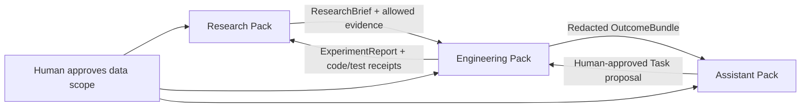
```mermaid
flowchart LR
    R["Research Pack"] -->|"ResearchBrief + allowed evidence"| E["Engineering Pack"]
    E -->|"ExperimentReport + code/test receipts"| R
    E -->|"Redacted OutcomeBundle"| A["Assistant Pack"]
    A -->|"Human-approved Task proposal"| E
    H["Human approves data scope"] --> R
    H --> E
    H --> A
```

Each transfer creates a child Task/contract with a parent ref, data sensitivity, output contract, budget, and specific grants; permissions are not automatically inherited. Research doesn't send the entire vault to Coding; Coding doesn't send source code/secrets to Assistant; Assistant doesn't turn emails into shell access. Shared artifact refs are only opened if policy allows.

## 12. Memory, Continuation, and Evidence: Three Distinct Concepts

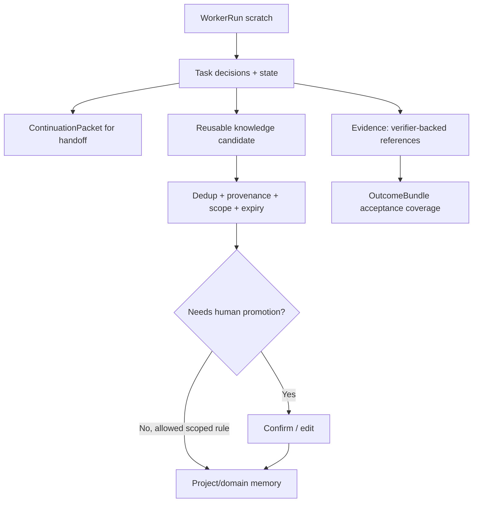
```mermaid
flowchart TB
    RUN["WorkerRun scratch"] --> TASK["Task decisions + state"]
    TASK --> PACKET["ContinuationPacket for handoff"]
    TASK --> CANDIDATE["Reusable knowledge candidate"]
    CANDIDATE --> CHECK["Dedup + provenance + scope + expiry"]
    CHECK --> HUMAN{"Needs human promotion?"}
    HUMAN -->|"Yes"| CONFIRM["Confirm / edit"]
    HUMAN -->|"No, allowed scoped rule"| STORE["Project/domain memory"]
    CONFIRM --> STORE
    TASK --> EVID["Evidence: verifier-backed references"]
    EVID --> OUT["OutcomeBundle acceptance coverage"]
```

ContinuationPackets help continue a **Task**; memory stores reusable knowledge with scope; evidence proves a criterion. Do not use transcripts for all three. Unpromoted memory does not become a fact; old evidence does not automatically remain valid after inputs/snapshots change.

## 13. Repo Structure and Languages: Dependencies, Not Seven Services

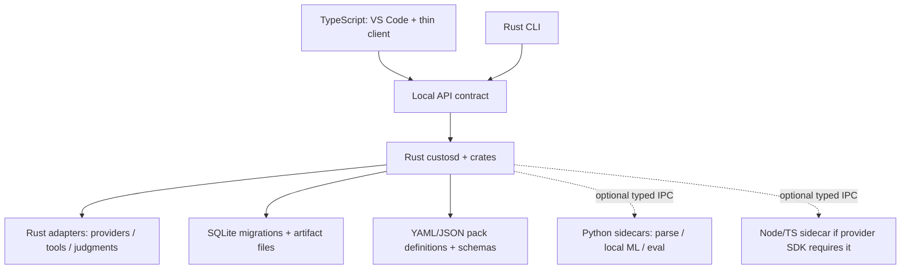
```mermaid
flowchart TB
    TS["TypeScript: VS Code + thin client"] --> API["Local API contract"]
    CLI["Rust CLI"] --> API
    API --> CORE["Rust custosd + crates"]
    CORE --> ADAPTER["Rust adapters: providers / tools / judgments"]
    CORE --> DB["SQLite migrations + artifact files"]
    CORE --> PACKS["YAML/JSON pack definitions + schemas"]
    CORE -. "optional typed IPC" .-> PY["Python sidecars: parse / local ML / eval"]
    CORE -. "optional typed IPC" .-> NODE["Node/TS sidecar if provider SDK requires it"]
```

Rust owns Task, authority, persistence, workflow, and completion. TypeScript owns the VS Code UI/client; Python is optional for documents/local ML; SQL expresses migrations; YAML/JSON Schema declares workflows and protocols. Sidecars return typed outputs; they never write to the Task DB. Diagram paths follow the inventory where possible; directories labeled as proposals in V8 might not exist in the checkout.

## 14. Illustrative User Journeys

### 14.1 Vibe Coding with a Chosen Model
1. Developer opens repo, selects Codex/Claude/local model, and says "explain this function".
2. Custos opens or creates a Task, takes a snapshot, fetches just enough source refs; uses one WorkerRun.
3. Worker replies with anchors. User continues: "propose a patch", Custos continues in the same Task.
4. User reviews diff, grants worktree/test scope; Gateway applies patch/runs test and logs receipts.
5. Evidence maps to acceptance; human accepts/rejects; Task resumes seamlessly after restart.

### 14.2 Delegated Research-to-Prototype
1. Human states question, timeframe, and allowed sources.
2. Research Pack gathers versioned docs, builds claim/evidence map, highlights contradictions.
3. Human reviews ResearchBrief then spawns an Engineering subtask.
4. Engineering runs prototype/test on recorded snapshot/config.
5. Research updates claims based on experiment evidence; Assistant drafts summary if user grants OutcomeBundle.

### 14.3 User-Authored Workflow
1. Select Pack and task type; drag blocks or declare YAML.
2. Compiler reports bad dependencies, cycles, missing ports/tools, missing verifiers, scope/budget errors.
3. Preview plan, provider preferences, effects, checkpoints, cost estimates; human saves version.
4. When running, Task pins the version; runtime is adaptive only within policy. New plans mean new revisions, not silent overwrites of the chosen workflow.

## 15. Who Does What in the Repo Diagram

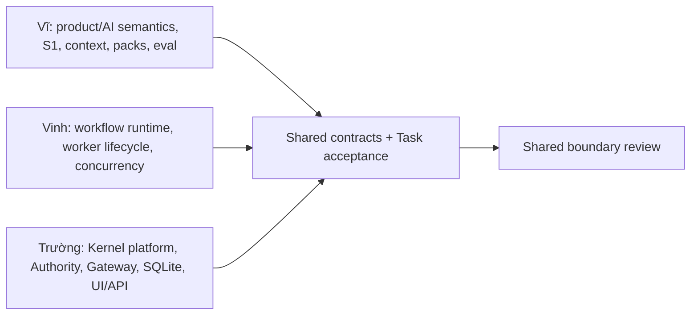
```mermaid
flowchart LR
    VI["Vĩ: product/AI semantics, S1, context, packs, eval"] --> CONTRACT["Shared contracts + Task acceptance"]
    VINH["Vinh: workflow runtime, worker lifecycle, concurrency"] --> CONTRACT
    TRUONG["Trường: Kernel platform, Authority, Gateway, SQLite, UI/API"] --> CONTRACT
    CONTRACT --> REVIEW["Shared boundary review"]
```

Vĩ is the product/AI lead; Vinh focuses on SE for orchestration and multi-agent correctness; Trường handles systems/platform trust boundaries. A module has an owner implementation; schema/permission/cross-pack changes require review from all three angles: meaning, lifecycle, persistence/security. Detailed paths/owners aligning with the inventory are in V8.

## 16. What the Diagrams Do Not Claim
- They do not claim Custos has completed all adapters, Packs, or integrations.
- They do not claim S1 always runs under 200ms, Assist always adds 2-4s, or tokens are reduced by 80-98%; these are targets to benchmark.
- They do not claim external Codex/Claude tool actions are all blocked by Custos.
- They do not claim Windows/macOS/Linux have equal sandbox or local model support.
- They do not claim "task complete" if the evidence is solely the model's word.

To know which modules exist in the inventory and which are goals, open section 11 in the Master Architecture V8. Before coding, check the actual checkout, `AGENTS.md`, schemas, migrations, and tests.
