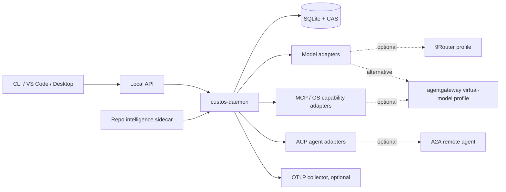
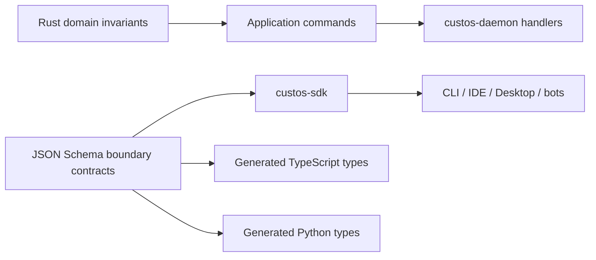

# Custos polyglot repository and deployment topology

**Document ID:** ARCH-TOPOLOGY-01
**Status:** Canonical supporting design
**Updated:** 2026-09-30
**Parent:** [`definitive-product-architecture.md`](definitive-product-architecture.md)
**Current tree:** [`../development/repository-structure.md`](../development/repository-structure.md)

This document defines where each responsibility and language belongs. It does
not authorize creating empty directories or new crates. Physical changes follow
real vertical slices and accepted ADRs.

## 1. Deployable units



The default product is one local daemon and embedded SQLite/CAS. Sidecars are
optional profiles, not hidden requirements. No sidecar receives direct database
access or Custos signing authority.

## 2. Target repository tree

```text
Custos/
├── Cargo.toml                     Rust workspace: 11 product crates + tests + xtask
├── crates/
│   ├── custos-domain/             pure types, IDs, value objects, invariants
│   ├── custos-core/               kernel, authority, effects, evidence, completion
│   ├── custos-provider/           Model/Agent/Capability/Judgment/Gateway ports
│   ├── custos-persistence/        SQLite repositories, migrations, CAS, outbox
│   ├── custos-bridge/             Session-to-Task application boundary
│   ├── custos-runtime/            workflow, workers, context, memory, routing
│   ├── custos-adapters/           providers, ACP/MCP/A2A, sandbox, connectors
│   ├── custos-packs/              engineering, research, assistant product logic
│   ├── custos-sdk/                versioned client DTOs and generated bindings
│   ├── custos-daemon/             sole production composition root
│   └── custos-cli/                thin Rust client
├── schemas/
│   ├── protocol/                  JSON Schema for Local API and port envelopes
│   └── packs/                     workflow, manifest, verifier schemas
├── tests/
│   ├── contract/                  producer/consumer and protocol conformance
│   ├── e2e/                       real daemon process vertical slices
│   ├── crash/                     kill/restart/uncertain-effect matrix
│   └── fixtures/                  pinned repositories, documents and responses
├── evals/                         quality, calibration, cost and regression suites
├── tools/
│   └── repo_intelligent/          Python offline indexer/research tool
├── ui/
│   └── desktop/                   Tauri/React desktop and retained UI workspace
├── packages/
│   ├── custos-vscode/             TypeScript editor client
│   └── custos-npm-package/        installer/distribution wrapper
├── services/                      explicitly external bots and integrations
├── config/                        current example; profiles only when activated
├── compatibility/                 conditional future home for reviewed shims
├── vendor/                        conditional future home for pinned source
├── workflow_recipes/              validated examples, not a second pack engine
├── docs/ and dev_docs/            architecture authority and active workboard
├── scripts/                       small bootstrap/migration wrappers
├── examples/ and templates/        non-production samples and work templates
├── scratch/ and buzz/              non-product, unassigned until reviewed
└── xtask/                         cross-language build, generation and release gates
```

`config/profiles/`, `compatibility/`, and `vendor/` are conditional responsibility
groups, not existing committed directories or required scaffolding. Existing
Goose-named UI/package paths move only through tested, reviewable migrations;
do not perform a bulk rename. The [physical repository
map](../development/repository-structure.md) classifies current peripheral
directories and names each owner's first bounded work item.

## 3. Language ownership

| Language/format | Allowed responsibility | Forbidden responsibility |
|---|---|---|
| Rust | Domain, trusted core, daemon, runtime, persistence, adapters, CLI, SDK core | None of these may be reimplemented in clients |
| TypeScript | Desktop/VS Code/web UI, npm installer, external bot clients | Canonical Task transitions, direct SQLite, permit issuance, completion |
| Python | Offline repository intelligence, evaluation, research prototypes, isolated sidecars | Files under Rust crates, canonical state writes, in-process trusted policy |
| SQL | Additive SQLite migrations, indexes, constraints, recovery queries | Business decisions hidden in triggers without a domain contract |
| JSON Schema | Cross-process envelopes, pack manifests, compatibility fixtures | Internal Rust-only types that never cross a boundary |
| YAML | Human-authored packs, workflows, policies and eval cases after schema validation | Executable code, secrets, implicit authority |
| Shell/PowerShell | Minimal install, CI and platform bootstrap wrappers | Product orchestration or security policy |
| C/C++/Metal | Pinned local-inference FFI behind an adapter | Types crossing the domain/application boundary |
| Kotlin | Upstream ACP/IDE compatibility only while required | New Custos core or duplicated SDK source of truth |
| Protobuf | Only when a selected remote/gRPC boundary requires it | A second Local API schema beside JSON Schema |

## 4. Contract generation direction



Domain invariants are handwritten Rust. Cross-process DTOs are versioned JSON
Schema and generated outward. Generated client types never flow back into the
domain. Compatibility translators terminate at the adapter/SDK boundary.

## 5. Runtime data ownership

| Data | Canonical writer | Storage | Replication/export |
|---|---|---|---|
| Task/revision/event | Kernel | SQLite | Versioned Local API only |
| Run/Step/checkpoint | Runtime through repository port | SQLite | Continuation projection |
| Permit/approval/effect attempt | Core authority/effect service | SQLite with critical durability | Redacted audit export |
| Artifact/source snapshot | CAS service | Content-addressed files + SQLite metadata | Digest-addressed export |
| Evidence/criterion assessment | Trusted verifier service | SQLite + CAS references | PROV/in-toto-inspired projection |
| Session/message | Bridge/session service | SQLite by retention class | User-controlled export/delete |
| Telemetry | Instrumented components | bounded local queue or external collector | Never canonical evidence |
| Secret | OS credential store | opaque reference in SQLite | Never events, prompts or artifacts |

## 6. Build and release graph

1. Generate and diff schemas; reject unreviewed breaking changes.
2. Format/lint/test Rust workspace and run dependency guards.
3. Run contract tests against Rust, TypeScript and Python bindings.
4. Build clients without repository-relative imports into Rust source.
5. Run daemon process E2E, crash matrix and sandbox tests.
6. Produce SBOM, license inventory, source/provenance attestations and signed artifacts.
7. Install on clean macOS/Linux/Windows profiles; verify upgrade and rollback.

The release gate must pin a SQLite version outside known WAL corruption ranges.
WAL and CAS files are local-host state; multi-device continuity transfers
versioned records/artifacts through a protocol and never shares a live SQLite
database over a network filesystem.

## 7. Evolution rules

- Add a crate only for a demonstrated compile-time, trust or deployable boundary.
- Add a service only for process isolation, independent scaling or external ownership.
- Prefer an internal module for organizational convenience.
- Keep single-worker and direct-model paths first-class.
- Run optional routers/gateways in shadow mode before they can affect selection;
  never chain 9Router and Agentgateway model routing by default.
- Every upstream adoption records revision, license, threat model, owner,
  conformance tests and rollback path.

## 8. Mapping the workflow refinement to existing modules

These are proposed extensions of owned responsibilities, not new crates or
claims that the functions are wired today.

| Responsibility | Implementation home | Required boundary |
|---|---|---|
| Evidence identity and dependency values | `custos-domain` | Pure types; C-04 review before schema changes |
| Completion and applicability checks | `custos-core/src/evidence` and Kernel | Trusted evidence lookup, expected revision, no client-authored pass |
| Dependency and budget persistence | `custos-persistence` | Atomic repositories, additive migrations, conservative legacy reads |
| Changed-source detection and context reuse | `custos-runtime/src/context` | Permission filtering, source snapshots, explicit unknown dependencies |
| Verification-aware route and ready scheduling | `custos-runtime/src/cognitive` and `workflow` | Eligible candidates, committed predecessors, bounded parallelism |
| Pack handoff and evaluation criteria | `custos-packs` | Typed artifacts; no implicit authority transfer |
| Setup lifecycle and connection supervision | `custos-daemon` with existing adapters | Effect-mediated changes, readiness probes, scoped activation |
| Setup preview and evidence/approval views | `custos-sdk`, CLI, TypeScript clients | Versioned Local API; one writer in the daemon |
| Comparative evaluation and drift analysis | `evals` and offline tools | Held-out fixtures and human-reviewed policy proposals |

Keep SQLite evidence references before considering a graph service. Keep
protocol translation in adapters before considering another hub process. Device
transfer and hosted multi-user support remain later profiles requiring ownership
fencing and an explicit tenancy design. The default remains a local modular
daemon with sandboxed worker processes and optional supervised sidecars.
