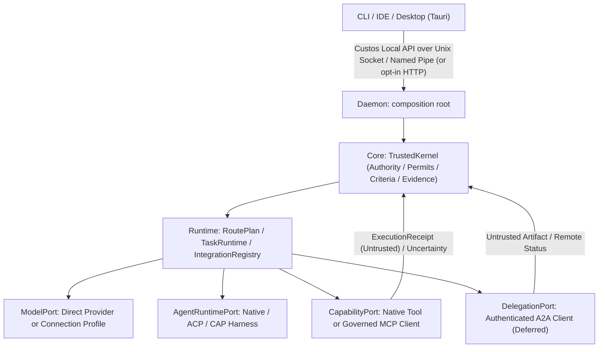

# Protocol and Connectivity Boundaries

**Document Version:** 2.0.0  
**Status:** Canonical Foundation  
**Decision Reference:** [Custos.md, Part 7](../../Custos.md); [Master Engineering Blueprint](../../../.gemini/antigravity-ide/brain/b9e1d82e-23f2-4ad5-b000-998796c5c0d6/custos-sade-master-engineering-blueprint.md)

---

## 1. Executive Principles: Sovereign SADE Architecture

Custos is a **Sovereign Autonomous Developer Environment (SADE)**. It is not an open proxy, not a gateway playground, and not a "universal protocol hub" standing above task execution.

Every connectivity boundary and protocol adapter in Custos is governed by three architectural axioms:

1. **One Canonical Product Protocol (The Spine Rule):**  
   Custos has exactly **ONE** internal product protocol: the **Custos Local API**. External protocols (MCP, ACP, CAP, A2A, OpenAI/Anthropic/Gemini vendor APIs) are **untrusted perimeter adapters** operating at distinct architectural boundaries. They never define canonical business entities, and they never supersede the Task Kernel.
2. **Authority Decoupled from Transport (The Non-Bypass Rule):**  
   The ability of a protocol to transport a message does **NOT** confer authority to modify files, run shell commands, complete a Task, or consume budget. External side-effects require an explicit, unforgeable `ExecutionPermit` minted exclusively by the Custos `TrustedKernel` and logged into the canonical evidence ledger.
3. **The 4-Level Realization Vocabulary:**  
   To prevent architectural drift and premature integration claims, all capabilities must be classified into:
   $$\mathbf{source\text{-}studied} \longrightarrow \mathbf{coded\text{-}unwired} \longrightarrow \mathbf{integrated} \longrightarrow \mathbf{verified}$$
   - **`source-studied`:** Upstream code/spec has been inspected and documented. No production wiring.
   - **`coded-unwired`:** Module exists in a crate and compiles, but is NOT mounted in the daemon runtime bootstrap.
   - **`prototype`:** Wire types or JSON-RPC structs exist; live runtime execution is simulated or incomplete.
   - **`integrated`:** Wired into the live daemon execution path; reachable by Desktop/CLI clients with real payloads.
   - **`verified`:** Validated by end-to-end conformance fixtures, failure recovery tests, and security boundary assertions.

---

## 2. Six Names, Distinct Boundaries

| Protocol | Kind | Custos Role | Purpose | Current Reality & Target Decision |
|---|---|---|---|---|
| **Custos Local API** | Product Protocol | Server (Daemon) | Spine of SADE: Task, Session, Run, Resource, Approval, Events, Settings | **Integrated (P0)**: Needs envelope hardening (`CommandEnvelope`, `EventEnvelope`). |
| **IPC** | Local Transport | Transport | Carry Local API between owned processes (Desktop/CLI/IDE ↔ Daemon) | **Target (P0)**: Unix domain socket (`custos.sock`) on macOS/Linux and named pipe on Windows is primary default; stdio JSONL supported. |
| **Local HTTP** | Local Transport | Transport | Carry the **same** Local API to browser / web integrations | **Defect in Current Code (P0 Gate)**: Daemon currently binds `127.0.0.1:3000` without authentication. Target: **Disabled by default**; opt-in only (`--enable-http`) with mandatory Bearer token auth and strict Origin checks. |
| **Model APIs** | Inference Client | Client | Direct inference turns, tool proposals, streaming deltas, usage receipts | **Integrated (P0)**: Direct vendor endpoints or supervised connection profiles (9Router profile, agentgateway proxy). `ModelPort` preserves multimodal images, tools, reasoning. |
| **MCP** | Tool Protocol | Client first | Consume external tools, data sources, research connectors | **`coded-unwired` (P1)**: Client currently returns mock strings in `adapters/client.rs`. Target: Real stdio/Streamable HTTP client (2026-07-28 spec) with pre-dispatch `ExecutionPermit` mediation. |
| **ACP** | Agent Client Protocol | Client or Server | Client when driving ACP coding agent; Server if external editor controls Custos | **Candidate (P1)**: Pinned session/update/permission negotiation. ACP is a transport for `AgentRuntimePort`, not the Custos Local API. |
| **CAP** | CLI Agent Driver | Orchestrator / Driver | Drive CLI agents via PTY or structured fast paths | **Research / Draft (P2)**: PTY parsing does not prove native effects; Ctrl+C does not guarantee child cleanup. Not a Custos internal contract. |
| **A2A** | Remote Agent Protocol | Client first | Delegate tasks across trust boundaries to independent HTTP agents | **`prototype` (P2)**: Structs in `a2a/mod.rs`; simulated dispatch in `roaming/a2a.rs`. Target: Live outbound client only when a real remote delegation job exists. |

---

## 3. Ownership and Execution Flow



### Strict Separation: `ModelPort` vs `AgentRuntimePort`

1. **`ModelPort` (Single Inference Attempt):**
   - Receives structured messages, multimodal attachments (images), tool schemas, deadlines, and budget reservations.
   - Emits streaming events: text deltas, reasoning tokens (o1/o3/Gemini thinking), tool proposals, and usage receipts (`known` | `estimated` | `unknown`).
   - If 9Router or agentgateway is used, it acts strictly as a **ModelPort connection profile**. It is never an authority or task manager.
2. **`AgentRuntimePort` (Autonomous Harness with Independent Loop):**
   - Drives multi-step coding agents (Claude Code CLI, Codex App Server, Goose, ACP runtimes) that own worktrees and execute tool loops.
   - If a harness executes native tools inside its own sandbox without passing through Custos `CapabilityPort`, its assurance must be downgraded to `observed-only` or `unsupervised`. It can **never** claim `custos-mediated`.

---

## 4. Protocol-Specific Contracts

### A. Custos Local API: Hardened Command & Event Envelopes

The Local API is the single source of truth for all clients. It enforces idempotency, actor authentication, and reconnectability.

#### 1. Mutating Command Envelope
```rust
#[derive(Debug, Clone, Serialize, Deserialize)]
pub struct CommandEnvelope<T> {
    pub schema_version: u32,       // e.g. 1
    pub command_id: Uuid,          // Idempotency key (deduplication)
    pub correlation_id: Uuid,      // Distributed tracing ID
    pub actor: AuthenticatedActor, // Caller identity + security tier
    pub task_id: Option<Uuid>,     // Target Task (if scoped)
    pub expected_revision: Option<u64>, // Optimistic concurrency control
    pub deadline: Option<DateTime<Utc>>,
    pub payload: T,
}
```

#### 2. Reconnectable Event Envelope
```rust
#[derive(Debug, Clone, Serialize, Deserialize)]
pub struct EventEnvelope<T> {
    pub cursor: u64,               // Monotonically increasing sequence cursor
    pub event_id: Uuid,
    pub task_id: Option<Uuid>,
    pub run_id: Option<Uuid>,
    pub timestamp: DateTime<Utc>,
    pub event_type: String,
    pub payload: T,
}
```
*Client Reconnection Semantics:* Disconnected clients query `v1.events.poll { after_cursor: <cursor> }` to replay missed state events without re-executing any commands.

#### 3. Ingress Security & Credential Isolation (Gate P0)
- **Unix Domain Socket / Named Pipe:** Primary default listener with OS file permissions `0600`.
- **Opt-in Local HTTP:** Disabled by default. Enabled only via `--enable-http` with:
  - Header: `Authorization: Bearer <daemon-token>` (random session secret generated on startup).
  - Strict Origin and CORS validation.
  - **No Credential Leaks:** Methods like `v1.oauth.get` must return status metadata only (`OAuthStatus { connected: true, provider: "openai", expires_at: ... }`), **never plaintext access or refresh tokens**.

---

### B. MCP: Governed Client Protocol (2026-07-28 Spec)

MCP exposes external tool definitions, but **tool discovery never grants tool execution authority**.

$$\begin{aligned}
\text{MCP Server} &\xrightarrow{\text{tools/list}} \text{Catalog Metadata (Untrusted)} \\
&\xrightarrow{\quad} \text{Task Scope \& Egress Policy Check} \\
&\xrightarrow{\quad} \text{Model proposes tool call: } \texttt{ActionIntent} \\
&\xrightarrow{\quad} \mathbf{Custos\ TrustedKernel:} \text{ Issues } \texttt{ExecutionPermit} \\
&\xrightarrow{\quad} \text{MCP Client Adapter: } \text{Dispatches } \texttt{tools/call} \\
&\xrightarrow{\quad} \text{Upstream returns: } \texttt{ExecutionReceipt} \text{ (Untrusted)} \\
&\xrightarrow{\quad} \mathbf{Verifier:} \text{ Objective Criterion Verification}
\end{aligned}$$

- **Specification Conformance:** Adapters must implement the 2026-07-28 stateless core with multi-round-trip `input_required`.
- **Bidirectional Namespace Aliasing (Agentgateway Pattern):**
  - Upstream tools are exposed as `namespace__tool_name` with collision detection.
  - On stream return, `restore_response` and `restore_event` restore clean, unmangled tool call names before delivery to callers.

---

### C. ACP and CAP: Coding Agent Harness Boundaries

- **ACP (Agent Client Protocol):** JSON-RPC client $\leftrightarrow$ agent protocol with `initialize`, `session/new`, `session/prompt`, `session/update`, and `permission`. Custos negotiates capabilities explicitly; presence of an ACP crate does not prove harness fidelity.
- **CAP (CLI Agent Protocol):** Draft protocol for driving CLI agents via PTY wrappers. PTY scraping does not guarantee observation of all filesystem effects, and sending `SIGINT` (Ctrl+C) does not guarantee clean child process termination. CAP is treated as an experimental driver, not a canonical substrate.

---

### D. A2A: Remote Delegation Boundary

- A2A is reserved exclusively for delegating work to independent agents across a network trust boundary.
- **Invariants:**
  - Map `remote_task_id` $\leftrightarrow$ `WorkerRun`.
  - Transmit only redacted `WorkPacket` payloads; never send local permits, secrets, or internal paths.
  - Verify remote artifact provenance and reconcile unknown status before retrying.
  - Inbound A2A server functionality is deferred until a concrete external client requires Custos to accept jobs.

---

## 5. Unified Integration Registry (Replacing "Six Hubs")

Custos replaces scattered "hub" abstractions with a single **Integration Registry** in `custos-runtime`.

### Unified Binding Lifecycle
All external connections transition through an explicit state machine:

$$\mathbf{configured} \xrightarrow{\text{discover}} \mathbf{discovered} \xrightarrow{\text{test/consent}} \mathbf{validated} \xrightarrow{\text{policy check}} \mathbf{enabled} \xrightarrow{\text{failure/timeout}} \mathbf{degraded / disabled}$$

### UI Settings Separation
Settings must provide four distinct management tabs instead of a single ambiguous "Providers" dropdown:
1. **Model Connections:** Direct API keys, OAuth profiles, local Ollama endpoints, 9Router proxy profiles.
2. **Tool Servers (MCP):** Stdio and Streamable HTTP tool servers with explicit capability scopes.
3. **Agent Runtimes (Harnesses):** Claude Code CLI, Codex App Server, ACP-compatible runtimes.
4. **Remote Agents (A2A):** Authenticated peer agents across trust boundaries.

---

## 6. Physical Ownership & Realization Status Map

| Responsibility | Realization Status | Physical Owner | Current Reality & Action Item |
|---|:---:|---|---|
| **Local API Ingress & Envelopes** | `integrated` | `custos-daemon`, `custos-sdk` | Currently accepts basic `ApiRequest`. Upgrade to `CommandEnvelope` + `EventEnvelope`. |
| **Daemon Listener Security** | `defect` | `custos-daemon/src/main.rs` | Currently binds HTTP `127.0.0.1:3000` without auth. Transition to Unix socket default; HTTP opt-in with Bearer token. |
| **Credential Storage & Protection** | `defect` | `custos-daemon/src/api.rs:2868` | `v1.oauth.get` leaks plaintext tokens. Sanitize to return status metadata only. |
| **ModelPort & Multimodal Turn** | `coded-unwired` | `custos-provider/src/port.rs` | Default `execute_turn` strips images/tools into `flat_prompt`. Remove flattening; preserve multimodal context. |
| **Connection Fallback & Economics** | `coded-unwired` | `custos-adapters/src/providers/fallback.rs` | Has `FallbackRouter` and `(connection, model)` lock idea from 9Router, but unwired to daemon. Wire with typed errors. |
| **MCP Client & Authority** | `coded-unwired` | `custos-adapters/src/mcp/` | `client.rs` returns mock strings. Replace with real 2026-07-28 stdio/HTTP client + `ExecutionPermit` enforcement. |
| **Coding Harnesses (ACP/Native)** | `coded-unwired` | `custos-adapters/src/harness/` | Claude Code CLI adapter exists; ACP is candidate. Enforce worktree isolation and realistic assurance tags. |
| **A2A Remote Protocol** | `prototype` | `custos-adapters/src/a2a/` | Structs exist; `roaming/a2a.rs` uses simulated dispatch. Defer live networking until a remote job exists. |

---

## 7. Actionable Implementation Order (The 6 Execution Gates)

1. **Gate 1 (P0): Secure Local API & Envelopes:**
   - Sanitize `v1.oauth.get` to eliminate token leakage.
   - Switch daemon default listener to Unix Domain Socket (`custos.sock`) / Named Pipe. Disable unauthenticated HTTP.
   - Implement `CommandEnvelope` and `EventEnvelope` with cursor-based event replay.
2. **Gate 2 (P0): True `ModelTurn` Execution Path:**
   - Eliminate `flat_prompt` text-flattening in `ModelProvider::execute_turn`.
   - Preserve multimodal images, tool history, reasoning deltas, and usage certainty across the daemon runtime.
   - Enforce stream safety: do not hot-swap models mid-flight after tokens have been emitted.
3. **Gate 3 (P1): Real Governed MCP Client:**
   - Implement real stdio/Streamable HTTP client conforming to 2026-07-28 spec.
   - Enforce pre-dispatch `ExecutionPermit` checks via `TrustedKernel`.
   - Wire Agentgateway-style bidirectional namespace tool mapping (`NamespaceToolMap`).
4. **Gate 4 (P1): Governed Coding Agent Harness:**
   - Validate native Claude Code CLI and ACP v1 harnesses with realistic assurance tags (`custos-mediated`, `observed-only`).
5. **Gate 5 (P2): Remote A2A Outbound Client:**
   - Build outbound A2A client only when a concrete remote agent job is scheduled.
6. **Gate 6 (Docs): Alignment & Traceability:**
   - Maintain continuous synchronization across `Custos.md`, `codebase-architecture.md`, and this protocol foundation document.
