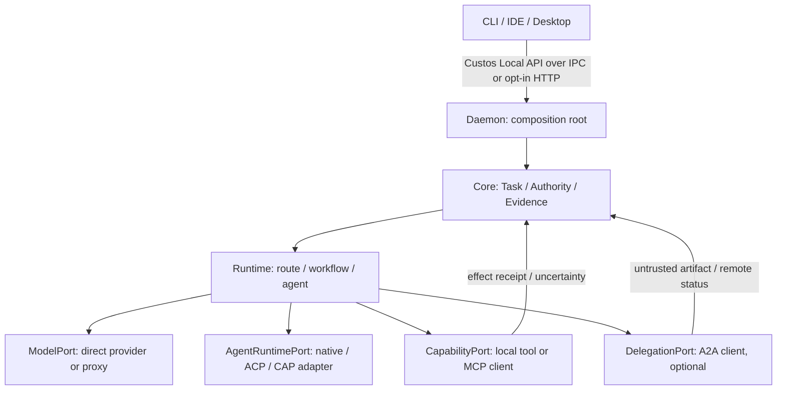

# Protocol and Connectivity Boundaries

**Workspace integration:** The [Agent Workspace](agent-workspace-and-ui.md) is a Local API client; terminal/browser/native-harness process owners remain backend services. [Capabilities and skills](capability-catalog-and-skills.md) separate domain operations from MCP exposure and remote A2A delegation. A new skill does not require a new protocol, hub process or agent. Existing transport support must be verified before enabling UI connection profiles.

> **Architecture decision:** [Custos.md, Part 7](../../Custos.md). This document maps the decision to implementation boundaries. A named hub is a logical responsibility, not a required process, crate, or shipped endpoint.

## 1. Six names, distinct boundaries

| Item | Kind | Purpose | Default decision |
|---|---|---|---|
| IPC | Local transport | Carry the Custos Local API between owned processes | Current stdio JSONL; socket/pipe when multiple clients require it |
| Local HTTP | Local transport | Carry the **same** Local API to a browser or integration | Optional, disabled by default |
| MCP | Tool/data protocol | Consume external tools/resources/prompts | Build a client when a real server is needed; no mandatory MCP server |
| ACP | Agent Client Protocol | Client ↔ coding agent session/permissions/events | Optional harness adapter or editor interoperability |
| CAP | CLI Agent Protocol draft | Orchestrator ↔ CLI agents via PTY/structured binding | Research/experiment; not a Custos internal contract |
| A2A | Remote-agent protocol | Delegate to an independent HTTP agent | Defer until remote delegation is a product job |

Model/vendor APIs are a seventh **different** boundary: `ModelPort` is a single inference attempt. Neither MCP nor A2A is a model transport. 9Router is a possible model proxy profile; agentgateway is a possible external model/MCP/A2A proxy. Both need source/license/fidelity/security review before use. [9Router architecture](https://github.com/decolua/9router/blob/master/docs/ARCHITECTURE.md), [agentgateway](https://github.com/agentgateway/agentgateway/blob/main/README.md).

## 2. Ownership and execution flow

The Local API owns command IDs, actor, task revision, deadline, privacy, and event cursor. IPC/HTTP cannot mint permissions. `AgentRuntimePort` owns harness turn/cancel/resume semantics, not Task success. `CapabilityPort` is the actual effect boundary where mediation is possible; external harnesses that run native tools outside it must receive a lower assurance label. An A2A Task is linked to, but never replaces, the Custos Task.

## 3. Protocol-specific contracts

### Local API over IPC and HTTP

The current daemon [main](../../crates/custos-daemon/src/main.rs) accepts **stdio JSONL**. Unix-domain socket on macOS/Linux and named pipe or authenticated loopback on Windows are target transports, not current capabilities. HTTP is an opt-in second listener over the *same handler/schema*, not a second Task API. IPC endpoints need OS-level endpoint/peer permissions; local HTTP needs explicit authentication, origin/CSRF checks, a loopback-only bind, and a documented browser threat model. Neither `127.0.0.1` nor possession of a session ID is a grant. Persist important events and resume by cursor; do not treat an ephemeral broadcast channel as the canonical event log.

### MCP

The [2026-07-28 transport spec](https://modelcontextprotocol.io/specification/2026-07-28/basic/transports) has stdio and Streamable HTTP. HTTP may return request-scoped SSE; legacy HTTP+SSE is a compatibility path, not a third default transport. OAuth authorization is optional for deployments; if HTTP auth is enabled, follow [resource metadata, discovery, audience and client registration rules](https://modelcontextprotocol.io/specification/2026-07-28/basic/authorization). Dynamic Client Registration is not mandatory for every peer. Stdio credentials belong to the spawned process environment and require scope/secret controls; setting `cwd` alone does not sandbox it.

On the modern revision, server-provided sampling/elicitation/roots requests are carried through multi-round-trip `input_required`, not unsolicited reverse JSON-RPC requests; older revisions may use the legacy callback channel. Handle each round with a bounded budget, privacy policy, source scope and human response where required. [MCP release](https://blog.modelcontextprotocol.io/posts/2026-07-28/), [SDK migration](https://ts.sdk.modelcontextprotocol.io/v2/migration/support-2026-07-28). Discovery metadata and tool output remain untrusted. `tools/list` never grants `tools/call`; a side effect goes through the Custos permit/attempt path only if Custos actually controls dispatch.

### ACP and CAP

[ACP](https://agentclientprotocol.com/protocol/v1/overview) is the **Agent Client Protocol** for client ↔ agent communication, with session updates, permission requests and optional filesystem/terminal methods. It is not the Custos Local API; an editor may call the Local API directly without ACP. [CAP](https://cap-protocol.org/) is a separate draft for orchestrator ↔ CLI agent, with PTY and optional structured fast paths. Use either only for an identified harness integration, with pinned protocol/binary version and measured event, permission, cancellation and native-tool coverage. Neither grants Custos authority over a harness's unseen side effects.

### A2A

[A2A](https://a2a-protocol.org/latest/topics/key-concepts/) exposes Agent Card metadata and remote Task/Message/Artifact semantics. Custos must separately authenticate the peer and map `remote_task_id → WorkerRun`; a card is not a signed Custos permission. Send only a selected, redacted work packet; never send a local permit or secret. Validate remote artifact source/version and reconcile unknown remote status before retry. Custos-specific IBCT is an optional design for compatible deployments, not a normative A2A field. An inbound A2A server is deferred until a real external client needs Custos to accept jobs.

## 4. Physical ownership and current-state map

This table assigns a place to investigate and eventually build; it does **not** order the creation of empty folders. Update the [physical catalog](../development/codebase-architecture.md) with a verified file/entrypoint/call-path before marking an implementation active.

The backend folder layout uses canonical crates rather than one crate per box in a
logical architecture diagram. The physical mapping is:

| Diagram label | Physical owner |
|---|---|
| Core | `custos-domain`, `custos-core` |
| Provider | `custos-provider`, with concrete providers in `custos-adapters/src/providers` |
| Router | routing modules in `custos-runtime` |
| Runtime | `custos-runtime` |
| Gateway | `custos-daemon` and `custos-bridge` |
| MCP / A2A / ACP | protocol adapters in `custos-adapters` |
| Policy | authority and capability modules in `custos-core` |
| Storage | `custos-persistence` |
| Observability | instrumentation remains beside its owner and is composed by `custos-daemon` |
| Applications | `custos-app/cli` and `custos-app/desktop` |

This arrangement keeps protocol code at the untrusted adapter boundary and prevents
gateway or client code from bypassing Kernel authority and persistence ports.

| Responsibility | Current location and evidence | Target location if the feature is built |
|---|---|---|
| Local API handler and transport | `custos-daemon/src/{api.rs,main.rs,local_api/}`; `main.rs` says `transport=stdio-jsonl` | Add IPC socket/pipe or HTTP listener **in daemon**, reusing the same handler; client DTOs in `custos-sdk` |
| Session ↔ Task binding | `custos-bridge/src/{port.rs,service.rs}` | Keep bridge focused on binding/steering, not transport listeners or SQLite |
| Model and harness contracts | `custos-provider/src/{port.rs,events.rs,types/}` has thin and Goose-derived provider interfaces | Reconcile into one supported public contract per job; no third provider abstraction |
| Workflow/catalog/health | `custos-runtime/src/{agent,cognitive,workflow,context}` | Add integration catalog only after proving existing registries cannot represent a real connection lifecycle |
| MCP | `custos-adapters/src/mcp/`; `adapters/client.rs` currently fabricates a success result for mock tools | Real stdio/Streamable HTTP client, version/auth/normalization in the same adapter boundary |
| Native agents, ACP, CAP | `custos-adapters/src/providers/{codex,claude,antigravity}` are model-named stubs | Distinct harness adapters under `custos-adapters`, only when native/ACP/CAP implementation and conformance exist |
| A2A | `custos-adapters/src/roaming/a2a.rs` contains `Simulated immediate dispatch` | Distinct A2A client/card/task mapping only after a remote job requires it; roaming transport is not A2A |
| Canonical effects and connections | `custos-core/src/{authority,capability,kernel,evidence}`; `custos-persistence/` | Core admits; persistence stores connection refs, permit/outbox/attempt/receipt; adapters never write canonical DB |

Dependency direction: pure domain → core/ports → runtime/pack semantics → daemon composition, with persistence and external adapters implementing ports. `custos-adapters/mcp` or a future A2A module must not decide Task success, mint a permit, or turn remote metadata into policy. A proxy binary is an optional supervised connection, not a new source of canonical state.

## 5. Five Harness Adapters

These are integration candidates, not five shipped adapters. At audit commit `3e4dac4`, model-named Codex, Claude, Antigravity, and LocalModel modules were simulation stubs; until real transports and conformance tests exist, they must return an explicit unsupported error rather than a fabricated model response. Goose-derived code exists in the runtime source tree, but the legacy `engine` module is not mounted by `runtime/src/lib.rs` and is not a daemon-composed harness.

The boundary is defined by loop ownership, not brand: `ModelPort` performs one inference attempt; `AgentRuntimePort` drives a multi-step harness. Both emit proposals. Effect authorization and domain verification remain independent. Each adapter advertises tested event, approval, tool, workspace, usage, cancel, and resume coverage. Assurance is recorded per action. Codex App Server and Claude hooks may expose tool events and approval points, but neither automatically routes every native side effect through Custos. CAP remains an optional draft adapter; ACP is a client-agent protocol, not an authority ledger.

### Harness conformance gate

Before a harness is enabled, record its exact binary/API version, supported transport, actor and model identity, loop owner, workspace owner, and capability manifest. Exercise these cases against a fake workspace and fake external connector:

| Fixture | Required observation | Failure handling |
|---|---|---|
| Read and patch inside an isolated worktree | Base commit/dirty manifest, exact changed paths, tool events where the harness exposes them | Reject stale base, symlink escape, or unexpected write set; do not treat a worktree as a sandbox |
| Native shell, MCP, and network effect | Identify whether Custos can intercept before dispatch, only approve via provider, or merely observe | Downgrade the **action** assurance; prevent false `custos-mediated` labels |
| Cancel, crash, reconnect, and resume | Terminal reason, partial artifact, source revision, and whether native session state really resumes | Unknown external effect enters reconciliation; never blindly repeat a non-idempotent call |
| Missing usage, model switch, and fallback | Per-attempt usage is actual, estimated, or unknown; record the real model | Never show unknown spend as zero or silently override a user pin |
| Approval payload changed after preview | Target/arguments/digest are compared at dispatch, not only in UI | Reject stale approval and request a new decision |

For coding, exactly one component owns a writable checkout for a worker run. A provider-managed worktree is an isolated *proposal workspace*: Custos imports and verifies the diff against a pinned base before applying to the user's checkout. For research, an agent-supplied citation is provisional until Custos reopens the exact source revision and passage. For assistant work, any agent may draft, but Custos-mediated send requires Custos's own connector, exact-payload permit, durable outbox, and reconciliation.

## 6. Adoption order and external-source gates

1. **Stabilize the Custos spine:** one command handler, Task/effect attempt IDs, durable permit/outbox/receipt, event replay and an explicitly unsupported error for paths without a real transport. This is a dependency of mediated side effects, not of all read-only model calls.
2. **Prove one direct model route and one tool route:** pin model/transport/version, preserve streaming and usage, run a tool through the actual authority path. A proxy may be added as a `ModelPort` connection profile only after comparing identical requests and failure paths.
3. **Implement one real MCP client:** choose one server and pinned revision; test stdio or Streamable HTTP, auth/metadata, tool call, cancellation, modern `input_required` and legacy compatibility only if required. Do not start with a virtual MCP federation.
4. **Add harness adapters one at a time:** prefer the agent's supported structured integration when it preserves needed features; ACP and CAP are candidates, not default infrastructure. Test native-tool bypass and worktree ownership before assurance claims.
5. **Add A2A only for a named remote delegation job:** test card/version/auth, remote Task mapping, timeout/reconciliation, artifact provenance, and no local-permit leakage. Add inbound server/federation only if Custos must serve outside agents.

For 9Router, inspect provider translation, streamed tool calls, fallback, usage, secret handling, ToS and pinned source/license. For agentgateway, inspect MCP/A2A protocol compatibility, connection/auth management, routing policy and whether an extra process yields a measurable benefit over a direct adapter. Neither upstream's marketing claims or protocol support imply Custos's action-level mediation. Record `candidate → tested → enabled` per integration and keep the direct path as a baseline.
