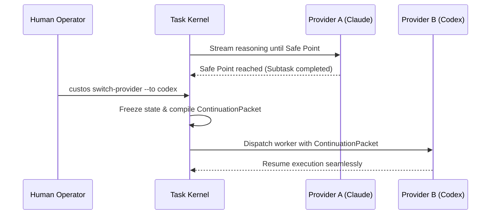

# Tương Thích & Chuyển Đổi Nhà Cung Cấp (Provider Interoperability)

> **Status:** Canonical Baseline v4.0  
> **Source:** Phần IV (§19) Canonical Specification

Một trong 3 trụ cột của Custos là **Model-Agnostic ("Thay não mà không mất hồn")**: khả năng chuyển đổi liền mạch giữa các nhà cung cấp AI (OpenAI, Anthropic, Google, Local models) mà không làm rách vỡ ngữ cảnh công việc hay mất trạng thái tiến trình.

---

## 1. Trừu Tượng Hóa: `ProviderPort`

Mọi AI provider đều được chuẩn hóa qua giao diện trừu tượng `ProviderPort`:

```rust
use async_trait::async_trait;
use tokio_stream::Stream;
use std::pin::Pin;

#[derive(Debug, Clone)]
pub struct ProviderRequest {
    pub session_id: String,
    pub model_name: String,
    pub context_pack: ContextPack,
    pub available_tools: Vec<ToolDefinition>,
    pub temperature: f32,
    pub max_tokens: u32,
}

#[derive(Debug, Clone)]
pub enum ProviderEvent {
    ContentDelta(String),
    ReasoningDelta(String),
    ToolCallProposal(ToolCallRequest),
    UsageMetrics { input_tokens: u32, output_tokens: u32 },
    Completed { finish_reason: String },
}

#[async_trait]
pub trait ProviderPort: Send + Sync {
    /// Thăm dò năng lực của mô hình (Hỗ trợ tool call, streaming, context window)
    async fn probe_capabilities(&self) -> Result<ProviderCapabilities, ProviderError>;
    
    /// Phát động phiên suy luận dạng dòng (Streaming)
    async fn stream_completion(
        &self,
        req: ProviderRequest,
    ) -> Result<Pin<Box<dyn Stream<Item = Result<ProviderEvent, ProviderError>> + Send>>, ProviderError>;
}
```

---

## 2. Ma Trận Năng Lực Nhà Cung Cấp (Capability Matrix)

| Nhà cung cấp | Model Adapter | Cửa sổ Context | Điểm mạnh tối ưu | Điểm yếu cần kiểm soát |
|---|---|---|---|---|
| **Anthropic** | `claude-3-7-sonnet` | 200k tokens | Suy luận kiến trúc phức tạp, tuân thủ chỉ dẫn khắt khe | Chi phí cao hơn, giới hạn rate limit |
| **OpenAI** | `codex / o-series` | 128k - 200k | Khả năng sinh mã chuyên sâu, giải quyết logic thuật toán | Xu hướng tạo tool call lồng nhau phức tạp |
| **Google** | `antigravity-adapter` | 1M+ tokens | Phân tích toàn diện kho tài liệu khổng lồ | Cần lọc kỹ context để tránh loãng thông tin |
| **Local LLM** | `llama.cpp / Ollama` | 8k - 32k | Hoạt động 100% offline, chi phí bằng $0$, bảo mật tuyệt đối | Năng lực suy luận giới hạn ở các subtask đơn giản |

---

## 3. Chuyển Đổi Provider Không Mất Trạng Thái: `ContinuationPacket`

Khi người dùng muốn đổi provider (ví dụ: bắt đầu với Claude nhưng muốn chuyển sang Codex do chạm trần chi phí, hoặc chuyển sang model local khi mất mạng):



### Cấu Trúc `ContinuationPacket`
`ContinuationPacket` là một gói dữ liệu độc lập hoàn toàn với định dạng chat của từng hãng:
- **Task Contract & Current Goals:** Mục tiêu cốt lõi và các ràng buộc chưa thay đổi.
- **Completed Steps & Verified Artifacts:** Danh sách các bước đã hoàn thành kèm mã băm chứng cứ.
- **Current Workspace State:** Snapshot Git worktree hiện tại.
- **Active Hypothesis & Pending Actions:** Giả thuyết kỹ thuật đang kiểm chứng và các việc tiếp theo cần làm.
