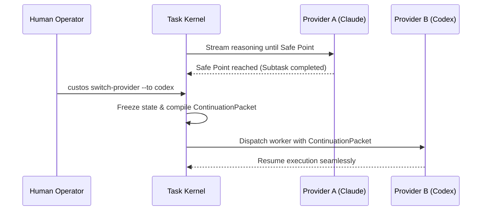

# Provider Interoperability & Portability

> **Status:** Canonical Baseline v4.0  
> **Source:** Part IV (§19) Canonical Specification

One of Custos's three pillars is **Model-Agnostic ("Brain Transplant Without Soul Loss")**: the ability to switch seamlessly across AI providers (OpenAI, Anthropic, Google, local models) without losing work progress, task context, or execution state.

---

## 1. Abstraction: `ProviderPort`

All AI providers are normalized through the abstract `ProviderPort` trait:

```rust
use async_trait::async_trait;
use tokio_stream::Stream;
use std::pin::Pin;

#[derive(Debug, Clone)]
pub struct ProviderRequest {
    pub session_id: String,
    pub model_name: String,
    pub context_pack: ContextPack,
    pub available_tools: Vec<ToolDefinition>,
    pub temperature: f32,
    pub max_tokens: u32,
}

#[derive(Debug, Clone)]
pub enum ProviderEvent {
    ContentDelta(String),
    ReasoningDelta(String),
    ToolCallProposal(ToolCallRequest),
    UsageMetrics { input_tokens: u32, output_tokens: u32 },
    Completed { finish_reason: String },
}

#[async_trait]
pub trait ProviderPort: Send + Sync {
    /// Probes model capabilities (tool use, streaming, context window limit)
    async fn probe_capabilities(&self) -> Result<ProviderCapabilities, ProviderError>;
    
    /// Initiates a streaming completion session
    async fn stream_completion(
        &self,
        req: ProviderRequest,
    ) -> Result<Pin<Box<dyn Stream<Item = Result<ProviderEvent, ProviderError>> + Send>>, ProviderError>;
}
```

---

## 2. Provider Capability Matrix

| Provider | Model Adapter | Context Window | Key Strengths | Managed Trade-offs |
|---|---|---|---|---|
| **Anthropic** | `claude-3-7-sonnet` | 200k tokens | Complex architectural reasoning, rigorous instruction following | Higher token cost, stricter rate limits |
| **OpenAI** | `codex / o-series` | 128k - 200k | Deep code synthesis, algorithmic problem solving | Tendency to emit deeply nested tool calls |
| **Google** | `antigravity-adapter` | 1M+ tokens | Massive multi-file document ingest & analysis | Requires aggressive context filtering to avoid dilution |
| **Local LLM** | `llama.cpp / Ollama` | 8k - 32k | 100% offline, zero operational cost, absolute data privacy | Restricted reasoning capacity; best for scoped subtasks |

---

## 3. Lossless Provider Switching: `ContinuationPacket`

When a user switches providers mid-flight (e.g., migrating from Claude to Codex when reaching a budget cap, or falling back to a local model when offline):



### Structure of `ContinuationPacket`
A `ContinuationPacket` is completely decoupled from any single vendor's chat completion schema:
- **Task Contract & Active Goals:** Core objective and active constraints.
- **Completed Steps & Verified Artifacts:** Chronological record of completed subtasks with verification hashes.
- **Current Workspace State:** Exact Git commit snapshot and worktree status.
- **Active Hypothesis & Pending Plan:** Current technical hypothesis under test and remaining planned steps.
