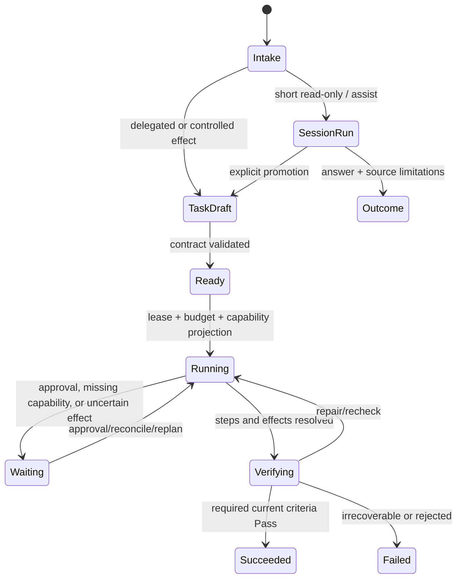

# Custos reference architecture: product, runtime, infrastructure and codebase

**Document ID:** ARCH-REF-01. **Status:** lead-directed target architecture, reviewed 2026-09-28; shared contract changes still require the review rules in `AGENTS.md`. **Implementation truth:** [status evidence](../status/README.md). **Execution semantics:** [runtime flows](runtime-flows.md). **Protocol research:** [connectivity findings](../research/connectivity-gateway-findings.md). This is the primary end-state system-design reference; [target architecture](target-architecture.md) is its shorter conceptual overview.

## 1. Architectural decision in one sentence

Build Custos as a **local-first, proof-carrying work runtime**: a durable Session/Task/Run spine governs work, while model providers, external coding agents and MCP capabilities plug into separate ports with explicit authority, provenance and failure semantics. Single-user value works without a gateway sidecar. 9Router and Agentgateway may be added by deployment profile, not embedded as the Task Kernel.

## 2. Product contract

| User promise | System obligation | Boundary |
|---|---|---|
| “Vibe” starts fast | A SessionRun can answer or propose a patch without forcing a formal Task upfront | Mutating/long-running/delegated work promotes into Task with explicit contract |
| Resume after interruption | Task, Run cursor, decisions, artifacts and unresolved effects persist | A model transcript is not the source of truth |
| Use many models/coding tools | Versioned roles and explicit ModelPort/AgentRuntimePort adapters | A 9Router-compatible model API does not run every coding agent loop |
| Connect useful tools | Per-user/per-Task capability projection from an MCP/Tool catalog | Tool discovery is not permission; untrusted metadata is not policy |
| Trust the result | Each required criterion maps to current evidence or a visible limitation | Passing a build or receiving plausible model text is not completion |
| Local-first privacy | State and artifacts local by default, egress is a policy decision | Cloud inference and remote MCP are opt-in scoped connections |

Engineering, programming research and personal operations share the same substrate but have different Pack contracts and risk defaults. Coding and research are first-class, not merely prompts with different labels. Assistant/personal external effects are a later release gate because recipient/attachment resolution and irreversible actions need stronger controls.

## 3. Core entities, versions and writers

| Entity | Meaning | Writer | Required version or identity |
|---|---|---|---|
| Session | Conversational continuity, preferences and journal | Session service | `session_id`, `session_version` |
| SessionRun | One fast-path request and its route/outcome | Session service | `session_run_id`, `command_id` |
| Task | Durable user goal and lifecycle | Kernel | `task_id`, `state_version`, `epoch` |
| TaskContract / Criterion | Scope, acceptance, policy, data and budget | Kernel via approved revision | `contract_id`, `revision`, `criterion_id` |
| SessionTaskBinding | Promotion/attachment link | Bridge transaction | `binding_id`, `command_id`, session/task revisions |
| Run / Step | Bounded execution, lease, checkpoint and handoff | Workflow | `run_id`, `step_id`, `lease_epoch`, cursor |
| SourceSnapshot / ContextPack | Exact selected sources and transformations | Context service; immutable artifacts | content hash, source version, compiler version |
| RouteDecision / RouteAttempt | Why and where a model/agent call went | Intelligence Hub | role/profile version, actual candidate or Unknown |
| Action / Attempt / Receipt | Controlled effect proposal, dispatch and observation | Gateway/effect service | action ID, payload digest, attempt ID, idempotency key |
| Evidence / Assessment / Outcome | Claims, verifier result, limitations and closure | Evidence service; Kernel transitions Task | criterion/revision/subject/verifier versions |

Events and immutable artifacts are durable facts; caches, full-text indexes, graph indexes, health probes and dashboards are derived views. Each state family has one writer. CLI, IDE, bot, 9Router, Agentgateway and external coding agents cannot directly update canonical Task state. `TaskContractRevision`, plan, source snapshot and artifact version are independent; staleness in one does not silently mutate another.

## 4. Invariants and trust boundaries

1. Models and agents propose. They do not mint permits, raise their own budget or mark required criteria Pass.
2. Policy is evaluated on canonicalized action arguments and current Task/source revisions before a Custos-controlled effect. Persist an attempt before dispatch and a real receipt afterward. Dispatch ambiguity is Uncertain and must be reconciled.
3. External-agent native tools are only “Custos-controlled” when interception and policy enforcement are proven. Every connector declares `Custos-mediated`, `Provider-governed` or `Observe-only`.
4. A model route is eligible only if it meets user pin, data/egress restrictions, capability, quality floor, budget and health. Unknown actual model/account is not silently rewritten as the requested alias.
5. A Task succeeds only on current required criterion assessments plus resolved relevant effects; optional Unknown remains visible.
6. Retrieval, MCP output, web/paper content and repository instructions are untrusted data. They may be cited or analyzed but cannot override user/system policy.
7. A gateway's telemetry/budget is supplemental. The Custos ledger, authority and completion gates remain authoritative.

The [four-contract register](../contracts/README.md) gives acceptance fixtures for the most contested boundaries. No production claim is made until process-level failure tests demonstrate the invariant.

## 5. Logical components and codebase placement

| Component | Responsibility | Existing target homes | Constraint |
|---|---|---|---|
| Local API + client | Versioned commands, event cursor, approvals, outcome UI | `crates/app/custos-local-api`, `custos-daemon`, `custos-cli` | One canonical DTO; thin clients |
| Session/Bridge | Fast path, journal, promotion, attachment, steering | `crates/runtime/custos-session`, `crates/core/custos-bridge` | Move RAM-only state to repository port; preserve legacy Promoted read |
| Task Kernel | Contract/revision/status and command idempotency | `crates/core/custos-domain`, `custos-kernel` | No sidecar or workflow writes Task directly |
| Workflow/agent harness | Bounded step, lease, checkpoint, handoff | `crates/runtime/custos-workflow`, `custos-agent` | Effect intent yielded; no hidden terminal status |
| Cognitive/Context | Role selection, source snapshot, ContextPack | `crates/runtime/custos-cognitive`, `custos-context`, `tools/repo_intelligent` | S1 prediction not policy; source revalidation |
| Model/agent adapters | Inference and external-agent lifecycle | `crates/core/custos-provider-sdk`, `crates/adapters/custos-providers`, explicit agent adapters | Separate ModelPort from AgentRuntimePort |
| Capability/Authority | Tool catalog, MCP host, grants/permits and raw execution | `crates/runtime/custos-security`, `crates/adapters/custos-adapters-mcp`, `custos-mcp` | Replace pass-through/synthetic success before governed effect claims |
| Evidence | Source/effect receipts and criterion closure | `crates/runtime/custos-security/evidence`, Kernel completion path | Verifier version and current subject required |
| Persistence/observability | SQLite WAL, CAS, outbox, route/effect ledger, backup/restore | `crates/infrastructure/custos-persistence`, daemon composition | Single authoritative writer, tested migrations |
| Packs/setup | Engineering, Research, Assistant; doctor and controlled setup | `crates/packs/*`, CLI/daemon adapters | Declarative capabilities, versioned recipes, no implicit broad grants |

Keep current crates while wiring vertical flows. Do not add another hub crate merely for a diagram. The daemon now reuses Local API DTOs, but context compaction homes and provider SDK/types still need ownership decisions. The workspace member `custos-gateway` remains an isolated experimental mock and must not become a second orchestration authority. `custos-engine` is outside the 42-member workspace; evaluate narrow extractions rather than turning the entire imported engine on. See [implementation blueprint](../development/implementation-blueprint.md).

## 6. Process and deployment architecture

### P0: local single-user baseline

One `custos-daemon` process supervises local API, Task/Session services, workflow, context, capability gateway, provider adapters and observability. SQLite WAL and content-addressed artifacts live in a user-selected data directory. Local MCP servers are child processes with explicit lifecycle, sandbox/egress restrictions and per-user credential references. CLI/IDE are clients. A direct cloud provider or local model is an adapter, not a second control plane. Bind local API to a Unix socket or loopback with authentication; do not expose it publicly by default.

### P1: model operations

Add 9Router on loopback for multiple provider/account connections. Custos selects an approved role/model class and sends a model request; 9Router handles translation/account operations within an agreed pool. Secrets remain with their declared owner. If route/usage provenance is opaque, that pool is ineligible for strict Tasks. Failure degrades to an approved direct candidate or pauses; never silently bypass user egress policy. [9Router architecture](https://github.com/decolua/9router/blob/master/docs/ARCHITECTURE.md).

### P2: team/network federation

Add Agentgateway for authenticated remote LLM, MCP and A2A traffic. It may front 9Router as one custom-compatible model backend after conformance. Custos still authorizes exact tool arguments/effects, reserves budget and owns Task state. A remote MCP server does not receive the full Task transcript; send only scoped data. Use correlation IDs and redacted traces across hops. [Agentgateway routes](https://agentgateway.dev/docs/standalone/latest/documentation/configuration/routes/), [custom provider](https://agentgateway.dev/docs/standalone/latest/integrations/llm/providers/custom/).

### P3: strict/privacy-sensitive

Pin model, server/tool schemas and source snapshot; disable opaque fallback, unmediated agent native tools and unapproved egress. Abstain or request human action when a required capability is unavailable. P3 is a policy profile, not an additional daemon.

The [connectivity architecture](connectivity-hubs.md) defines exact model/agent/MCP paths, per-user and per-Task capability views, and fallback ownership. It is the reference for deciding whether to run no gateway, one gateway or both.

## 7. Workflow engine and task profiles

The Task status names in current code are `Draft/Queued/Running/Blocked/Succeeded/Failed/Cancelled`; the diagram uses logical phases. Do not add/rename public enum variants until a versioned migration and client compatibility plan is accepted. Task profiles constrain step graph, capability set, privacy, budget and evidence:

| Profile | Default graph | Allowed effects | Required evidence |
|---|---|---|---|
| Explain/repo research | Locate → select source → synthesize → cite/check | Read-only within data policy | Exact span/hash, unsupported claim detection |
| Bug fix | Reproduce/triage → plan → edit → test → review/verify | Scoped worktree/file/shell after permit | Diff, test result, current criterion mapping |
| Research-to-code | Sources → support/contradiction → brief → engineering child work → experiment | Read then scoped code/test | Source version, claim support, artifact/test |
| External coding-agent session | User-selected agent → capability negotiation → bounded delegated steps → inspect/reconcile | Depends on proven adapter control mode | Native-tool visibility, artifacts, declared limitations |
| Personal operation (later) | Resolve identity/target → preview → exact approval → send/reconcile | External irreversible only after approval | Recipient/payload digest, external ID, receipt |

Multi-worker execution is optional. Default one worker with explicit checkpoints; parallel workers only when independent steps, isolation and merge/evidence semantics are measured. S1/S2 are multiple role candidates, not a fixed two-model switch. The [Intelligence Hub](intelligence-hub.md) owns route policy but cannot change Task authority.

## 8. Data model and transactions

SQLite is the local authoritative store. Use versioned additive migrations, WAL, foreign keys, one logical writer and CAS on `state_version`/lease epoch. Suggested *logical* tables, not a claim of existing schema: `sessions`, `session_events`, `session_task_bindings`, `tasks`, `task_revisions`, `task_events`, `runs`, `steps`, `leases`, `outbox`, `actions`, `action_attempts`, `effect_receipts`, `source_manifests`, `route_decisions`, `route_attempts`, `usage_ledger`, `evidence_items`, `criterion_assessments`, `artifact_refs`, `grants`, `approvals`, `audit_events`. Reuse existing tables where present; do not create duplicate parallel ledgers.

Transactions to prove: promotion writes Task/revision/binding/event exactly once; step claim fences stale lease; effect prepare/outbox/attempt commits before dispatch; receipt or Uncertain follows; criterion assessment references current subject; terminal Task transition checks required criteria and relevant unresolved effects. Idempotency keys are scoped to actor, command type and payload digest, not globally reused strings. A timeout after dispatch is not rollback of external state.

Back up SQLite consistently with WAL and pin every referenced CAS blob, encryption/key references and schema version. Restore to a separate directory, run integrity checks, reload Task/Session/evidence and execute recovery scan before switching live writers. GC follows reachability and retention policy; cannot collect an artifact still referenced by an active Task, export or backup.

## 9. API, configuration, setup and UX

Local API requests include protocol version, request/command ID, actor/workspace ID, expected entity version and correlation ID. Separate commands from queries and event-stream cursors. Authenticated clients can read timeline, sources, route/usage and capability status; only commands request state changes. Invalid/unknown fields and protocol downgrade behavior are specified per version. CLI/IDE reconnect from the last durable cursor; UI never synthesizes a success state because the daemon is unavailable.

Configuration has three layers: organization policy (if present), user preferences and Task-specific narrowing. Task config may not widen higher-level egress, capability or budget constraints. `SetupPlan` inspects OS, toolchain, network and credentials, proposes reversible steps, asks for approval for installs/config writes, then records receipts and rollback. `doctor` reports missing capabilities and degraded profiles without claiming everything is installed. Sidecar config is desired state plus observed health/drift; Custos does not edit 9Router/Agentgateway private databases.

User-facing controls should expose `Roles`, `Models`, `Coding agents`, `Tools/MCP`, `Connections`, `Policies`, `Costs`, `Task timeline`, `Evidence` and `Health`, but the first release may use CLI views. Every Task shows selected route/control mode, source snapshot, allowed effects, outstanding approvals, attempted effects and limitations. A user pin always has an explicit “unavailable/unsafe” outcome rather than silent substitution.

## 10. Failure, security and non-functional targets

| Failure | Required behavior |
|---|---|
| Daemon crash before/after effect dispatch | Recover prepared attempt; dispatch outcome may be Uncertain; reconcile, no blind replay. |
| MCP server disappears or tool schema changes | Stop new calls, preserve in-flight state, reproject capabilities at safe checkpoint. |
| Model stream truncates during tool proposal | Never execute incomplete JSON/tool delta; record partial usage and reason. |
| Gateway fallback or double retry | Config validator enforces one owner per pool/failure class; route attempts visible. |
| Index stale/dirty buffer | Revalidate source bytes or mark citation stale/unknown. |
| Sidecar/network outage | Local profile continues if allowed; remote capability is Degraded, not silently replaced. |
| Missing usage or budget mismatch | Reserve conservatively, settle observed cost, mark Unknown instead of zero. |
| External coding agent with hidden native tools | Show Provider-governed/Observe-only, require explicit user choice for effectful work. |

Security defaults: deny by default for mutation/egress, least privilege, secret references rather than prompt injection, path/recipient canonicalization, sandbox by effect class, redacted telemetry, data retention and audit export. Trust model covers prompt injection in repo/web/MCP output, compromised MCP server, stolen sidecar credential, symlink/path escape, stale permit, TOCTOU source, log leakage and confused-deputy agent adapters.

Initial *measurement hypotheses* on a pinned local fixture: daemon warm startup p50 <500 ms, warm context compile p50 <200 ms, local policy/dispatch overhead p50 <50 ms, idle daemon RSS <100 MB without loaded model, fake-provider F1 p50 <5 s. Record p95 and failure paths; do not label unmeasured targets as achieved SLOs. Track verified outcome rate, unsupported-claim rate, human interventions, total cost, recovery time and unresolved effects, not raw agent count.

## 11. Delivery decisions for a three-person team

The shortest safe path is PR-00 baseline/ownership/four contracts → real daemon F1 → effect spine/F2 → research-to-code/F3 → setup and gateway spikes. Separate contract, migration, adapter, composition and eval PRs. Vi owns role/eval/product semantics; Truong owns data/authority/daemon; Vinh owns Session/Workflow/agent/MCP lifecycle, provisionally. Shared `custos-domain` and DTO ownership remain blocked on an accepted ADR. Use [implementation blueprint](../development/implementation-blueprint.md) for PR dependencies and [PR-00 gates](../development/pr-00-gates.md) for rollback and acceptance.

## 12. Architecture decisions still open

1. Accept versioned C-01 through C-04 contracts and retain `custos-local-api` as the public Local API DTO home unless a reviewed ADR changes it.
2. Close the trusted-evidence boundary so completion accepts trusted evidence identities, not client-authored verifier truth.
3. Compose the first controlled raw executor, durable attempts and reconciliation in the daemon for F2.
4. Choose AgentRuntime adapters individually; never promise universal coding-agent support from 9Router.
5. Pin 9Router/Agentgateway releases and decide per pool who owns model fallback/retry.
6. Define when a user may opt into Provider-governed external-agent behavior and how the UI labels it.
7. Select backup encryption/key management and retention policy before handling sensitive sources or credentials.

These are decision gates, not reasons to stop F1 fixtures, provider-port conformance or codebase inventory.
