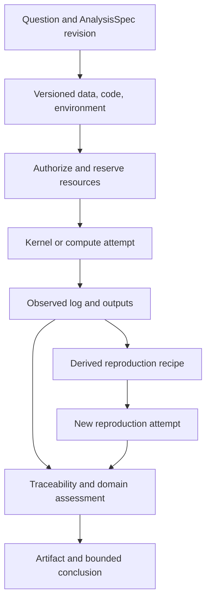

# Research Workbench: thiết kế từ Claude Science và Open Science

**Trạng thái:** kiến trúc đích và kế hoạch implementation cho Custos SADE. Nghiên cứu nguồn công khai và source local ngày 07-10-2026; không truy cập mã nội bộ Claude Science, không chứng nhận đã dùng thử toàn bộ sản phẩm. Bản này đào sâu Research của [desktop blueprint](../development/sade-frontend-backend-convergence-plan.md), không tạo runtime hay roadmap song song. Các object/path mới là đề xuất cần map vào type hiện hữu khi triển khai.

## 1. Phân biệt nguồn và kết luận thiết kế

**Claude Science của Anthropic** là ứng dụng research riêng, dùng model Claude cùng môi trường thực thi và công cụ khoa học. Tài liệu hiện hành nói hỗ trợ cả computer science/ML và nhiều ngành ngoài life sciences. Đây là nguồn để học hành vi sản phẩm, không phải source có thể copy. [Overview](https://claude.com/docs/claude-science/overview).

**Open Science Desktop `ai4s-research/open-science`** là checkout local ở `AgentHub/open-science`, SHA đã kiểm `04b64817c12e7fdbe0e052bfa1aeaf8802feecde`; dùng Tauri/React, OpenCode sidecar và các phần Rust/skills. Đây là nguồn implementation độc lập, không là bản open-source chính thức của Claude Science. Source study chi tiết ở [Open Science](../development/open-science-source-study.md). Dự án `synthetic-sciences/openscience` khác nữa; không dùng các tên này thay thế nhau.

**Custos Research** nên cung cấp vòng làm việc hoàn chỉnh: question → evidence → analysis/experiment → artifact → review → revision → reuse. User bắt đầu bằng chat, nhưng thao tác trực tiếp trên paper, bảng, notebook, hình và báo cáo. Research chia sẻ conversation/Task/resource nền với Coding/Copilot; domain-specific services giữ semantics nghiên cứu.

“Dùng toàn vẹn” nghĩa là mỗi workflow được hỗ trợ có đủ intake, execution, inspection, correction, save, resume và export. Không có nghĩa nhập mọi connector sinh học hoặc giả rằng Claude Science có API headless để nhúng. Chỉ xây `AgentRuntimePort` cho một sản phẩm khi đã kiểm API/CLI và điều kiện tích hợp thực; dùng Claude model API không tự mang theo Claude Science workbench.

## 2. Những hành vi Claude Science đáng học và giới hạn

| Nguồn chính thức đã đọc | Hành vi được mô tả | Quyết định Custos |
|---|---|---|
| [Core concepts](https://claude.com/docs/claude-science/core-concepts) | Project nhóm sessions/artifacts; session có workspace/kernels; delegation hiện track trong conversation | Giữ Task/Session/ExecutionWorkspace riêng; mở track để xem run, không ép Task thành session |
| [Artifacts](https://claude.com/docs/claude-science/artifacts) | Artifact version mở cạnh chat; provenance nối messages/code/log/environment/review; execution log ưu tiên khi khác code recipe | Versioned artifact + observed execution record + derived reproduction recipe có method và completeness |
| [Comments](https://claude.com/docs/claude-science/comments) | Comment bám text/figure; lưu comment có thể chờ gửi theo message | Pending annotations có artifact version; submit batch có receipt, không tự chạy ngay khi click hình |
| [Reviewer](https://claude.com/docs/claude-science/the-reviewer) | Đối chiếu claims với record; không re-run analysis và không tự chọn đúng phương pháp nghiên cứu | Traceability review, reproduction test và methodological review thành các loại assessment riêng |
| [Tools/environments](https://claude.com/docs/claude-science/tools-and-environments) | Python/R persistent state; environment và package lifecycle ảnh hưởng kernel | Kernel epoch + environment revision + explicit restart/invalidation |
| [Remote compute](https://claude.com/docs/claude-science/remote-compute-clusters) | SSH/Slurm hoặc detached job; mất kết nối không dừng job; remote execution ngoài local sandbox | Durable job identity, submit uncertainty/reconcile, assurance theo host |
| [Literature access](https://claude.com/docs/claude-science/literature-access) | Open access và quyền truy cập qua publisher/library credentials | Acquisition ledger ghi route/access/version; metadata không bị trình bày là full-text đã đọc |
| [Data handling](https://claude.com/docs/claude-science/how-claude-science-works-with-your-data) | Dữ liệu local nhưng phần đưa vào model, tool hoặc dịch vụ ngoài có egress riêng | Context receipt và data-transfer receipt độc lập; local compute không đồng nghĩa offline inference |

Các hành vi trong bảng là mô tả vendor tại thời điểm đọc, không kiểm chứng độ chính xác hoặc bảo mật của triển khai. Trang Help Center cũ ghi ít nền tảng hơn overview hiện hành; không dùng trang cũ để kết luận Windows không được hỗ trợ. Product guide gặp lỗi truy cập trong lượt nghiên cứu này nên không dùng làm căn cứ.

## 3. Những workflow Custos phải hoàn thiện

| Workflow | Input | Output dùng được | Điều kiện xong |
|---|---|---|---|
| Paper/source reading | PDF/URL/repo docs + question | Answer/PaperCard với spans và parse gaps | Mở đúng nguồn/version; nêu phần chưa đọc được |
| Literature comparison | Question, candidates, phạm vi | Evidence matrix, contradictions, brief | Có search/selection ledger và tiêu chí so sánh đồng nhất |
| Data exploration | Dataset ref + question | Profile, cleaning script, plots, notes | Ghi schema/sample/nulls/transforms; raw input giữ nguyên |
| ML baseline/ablation | Dataset/splits, method, budget | Code/config, run records, metrics, figures | Cùng metric/split/baseline; negative runs không bị bỏ |
| Reproduce result | Artifact/run/paper claim | Reproduction attempt và comparison | Nêu tolerance, environment khác biệt và missing inputs |
| Figure iteration | Figure/version + annotation | Code revision + regenerated figure | Biết chỉnh presentation hay thay phép phân tích; giữ bản trước |
| Report/manuscript | Selected claims/results | Markdown/LaTeX/report + references | Figures/numbers có nguồn; unresolved findings hiển thị |
| Research → Coding | Selected method/code/claims | Engineering brief và code artifact refs | Chọn repo/behavior criteria; không biến paper claim thành test oracle |
| Research → Copilot | Selected outcome | Note/draft/report summary | Giữ caveats và source links; gửi ra ngoài là effect riêng |

Ưu tiên programming/AI/Data: paper về ML/systems, code benchmark, CSV/Parquet, notebook Python, metrics/plots và report. Các ngành khác dùng extension profile gồm source connectors, data formats/viewers, environment recipe, workflows và rubrics. Không fork Research runtime cho từng ngành.

## 4. Desktop: từ chat đến bàn phân tích

Research preset dùng shell chung: conversation bên trái hoặc có thể thu gọn, resource canvas ở giữa, inspector theo selection. Library là panel tài nguyên có thể mở/đóng; Experiments và Findings là resources có thể pin. Không mở sẵn mọi panel trên màn hình nhỏ.

Conversation gồm question, plan card khi cần, source cards, execution progress, artifact cards và review findings. User có thể hỏi ngắn mà không lập plan. Khi cần compute, plan mô tả inputs, method, environment, budget và expected outputs trước chạy. Hiển thị “Đang chờ kernel”, “Đang chạy”, “Đang đối chiếu kết quả” theo backend state, không theo timer UI.

Resource picker nhóm Sources, Data, Analysis, Outputs; có search và recent. Một notebook có thể mở trong Research hoặc Coding bằng cùng resource ID. Chuyển lens giữ draft, selected artifact và Task; đổi executor chuẩn bị context mới với refs và omissions. Sidebar filter theo Research chỉ đổi projection, vẫn có All history.

### 4.1 Artifact viewer và inspector

Viewer registry chọn theo MIME/schema/version/capability, không chỉ đuôi file. Giai đoạn đầu: PDF/text/code, Markdown, image/SVG được xử lý an toàn, table preview, notebook, metrics/plots. Viewer không hiểu format trả download/raw metadata; không giả render thành công. Dữ liệu lớn dùng page/range/column requests, không đổ hàng GB vào renderer.

Inspector có Overview, Inputs, Code, Execution, Environment, Review, History. Overview nói artifact là authored/imported/computed/derived; Execution ghi command/cells thật đã quan sát; Code có thể là bản script được tái dựng để reproduce và phải ghi như vậy. Một câu trả lời của model về “đã chạy” không tạo execution record.

History so sánh version, mở conversation/turn sinh ra nó, restore thành version mới. Rename đổi label/path mapping, không phá artifact identity. Delete view, archive artifact và purge bytes là actions riêng. Với nguồn do user sở hữu ngoài managed storage, xóa catalog reference không tự xóa file gốc. Export kiểm sensitivity/license/access scope và tạo manifest.

### 4.2 Comments và vòng sửa figure

Annotation contract dự kiến: ID, artifact/version, selector, quoted text hoặc image region, actor, note, created time, dispatch status, submitted turn ID. Text selector có offsets + quote/context; hình dùng tọa độ chuẩn hóa trên content bounds, không trên padding của pane; bảng dùng row identity/column key khi hỗ trợ. Resize/zoom không đổi vị trí logic.

Save comment → pending list trong composer → submit selected comments → backend ghi turn và annotation links → worker đọc đúng version → đề xuất patch/code → execute nếu cần → new artifact version → compare. Nếu version đã đổi, comment vẫn neo bản cũ; migration selector phải có match status, không tự gắn nhầm lên bản mới.

Phân biệt yêu cầu “đổi màu/trục” với “loại outlier/thay normalization”. Trường hợp sau đổi analysis semantics, cần cập nhật method/config và review kết quả; user thấy thay đổi này trong diff/summary. Figure mới phải nối đúng producing run, không sửa hình rồi giữ provenance của code cũ.

## 5. Mô hình dữ liệu nghiên cứu

Tái sử dụng `SourceRecord`, `PassageAnchor`, `ResearchClaim`, experiment/lineage và artifact types hiện hữu. Bảng dưới định nghĩa phần cần bổ sung, chưa là schema SQL hay Rust type đã freeze.

| Object | Fields cần có thêm hoặc xác nhận | Tính chất |
|---|---|---|
| SourceRevision | canonical identity, content digest, retrieved time, acquisition route, format/parser version, access/license | Raw snapshot immutable khi được phép lưu |
| DatasetVersion | manifest/URI, schema, row count khi biết, split refs, fingerprint method, exclusions | Không giả hash sample là full dataset hash |
| Recipe (AnalysisSpec) | name, command, environment_spec, inputs, outputs, created_at | Định nghĩa CÁCH chạy thực nghiệm (reproducible logic) |
| EnvironmentSpec | python_version, requirements, container_image, hardware | Mức capture complete/partial rõ ràng của môi trường |
| KernelSession | stable ID, notebook/workspace, environment revision, epoch, status, lease | In-memory state không được bảo đảm sống qua restart |
| ExecutionRecord | recipe_id, session_id, status, exit_code, stdout/stderr_cas_uri, started/ended_at, artifacts | Quan sát LỊCH SỬ chạy thực sự, không chứa logic |
| ArtifactVersion | digest/location, producing attempt, inputs, media/schema, completeness, retention | Có thể là partial output của failed run |
| Observation/Metric | metric definition/unit, split, estimator, value/error, producing attempt | Tách measured, reported-by-paper và inferred |
| VerificationClaim | claim_statement, verifier_id, passed, details, verified_at | Scientific claim assessment độc lập với run logic |
| ReviewFinding | subject/version, check/method, evidence, severity/status, reviewer | Finding resolved không tự đồng nghĩa claim true |
| ReproductionRecipe | source attempt, ordered commands, env/input refs, derivation method, gaps | Derived artifact; không sửa observed execution history |

**Thay thang tin cậy đơn:** `ClaimGroundingLevel` hiện có `L0Ungrounded/L1Cited/L2Verified/L3Sealed` trong `domain/claim.rs`; các comment “zero false-passes/cryptographic proof” không được hiểu là bảo đảm đã implement. Thiết kế đích dùng các trục: locator validity, extraction fidelity, semantic support, empirical replication, methodological review và freshness. Mỗi trục có method/status/record refs. “Sealed” nếu giữ chỉ là integrity/storage property.

Migration giữ enum cũ để decode dữ liệu, thêm assessment records; không tự map `L3Sealed → scientifically verified`. UI chuyển sang badges có nghĩa cụ thể như “Đã kiểm locator”, “Chưa đánh giá support”, “Đã tái chạy trong env X”. Existing ingress normalization vẫn cần giữ trong quá trình migration.

## 6. Literature và source acquisition

Pipeline: resolve identifier → discover candidates → chọn access route → fetch snapshot → dedup/version → parse → coverage report → passage index → claim extraction. Ghi riêng discovery metadata, acquired full text và parsed usable content. Có abstract nhưng thiếu full text thì trả lời trong giới hạn abstract.

Connector profile khai báo operation, auth reference, egress target, rate/retry limits, supported response schema và health. MCP là một transport adapter; cùng source service có thể gọi native HTTP. DOI resolving chỉ xác nhận identity; claim support cần passage. Không cần gọi mọi connector cho một paper có PDF sẵn.

Search ledger giữ queries/filters/date, candidates, inclusion/exclusion/reason và dedup roots. Literature map phải thể hiện coverage gap và nguồn thứ cấp cùng gốc. Source update tạo revision mới; claims/report phụ thuộc bản trước stale theo policy, không silently replace bytes dưới anchor cũ.

Cache theo content/version/parser/access scope. Credential chỉ là secure reference; auth grants cho source không tự cho phép model egress. File parse không execute embedded code/macros; OCR/table/figure gaps được trả về như dữ liệu. Chọn parser theo tài liệu và fixture, chưa khóa library chỉ vì upstream dùng nó.

## 7. Dataset, environment và notebook execution

Raw datasets được mount/read trong scope; transforms tạo outputs riêng. Dataset preview bounded, có sampling method và filters. Remote/object-store dataset dùng version ID/manifest nếu có; nếu chỉ có URI mutable thì reproducibility status phải partial. Locality của dataset, compute và model inference được hiển thị riêng.

Environment manager hỗ trợ create/resolve/probe/revise/retire. Mỗi run giữ environment revision; dependency install tạo revision mới hoặc clone environment, tránh sửa env đang có active jobs. Chọn Python managed environment đầu tiên dựa toolchain hiện có; package install là effect có network/disk scope. Không bắt buộc copy cơ chế conda của Claude Science vào Custos.

Kernel service có queue theo kernel, operation ID/cell ID/code hash/epoch, bounded output và explicit stdin handling. Hai notebook độc lập không chia state mặc định. Hai worker muốn mutate cùng kernel phải được serial hóa hoặc tạo kernel riêng; OI không được parallel execute dựa riêng vào write-set file. Interrupt/reset đi control path riêng để không mắc sau lock của cell treo.

Source local Open Science `kernel.rs` dùng persistent children với JSON-line bridge, locks I/O và child tách biệt; `jupyter.rs` là đường Jupyter riêng. Không gọi JSON-line bridge này là implementation đầy đủ Jupyter protocol. Custos nên giữ contract kernel trung lập; MVP bridge phải tuyên bố MIME/output/interrupt support thực tế, Jupyter adapter thêm khi cần rich display và protocol fidelity.

Output capture gồm stdout/stderr/result/error, MIME bundle, output index, truncated flag và artifact refs. Rich content ở viewer cách ly, không nhận daemon bridge hoặc credential. Mở notebook không execute; “Run all” tạo execution plan có cell versions và thứ tự. Restart mất biến: UI giữ outputs cũ nhưng ghi epoch/version, cung cấp rerun plan thay vì tự chạy lại.

## 8. Experiments, reproducibility và remote compute

Lifecycle target: planned → admitted → submitting → queued/running → succeeded/failed/cancelled/unknown; submission uncertainty được giữ riêng bằng attempt facts. Process exit là operational state; experiment hypothesis có thể bị bác bỏ dù process succeeded. Failed run với useful partial files vẫn lưu output và costs.

Reproduce có ba mức: rerun được procedure; metrics match trong tolerance; kết luận được hỗ trợ trên fixture/replication scope. Không hứa bit-for-bit trên GPU nếu kernel/library nondeterministic. So sánh ghi same/different/missing cho data, code, env, seed, hardware và metric definitions.

Remote compute extension: host profile/capabilities → submit plan → persist submission ID trước external call → reconcile scheduler/job ID → monitor → collect output manifest → verify. SSH disconnect không sinh failed/retry. Không tìm job chỉ bằng PID tái sử dụng hoặc job name mơ hồ; adapter cần durable idempotency/correlation strategy, nếu không xác định thì giữ unknown. Stop acknowledged khác request sent.

Large outputs có remote artifact refs và retention/availability; không tự tải mọi checkpoint về desktop. Host details/notes là context có provenance, không tự là authorization. Compute budget gồm GPU/runtime/storage/transfer nếu có pricing; unknown billing giữ riêng với model cost. Revocation chặn new dispatch; stop/collect cho jobs đã chạy cần scope chính sách rõ.

## 9. AI/Data methodology và reviewer

Research profile cho AI/Data kiểm tối thiểu: train/validation/test separation, preprocessing fit scope, duplicate/leakage checks theo khả năng, baseline parity, metric direction/unit, seed/repeats, confidence interval khi thiết kế cho phép và hardware/time accounting. Chưa kiểm leakage thì ghi unchecked; không gắn “không leakage” vì không thấy warning.

Reviewer pipeline có ba lớp độc lập: code kiểm locator/hash/units/schema và số liệu theo file; semantic assessor kiểm claim support; reproduction/methodology assessment kiểm thực nghiệm và sự phù hợp trong phạm vi rubric. Human adjudication cho kết luận hệ trọng hoặc mâu thuẫn chưa giải. Findings gắn artifact/source/run revisions, không chỉ text trong chat.

Review trigger: yêu cầu user, trước export/handoff consequential, khi artifact/version đổi hoặc milestones đã đặt. Debounce/batch để không review mỗi token; reserve budget. Reviewer không sửa output trực tiếp: tạo finding, producer đề xuất revision, sau đó kiểm lại vùng ảnh hưởng. Required check không bị tắt chỉ để giảm cost; optional auto-review có thể cấu hình và UI phải hiện coverage.

Finding workflow: open → acknowledged → fix proposed → rechecked/resolved hoặc dismissed với reason. Semantic uncertainty không biến thành resolved vì producer tự nói đã sửa. Artifact có thể published-as-draft với unresolved findings theo user action, nhưng status không bị sửa thành verified.

## 10. S1, S2, OI, skills và cost

| Job | Topology baseline | S1 có thể giúp | Điều kiện thêm worker |
|---|---|---|---|
| Paper QA | Single reader | Passage rank/unit extraction | Nguồn dài/độc lập hoặc mâu thuẫn cần đối chiếu |
| Literature map | Search/screen/read/join | Dedup, eligibility hints, claim candidates | Readers độc lập, shared corpus ledger, budget cap |
| Dataset analysis | One analyst + kernel | Schema/profile/error triage | Phân tích độc lập trên immutable input; kernel/resource isolation |
| ML ablation | Plan → bounded trials → compare | Config checks, log/metric extraction | Resource quota và fair comparison giữ được |
| Figure revision | Existing run/artifact → code patch → regenerate | Locate generating code/version | Reviewer thêm khi thay analysis semantics |

S2 vẫn có nguồn thô và quyền bỏ S1 hint. OI chọn execution graph, không xác nhận kết luận khoa học. Native agent dùng AgentRuntimePort hoặc model qua Custos loop đều tiêu thụ cùng research capabilities; native tool bypass chỉ có provenance quan sát được phải báo coverage tương ứng.

Reusable skill gồm instructions + parameter/input/output schema + capability requirements + environment/recipe version + verifier obligations + fixtures. “Save as workflow” tạo recipe candidate đã redacted, bỏ secrets/paths cá nhân, parameterize inputs và chạy fixture trước khi đưa vào catalog. Skill installation không cấp compute/egress permission. Meta chỉ đề xuất thay policy từ outcomes được đánh giá.

Tối ưu trước hết: cache parse/index theo source version; dataset preview nhỏ; giữ kernel trong giới hạn memory/idle; tái dùng env immutable; batch retrieval; bounded fan-out; chỉ chuyển selected refs giữa workbench. Mỗi cache phải có invalidation key và sensitivity scope. Không cache result phân tích qua data version khác hoặc coi kernel state còn đúng sau package/env đổi.

## 11. Ranh giới code và API cụ thể

| Trách nhiệm | Địa chỉ đích trong repo | Quy tắc |
|---|---|---|
| Research IDs/versions/assessment values | `custos-domain` mở rộng source/claim/artifact/run | Thuần dữ liệu; không package install/network |
| Authority/completion/freshness policies, ports | `custos-core` | Không coi assessment của model là grant |
| Acquire/parse/claim/experiment/review semantics | `custos-packs/src/research` | Gọi ports; không tự mở SQLite/child process |
| Kernel/job/artifact coordination | `custos-runtime` module phù hợp | Dùng scheduler/supervisor chung, tránh Research scheduler thứ hai |
| Parser/kernel/compute/connector implementations | `custos-adapters` | OS/network/process, normalized receipts/capabilities |
| Journal/artifact/experiment/assessment store | `custos-persistence` | Canonical DB/CAS, migrations, transaction và recovery |
| API wiring/typed client | `custos-daemon`, `custos-sdk` | Handler gọi use case; host Tauri forward |
| Library/reader/notebook/experiment/inspector/comments | `ui/desktop/src/features/research` đích | Pane registry chung; shared artifact comments dùng được cho Coding |
| Recipes/rubrics/fixtures | Pack declarative assets + tests/evaluation hiện có | Có version, input assumptions và expected failure |

API use cases bổ sung vào desktop plan: ImportSource, GetSourceCoverage, ProposeClaim, RequestAssessment, CreateAnalysisRevision, ResolveEnvironment, StartKernel, ExecuteCell, InterruptKernel, SubmitExperiment, GetArtifactVersion, SaveAnnotation, SubmitAnnotations, PrepareReproduction, ExportResearchBundle. Tên là logical operations; chọn method names theo Local API hiện hữu lúc implement.

Writes cần command ID/expected version; backend không nhận client-declared successful run hoặc verified claim. Durable events gồm source imported/parse completed, artifact version created, assessment completed và attempt state; token/cell/PTY stream có offset riêng. Subscription filter theo Task/resource; inactive lens vẫn nhận entity state cần thiết nhưng không render tất cả viewers.

## 12. Các phần lấy từ Open Science và phải viết lại

| Source local đã kiểm | Giá trị | Custos implementation |
|---|---|---|
| `apps/desktop/src/components/thread/FigureBlock.tsx` | Image pin/comment callback | Versioned persisted annotations; đúng content bounds; batch submit/receipt |
| `components/inspector/ProvenancePanel.tsx` | Artifact history → generating code/env/run → reproduce prompt | Unified ArtifactInspector với execution/recipe distinction |
| `components/session/PaneTree.tsx` | Pane identity, focus, recursive splits | Shared SADE layout engine, không Research-only tree |
| `crates/osd-core/src/runs.rs` | Command/env/log/code/output run record | Explicit output manifest + incomplete detection; mtime discovery chỉ là heuristic |
| `crates/osd-core/src/provenance.rs` | Version history và env snapshots | Custos CAS/DB; digest algorithm/completeness rõ, không thêm canonical JSONL |
| `src-tauri/src/kernel.rs`, `jupyter.rs` | Persistent child lifecycle, reset path độc lập | Port supervision xuống daemon/adapters; epoch/cell/event contract |
| `src-tauri/src/compute.rs` | Host discovery/probe/jobs/cancel | Host adapter với durable submission/reconciliation |
| `src/lib/scienceConnectors.ts` | Catalog có local package và remote endpoint | Profile pin/version/health/credential scope; không copy mọi connector |
| `runtime/skills/core/traceability-review/SKILL.md` | Citation/number/figure rubric và findings | Research verifier reports có records; skill output là untrusted input |

Source caps đã thấy: run output discovery bị giới hạn scan/output count; file lớn có thể không hash; provenance text bị cắt; notebook JSON-line response đơn giản. Đây là giới hạn thiết kế cần ghi nhận, không suy toàn bộ upstream sai. Literal reuse cần pin/license/dependency check; không bê Tauri commands đang sở hữu kernel sang thin host Custos.

## 13. Lộ trình Research gắn với desktop packets

| Packet | Deliverable hoàn chỉnh | Gate |
|---|---|---|
| R0 / D5 nền | Source/artifact version contracts; assessment axes; ingress compatibility | Old L3 không tự hiện true; client không ghi trusted success |
| R1 / D5 | Import PDF/text → coverage → reader → claim → inspect | Citation đúng DOI nhưng sai support vẫn unknown; source đổi thành stale |
| R2 / D3+D5 | Artifact viewer/history/comments → submitted turn → new version | Zoom/resize không lệch anchor; comment bản cũ không bám nhầm bản mới |
| R3 / D6 | Environment + local Python kernel + notebook + run/output persistence | Hung cell cancel/reset, independent notebook states, restart epoch |
| R4 / D6 | Dataset manifest + baseline/ablation + metric compare | Same split/metric; failed runs và partial outputs giữ lại |
| R5 / D5+D6 | Traceability review, findings/fix/recheck, reproduction recipe | Reviewer pass không giả re-run; env mismatch hiển thị |
| R6 / D8 | Report/export + Coding/Copilot handoff | Selected artifacts/claims/caveats có receipt; quyền không chuyển ngầm |
| R7 / expansion | R kernel, remote SSH/Slurm, richer viewers/connectors | Submit unknown không duplicate job; host disconnect không false fail |

### Trạng thái lát cắt recipe ledger

Recipe, execution record và annotation đã có domain/persistence. Lát cắt kế tiếp expose list/get execution records qua daemon và hiển thị một pane `Methods` chỉ đọc: recipe là procedure dự kiến, execution là observation, artifact/log chỉ là reference. Pane không có nút chạy cho tới khi kernel supervisor, admission và effect receipt được nối. Decode JSON hỏng phải fail request; tuyệt đối không tạo environment hoặc annotation target mặc định để cứu UI.

R0–R6 tạo Research trọn vẹn cho phạm vi local programming/AI/Data. Remote/scientific specializations vẫn được thiết kế qua contracts để phát triển tiếp. Các packet này là phần sâu của D5/D6/D8 trong convergence plan, không yêu cầu chờ hoàn thành toàn bộ research stack mới sửa shell/chat.

## 14. Demo nghiệm thu và phép đo

Demo A: nhập paper + dataset nhỏ → hỏi method → code baseline → figure → pin yêu cầu đổi plot → xem code diff → regenerate → compare → export brief. Restart giữa run phải khôi phục trạng thái thật; mở pane không rerun.

Demo B: paper báo kết quả cao nhưng fixture reproduction thấp hơn → lưu cả hai observations → reviewer chỉ ra khác split/config hoặc unknown → Coding sửa implementation → Research rerun → Copilot draft báo cáo có caveat. Không ép kết quả khớp paper bằng đổi test hay lọc negative runs.

Demo C: đọc metadata không có full text, figure cũ hơn generating code, remote job timeout response, kernel restart và output đến muộn. Mỗi trường hợp có status rõ, không phát sinh false-success hoặc duplicate effect.

Đo source coverage, supported-claim precision/recall trên rubric, traceability coverage, reproducibility completion/match rate, annotation revision success, cross-lens context recall, total billed/estimated/unknown cost, negative-run spend, latency và human correction time. Chỉ gọi research capability usable khi UI → API → execution → artifact → review → restart/export đi được bằng dữ liệu thật trong scope đã kiểm.
