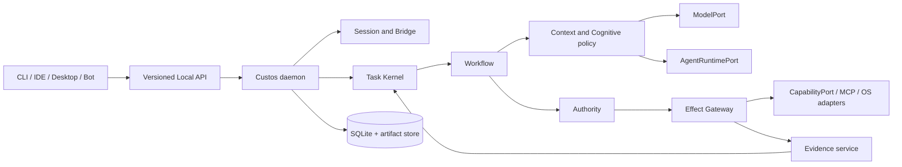
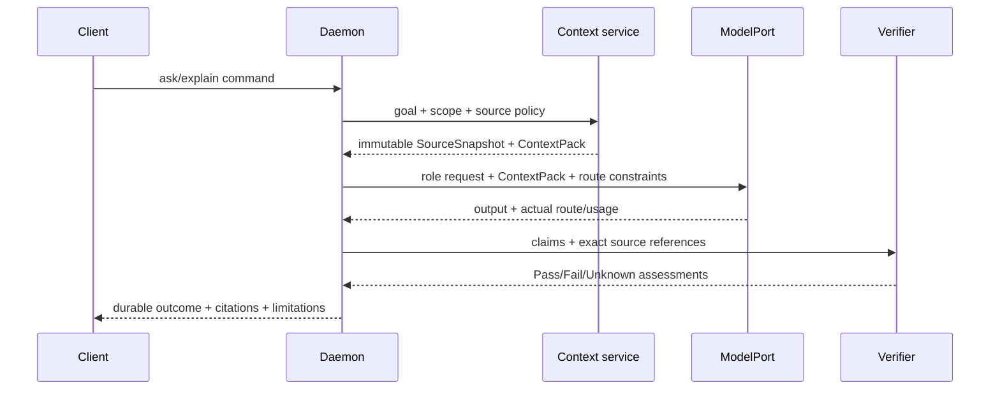
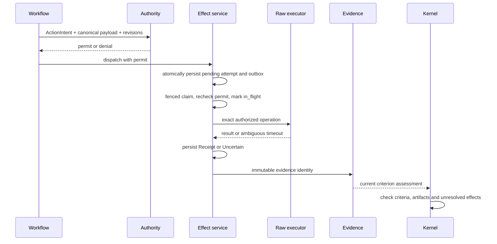
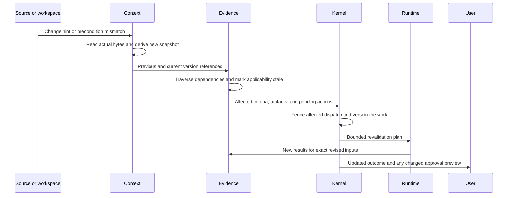

# Custos runtime flows and control ownership

**Document ID:** ARCH-FLOW-01. **Status:** target execution contract, reviewed 2026-09-30 against the current dirty checkout. **Implementation evidence:** [current status](../status/README.md). This document defines intended control flow; it does not claim every edge is wired.

## 1. Control-plane rule

The daemon is the production composition root. Clients submit commands; the Kernel owns Task state; Workflow owns Run/Step progress; Authority issues grants and permits; the effect service owns attempts and receipts; Evidence owns assessments; only the Kernel closes a Task. Models, external agents, MCP servers, 9Router and Agentgateway are untrusted or partially trusted adapters and never become canonical writers.

## 2. Intake: Session versus Task

1. Local API authenticates the client, validates protocol version and assigns correlation/command identity.
2. Session service records conversational input and starts a bounded `SessionRun` for read-only or low-risk assistance.
3. Long-running, mutating, delegated or auditable work creates a Task immediately or promotes the Session through an idempotent binding command.
4. Promotion atomically records Task, contract revision, binding and event. A retry with the same key and payload returns the same Task; a changed payload conflicts.
5. Session history remains conversational context; Task state becomes the durable work authority.

Current code persists Session, journal, binding and Task across daemon restart. Contract revision and idempotent promotion semantics still require accepted C-01 fixtures.

## 3. F1: read-only engineering or research answer

The ContextPack must be present in the actual provider request. Source references carry snapshot identity, path, exact span and content hash. Nexus may locate candidates, but the verifier rereads current or pinned bytes. Unsupported and stale claims never silently Pass. Restart must restore the outcome and source identities.

## 4. Model and agent routing

1. Cognitive policy selects a versioned role and effort tier: deterministic, System One, System Two or abstain.
2. Runtime RoutePlanner filters candidates by capability, user pin, data/egress policy, quality floor, budget, verification requirements, and health.
3. Budget is reserved before dispatch; every attempt records requested and actual provider/model when observable.
4. Exactly one layer owns retry/fallback for a candidate pool. A reroute occurs only at a safe checkpoint and becomes a new attempt.
5. `ModelPort` covers inference. `AgentRuntimePort` covers external agent lifecycle, steering, cancellation and artifact export. A compatible chat endpoint does not imply coding-agent support.
6. Unknown actual route, usage or native-tool control remains Unknown and may make the candidate ineligible for strict work.

Direct/local providers are the baseline. 9Router is an optional provider/account backend; Agentgateway is an optional network identity/routing front for LLM, MCP or A2A. Neither owns Task or effect authority.

## 5. F2: controlled effect and proof closure

A permit binds actor, capability, canonical payload or allowed scope, Task/contract/source preconditions, expiry and idempotency semantics. Persist the attempt before dispatch. An ambiguous timeout is `Uncertain`, not failure; non-idempotent work is reconciled before retry. Completion accepts trusted evidence IDs resolved by the daemon, never caller-authored `passed=true` claims.

Current code has contained read/list and non-mutating patch preview with receipts, but those components run in the E2E process and completion still accepts client-supplied claims. Therefore this flow is target behavior, not a production guarantee.

## 6. MCP and external coding-agent flow

1. Connection manager discovers servers/agents and stores observed capabilities separately from granted capabilities.
2. Task projection exposes only the tools/resources allowed for that user, workspace, Task and data class.
3. Tool name, schema and server identity are pinned for the attempt; arguments are canonicalized before Custos authority evaluation.
4. Custos-mediated tools use the controlled-effect flow. Provider-native tools are labeled `Provider-governed` or `Observe-only` unless interception is proven.
5. Cancellation, stream truncation, server restart, schema change and duplicate response become explicit lifecycle events.
6. Remote MCP/A2A receives the minimum scoped data; prompt or tool output is untrusted data and cannot grant authority.

## 7. F3: research-to-code

Question decomposition produces source-versioned claims with support, contradiction and limitations. A typed research artifact creates an Engineering Task child or handoff containing accepted facts, unresolved questions, source identities and constraints. Engineering then follows F2 for edits/tests. Research confidence cannot substitute for executable evidence, and coding success cannot retroactively validate unsupported research claims.

## 8. Recovery and shutdown

On startup the daemon opens and migrates SQLite, validates artifact references, reacquires only expired leases, resumes safe checkpoints, scans prepared/dispatched attempts and marks ambiguous effects for reconciliation. It does not replay non-idempotent effects blindly. Clients reconnect from durable cursors. Graceful shutdown stops admission, checkpoints workers, drains bounded idempotent work, persists cursor/usage and releases leases; forced termination relies on the same recovery scan.

## 9. Flow status vocabulary

| Label | Required evidence |
|---|---|
| Designed | This document or an accepted ADR specifies the behavior. |
| Implemented | Relevant code exists and local unit/contract tests cover it. |
| Wired | A production entrypoint reaches it through the intended composition. |
| Verified | A pinned process-level success and relevant failure/restart fixtures pass. |
| Trust-closed | Authority, provenance, revision binding and unresolved-effect checks cannot be forged by an untrusted caller. |

The release order is reproducible baseline and durable storage, trusted evidence
boundary, real F1 ContextPack/provider path, daemon-owned effect spine, F2/F3
closure, then optional gateway and client expansion.

## 10. F4: research, coding, and assistant on one evidence chain

Example goal: evaluate a library migration, implement the selected approach,
verify compatibility, and prepare a team update.

| Step | Durable output | Admission and failure behavior |
|---|---|---|
| Intake | Task revision with scope, criteria, baseline, egress, budget, and delivery target | Missing recipient or acceptance criterion remains unresolved; do not guess authority |
| Investigate | Source snapshots, claim/support/counter-evidence references | Fetch and parse in bounded adapters; inaccessible source is a limitation |
| Decide | Selected approach with supporting claims and rejected alternatives | Human resolves consequential uncertainty when contract requires it |
| Implement | Patch on a pinned isolated worktree | Capability checks apply to file writes, test commands, downloads, and network use |
| Verify | Named test/profile results on exact artifact and environment | Include regression and scope checks; failed/unknown checks cannot satisfy required criteria |
| Compose | Draft update referencing the accepted outcome revision | Send remains a distinct effect with target, payload, account, and approval binding |
| Publish | Attempt and provider receipt | Ambiguous acknowledgement becomes uncertain; provider acknowledgement is labeled separately from delivery |
| Continue | Outcome and continuation with unresolved items | Resume with fresh policy and source checks, retaining previous results as history |

Cross-pack work may use one Task when all scope and permissions remain within
its contract. A materially different authority, owner, retention, or acceptance
boundary creates a linked child Task. It imports only allowed typed artifacts;
parent and child do not silently share grants or success state.

## 11. F5: change-driven revalidation

Unknown dependencies trigger broader invalidation. Immutable past receipts
remain facts about past execution. Existing terminal Task results are not
rewritten; a successor or reviewed revision carries new work. A previously sent
message cannot be invalidated away: record that its content is outdated, then
propose a separately authorized correction if appropriate.

An invalidation walk is not sufficient protection against concurrent edits.
Completion and dispatch compare the expected Task/source/policy versions again.
Tests run against sealed artifacts; publication uses compare-and-set against
the live target. Research sources without stable versions use snapshot identity
and freshness policy, with remaining observation gaps disclosed.

## 12. F6: exact dispatch, cancellation, and uncertainty

1. Authenticate principal/workspace and validate command identity, payload
   digest, policy version, source preconditions, and current grant/approval.
2. In one canonical transaction, consume/reserve the permit for one attempt,
   reserve budget, and persist pending attempt, event, and outbox entry. Reusing
   the command with changed payload returns Conflict.
3. Dispatcher claims the attempt with a fenced lease and rechecks authorization
   immediately before dispatch. Commit `in_flight` before calling the executor.
4. Execute outside the SQLite transaction using a stable external idempotency
   key when supported. A stale worker may not commit canonical results.
5. Record receipt or uncertainty transactionally with usage settlement state and
   follow-up event. Delayed billing reconciles later; unknown usage is not zero.
6. If the result was lost, query external state or require human resolution.
   Redelivery is allowed only under the connector's demonstrated idempotency
   contract. An internal outbox alone cannot guarantee exactly-once delivery.

Cancellation fences future work and signals running processes. Already accepted
remote work may finish; capture its receipt, settle outstanding reservations,
and expose pending reconciliation even if Task status is Cancelled. Compensation
is a new authorized action and may itself fail. No generic rollback promise.

## 13. F7: bounded parallel workers and budget

- Compile a workflow revision with typed artifacts, dependency edges, bounded
  fan-out, declared writes, cancellation, and verification requirements.
- Reserve from one authoritative budget ledger atomically before each dispatch;
  sibling Runs cannot independently spend the same remaining amount.
- Dispatch only ready nodes after predecessor artifacts commit. Cap worker
  count, queue length, retries, wall time, and verification cost.
- Use isolated candidate worktrees; serialize conflicting target publication.
  Unknown writes conflict conservatively. Revalidate the merged artifact.
- Changing model or topology starts a new recorded attempt at a safe boundary.
  Preserve failed-attempt cost; release only unused reservations. Strict budget
  profiles reject transports that cannot bound exposure adequately.

## 14. F8: automatic setup and protocol lifecycle

Detect toolchains, manifests, credentials by reference, and platform controls;
produce a declarative setup preview. Approve installs/configuration changes when
required, execute through the same effect path, probe health, and activate the
profile only after success. Never execute repository hooks during inspection.

Every connection records configured endpoint, transport, observed capabilities,
authentication scope, version, health, and last successful probe. Schema or
tool identity changes invalidate cached tool projections. Credential refresh is
single-flight per account; redact logs and inject secrets only at the boundary.
Expose capabilities per Task and workspace; discovery never creates a grant.
MCP uses negotiated supported transports; ACP manages agent lifecycle; Local
API carries Custos commands. One logical catalog can serve all three packs
without requiring three server processes or inventing another protocol.

Slow event consumers receive bounded buffers and resume via durable cursors.
If retention removed the requested cursor, return a snapshot-resync response.
Reconnect cannot submit duplicate commands unnoticed. Recovery prioritizes
uncertain effects and data integrity before admitting new delegated work.
