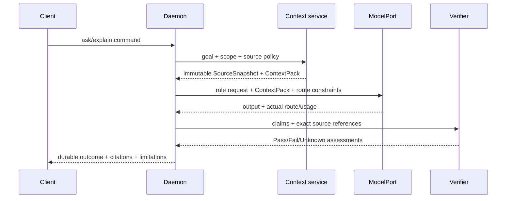
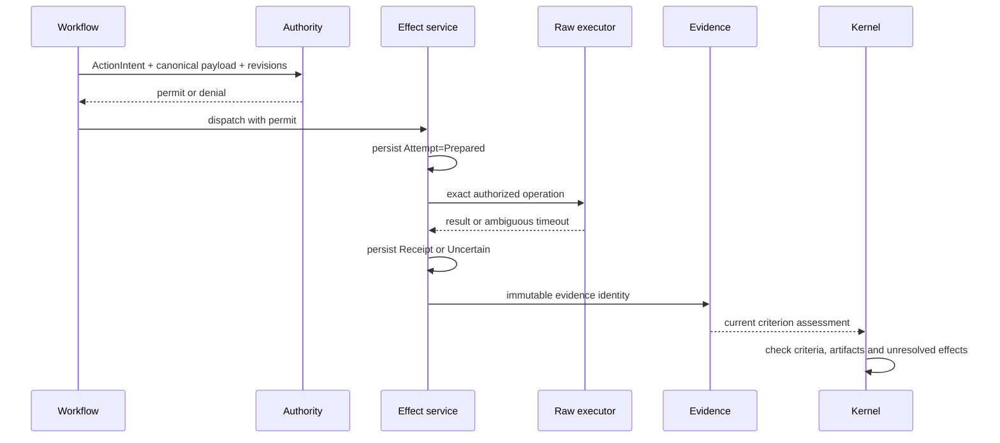

# Custos runtime flows and control ownership

**Document ID:** ARCH-FLOW-01. **Status:** target execution contract, reviewed 2026-09-28 against the current dirty checkout. **Implementation evidence:** [current audit](../status/local-dev-audit-2026-09-28.md). This document defines intended control flow; it does not claim every edge is wired.

## 1. Control-plane rule

The daemon is the production composition root. Clients submit commands; the Kernel owns Task state; Workflow owns Run/Step progress; Authority issues grants and permits; the effect service owns attempts and receipts; Evidence owns assessments; only the Kernel closes a Task. Models, external agents, MCP servers, 9Router and Agentgateway are untrusted or partially trusted adapters and never become canonical writers.

## 2. Intake: Session versus Task

1. Local API authenticates the client, validates protocol version and assigns correlation/command identity.
2. Session service records conversational input and starts a bounded `SessionRun` for read-only or low-risk assistance.
3. Long-running, mutating, delegated or auditable work creates a Task immediately or promotes the Session through an idempotent binding command.
4. Promotion atomically records Task, contract revision, binding and event. A retry with the same key and payload returns the same Task; a changed payload conflicts.
5. Session history remains conversational context; Task state becomes the durable work authority.

Current code persists Session, journal, binding and Task across daemon restart. Contract revision and idempotent promotion semantics still require accepted C-01 fixtures.

## 3. F1: read-only engineering or research answer

The ContextPack must be present in the actual provider request. Source references carry snapshot identity, path, exact span and content hash. Nexus may locate candidates, but the verifier rereads current or pinned bytes. Unsupported and stale claims never silently Pass. Restart must restore the outcome and source identities.

## 4. Model and agent routing

1. Cognitive policy selects a versioned role and effort tier: deterministic, System One, System Two or abstain.
2. The Intelligence Hub filters candidates by capability, user pin, data/egress policy, quality floor, budget and health.
3. Budget is reserved before dispatch; every attempt records requested and actual provider/model when observable.
4. Exactly one layer owns retry/fallback for a candidate pool. A reroute occurs only at a safe checkpoint and becomes a new attempt.
5. `ModelPort` covers inference. `AgentRuntimePort` covers external agent lifecycle, steering, cancellation and artifact export. A compatible chat endpoint does not imply coding-agent support.
6. Unknown actual route, usage or native-tool control remains Unknown and may make the candidate ineligible for strict work.

Direct/local providers are the baseline. 9Router is an optional provider/account backend; Agentgateway is an optional network identity/routing front for LLM, MCP or A2A. Neither owns Task or effect authority.

## 5. F2: controlled effect and proof closure

A permit binds actor, capability, canonical payload or allowed scope, Task/contract/source preconditions, expiry and idempotency semantics. Persist the attempt before dispatch. An ambiguous timeout is `Uncertain`, not failure; non-idempotent work is reconciled before retry. Completion accepts trusted evidence IDs resolved by the daemon, never caller-authored `passed=true` claims.

Current code has contained read/list and non-mutating patch preview with receipts, but those components run in the E2E process and completion still accepts client-supplied claims. Therefore this flow is target behavior, not a production guarantee.

## 6. MCP and external coding-agent flow

1. Connection manager discovers servers/agents and stores observed capabilities separately from granted capabilities.
2. Task projection exposes only the tools/resources allowed for that user, workspace, Task and data class.
3. Tool name, schema and server identity are pinned for the attempt; arguments are canonicalized before Custos authority evaluation.
4. Custos-mediated tools use the controlled-effect flow. Provider-native tools are labeled `Provider-governed` or `Observe-only` unless interception is proven.
5. Cancellation, stream truncation, server restart, schema change and duplicate response become explicit lifecycle events.
6. Remote MCP/A2A receives the minimum scoped data; prompt or tool output is untrusted data and cannot grant authority.

## 7. F3: research-to-code

Question decomposition produces source-versioned claims with support, contradiction and limitations. A typed research artifact creates an Engineering Task child or handoff containing accepted facts, unresolved questions, source identities and constraints. Engineering then follows F2 for edits/tests. Research confidence cannot substitute for executable evidence, and coding success cannot retroactively validate unsupported research claims.

## 8. Recovery and shutdown

On startup the daemon opens and migrates SQLite, validates artifact references, reacquires only expired leases, resumes safe checkpoints, scans prepared/dispatched attempts and marks ambiguous effects for reconciliation. It does not replay non-idempotent effects blindly. Clients reconnect from durable cursors. Graceful shutdown stops admission, checkpoints workers, drains bounded idempotent work, persists cursor/usage and releases leases; forced termination relies on the same recovery scan.

## 9. Flow status vocabulary

| Label | Required evidence |
|---|---|
| Designed | This document or an accepted ADR specifies the behavior. |
| Implemented | Relevant code exists and local unit/contract tests cover it. |
| Wired | A production entrypoint reaches it through the intended composition. |
| Verified | A pinned process-level success and relevant failure/restart fixtures pass. |
| Trust-closed | Authority, provenance, revision binding and unresolved-effect checks cannot be forged by an untrusted caller. |

The current release order is reproducible baseline, trusted evidence boundary, daemon-owned effect spine, real F1 ContextPack/provider path, F2/F3 closure, then optional gateway and client expansion.
