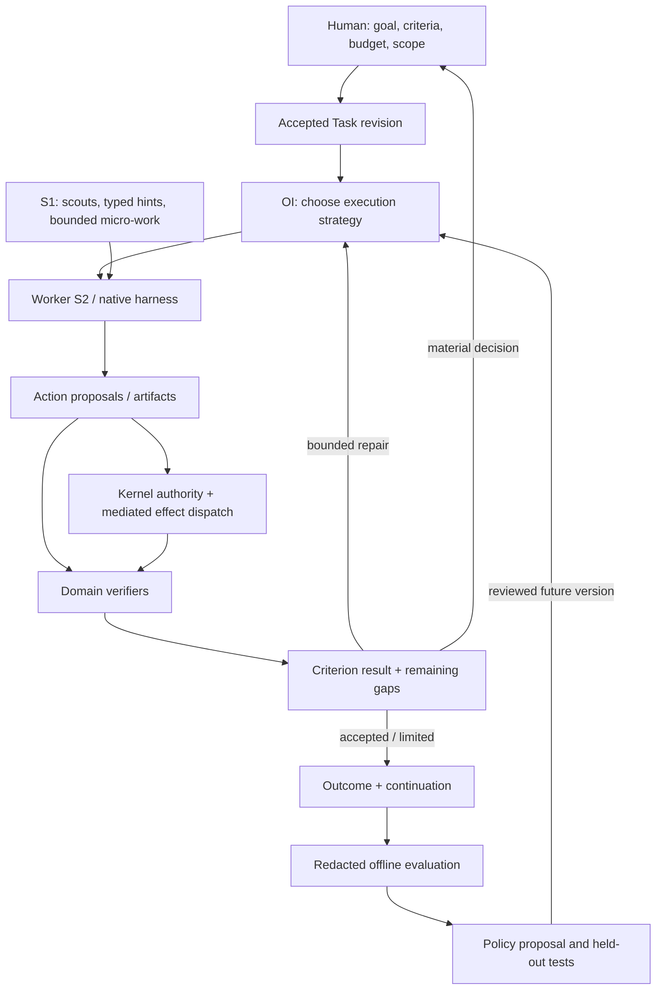

# Custos SADE: bản sắc và cơ chế supervision

**Kiến trúc đích, không phải chứng nhận sản phẩm đã triển khai hoặc độc nhất.** Đây là phần chuyên sâu của [master](../../Custos.md), [Agent Workspace/UI](agent-workspace-and-ui.md) và [OI](cognitive-fabric-and-orchestration.md); không thay Task Kernel, không tạo framework/crate mới.

**Plan để xây:** [SADE refactor và cost core](../development/workspace-restructuring-plan.md) nối source audit, module ownership, contracts, ba domain blueprints, W0–W5 và evaluation gates. Đây là một campaign thống nhất, không roadmap cạnh tranh. [Pack/workflow design](domain-packs-and-workflows.md) định nghĩa jobs/artifacts/acceptance riêng từng miền.

**Kế hoạch code theo source:** [SADE–OrCa integration plan](../development/sade-orca-integration-plan.md) xác định cây repo đích, nơi hấp thụ OrCa và cách đưa hai app hosts về một daemon owner.

## 1. Định nghĩa và lời hứa

**Custos là Supervised Agent Development Environment (SADE) local-first: một môi trường để human và các agent cùng nghiên cứu, xây dựng, kiểm chứng và tự động hóa công việc, với chi phí được tối ưu trên kết quả đạt yêu cầu.**

“Development” bao gồm phát triển phần mềm và tri thức/thí nghiệm phục vụ nó; Assistant nối công việc với lịch, ghi chú và hành động cá nhân có giới hạn. “Supervised” nghĩa là có thể hiểu, điều khiển và quy trách nhiệm cho công việc, không phải phải duyệt từng tool call. “Agent Workspace” là hình thức tương tác; SADE là định vị sản phẩm của cùng Custos.

Bản sắc không phải phép cộng UI OrCa + agent Goose + router. Nó là **môi trường thực thi thích ứng có giám sát theo bằng chứng**: tự do suy luận trong phạm vi đã giao, giảm việc phụ và lặp vô ích, đưa quyết định consequential về đúng human, tiếp tục trên trạng thái thật.

Không tự nhận SADE là một chuẩn industry đã được công nhận, hay “thế hệ mới” chứng minh vượt mọi sản phẩm. Đó là tên định vị và hướng thiết kế cần nghiệm thu.

## 2. Research → quyết định, không copy khẩu hiệu

| Nguồn primary và mức đối chiếu | Bài học | Quyết định Custos |
|---|---|---|
| [Orca worktrees](https://www.onorca.dev/docs/model/worktrees), [CLI](https://www.onorca.dev/docs/cli/overview): product docs | ADE có tài nguyên/terminal/browser/diff, không chỉ chat; agents có thể điều khiển môi trường | Desktop và headless CLI/API ngang semantics, resource/run-scoped actions |
| [Orca orchestration](https://www.onorca.dev/docs/cli/orchestration): product docs | Tracked orchestration là phần sản phẩm thực, không thể nói Orca chỉ là UI | Custos thêm Task/criteria/authority lineage theo thiết kế riêng, không claim đối thủ không giám sát |
| [Goose subagents](https://github.com/aaif-goose/goose/blob/main/documentation/docs/guides/context-engineering/subagents.mdx): upstream guide | Delegation/recipes giúp tách context và chuyên biệt extensions, có lifecycle limits | Reuse pattern có giới hạn; parent extension availability không tự là child grant |
| [RouteLLM](https://arxiv.org/abs/2406.18665): abstract, không tái lập benchmark | Strong/weak model routing có quality–cost tradeoff | Một ablation cho bước phù hợp, không cheap-first mọi Task |
| [Cost-aware protocol routing](https://arxiv.org/abs/2608.14927): abstract, reasoning benchmark | Failure risk có thể dự báo tốt hơn giá trị của protocol collaboration cụ thể | Tách “cần thêm effort?” khỏi “effort nào có ích?”; thiếu calibration thì baseline |
| [MAST](https://arxiv.org/abs/2503.13657): abstract/taxonomy overview | Design, alignment và verification đều có failure modes | Test join/replan/termination/false pass, không tăng agents như mặc định |

Các paper chưa được tái lập trên Custos; không lấy chỉ số của reasoning benchmark làm coding/research/assistant SLO. Upstream guides thay đổi: code reuse phải pin SHA và license, không copy ví dụ permission/credential configuration thành policy.

## 3. Các lựa chọn làm nên bản sắc

1. **Environment-native:** tài nguyên, processes, sources, artifacts và runs là đối tượng làm việc thật. Chat là command surface, không source of truth duy nhất.
2. **Strong reasoning preserved:** S2/native harness giữ đoạn reasoning liên tục; OI không chia mỗi edit thành nhiệm vụ model nhỏ. S1 trả source-backed hint có thể bác bỏ, không summary bắt buộc làm mất nguồn.
3. **Evidence-shaped coordination:** graph được chọn theo nguồn/dependencies/write sets và cách kiểm kết quả. Critic agent không tự là verifier đáng tin.
4. **Outcome economics:** so toàn route gồm planning, retrieval, transfer, failed candidates, verification, rework và human time; không tối ưu unit price token riêng lẻ.
5. **Supervision by exception:** standing scope cho việc thường lệ; xin quyết định khi quyền/preconditions/uncertainty đòi hỏi, không notification mỗi tool call.
6. **Continuity without fictional state:** resume facts/decisions/artifacts, kiểm freshness và pending effects; không hứa chuyển hidden memory của harness.

## 4. Ba vòng lặp, một authority

**Worker loop** xử lý tool/reasoning trong execution scope. **Task loop** phân bổ workspaces, dependencies, budget và verification theo events. **Improvement loop** đánh giá offline, không tự đổi policy giữa Task. Authority là boundary dùng chung; model không ký permit. Native effects chưa intercept giữ assurance riêng.

Nested delegation chỉ có một owner cho mỗi nhánh: hoặc Custos quản lý child WorkerRuns, hoặc native harness quản lý children trong phạm vi adapter quan sát. Không bật đồng thời hai auto-decomposers cho cùng goal. Native children opaque phải ghi observation/usage limitation; parent budget không được giả thành hard cap nếu harness không cho chặn.

## 5. Supervision là những quyết định gì?

| Điểm quyết định | Hệ thống tự làm trong scope | Khi human cần tham gia |
|---|---|---|
| Goal/criterion | Gợi ý draft và làm rõ missing fields | Hai interpretations làm khác outcome |
| Strategy | Rules/context recipe, admissible scheduling | Đổi pin/egress/scope hoặc tăng budget |
| Work | Read, bounded transformations/tests theo grant | Destructive/external effect ngoài standing grant |
| Integration | Check hashes/conflicts, chạy required verifier | Chọn tradeoff candidate hoặc approve effect theo policy |
| Completion | Record evidence, pass/fail/unknown/stale | Consequential semantic ambiguity hoặc waiver riêng |
| Recovery | Reconcile idempotent/observable effects | Không chứng minh trạng thái external, không retry mù |

UI trả lời nhanh: **đang làm gì; vì sao cần bước này; trên dữ liệu nào; còn phạm vi/ngân sách nào; điều gì cần tôi quyết định?** Run timeline, comparison và criterion inspector là cùng trạng thái, không ba dashboard mâu thuẫn. Choice card trình alternatives/cost ranges/consequences, không raw reasoning chain hoặc score tự báo không calibrated.

## 6. S1 làm việc hữu ích, không thu nhỏ S2

S1 là lớp **effort có giới hạn**: deterministic code, retrieval, local classifier hoặc model judgment phù hợp. “Nhanh” được đo theo job/hardware; không gắn mọi model local là S1.

| Miền | Việc S1 hỗ trợ | Việc giữ cho S2/human và verifier |
|---|---|---|
| Coding | Symbol/test scouts, log triage, structural impact candidates, narrow transformation | Diagnosis phức tạp, interface design/refactor; independent behavior acceptance |
| Research | Dedup/version, screen/rank, bounded extraction with spans, unit checks | Synthesis/counter-evidence, experimental design, interpretation consequential |
| Assistant | Identity candidates, date parsing signals, deterministic timezone/preflight | Ambiguity resolution, nuanced draft; exact recipient/payload authorization |

Hint giữ inputs/source revision/method/status/omissions. S2 mở lại raw source, bác hint, hoặc tự làm tiếp. S1 failure có fallback/abstain; không cascade rồi nhân đôi cost khi strong model vốn có thể làm thẳng. Micro-worker có grant/budget/timeout giống mọi worker; worktree không biến nó thành trusted actor. S1 semantic assessor không là oracle độc lập chỉ vì model khác tên.

## 7. Kinh tế điều phối

Economics bắt đầu cùng live worker đầu tiên: durable reserve/dispatch/settle theo attempt, pricing version/currency, unknown usage và late settlement. Core policy không gọi provider; runtime estimator không sở hữu ledger; persistence là canonical owner; UI không tự tính một số `$0` khi thiếu receipt. Money cap chưa enforce trong reserve/settle hiện tại là migration gap, không capability đã hoàn tất.

Hard filter trước: user pin, local-only/privacy, scope/capability, grant và resource limits. Sau đó so **direct strong run**, assisted strong run, decomposed run, candidates hoặc iterative experiment bằng predicted total cost và quality/latency ranges. Human chọn priority khi tradeoff chưa rõ; không trừ USD khỏi một quality score vô đơn vị.

Ưu tiên giảm waste trước downgrade: exact search, bounded source selection, stable cache khi provider hỗ trợ, tránh duplicate retrieval, tái dùng evidence còn hợp lệ, bớt context handoff, deterministic scheduling, verify đúng criterion. Required verifier không bị cắt để làm đẹp giá.

“Thêm effort” phải có gap cụ thể: missing source, failed reproducer, contradiction, unresolved behavior hay external status. Nếu không có diagnostic progress sau số attempts/replans đã chốt, dừng limited/ask human; không mở thêm agents để tranh luận vô hạn. Reserve execution và verification/recovery headroom; uncertainty reconcile ưu tiên trước gửi effect mới.

Chứng minh bằng paired ablation: strong pinned baseline → selective context → S1 assist → OI topology, cùng tasks/environment/verifier. Report accepted quality/rate, billed cost, estimates/unknown, total tokens, p95 useful output, human minutes và safety failures. Learning policy cần held-out data, không train từ self-reported success. Router overhead/retry phải tính vào kết quả.

## 8. Domain-native environment

Coding dùng checkout/worktree, editor/diff/browser/tests. Research dùng corpus/source viewer, dataset/experiment directory, kernels/GPU jobs, metrics và provenance. Assistant dùng scoped account/contacts/calendar/drafts/outbox và automation runs. Chúng cùng vocabulary execution workspace nhưng không ép tất cả thành Git repo.

Signature demo: nghiên cứu một phương pháp AI → chọn claim có nguồn → chạy thí nghiệm trên dataset versioned → sửa implementation → verify regression/metric → tạo thông báo từ outcome được chọn → preview/grant/send. Có thể dùng riêng từng đoạn. Không tự gửi báo cáo vì patch pass; không đưa personal memory vào training context mặc định.

## 9. Đặt trong code và nghiệm thu

Không thêm service SADE: UI features chứa presentation; runtime giữ worker/OI/context/workspace lifecycle; pack giữ domain obligations; core giữ authority/gates; adapters giữ concrete I/O/protocol; persistence giữ canonical/derived storage; daemon compose. Goose-derived loop được retained qua provenance và conformance, không import cả dormant engine để tuyên bố đã có Goose core.

S1/OI là augmentation opt-in/gradually enabled theo measured slice; human-facing controls và truthful assurance cần từ flow đầu tiên. SADE gate: một job đi từ interaction tới verified/limited outcome, restart/resume, exact approvals, cancel/reconcile và costs có nhãn. “Thế hệ mới” chỉ trở thành claim ưu thế khi demo/benchmark chứng minh kết quả tốt hơn hoặc ít effort hơn ở phạm vi cụ thể.

**Lõi hiện tại cần được làm cho nhất quán trước khi mở rộng SADE:** giữ crate boundaries nhưng sửa ownership bên trong: domain chỉ giữ values; core giữ policy và invariants; runtime giữ điều phối; adapter giữ I/O và process/Git lifecycle; persistence giữ tính nguyên tử/durable; daemon là composition root. OrCa cung cấp nguồn tham khảo cho lifecycle và vận hành workspace/agent, không thay Task Kernel, pack semantics, authority hay worker reasoning của Custos. Thứ tự và source findings nằm trong [refactor plan §24](../development/workspace-restructuring-plan.md#24-refactor-lõi-để-custos-thành-sade-và-hấp-thụ-orca-đúng-trách-nhiệm).
